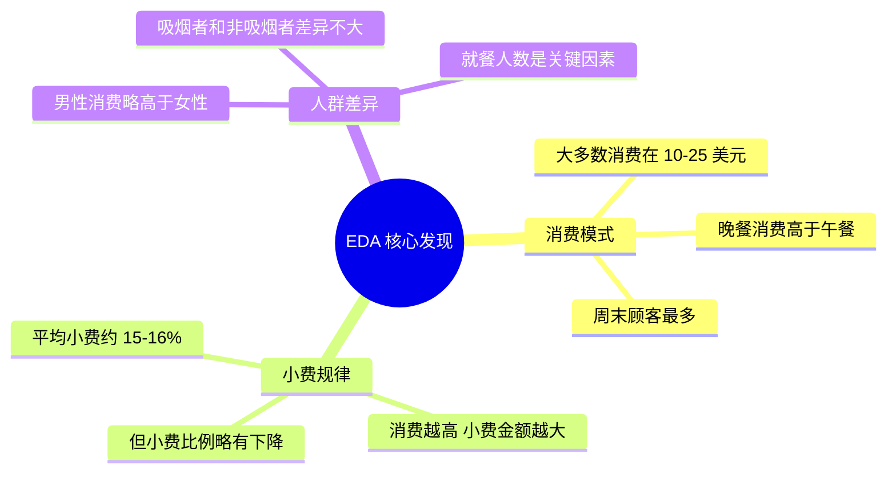

# 实战项目：探索性数据分析（EDA）

:::tip 项目定位
这是第二阶段的**综合实战项目**。你将用前面学到的 NumPy、Pandas、Matplotlib/Seaborn 知识，对一个真实数据集进行完整的探索性数据分析。
:::

## 项目简介

**探索性数据分析（Exploratory Data Analysis, EDA）** 是数据科学项目的第一步——在建模之前，先用统计和可视化手段"摸清"数据的底细。


### 你将练到的技能

| 技能 | 对应章节 |
|------|---------|
| Pandas 数据读取与清洗 | 第 3 章 |
| 统计摘要与分组聚合 | 第 3 章 |
| Matplotlib / Seaborn 可视化 | 第 4 章 |
| NumPy 数值计算 | 第 2 章 |

### 项目产出

完成后你会得到一份**完整的 EDA 分析报告**（Jupyter Notebook），包含数据概览、清洗过程、统计发现和可视化图表。

---

## 一、项目准备

### 1.1 数据集选择

我们选用 Seaborn 内置的 **`tips` 数据集**——一个美国餐厅的小费记录。

| 字段 | 含义 | 类型 |
|------|------|------|
| `total_bill` | 消费总额（美元） | 连续型 |
| `tip` | 小费金额（美元） | 连续型 |
| `sex` | 顾客性别 | 分类型 |
| `smoker` | 是否吸烟 | 分类型 |
| `day` | 星期几 | 分类型 |
| `time` | 午餐/晚餐 | 分类型 |
| `size` | 就餐人数 | 离散型 |

:::info 为什么选这个数据集？
- 内置数据，**无需下载**，一行代码就能加载
- 变量类型丰富（连续型 + 分类型）
- 数据量适中（244 行），适合学习
- 业务场景直观，人人都去过餐厅
:::

### 1.2 环境搭建

```python
# 导入所有需要的库
import numpy as np
import pandas as pd
import matplotlib.pyplot as plt
import seaborn as sns

# 设置中文显示（macOS）
plt.rcParams['font.sans-serif'] = ['Arial Unicode MS']
# Windows 用户可以用：plt.rcParams['font.sans-serif'] = ['SimHei']
plt.rcParams['axes.unicode_minus'] = False

# 设置 Seaborn 主题
sns.set_theme(style="whitegrid", font_scale=1.1)

# Jupyter 中图表内嵌显示
# %matplotlib inline
```

### 1.3 加载数据

```python
# 加载内置数据集
tips = sns.load_dataset("tips")

# 第一眼：看看数据长什么样
print(f"数据集大小：{tips.shape[0]} 行 × {tips.shape[1]} 列")
tips.head(10)
```

输出示例：

| | total_bill | tip | sex | smoker | day | time | size |
|---|-----------|-----|-----|--------|-----|------|------|
| 0 | 16.99 | 1.01 | Female | No | Sun | Dinner | 2 |
| 1 | 10.34 | 1.66 | Male | No | Sun | Dinner | 3 |
| 2 | 21.01 | 3.50 | Male | No | Sun | Dinner | 3 |
| 3 | 23.68 | 3.31 | Male | No | Sun | Dinner | 2 |
| 4 | 24.59 | 3.61 | Female | No | Sun | Dinner | 4 |

---

## 二、数据概览——先"摸底"

EDA 的第一步，不是急着画图，而是先搞清楚：数据有多大？每列是什么类型？有没有缺失值？

### 2.1 基本信息

```python
# 数据类型和非空计数
tips.info()
```

输出会告诉你：
- 7 列，244 行
- 没有缺失值（Non-Null Count 全是 244）
- `total_bill` 和 `tip` 是 float64
- `sex`、`smoker`、`day`、`time` 是 category

```python
# 统计摘要
tips.describe()
```

| | total_bill | tip | size |
|---|-----------|-----|------|
| count | 244.0 | 244.0 | 244.0 |
| mean | 19.79 | 3.00 | 2.57 |
| std | 8.90 | 1.38 | 0.95 |
| min | 3.07 | 1.00 | 1.00 |
| 25% | 13.35 | 2.00 | 2.00 |
| 50% | 17.80 | 2.90 | 2.00 |
| 75% | 24.13 | 3.56 | 3.00 |
| max | 50.81 | 10.00 | 6.00 |

**发现**：
- 人均消费约 19.79 美元，小费约 3.00 美元
- 小费最少 1 美元，最多 10 美元
- 就餐人数大多是 2 人

### 2.2 分类变量分布

```python
# 分类变量各取值的计数
for col in ['sex', 'smoker', 'day', 'time']:
    print(f"\n--- {col} ---")
    print(tips[col].value_counts())
```

**发现**：
- 男性顾客多于女性（157 vs 87）
- 不吸烟的多于吸烟的（151 vs 93）
- 周六和周日数据最多
- 晚餐数据远多于午餐（176 vs 68）

### 2.3 添加衍生特征

好的分析师会**创造新特征**来帮助发现规律：

```python
# 小费比例 = 小费 / 消费总额
tips['tip_pct'] = (tips['tip'] / tips['total_bill'] * 100).round(2)

# 人均消费
tips['per_person'] = (tips['total_bill'] / tips['size']).round(2)

tips[['total_bill', 'tip', 'tip_pct', 'per_person']].head()
```

| | total_bill | tip | tip_pct | per_person |
|---|-----------|-----|---------|-----------|
| 0 | 16.99 | 1.01 | 5.94 | 8.50 |
| 1 | 10.34 | 1.66 | 16.05 | 3.45 |
| 2 | 21.01 | 3.50 | 16.66 | 7.00 |
| 3 | 23.68 | 3.31 | 13.97 | 11.84 |
| 4 | 24.59 | 3.61 | 14.68 | 6.15 |

---

## 三、数据清洗——检查数据质量

这个数据集比较干净，但真实项目中这一步通常最耗时间。我们依然走一遍完整流程：

### 3.1 缺失值检查

```python
# 缺失值统计
missing = tips.isnull().sum()
print("缺失值统计：")
print(missing[missing > 0] if missing.sum() > 0 else "无缺失值 ✓")
```

### 3.2 重复值检查

```python
# 完全重复的行
dup_count = tips.duplicated().sum()
print(f"重复行数：{dup_count}")

if dup_count > 0:
    tips = tips.drop_duplicates()
    print(f"已删除重复行，剩余 {len(tips)} 行")
```

### 3.3 异常值检测

用 IQR（四分位距）方法检测异常值：

```python
def detect_outliers_iqr(df, column):
    """用 IQR 方法检测异常值"""
    Q1 = df[column].quantile(0.25)
    Q3 = df[column].quantile(0.75)
    IQR = Q3 - Q1
    lower = Q1 - 1.5 * IQR
    upper = Q3 + 1.5 * IQR
    
    outliers = df[(df[column] < lower) | (df[column] > upper)]
    return outliers, lower, upper

# 检查各数值列的异常值
for col in ['total_bill', 'tip', 'tip_pct']:
    outliers, lower, upper = detect_outliers_iqr(tips, col)
    print(f"\n{col}：正常范围 [{lower:.2f}, {upper:.2f}]，异常值 {len(outliers)} 个")
    if len(outliers) > 0:
        print(f"  异常值示例：{outliers[col].values[:5]}")
```

:::tip 异常值处理策略
在 EDA 阶段，**通常不急着删除异常值**，而是先标记它们、理解它们：
- 异常值可能是数据录入错误 → 应修正
- 异常值可能是真实的极端情况 → 保留，但分析时注意
- 异常值过多 → 可能说明数据质量有问题
:::

---

## 四、统计分析——用数字说话

### 4.1 核心统计指标

```python
# 按性别分组的小费统计
tips.groupby('sex')[['total_bill', 'tip', 'tip_pct']].agg(['mean', 'median', 'std'])
```

```python
# 按 day 分组
day_stats = tips.groupby('day')[['total_bill', 'tip']].agg(['mean', 'count'])
print(day_stats)
```

### 4.2 交叉分析

```python
# 透视表：不同性别 + 是否吸烟 的小费比例
pivot = tips.pivot_table(
    values='tip_pct', 
    index='sex', 
    columns='smoker', 
    aggfunc='mean'
).round(2)

print("小费比例(%)：")
print(pivot)
```

示例输出：

| smoker | No | Yes |
|--------|-----|------|
| Female | 15.69 | 18.22 |
| Male | 16.07 | 15.28 |

**发现**：女性吸烟者给的小费比例最高，男性吸烟者给的最低。

### 4.3 相关性分析

```python
# 数值列的相关系数
numeric_cols = ['total_bill', 'tip', 'size', 'tip_pct', 'per_person']
corr_matrix = tips[numeric_cols].corr().round(3)
print(corr_matrix)
```

**关键发现**：
- `total_bill` 和 `tip` 正相关（约 0.68）→ 消费越多，小费越多
- `total_bill` 和 `tip_pct` 负相关（约 -0.09）→ 消费越多，小费**比例**反而略低
- `size` 和 `total_bill` 正相关（约 0.60）→ 人越多，消费越高

---

## 五、可视化探索——让数据说话

### 5.1 数值分布

```python
fig, axes = plt.subplots(1, 3, figsize=(15, 4))

# 消费总额分布
axes[0].hist(tips['total_bill'], bins=20, color='steelblue', edgecolor='white')
axes[0].set_title('消费总额分布')
axes[0].set_xlabel('金额（美元）')
axes[0].set_ylabel('频次')

# 小费分布
axes[1].hist(tips['tip'], bins=20, color='coral', edgecolor='white')
axes[1].set_title('小费分布')
axes[1].set_xlabel('金额（美元）')

# 小费比例分布
axes[2].hist(tips['tip_pct'], bins=20, color='mediumseagreen', edgecolor='white')
axes[2].set_title('小费比例(%)分布')
axes[2].set_xlabel('百分比')

plt.tight_layout()
plt.savefig('01_distribution.png', dpi=150, bbox_inches='tight')
plt.show()
```

**解读**：消费总额和小费都呈右偏分布——大多数人消费在 10-25 美元之间，小费在 2-4 美元之间。

### 5.2 分类变量可视化

```python
fig, axes = plt.subplots(2, 2, figsize=(12, 10))

# 按天统计
sns.countplot(data=tips, x='day', order=['Thur', 'Fri', 'Sat', 'Sun'], 
              palette='Blues_d', ax=axes[0, 0])
axes[0, 0].set_title('各天的顾客数')

# 按时间段
sns.countplot(data=tips, x='time', palette='Set2', ax=axes[0, 1])
axes[0, 1].set_title('午餐 vs 晚餐')

# 按性别
sns.countplot(data=tips, x='sex', palette='Pastel1', ax=axes[1, 0])
axes[1, 0].set_title('顾客性别分布')

# 按吸烟状态
sns.countplot(data=tips, x='smoker', palette='Pastel2', ax=axes[1, 1])
axes[1, 1].set_title('吸烟 vs 不吸烟')

plt.tight_layout()
plt.savefig('02_categorical.png', dpi=150, bbox_inches='tight')
plt.show()
```

### 5.3 关键关系探索

#### 消费与小费的关系

```python
fig, axes = plt.subplots(1, 2, figsize=(14, 5))

# 散点图：消费 vs 小费
sns.scatterplot(data=tips, x='total_bill', y='tip', hue='time', 
                style='smoker', s=80, alpha=0.7, ax=axes[0])
axes[0].set_title('消费金额 vs 小费')
axes[0].set_xlabel('消费总额（美元）')
axes[0].set_ylabel('小费（美元）')

# 回归线
sns.regplot(data=tips, x='total_bill', y='tip', 
            scatter_kws={'alpha': 0.5}, line_kws={'color': 'red'},
            ax=axes[1])
axes[1].set_title('消费金额 vs 小费（含趋势线）')
axes[1].set_xlabel('消费总额（美元）')
axes[1].set_ylabel('小费（美元）')

plt.tight_layout()
plt.savefig('03_bill_vs_tip.png', dpi=150, bbox_inches='tight')
plt.show()
```

**解读**：消费金额越高，小费也越高，呈明显的线性趋势。但也能看到一些"离群点"——有人消费 40 多美元只给了 1.5 美元小费。

#### 不同场景的小费比较

```python
fig, axes = plt.subplots(1, 3, figsize=(16, 5))

# 按天比较小费
sns.boxplot(data=tips, x='day', y='tip', 
            order=['Thur', 'Fri', 'Sat', 'Sun'],
            palette='coolwarm', ax=axes[0])
axes[0].set_title('各天小费分布')

# 按时间段比较
sns.violinplot(data=tips, x='time', y='tip', 
               palette='Set2', ax=axes[1])
axes[1].set_title('午餐 vs 晚餐小费分布')

# 按就餐人数比较
sns.boxplot(data=tips, x='size', y='tip', 
            palette='YlOrRd', ax=axes[2])
axes[2].set_title('不同就餐人数的小费')

plt.tight_layout()
plt.savefig('04_tip_comparison.png', dpi=150, bbox_inches='tight')
plt.show()
```

**解读**：
- 周日的小费中位数最高
- 晚餐小费整体高于午餐（因为晚餐消费更多）
- 人数越多，小费越高

### 5.4 相关性热力图

```python
plt.figure(figsize=(8, 6))

# 绘制热力图
sns.heatmap(
    corr_matrix, 
    annot=True,           # 显示数字
    fmt='.2f',            # 保留两位小数
    cmap='RdBu_r',        # 红蓝配色
    center=0,             # 0 为中心
    square=True,          # 正方形格子
    linewidths=0.5        # 格线宽度
)
plt.title('数值变量相关性矩阵')
plt.tight_layout()
plt.savefig('05_correlation.png', dpi=150, bbox_inches='tight')
plt.show()
```

### 5.5 组合多维度分析

```python
# FacetGrid：按性别和是否吸烟，看消费-小费关系
g = sns.FacetGrid(tips, col='sex', row='smoker', 
                  height=4, aspect=1.2, margin_titles=True)
g.map_dataframe(sns.scatterplot, x='total_bill', y='tip', 
                hue='time', alpha=0.7)
g.add_legend()
g.set_axis_labels('消费总额（美元）', '小费（美元）')
g.fig.suptitle('按性别 × 吸烟状态分面', y=1.02, fontsize=14)
plt.savefig('06_facet.png', dpi=150, bbox_inches='tight')
plt.show()
```

---

## 六、分析结论

经过完整的 EDA，我们得出以下结论：

### 核心发现



### 具体结论

1. **消费与小费正相关**：消费总额越高，小费金额越高（相关系数 0.68），但小费比例反而略有下降
2. **晚餐消费高于午餐**：晚餐的平均消费和小费都显著高于午餐
3. **周末是高峰**：周六和周日的顾客最多，消费也最高
4. **就餐人数影响大**：人数越多，总消费越高（相关系数 0.60）
5. **性别差异小**：男女在小费比例上差异不大（约 1 个百分点）
6. **吸烟状态影响有限**：吸烟与否对小费比例影响不显著

### 给餐厅的建议

- **周末晚餐**是营收重点时段，应确保服务质量
- 鼓励大桌就餐（人多消费多，小费也多）
- 可以针对午餐推出套餐，提高午间客流

---

## 七、代码整合——完整分析脚本

将上面的分析整合成一个结构清晰的脚本：

```python
"""
Tips 数据集 - 探索性数据分析（EDA）
====================================
分析目标：理解餐厅消费和小费的影响因素
"""

# ========== 1. 导入与配置 ==========
import numpy as np
import pandas as pd
import matplotlib.pyplot as plt
import seaborn as sns

plt.rcParams['font.sans-serif'] = ['Arial Unicode MS']
plt.rcParams['axes.unicode_minus'] = False
sns.set_theme(style="whitegrid", font_scale=1.1)


# ========== 2. 数据加载 ==========
tips = sns.load_dataset("tips")
print(f"数据集：{tips.shape[0]} 行 × {tips.shape[1]} 列\n")


# ========== 3. 数据概览 ==========
print("=== 基本信息 ===")
tips.info()
print("\n=== 统计摘要 ===")
print(tips.describe().round(2))


# ========== 4. 特征工程 ==========
tips['tip_pct'] = (tips['tip'] / tips['total_bill'] * 100).round(2)
tips['per_person'] = (tips['total_bill'] / tips['size']).round(2)


# ========== 5. 数据质量检查 ==========
print(f"\n缺失值：{tips.isnull().sum().sum()}")
print(f"重复行：{tips.duplicated().sum()}")


# ========== 6. 统计分析 ==========
print("\n=== 按性别分组 ===")
print(tips.groupby('sex')[['total_bill', 'tip', 'tip_pct']].mean().round(2))

print("\n=== 按天分组 ===")
print(tips.groupby('day')[['total_bill', 'tip']].agg(['mean', 'count']).round(2))

print("\n=== 相关性矩阵 ===")
print(tips[['total_bill', 'tip', 'size', 'tip_pct']].corr().round(3))


# ========== 7. 可视化 ==========
# 此处参考上面第五节的可视化代码
# 在 Jupyter Notebook 中逐个运行效果最佳

print("\n分析完成！")
```

---

## 八、进阶挑战

完成基础 EDA 后，试试这些挑战：

### 挑战 1：换一个数据集

用 Seaborn 内置的 **`diamonds`** 数据集做 EDA：

```python
diamonds = sns.load_dataset("diamonds")
print(diamonds.shape)       # 53940 行 × 10 列
print(diamonds.head())
```

分析方向：
- 哪些因素影响钻石价格？
- 切工（cut）、颜色（color）、净度（clarity）如何影响价格？
- 克拉数（carat）和价格是线性关系吗？

### 挑战 2：自动化 EDA 报告

试试用代码自动生成一份简单的报告：

```python
def quick_eda(df, title="EDA Report"):
    """快速生成 EDA 报告"""
    print(f"{'='*50}")
    print(f"  {title}")
    print(f"{'='*50}")
    
    # 基本信息
    print(f"\n📊 数据集大小：{df.shape[0]} 行 × {df.shape[1]} 列")
    
    # 数据类型统计
    print(f"\n📋 数据类型：")
    print(df.dtypes.value_counts().to_string())
    
    # 缺失值
    missing = df.isnull().sum()
    if missing.sum() > 0:
        print(f"\n⚠️ 缺失值：")
        print(missing[missing > 0].to_string())
    else:
        print(f"\n✅ 无缺失值")
    
    # 数值列统计
    num_cols = df.select_dtypes(include=[np.number]).columns
    if len(num_cols) > 0:
        print(f"\n📈 数值列统计：")
        print(df[num_cols].describe().round(2).to_string())
    
    # 分类列统计
    cat_cols = df.select_dtypes(include=['object', 'category']).columns
    for col in cat_cols:
        print(f"\n🏷️ {col} 分布：")
        print(df[col].value_counts().head(5).to_string())
    
    return None

# 使用
quick_eda(tips, "Tips 数据集 EDA")
```

### 挑战 3：用 Plotly 做交互版

如果你学了第 4 章的 Plotly，试试把静态图表替换成交互版：

```python
import plotly.express as px

# 交互式散点图
fig = px.scatter(
    tips, x='total_bill', y='tip', 
    color='time', size='size',
    hover_data=['sex', 'smoker', 'day'],
    title='消费金额 vs 小费（交互版）'
)
fig.show()
```

---

## 九、EDA 检查清单

完成项目后，对照检查：

| 检查项 | 是否完成 |
|--------|---------|
| 加载数据并查看前几行 | ☐ |
| 查看 `info()` 和 `describe()` | ☐ |
| 检查缺失值和重复值 | ☐ |
| 检测异常值 | ☐ |
| 创建有意义的衍生特征 | ☐ |
| 绘制数值变量的分布图 | ☐ |
| 绘制分类变量的计数图 | ☐ |
| 探索变量之间的关系（散点图、箱线图） | ☐ |
| 绘制相关性热力图 | ☐ |
| 多维度交叉分析（分面图、透视表） | ☐ |
| 写出 3-5 条有价值的发现 | ☐ |
| 给出数据驱动的建议 | ☐ |

:::tip 完成后的下一步
拿到 EDA 的结论后，下一步通常是**建模预测**——比如用小费比例作为目标变量，用其他特征来预测。这就是第三、四阶段会学到的机器学习内容了。
:::

---

:::note 项目回顾
本项目带你完成了一次完整的 EDA 流程：加载数据 → 概览 → 清洗 → 统计 → 可视化 → 得出结论。这个流程在几乎所有数据科学项目中都是第一步，熟练掌握后你会发现面对任何数据集都不会"不知道从何下手"。
:::
