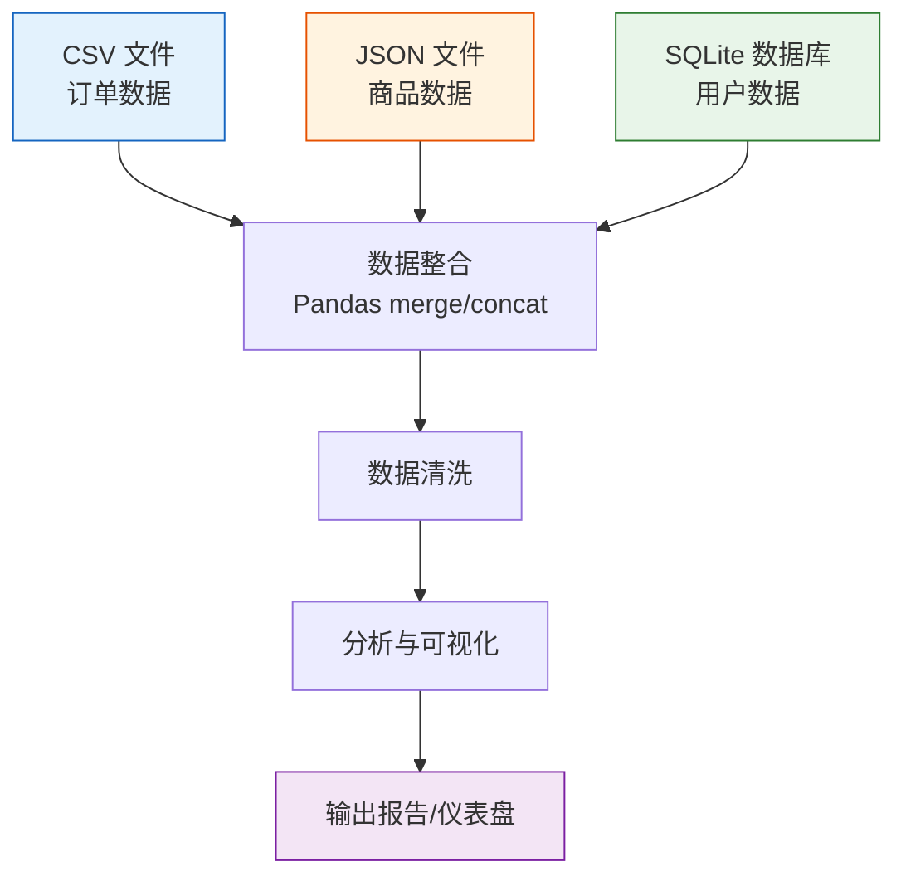
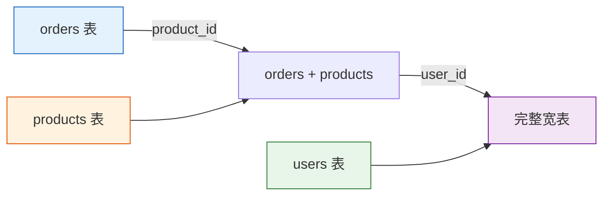
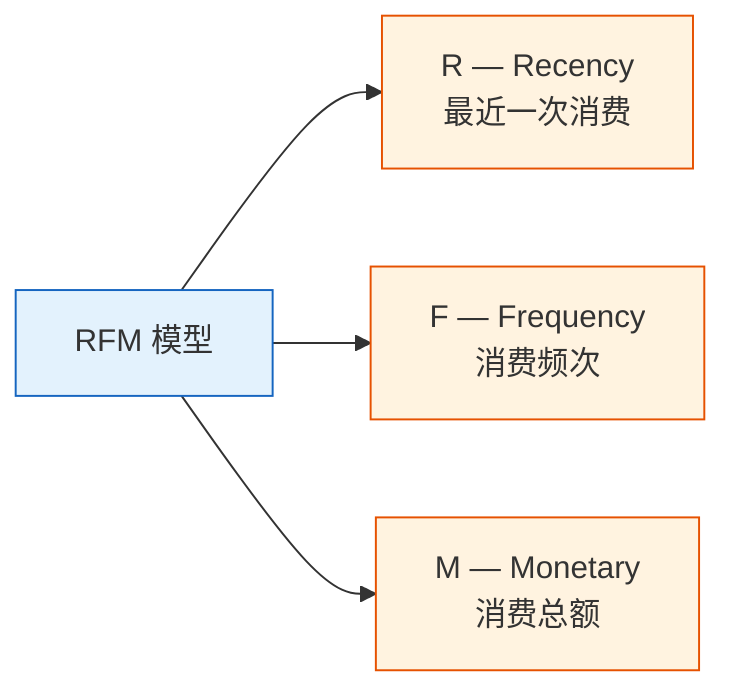
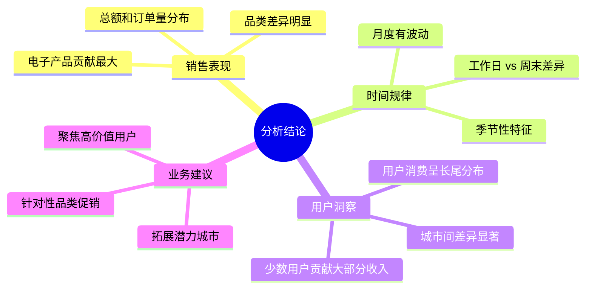

# 实战项目：多数据源整合分析

:::tip 项目定位
这是第二阶段的**毕业项目**。相比项目一（单数据集 EDA），本项目增加了**多来源数据整合**和**时间维度分析**，更接近真实的数据分析工作。
:::

## 项目简介

真实工作中，数据几乎不会整整齐齐地放在一个 CSV 里。你需要从 CSV、JSON、数据库等多个来源获取数据，先清洗整合，再分析。



### 项目场景

你是一家**在线零售公司**的数据分析师。公司的数据分散在不同系统中：

| 数据来源 | 格式 | 内容 |
|---------|------|------|
| 销售系统导出 | CSV | 订单记录（订单ID、用户ID、商品ID、数量、日期） |
| 商品管理系统 API | JSON | 商品信息（商品ID、名称、类别、价格） |
| 用户系统数据库 | SQLite | 用户信息（用户ID、姓名、城市、注册日期） |

你的任务：整合这些数据，分析销售情况，输出一份有价值的分析报告。

### 涉及知识点

| 技能 | 对应章节 |
|------|---------|
| CSV/JSON 读写 | 第 3 章 3.2 节 |
| Pandas merge 合并 | 第 3 章 3.7 节 |
| 分组聚合与透视表 | 第 3 章 3.6 节 |
| 时间序列处理 | 第 3 章 3.8 节 |
| Matplotlib/Seaborn 可视化 | 第 4 章 |
| SQLite 数据库操作 | 第 5 章 |

---

## 一、准备模拟数据

真实项目中数据是现成的，但为了学习，我们先用 Python 生成模拟数据。

### 1.1 生成订单数据（CSV）

```python
import numpy as np
import pandas as pd
import json
import sqlite3
from datetime import datetime, timedelta

np.random.seed(42)

# ---------- 订单数据 ----------
n_orders = 2000
order_dates = pd.date_range('2024-01-01', '2024-12-31', freq='h')
order_dates = np.random.choice(order_dates, n_orders)

orders = pd.DataFrame({
    'order_id': range(1, n_orders + 1),
    'user_id': np.random.randint(1, 201, n_orders),       # 200 个用户
    'product_id': np.random.randint(1, 51, n_orders),      # 50 个商品
    'quantity': np.random.choice([1, 1, 1, 2, 2, 3], n_orders),
    'order_date': order_dates
})

# 保存为 CSV
orders.to_csv('orders.csv', index=False)
print(f"订单数据：{orders.shape}")
orders.head()
```

### 1.2 生成商品数据（JSON）

```python
# ---------- 商品数据 ----------
categories = ['电子产品', '服装', '食品', '家居', '图书']
products = []

for i in range(1, 51):
    cat = np.random.choice(categories)
    # 不同类别的价格区间不同
    price_ranges = {
        '电子产品': (200, 5000),
        '服装': (50, 800),
        '食品': (10, 100),
        '家居': (30, 500),
        '图书': (20, 150),
    }
    low, high = price_ranges[cat]
    price = round(np.random.uniform(low, high), 2)
    
    products.append({
        'product_id': i,
        'name': f'{cat}_{i:03d}',
        'category': cat,
        'price': price
    })

# 保存为 JSON
with open('products.json', 'w', encoding='utf-8') as f:
    json.dump(products, f, ensure_ascii=False, indent=2)

print(f"商品数据：{len(products)} 个商品")
pd.DataFrame(products).head()
```

### 1.3 生成用户数据（SQLite）

```python
# ---------- 用户数据 ----------
cities = ['北京', '上海', '广州', '深圳', '杭州', '成都', '武汉', '南京', '重庆', '西安']

users = pd.DataFrame({
    'user_id': range(1, 201),
    'name': [f'用户_{i:03d}' for i in range(1, 201)],
    'city': np.random.choice(cities, 200),
    'register_date': pd.date_range('2022-01-01', periods=200, freq='2D')
})

# 保存到 SQLite
conn = sqlite3.connect('users.db')
users.to_sql('users', conn, if_exists='replace', index=False)
conn.close()

print(f"用户数据：{users.shape}")
users.head()
```

:::info 数据文件清单
运行上面的代码后，你会得到三个文件：
- `orders.csv` — 2000 条订单记录
- `products.json` — 50 个商品信息
- `users.db` — SQLite 数据库，包含 200 个用户信息
:::

---

## 二、多源数据读取

### 2.1 读取 CSV

```python
import pandas as pd
import numpy as np
import matplotlib.pyplot as plt
import seaborn as sns
import json
import sqlite3

plt.rcParams['font.sans-serif'] = ['Arial Unicode MS']
plt.rcParams['axes.unicode_minus'] = False
sns.set_theme(style="whitegrid", font_scale=1.1)

# 1. 读取 CSV
orders = pd.read_csv('orders.csv', parse_dates=['order_date'])
print(f"订单数据：{orders.shape}")
print(orders.dtypes)
orders.head()
```

### 2.2 读取 JSON

```python
# 2. 读取 JSON
with open('products.json', 'r', encoding='utf-8') as f:
    products_list = json.load(f)

products = pd.DataFrame(products_list)
print(f"\n商品数据：{products.shape}")
products.head()
```

也可以直接用 Pandas 读取：

```python
# Pandas 一行搞定
products = pd.read_json('products.json')
```

### 2.3 读取 SQLite

```python
# 3. 读取 SQLite
conn = sqlite3.connect('users.db')
users = pd.read_sql_query("SELECT * FROM users", conn, parse_dates=['register_date'])
conn.close()

print(f"\n用户数据：{users.shape}")
users.head()
```

### 2.4 数据概览

```python
print("=" * 50)
print("数据源汇总")
print("=" * 50)
print(f"订单表：{orders.shape[0]} 行 × {orders.shape[1]} 列")
print(f"商品表：{products.shape[0]} 行 × {products.shape[1]} 列")
print(f"用户表：{users.shape[0]} 行 × {users.shape[1]} 列")

# 检查关联键
print(f"\n订单中的用户ID范围：{orders['user_id'].min()} ~ {orders['user_id'].max()}")
print(f"订单中的商品ID范围：{orders['product_id'].min()} ~ {orders['product_id'].max()}")
print(f"用户表的用户ID范围：{users['user_id'].min()} ~ {users['user_id'].max()}")
print(f"商品表的商品ID范围：{products['product_id'].min()} ~ {products['product_id'].max()}")
```

---

## 三、数据整合

这是本项目的**核心步骤**——把三张表合并成一张宽表。

### 3.1 整合策略



### 3.2 合并操作

```python
# 第一步：订单 + 商品信息
df = orders.merge(products, on='product_id', how='left')
print(f"合并商品后：{df.shape}")

# 第二步：+ 用户信息
df = df.merge(users, on='user_id', how='left')
print(f"合并用户后：{df.shape}")

df.head()
```

### 3.3 计算关键指标

```python
# 订单金额 = 单价 × 数量
df['amount'] = df['price'] * df['quantity']

# 提取时间维度
df['month'] = df['order_date'].dt.month
df['weekday'] = df['order_date'].dt.day_name()
df['quarter'] = df['order_date'].dt.quarter

# 查看结果
print(f"\n完整数据集：{df.shape[0]} 行 × {df.shape[1]} 列")
print(f"总销售额：¥{df['amount'].sum():,.0f}")
print(f"平均订单金额：¥{df['amount'].mean():,.0f}")
df[['order_id', 'name_x', 'category', 'quantity', 'price', 'amount', 'city', 'month']].head(10)
```

:::warning 合并时注意列名冲突
`orders` 和 `users` 都可能有 `name` 列。Pandas 会自动加后缀 `_x` 和 `_y`。建议合并前重命名，或者合并后处理：
```python
# 重命名避免混淆
df = df.rename(columns={'name_x': 'user_name', 'name_y': 'product_name'})
# 或者合并前只选需要的列
users_slim = users[['user_id', 'city', 'register_date']]
```
:::

### 3.4 数据质量检查

```python
# 检查合并后的数据完整性
print("=== 合并后数据质量检查 ===")
print(f"总行数：{len(df)}")
print(f"缺失值：")
print(df.isnull().sum()[df.isnull().sum() > 0])

# 如果有缺失值，说明某些 ID 在关联表中不存在
# 检查孤立记录
orphan_products = set(orders['product_id']) - set(products['product_id'])
orphan_users = set(orders['user_id']) - set(users['user_id'])
print(f"\n无法匹配的商品ID：{orphan_products if orphan_products else '无'}")
print(f"无法匹配的用户ID：{orphan_users if orphan_users else '无'}")
```

---

## 四、分析一：销售概览

### 4.1 总体指标

```python
print("=" * 50)
print("  2024 年销售概览")
print("=" * 50)
print(f"  总订单数：{df['order_id'].nunique():,}")
print(f"  总销售额：¥{df['amount'].sum():,.0f}")
print(f"  平均客单价：¥{df.groupby('order_id')['amount'].sum().mean():,.0f}")
print(f"  活跃用户数：{df['user_id'].nunique()}")
print(f"  商品种类数：{df['product_id'].nunique()}")
```

### 4.2 品类分析

```python
# 各品类销售额和订单量
cat_stats = df.groupby('category').agg(
    销售额=('amount', 'sum'),
    订单量=('order_id', 'count'),
    平均单价=('price', 'mean'),
    商品数=('product_id', 'nunique')
).round(0).sort_values('销售额', ascending=False)

print(cat_stats)
```

```python
fig, axes = plt.subplots(1, 2, figsize=(14, 5))

# 品类销售额占比
colors = ['#2196f3', '#ff9800', '#4caf50', '#f44336', '#9c27b0']
axes[0].pie(cat_stats['销售额'], labels=cat_stats.index, autopct='%1.1f%%',
            colors=colors, startangle=90, pctdistance=0.85)
axes[0].set_title('各品类销售额占比')

# 品类订单量对比
cat_stats['订单量'].plot(kind='barh', ax=axes[1], color=colors)
axes[1].set_title('各品类订单量')
axes[1].set_xlabel('订单数')

plt.tight_layout()
plt.savefig('07_category.png', dpi=150, bbox_inches='tight')
plt.show()
```

### 4.3 城市分析

```python
# Top 城市销售额
city_stats = df.groupby('city').agg(
    销售额=('amount', 'sum'),
    订单量=('order_id', 'count'),
    用户数=('user_id', 'nunique')
).sort_values('销售额', ascending=False)

fig, ax = plt.subplots(figsize=(10, 5))
city_stats['销售额'].plot(kind='bar', color='steelblue', ax=ax)
ax.set_title('各城市销售额')
ax.set_ylabel('销售额（元）')
ax.set_xticklabels(ax.get_xticklabels(), rotation=45, ha='right')

# 在柱子上标数字
for i, v in enumerate(city_stats['销售额']):
    ax.text(i, v + v*0.01, f'¥{v:,.0f}', ha='center', va='bottom', fontsize=9)

plt.tight_layout()
plt.savefig('08_city.png', dpi=150, bbox_inches='tight')
plt.show()
```

---

## 五、分析二：时间趋势

### 5.1 月度趋势

```python
# 按月汇总
monthly = df.groupby('month').agg(
    销售额=('amount', 'sum'),
    订单量=('order_id', 'count')
).reset_index()

fig, ax1 = plt.subplots(figsize=(12, 5))

# 双 Y 轴：销售额用柱状图，订单量用折线图
color1 = 'steelblue'
color2 = 'coral'

bars = ax1.bar(monthly['month'], monthly['销售额'], color=color1, alpha=0.7, label='销售额')
ax1.set_xlabel('月份')
ax1.set_ylabel('销售额（元）', color=color1)
ax1.tick_params(axis='y', labelcolor=color1)
ax1.set_xticks(range(1, 13))

ax2 = ax1.twinx()
ax2.plot(monthly['month'], monthly['订单量'], color=color2, marker='o', linewidth=2, label='订单量')
ax2.set_ylabel('订单量', color=color2)
ax2.tick_params(axis='y', labelcolor=color2)

ax1.set_title('月度销售趋势（2024年）')

# 合并图例
lines1, labels1 = ax1.get_legend_handles_labels()
lines2, labels2 = ax2.get_legend_handles_labels()
ax1.legend(lines1 + lines2, labels1 + labels2, loc='upper left')

plt.tight_layout()
plt.savefig('09_monthly.png', dpi=150, bbox_inches='tight')
plt.show()
```

### 5.2 周内分布

```python
# 按星期几统计
weekday_order = ['Monday', 'Tuesday', 'Wednesday', 'Thursday', 'Friday', 'Saturday', 'Sunday']
weekday_cn = ['周一', '周二', '周三', '周四', '周五', '周六', '周日']

weekday_stats = df.groupby('weekday')['amount'].agg(['sum', 'count']).reindex(weekday_order)
weekday_stats.index = weekday_cn

fig, axes = plt.subplots(1, 2, figsize=(14, 5))

weekday_stats['sum'].plot(kind='bar', color='mediumseagreen', ax=axes[0])
axes[0].set_title('各星期的销售额')
axes[0].set_ylabel('销售额（元）')
axes[0].set_xticklabels(weekday_cn, rotation=0)

weekday_stats['count'].plot(kind='bar', color='salmon', ax=axes[1])
axes[1].set_title('各星期的订单量')
axes[1].set_ylabel('订单数')
axes[1].set_xticklabels(weekday_cn, rotation=0)

plt.tight_layout()
plt.savefig('10_weekday.png', dpi=150, bbox_inches='tight')
plt.show()
```

### 5.3 品类月度趋势

```python
# 各品类的月度销售额
cat_monthly = df.groupby(['month', 'category'])['amount'].sum().reset_index()

plt.figure(figsize=(12, 6))
sns.lineplot(data=cat_monthly, x='month', y='amount', hue='category',
             marker='o', linewidth=2)
plt.title('各品类月度销售趋势')
plt.xlabel('月份')
plt.ylabel('销售额（元）')
plt.xticks(range(1, 13))
plt.legend(title='品类', bbox_to_anchor=(1.02, 1), loc='upper left')
plt.tight_layout()
plt.savefig('11_cat_monthly.png', dpi=150, bbox_inches='tight')
plt.show()
```

---

## 六、分析三：用户分析

### 6.1 用户消费分层

用 **RFM 模型** 的简化版对用户进行分层：



```python
# 计算 RFM
today = pd.Timestamp('2025-01-01')  # 参考日期

rfm = df.groupby('user_id').agg(
    Recency=('order_date', lambda x: (today - x.max()).days),     # 距今天数
    Frequency=('order_id', 'nunique'),                             # 订单次数
    Monetary=('amount', 'sum')                                     # 消费总额
).round(0)

print(rfm.describe().round(1))
rfm.head(10)
```

### 6.2 用户分层可视化

```python
fig, axes = plt.subplots(1, 3, figsize=(16, 4))

axes[0].hist(rfm['Recency'], bins=30, color='steelblue', edgecolor='white')
axes[0].set_title('R：最近消费距今天数')
axes[0].set_xlabel('天数')

axes[1].hist(rfm['Frequency'], bins=20, color='coral', edgecolor='white')
axes[1].set_title('F：消费频次')
axes[1].set_xlabel('订单数')

axes[2].hist(rfm['Monetary'], bins=30, color='mediumseagreen', edgecolor='white')
axes[2].set_title('M：消费总额')
axes[2].set_xlabel('金额（元）')

plt.tight_layout()
plt.savefig('12_rfm.png', dpi=150, bbox_inches='tight')
plt.show()
```

### 6.3 简单用户分群

```python
# 根据消费金额和频次将用户分为 4 个群体
rfm['value_group'] = pd.qcut(rfm['Monetary'], q=4, labels=['低价值', '中低', '中高', '高价值'])
rfm['freq_group'] = pd.qcut(rfm['Frequency'], q=3, labels=['低频', '中频', '高频'], duplicates='drop')

# 交叉表：价值 × 频次
cross = pd.crosstab(rfm['value_group'], rfm['freq_group'], margins=True)
print("用户分群交叉表：")
print(cross)
```

```python
# 高价值用户的特征
high_value = rfm[rfm['value_group'] == '高价值']
print(f"\n高价值用户：{len(high_value)} 人")
print(f"  平均消费：¥{high_value['Monetary'].mean():,.0f}")
print(f"  平均频次：{high_value['Frequency'].mean():.1f} 次")
print(f"  平均间隔：{high_value['Recency'].mean():.0f} 天")
```

### 6.4 城市 × 用户分层

```python
# 合并 RFM 分群回到主表
user_city = df.groupby('user_id')['city'].first().reset_index()
rfm_city = rfm.reset_index().merge(user_city, on='user_id')

# 各城市高价值用户占比
city_value = pd.crosstab(rfm_city['city'], rfm_city['value_group'], normalize='index') * 100

plt.figure(figsize=(12, 6))
city_value[['高价值', '中高']].plot(kind='barh', stacked=True, 
                                    color=['#2196f3', '#90caf9'],
                                    figsize=(10, 6))
plt.title('各城市中高/高价值用户占比')
plt.xlabel('占比（%）')
plt.legend(title='用户分群')
plt.tight_layout()
plt.savefig('13_city_value.png', dpi=150, bbox_inches='tight')
plt.show()
```

---

## 七、分析四：综合仪表盘

把关键指标和图表整合到一张大图中：

```python
fig = plt.figure(figsize=(18, 14))
fig.suptitle('2024 年在线零售分析仪表盘', fontsize=18, fontweight='bold', y=0.98)

# ---------- 1. 核心指标（文字） ----------
ax_text = fig.add_subplot(4, 3, (1, 3))
ax_text.axis('off')

metrics = [
    (f"¥{df['amount'].sum():,.0f}", "总销售额"),
    (f"{df['order_id'].nunique():,}", "总订单数"),
    (f"{df['user_id'].nunique()}", "活跃用户"),
    (f"¥{df.groupby('order_id')['amount'].sum().mean():,.0f}", "平均客单价"),
]

for i, (value, label) in enumerate(metrics):
    x_pos = 0.12 + i * 0.22
    ax_text.text(x_pos, 0.6, value, fontsize=22, fontweight='bold', 
                 color='#1565c0', ha='center', transform=ax_text.transAxes)
    ax_text.text(x_pos, 0.2, label, fontsize=12, color='#666',
                 ha='center', transform=ax_text.transAxes)

# ---------- 2. 月度趋势 ----------
ax2 = fig.add_subplot(4, 3, (4, 6))
monthly_amount = df.groupby('month')['amount'].sum()
ax2.fill_between(monthly_amount.index, monthly_amount.values, alpha=0.3, color='steelblue')
ax2.plot(monthly_amount.index, monthly_amount.values, color='steelblue', linewidth=2, marker='o')
ax2.set_title('月度销售趋势', fontsize=13)
ax2.set_xlabel('月份')
ax2.set_ylabel('销售额')
ax2.set_xticks(range(1, 13))

# ---------- 3. 品类饼图 ----------
ax3 = fig.add_subplot(4, 3, 7)
cat_amount = df.groupby('category')['amount'].sum().sort_values(ascending=False)
colors = ['#2196f3', '#ff9800', '#4caf50', '#f44336', '#9c27b0']
ax3.pie(cat_amount, labels=cat_amount.index, autopct='%1.0f%%', 
        colors=colors, startangle=90, textprops={'fontsize': 9})
ax3.set_title('品类销售占比', fontsize=13)

# ---------- 4. Top 商品 ----------
ax4 = fig.add_subplot(4, 3, 8)
# 使用 product_id 关联的 name 列（可能叫 name 或 product_name）
product_col = 'name' if 'name' in df.columns else df.columns[df.columns.str.contains('name')][0]
top_products = df.groupby('product_id')['amount'].sum().nlargest(8)
product_names = products.set_index('product_id').loc[top_products.index, 'name']
ax4.barh(product_names.values[::-1], top_products.values[::-1], color='coral')
ax4.set_title('Top 8 热销商品', fontsize=13)
ax4.set_xlabel('销售额')

# ---------- 5. 城市对比 ----------
ax5 = fig.add_subplot(4, 3, 9)
city_amount = df.groupby('city')['amount'].sum().sort_values(ascending=True)
ax5.barh(city_amount.index, city_amount.values, color='mediumseagreen')
ax5.set_title('城市销售排名', fontsize=13)
ax5.set_xlabel('销售额')

# ---------- 6. 用户消费分布 ----------
ax6 = fig.add_subplot(4, 3, (10, 12))
user_amount = df.groupby('user_id')['amount'].sum()
ax6.hist(user_amount, bins=40, color='#7986cb', edgecolor='white', alpha=0.8)
ax6.axvline(user_amount.mean(), color='red', linestyle='--', linewidth=2, label=f'均值: ¥{user_amount.mean():,.0f}')
ax6.axvline(user_amount.median(), color='orange', linestyle='--', linewidth=2, label=f'中位数: ¥{user_amount.median():,.0f}')
ax6.set_title('用户消费金额分布', fontsize=13)
ax6.set_xlabel('消费总额（元）')
ax6.set_ylabel('用户数')
ax6.legend()

plt.tight_layout(rect=[0, 0, 1, 0.96])
plt.savefig('14_dashboard.png', dpi=150, bbox_inches='tight')
plt.show()
```

---

## 八、分析结论与建议

### 核心发现



### 给公司的建议

1. **高价值用户维护**：前 20% 用户贡献了大部分销售额，应建立 VIP 机制，提供专属服务
2. **品类策略**：电子产品虽然单价高，但可以通过食品和图书引流，提高用户黏性
3. **城市拓展**：分析各城市的渗透率，对于用户少但人均消费高的城市，值得加大推广
4. **时间运营**：根据月度和周内趋势，合理安排促销活动和库存
5. **用户增长**：关注新老用户的转化率，对低频用户发放优惠券激活

---

## 九、项目总结与扩展

### 知识回顾

| 步骤 | 用到的技能 | 对应代码 |
|------|-----------|---------|
| 数据读取 | `read_csv`, `read_json`, `read_sql_query` | 第二节 |
| 数据合并 | `merge`（多表关联） | 第三节 |
| 分组聚合 | `groupby`, `agg`, `pivot_table` | 第四~六节 |
| 时间处理 | `dt.month`, `dt.day_name()`, `date_range` | 第五节 |
| 可视化 | Matplotlib 子图、双 Y 轴、Seaborn | 全过程 |

### 进阶挑战

**挑战 1：加入更多数据源**

从网络 API 获取数据（如天气数据），分析天气对销售的影响：

```python
# 示例：模拟天气数据
weather = pd.DataFrame({
    'date': pd.date_range('2024-01-01', '2024-12-31'),
    'temp': np.random.normal(20, 10, 366).clip(-5, 40),
    'rain': np.random.choice([0, 0, 0, 1], 366)  # 0=晴 1=雨
})
```

**挑战 2：用 Plotly 做交互式仪表盘**

```python
import plotly.express as px
from plotly.subplots import make_subplots

# 交互式月度趋势
fig = px.line(monthly, x='month', y='销售额', 
              title='月度销售趋势', markers=True)
fig.show()
```

**挑战 3：自动生成 PDF 报告**

研究 `matplotlib` 的 `PdfPages` 或 `reportlab` 库，自动生成 PDF 分析报告。

**挑战 4：使用真实数据集**

到 [Kaggle](https://www.kaggle.com/datasets) 上找一个真实的电商数据集（如 [Brazilian E-Commerce](https://www.kaggle.com/datasets/olistbr/brazilian-ecommerce)），重做这个项目。

---

## 十、项目检查清单

| 检查项 | 是否完成 |
|--------|---------|
| 从 CSV 读取订单数据 | ☐ |
| 从 JSON 读取商品数据 | ☐ |
| 从 SQLite 读取用户数据 | ☐ |
| 用 merge 合并三张表 | ☐ |
| 检查合并后的数据质量 | ☐ |
| 完成销售概览分析（品类、城市） | ☐ |
| 完成时间趋势分析（月度、周内） | ☐ |
| 完成用户分析（RFM、分群） | ☐ |
| 制作综合仪表盘（大图） | ☐ |
| 写出至少 3 条分析结论 | ☐ |
| 给出业务建议 | ☐ |

:::note 恭喜完成第二阶段！
完成这两个项目，意味着你已经掌握了数据分析的完整工作流——从获取数据、清洗整合，到分析可视化和撰写报告。这些技能是进入**机器学习**阶段的坚实基础。

下一步，你将进入**第三阶段：数学基础**和**第四阶段：机器学习**，把数据分析的能力升级为预测和建模的能力。
:::
