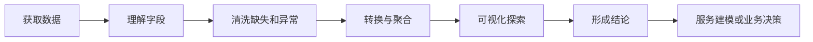

# 02 数据分析与可视化

这一阶段解决的是“能不能理解数据、整理数据、发现规律并表达结论”。无论你后面做机器学习、RAG、Agent 还是产品数据分析，数据能力都是底层能力。

## 阶段定位

| 信息 | 说明 |
|---|---|
| 适合对象 | 已经能写基础 Python，希望进入数据和 AI 项目的学习者 |
| 预估学时 | 80～120 小时 |
| 前置要求 | 完成 Python 编程基础 |
| 阶段产出 | 一个完整的数据分析报告，一个多来源数据整理项目 |

## 为什么 AI 离不开数据

模型并不是从空气中学习。数据的质量、结构、分布和标注方式会直接影响模型结果。即使你未来主要做大模型应用，也会遇到文档清洗、日志分析、评估集构造、用户反馈统计和检索质量分析。

## 本阶段学习路径

第一章用纯 Python 处理数据，让你体会为什么需要 NumPy 和 Pandas。

第二章学习 NumPy。你会理解数组、向量化、广播、矩阵运算和随机统计，这些概念会在机器学习和深度学习里反复出现。

第三章学习 Pandas。你会处理表格数据、读写文件、筛选过滤、清洗缺失值、分组聚合、合并数据和处理时间序列。

第四章学习可视化。你会用图表表达分布、趋势、关系和异常，而不是只把结果打印成表格。

第五章数据库是选修，但如果你想做真实应用或企业数据项目，建议至少理解关系型数据库和 SQL 基础。

## 学完后你应该能做到

- 能读取 CSV、Excel、JSON 等常见数据文件
- 能用 Pandas 完成筛选、清洗、转换、聚合和合并
- 能用 NumPy 理解数组计算和基础统计
- 能选择合适图表表达数据结论
- 能把数据分析过程整理成 Notebook 或报告
- 能为后续机器学习项目准备干净的数据集

## 常见误区

不要把数据分析学成“背 API”。Pandas 方法很多，第一遍不需要全部记住。你更应该理解数据处理的流程：先看数据长什么样，再查缺失和异常，再做转换和统计，最后用图表验证判断。

也不要只画漂亮图。图表的目的不是装饰，而是回答问题。每张图都应该对应一个明确问题，比如“哪个特征和目标最相关”“是否存在明显异常”“不同类别之间有什么差异”。

## 阶段项目

本阶段至少完成一个真实数据分析报告。推荐选择公开数据集，完成数据读取、字段理解、清洗、可视化、结论总结和后续建模建议。

进阶项目可以做多来源数据分析，把多个 CSV、网页数据或数据库表合并起来，形成一个更接近真实工作的分析流程。