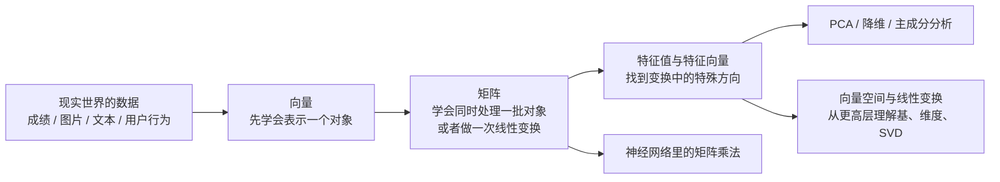

# 学前导读：线性代数这章到底在学什么

:::tip 先别急着背公式
对新人来说，这一章最重要的不是证明定理，而是先建立一张地图：

1. 为什么 AI 里到处都是向量和矩阵
2. 这四节课之间是什么关系
3. 学到什么程度就足够支撑后面的机器学习和深度学习
:::

## 学习目标

- 知道线性代数这章在整套课里的位置
- 看懂“向量 -> 矩阵 -> 特征值 -> 线性变换”的关系
- 知道新人该重点掌握什么、哪些内容先求直觉就够
- 在正式进入公式前，先建立 AI 场景里的使用感

---

## 一、为什么 AI 里到处都是线性代数？

因为 AI 的很多对象，本质上都可以表示成“数字数组”，而线性代数就是研究这些数字数组如何表示、如何变换、如何比较的一套语言。

| AI 场景 | 你看到的对象 | 在线性代数里怎么看 |
|---|---|---|
| 一条用户数据 | 年龄、收入、城市等级、活跃度 | 一个向量 |
| 一批样本 | 很多条用户数据堆在一起 | 一个矩阵 |
| 文本向量检索 | 查询和文档谁更像 | 向量相似度 |
| 神经网络一层 | 输入乘权重再加偏置 | 矩阵乘法 |
| PCA 降维 | 压缩特征又尽量少丢信息 | 特征值和特征向量 |

所以你可以把这一章理解成：

- 向量：学会描述一个对象
- 矩阵：学会同时处理一批对象，或者对对象做变换
- 特征值：学会找到“最重要的方向”
- 向量空间：学会从更高视角理解维度、基和变换

---

## 二、这一章四节之间是什么关系？



你可以把整章压缩成一句话：

> **先学会把数据写成向量，再学会用矩阵批量处理向量，最后学会从这些变换里找出最重要的结构。**

---

## 三、新人最应该怎么学这一章？

### 3.1 第一步：先把向量学明白

你最少要弄懂这些事：

- 向量就是一串有序数字
- 向量长度、点积、余弦相似度分别在衡量什么
- 为什么 RAG、推荐系统、词向量都会用到相似度

### 3.2 第二步：再把矩阵当成“批量处理机器”

你最少要弄懂这些事：

- 一批样本堆起来就是矩阵
- 矩阵乘法其实就是“行和列做点积”
- 为什么神经网络一层可以写成 `X @ W + b`

### 3.3 第三步：把特征值当成“特殊方向”

你最少要弄懂这些事：

- 大多数向量被矩阵作用后，方向会变
- 但有些特殊方向只会被拉长或缩短
- PCA 就是在找数据变化最大的那些方向

### 3.4 第四步：把向量空间当成加深理解的选修

这一节更像“把前面学过的内容抬高一个视角”。

如果你当前目标是尽快学机器学习和深度学习，可以先把：

- 线性无关
- 基
- 维度
- 线性变换

理解到“会解释、会用代码验证”的程度，再继续往后走。

---

## 四、学这一章最常见的误解

- 误以为线性代数就是一堆公式，其实它首先是描述数据和变换的语言
- 误以为看不懂证明就学不会 AI，其实先看懂图和代码已经很有价值
- 误以为数学和代码可以分开学，其实一分开就很容易越来越虚
- 误以为高维向量画不出来就无法理解，其实二维图只是帮助建立直觉

---

## 五、先跑一个贯穿整章的最小例子

下面这段小代码，几乎把这一章的主线都串起来了：

- 一条样本是向量
- 多条样本堆起来是矩阵
- 和权重做点积可以得到打分
- 一批样本和权重矩阵相乘可以一次算出多组结果

```python
import numpy as np

student = np.array([90, 85, 92])
print("单个学生向量:", student)

students = np.array([
    [90, 85, 92],
    [70, 88, 75],
    [95, 91, 89],
])
print("样本矩阵形状:", students.shape)  # (3, 3)

weights = np.array([0.4, 0.2, 0.4])

single_score = student @ weights
print("单个学生综合分:", round(single_score, 2))

all_scores = students @ weights
print("所有学生综合分:", all_scores.round(2))
```

---

## 六、学完这章后，你至少应该会什么？

- 看到一条数据，知道它可以写成向量
- 看到一批数据，知道它可以写成矩阵
- 看到点积，知道它在衡量什么
- 看到矩阵乘法，知道它是在做批量变换
- 看到特征值，知道它和 PCA、主方向有关
