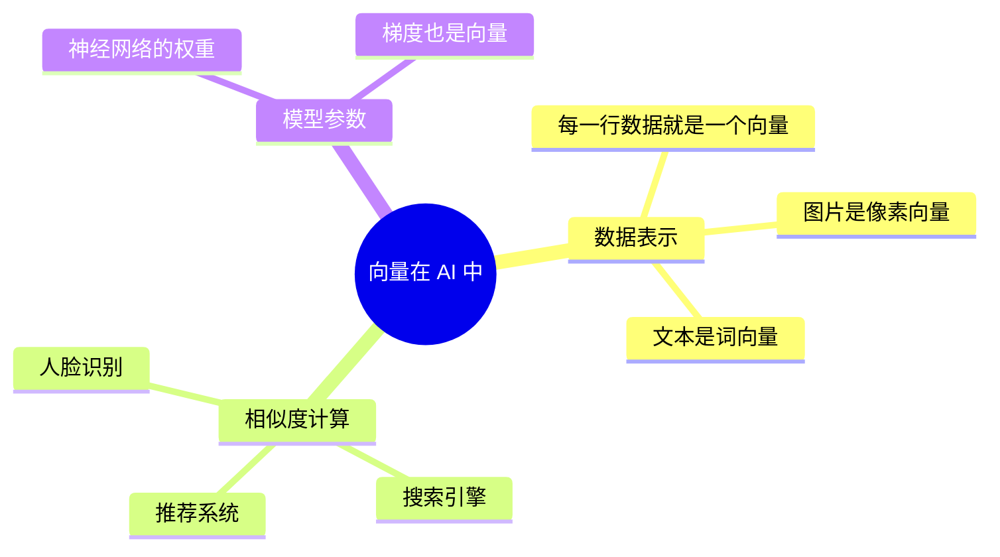
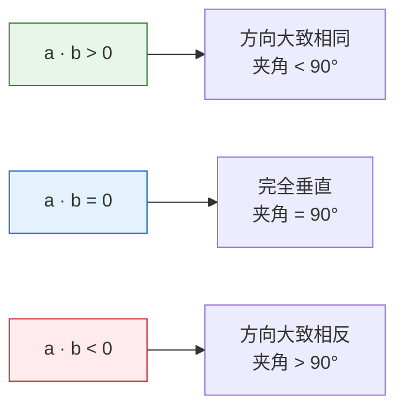
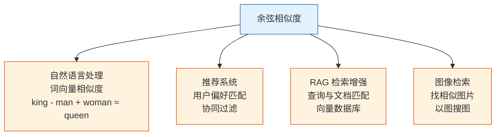

# 向量：AI 世界的基本单元

:::tip 学习方式
本章的数学不需要你"证明定理"，只需要你**理解直觉、会用代码实现**。每个概念都会配上可视化和 NumPy 代码，看不懂公式没关系，看懂图和代码就行。
:::

## 学习目标

- 直觉理解向量是什么（方向 + 大小）
- 掌握向量的加法、数乘运算
- 理解点积（Dot Product）的含义
- 掌握余弦相似度——AI 中最常用的相似度度量
- 用 NumPy 实现所有向量操作

---

## 一、向量是什么？

### 1.1 直觉理解

**向量 = 一组有序的数字。**

就这么简单。在 AI 领域，向量无处不在：

| AI 场景 | 向量表示 | 维度 |
|---------|---------|------|
| 一个学生的成绩 | [数学, 英语, 物理] = [90, 85, 92] | 3 维 |
| 一个像素的颜色 | [R, G, B] = [255, 128, 0] | 3 维 |
| 一个词的含义（词向量） | [0.2, -0.5, 0.8, ...] | 通常 100~300 维 |
| 一张图片（展平后） | [像素1, 像素2, ..., 像素n] | 几万到几百万维 |



### 1.2 几何直觉

在二维空间中，向量可以画成一个**带箭头的线段**——既有**方向**，又有**大小**（长度）。

```python
import numpy as np
import matplotlib.pyplot as plt

plt.rcParams['font.sans-serif'] = ['Arial Unicode MS']
plt.rcParams['axes.unicode_minus'] = False

# 定义两个二维向量
a = np.array([3, 2])
b = np.array([1, 4])

# 画向量
fig, ax = plt.subplots(figsize=(6, 6))
ax.quiver(0, 0, a[0], a[1], angles='xy', scale_units='xy', scale=1, 
          color='steelblue', linewidth=2, label=f'a = {a}')
ax.quiver(0, 0, b[0], b[1], angles='xy', scale_units='xy', scale=1, 
          color='coral', linewidth=2, label=f'b = {b}')

ax.set_xlim(-1, 6)
ax.set_ylim(-1, 6)
ax.set_aspect('equal')
ax.grid(True, alpha=0.3)
ax.axhline(y=0, color='k', linewidth=0.5)
ax.axvline(x=0, color='k', linewidth=0.5)
ax.legend(fontsize=12)
ax.set_title('二维向量的几何表示')
plt.show()
```

**解读**：向量 a = [3, 2] 从原点出发，向右走 3 步、向上走 2 步。

:::info 高维向量怎么理解？
AI 中的向量通常是几百上千维的，没法画出来。但数学上的操作是一样的——向量就是**一串数字**，所有运算规则对任意维度都适用。
:::

---

## 二、向量的基本运算

### 2.1 向量加法

两个向量相加 = **对应位置的数字相加**。

```python
a = np.array([3, 2])
b = np.array([1, 4])

# 向量加法
c = a + b
print(f"a + b = {c}")  # [4, 6]
```

几何含义：把 b 接在 a 的末端，结果指向终点。

```python
fig, ax = plt.subplots(figsize=(7, 7))

# 画 a
ax.quiver(0, 0, a[0], a[1], angles='xy', scale_units='xy', scale=1,
          color='steelblue', linewidth=2, label=f'a = {a}')
# 画 b（从 a 的末端开始）
ax.quiver(a[0], a[1], b[0], b[1], angles='xy', scale_units='xy', scale=1,
          color='coral', linewidth=2, label=f'b = {b}')
# 画 a + b
ax.quiver(0, 0, c[0], c[1], angles='xy', scale_units='xy', scale=1,
          color='green', linewidth=2.5, label=f'a + b = {c}')

ax.set_xlim(-1, 7)
ax.set_ylim(-1, 8)
ax.set_aspect('equal')
ax.grid(True, alpha=0.3)
ax.legend(fontsize=11)
ax.set_title('向量加法：首尾相接')
plt.show()
```

### 2.2 数乘（标量乘法）

向量乘以一个数 = **每个分量都乘以这个数**。

```python
a = np.array([3, 2])

# 数乘
print(f"2 * a = {2 * a}")     # [6, 4]  —— 方向不变，长度变 2 倍
print(f"0.5 * a = {0.5 * a}") # [1.5, 1.0]  —— 方向不变，长度变一半
print(f"-1 * a = {-1 * a}")   # [-3, -2]  —— 方向反转
```

```python
fig, ax = plt.subplots(figsize=(8, 6))

vectors = [
    (a, 'steelblue', f'a = {a}'),
    (2 * a, 'green', f'2a = {2*a}'),
    (0.5 * a, 'orange', f'0.5a = {0.5*a}'),
    (-1 * a, 'red', f'-a = {-1*a}'),
]

for vec, color, label in vectors:
    ax.quiver(0, 0, vec[0], vec[1], angles='xy', scale_units='xy', scale=1,
              color=color, linewidth=2, label=label)

ax.set_xlim(-5, 8)
ax.set_ylim(-4, 6)
ax.set_aspect('equal')
ax.grid(True, alpha=0.3)
ax.axhline(y=0, color='k', linewidth=0.5)
ax.axvline(x=0, color='k', linewidth=0.5)
ax.legend(fontsize=11)
ax.set_title('数乘：缩放和反转')
plt.show()
```

### 2.3 向量的长度（模/范数）

向量的**长度**（也叫**模**或**范数**）用勾股定理计算：

对于向量 a = [a1, a2]，长度 = 根号(a1 的平方 + a2 的平方)

```python
a = np.array([3, 4])

# 方法 1：手算
length_manual = np.sqrt(a[0]**2 + a[1]**2)
print(f"手算长度: {length_manual}")  # 5.0

# 方法 2：NumPy 内置函数（推荐）
length = np.linalg.norm(a)
print(f"NumPy 长度: {length}")  # 5.0
```

:::tip 3-4-5 三角形
向量 [3, 4] 的长度恰好是 5——这就是经典的勾股数。在数据科学中，我们会经常用 `np.linalg.norm()` 来计算向量长度。
:::

### 2.4 单位向量

长度为 1 的向量叫**单位向量**。任何向量除以它的长度，就变成同方向的单位向量：

```python
a = np.array([3, 4])

# 单位化（归一化）
unit_a = a / np.linalg.norm(a)
print(f"单位向量: {unit_a}")                  # [0.6, 0.8]
print(f"单位向量长度: {np.linalg.norm(unit_a)}")  # 1.0
```

**为什么重要？** 在 AI 中，我们经常需要比较两个向量的**方向**而不是大小。单位化后就只保留了方向信息。

---

## 三、点积——向量最重要的运算

### 3.1 什么是点积？

两个向量的**点积**（Dot Product）= **对应位置相乘，再求和**。

```python
a = np.array([1, 2, 3])
b = np.array([4, 5, 6])

# 方法 1：手算
dot_manual = a[0]*b[0] + a[1]*b[1] + a[2]*b[2]
print(f"手算: {dot_manual}")  # 1*4 + 2*5 + 3*6 = 32

# 方法 2：NumPy（推荐）
dot_np = np.dot(a, b)
print(f"NumPy: {dot_np}")  # 32

# 方法 3：@ 运算符（Python 3.5+）
dot_at = a @ b
print(f"@ 运算符: {dot_at}")  # 32
```

### 3.2 点积的几何含义

点积反映了两个向量的**方向关系**：



```python
# 同方向
a = np.array([1, 0])
b = np.array([1, 1])
print(f"同方向: a · b = {np.dot(a, b)}")  # 1（正数）

# 垂直
a = np.array([1, 0])
b = np.array([0, 1])
print(f"垂直:   a · b = {np.dot(a, b)}")  # 0

# 反方向
a = np.array([1, 0])
b = np.array([-1, 0])
print(f"反方向: a · b = {np.dot(a, b)}")  # -1（负数）
```

### 3.3 用可视化理解点积

```python
fig, axes = plt.subplots(1, 3, figsize=(15, 4))

cases = [
    ([2, 1], [1, 2], '同向（点积 > 0）'),
    ([2, 0], [0, 2], '垂直（点积 = 0）'),
    ([2, 1], [-1, -2], '反向（点积 < 0）'),
]

for ax, (a, b, title) in zip(axes, cases):
    a, b = np.array(a), np.array(b)
    dot = np.dot(a, b)
    
    ax.quiver(0, 0, a[0], a[1], angles='xy', scale_units='xy', scale=1,
              color='steelblue', linewidth=2, label='a')
    ax.quiver(0, 0, b[0], b[1], angles='xy', scale_units='xy', scale=1,
              color='coral', linewidth=2, label='b')
    
    ax.set_xlim(-3, 4)
    ax.set_ylim(-3, 4)
    ax.set_aspect('equal')
    ax.grid(True, alpha=0.3)
    ax.axhline(y=0, color='k', linewidth=0.5)
    ax.axvline(x=0, color='k', linewidth=0.5)
    ax.set_title(f'{title}\na·b = {dot}')
    ax.legend()

plt.tight_layout()
plt.show()
```

---

## 四、余弦相似度——AI 中最常用的相似度

### 4.1 从点积到余弦相似度

点积的大小不仅取决于方向，还取决于向量的长度。如果我们只关心**方向有多相似**，需要消除长度的影响：

**余弦相似度 = 点积 / (向量 A 的长度 × 向量 B 的长度)**

```python
def cosine_similarity(a, b):
    """计算两个向量的余弦相似度"""
    dot_product = np.dot(a, b)
    norm_a = np.linalg.norm(a)
    norm_b = np.linalg.norm(b)
    return dot_product / (norm_a * norm_b)
```

余弦相似度的取值范围：

| 值 | 含义 |
|----|------|
| 1 | 方向完全相同 |
| 0 | 完全不相关（垂直） |
| -1 | 方向完全相反 |

### 4.2 实例：用户偏好相似度

假设有三个用户对五种电影类型的评分：

```python
# 用户对 [动作, 喜剧, 爱情, 科幻, 恐怖] 的偏好打分（1-5）
alice   = np.array([5, 3, 4, 5, 1])
bob     = np.array([4, 2, 5, 4, 1])
charlie = np.array([1, 5, 2, 1, 5])

# 计算两两相似度
print(f"Alice vs Bob:     {cosine_similarity(alice, bob):.4f}")
print(f"Alice vs Charlie: {cosine_similarity(alice, charlie):.4f}")
print(f"Bob vs Charlie:   {cosine_similarity(bob, charlie):.4f}")
```

输出：
```
Alice vs Bob:     0.9750
Alice vs Charlie: 0.5054
Bob vs Charlie:   0.4251
```

**解读**：Alice 和 Bob 的偏好非常相似（0.98 接近 1），而 Charlie 和他们的口味很不同。这就是推荐系统的基本原理——找到和你口味相似的人，把他们喜欢的东西推荐给你。

### 4.3 余弦相似度在 AI 中的应用



:::tip 你以后会反复用到余弦相似度
- **NLP（第七阶段）**：计算两个词向量有多相似，比如 "猫" 和 "狗" 的余弦相似度很高
- **RAG（第八B阶段）**：用向量数据库检索最相关的文档片段
- **推荐系统**：找到偏好最相似的用户

所以，余弦相似度是你在整个 AI 学习旅程中会反复遇到的工具。
:::

### 4.4 可视化：不同余弦相似度的向量

```python
fig, axes = plt.subplots(1, 4, figsize=(16, 4))

# 不同相似度的向量对
pairs = [
    ([1, 0], [1, 0.1], '≈ 1.0（几乎相同）'),
    ([1, 0], [0.7, 0.7], '≈ 0.7（比较相似）'),
    ([1, 0], [0, 1], '= 0（不相关）'),
    ([1, 0], [-0.9, -0.3], '≈ -0.95（相反）'),
]

for ax, (a, b, desc) in zip(axes, pairs):
    a, b = np.array(a), np.array(b)
    sim = cosine_similarity(a, b)
    
    ax.quiver(0, 0, a[0], a[1], angles='xy', scale_units='xy', scale=1,
              color='steelblue', linewidth=2.5)
    ax.quiver(0, 0, b[0], b[1], angles='xy', scale_units='xy', scale=1,
              color='coral', linewidth=2.5)
    
    ax.set_xlim(-1.5, 1.5)
    ax.set_ylim(-1, 1.5)
    ax.set_aspect('equal')
    ax.grid(True, alpha=0.3)
    ax.set_title(f'cos = {sim:.2f}\n{desc}', fontsize=10)

plt.tight_layout()
plt.show()
```

---

## 五、NumPy 向量操作汇总

把本节学到的所有操作用 NumPy 整理一遍：

```python
import numpy as np

# ========== 创建向量 ==========
a = np.array([1, 2, 3])
b = np.array([4, 5, 6])

# ========== 基本运算 ==========
print("加法:", a + b)           # [5, 7, 9]
print("减法:", a - b)           # [-3, -3, -3]
print("数乘:", 3 * a)           # [3, 6, 9]
print("逐元素乘:", a * b)       # [4, 10, 18]

# ========== 点积 ==========
print("点积:", np.dot(a, b))    # 32
print("点积:", a @ b)           # 32（等价写法）

# ========== 长度（范数） ==========
print("长度:", np.linalg.norm(a))   # 3.742

# ========== 单位化 ==========
unit_a = a / np.linalg.norm(a)
print("单位向量:", unit_a)

# ========== 余弦相似度 ==========
cos_sim = np.dot(a, b) / (np.linalg.norm(a) * np.linalg.norm(b))
print("余弦相似度:", cos_sim)   # 0.9746

# scikit-learn 也提供了内置函数
# from sklearn.metrics.pairwise import cosine_similarity
```

---

## 六、小结

| 概念 | 直觉理解 | NumPy 实现 |
|------|---------|-----------|
| 向量 | 一组有序数字 | `np.array([1, 2, 3])` |
| 向量加法 | 对应位置相加 | `a + b` |
| 数乘 | 缩放向量 | `k * a` |
| 向量长度 | 从原点到终点的距离 | `np.linalg.norm(a)` |
| 点积 | 衡量两个向量的方向关系 | `np.dot(a, b)` 或 `a @ b` |
| 余弦相似度 | 只看方向，不看长度的相似度 | `dot / (norm_a * norm_b)` |

:::info 连接后续
- **下一节**：矩阵——对一组向量做批量变换
- **第四阶段**：线性回归中，每个样本就是一个特征向量，模型就是找到一个权重向量
- **第七阶段（NLP）**：词向量、句子向量，余弦相似度反复出现
- **第八B阶段（RAG）**：向量数据库的核心就是高维向量的相似度检索
:::

---

## 动手练习

### 练习 1：向量运算

给定向量 a = [2, 3, -1] 和 b = [1, -2, 4]，用 NumPy 计算：
1. a + b
2. 3a - 2b
3. a 的长度
4. a 和 b 的点积
5. a 和 b 的余弦相似度

### 练习 2：找最相似的电影

已知五部电影的特征向量（根据风格打分）：

```python
movies = {
    "星际穿越": np.array([5, 1, 3, 5, 2]),   # [动作, 喜剧, 情感, 科幻, 恐怖]
    "泰囧":     np.array([2, 5, 3, 1, 1]),
    "战狼2":    np.array([5, 1, 2, 2, 1]),
    "前任3":    np.array([1, 3, 5, 1, 1]),
    "异形":     np.array([4, 1, 1, 4, 5]),
}
```

任务：计算每两部电影之间的余弦相似度，找出最相似和最不相似的一对。

### 练习 3：可视化向量加法

用 Matplotlib 画出以下向量加法的过程（带箭头）：
- a = [2, 3]，b = [-1, 2]，画出 a、b 和 a+b

提示：参考 2.1 节的代码。
