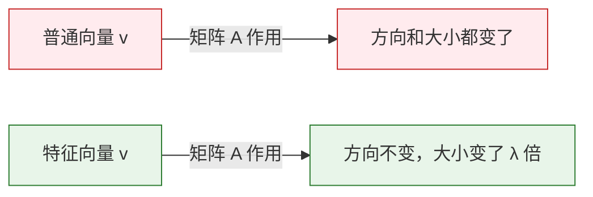
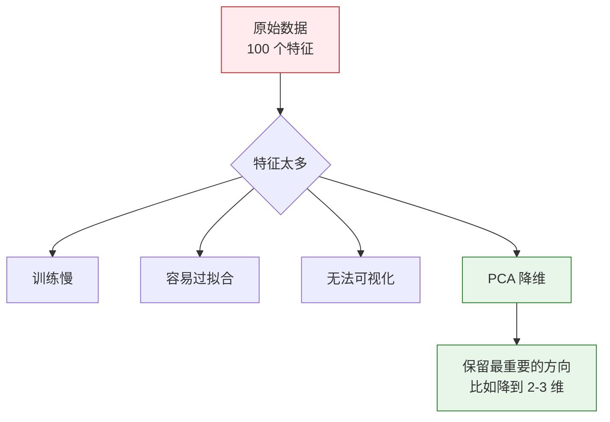
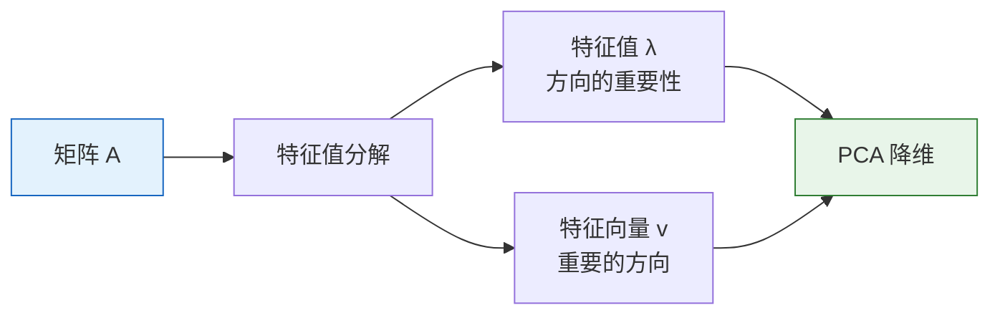

# 特征值与特征向量

:::tip 不要被名字吓到
"特征值"和"特征向量"听起来很数学，但直觉其实很简单：**在矩阵变换下，有些特殊的向量只会被拉伸/缩小，不会改变方向**。这些就是特征向量，拉伸的倍数就是特征值。
:::

## 学习目标

- 直觉理解特征值和特征向量的含义
- 用可视化看到矩阵变换中的"特殊方向"
- 理解 PCA 降维为什么有效
- 用 NumPy 计算特征值和特征向量

---

## 一、直觉理解

### 1.1 矩阵变换中的"特殊方向"

上一节我们学了：矩阵 × 向量 = 新向量（方向和大小都可能改变）。

但有些向量很特殊——矩阵作用在它们身上后，**方向不变**，只有长度变化。



用数学语言说：**A × v = λ × v**
- v 是特征向量（方向不变的那个向量）
- λ（lambda）是特征值（拉伸的倍数）

### 1.2 可视化：哪些向量方向不变？

```python
import numpy as np
import matplotlib.pyplot as plt

plt.rcParams['font.sans-serif'] = ['Arial Unicode MS']
plt.rcParams['axes.unicode_minus'] = False

# 定义一个矩阵
A = np.array([[2, 1],
              [1, 2]])

# 计算特征值和特征向量
eigenvalues, eigenvectors = np.linalg.eig(A)
print(f"特征值: {eigenvalues}")         # [3. 1.]
print(f"特征向量:\n{eigenvectors}")

# 可视化：对很多方向的向量做变换，看看哪些方向不变
fig, axes = plt.subplots(1, 2, figsize=(14, 6))

# 生成一组均匀分布的单位向量
angles = np.linspace(0, 2*np.pi, 50, endpoint=False)
unit_vectors = np.array([np.cos(angles), np.sin(angles)])  # 2×50

# 变换后的向量
transformed = A @ unit_vectors  # 2×50

# 画变换前后
for ax, vectors, title in [(axes[0], unit_vectors, '变换前（单位圆）'), 
                             (axes[1], transformed, '变换后（椭圆）')]:
    # 画所有向量（灰色）
    for i in range(vectors.shape[1]):
        ax.plot([0, vectors[0, i]], [0, vectors[1, i]], 'gray', alpha=0.3)
    
    # 高亮特征向量方向
    for j in range(2):
        ev = eigenvectors[:, j]
        if ax == axes[0]:
            scale = 1
        else:
            scale = eigenvalues[j]
        color = ['red', 'blue'][j]
        ax.quiver(0, 0, ev[0]*scale, ev[1]*scale, angles='xy', scale_units='xy', 
                  scale=1, color=color, linewidth=3,
                  label=f'特征向量 {j+1} (λ={eigenvalues[j]:.0f})')
    
    ax.set_xlim(-4, 4)
    ax.set_ylim(-4, 4)
    ax.set_aspect('equal')
    ax.grid(True, alpha=0.3)
    ax.legend(fontsize=10)
    ax.set_title(title, fontsize=13)

plt.suptitle(f'矩阵 A = [[2,1],[1,2]] 的特征向量', fontsize=14)
plt.tight_layout()
plt.show()
```

**解读**：
- 红色和蓝色箭头是特征向量的方向
- 变换后，单位圆变成了椭圆
- 但特征向量的**方向没变**，只是长度变了（分别变为 3 倍和 1 倍）
- 椭圆的长轴和短轴，恰好就是特征向量的方向

---

## 二、用 NumPy 计算特征值和特征向量

### 2.1 基本用法

```python
A = np.array([[4, 2],
              [1, 3]])

# 一行搞定
eigenvalues, eigenvectors = np.linalg.eig(A)

print("特征值:", eigenvalues)      # [5. 2.]
print("特征向量:\n", eigenvectors)
# 每一列是一个特征向量
# 第 1 个特征向量（对应 λ=5）: eigenvectors[:, 0]
# 第 2 个特征向量（对应 λ=2）: eigenvectors[:, 1]
```

### 2.2 验证：A × v = λ × v

```python
for i in range(len(eigenvalues)):
    v = eigenvectors[:, i]      # 第 i 个特征向量
    lam = eigenvalues[i]        # 第 i 个特征值
    
    left = A @ v                # 矩阵乘向量
    right = lam * v             # 特征值乘向量
    
    print(f"\n特征值 λ={lam:.1f}, 特征向量 v={v.round(3)}")
    print(f"  A @ v  = {left.round(6)}")
    print(f"  λ * v  = {right.round(6)}")
    print(f"  相等？ {np.allclose(left, right)}")  # True
```

### 2.3 对称矩阵的特殊性质

在 AI 中，我们经常遇到**对称矩阵**（如协方差矩阵）。对称矩阵有一个好性质：**特征向量互相垂直**。

```python
# 协方差矩阵（对称矩阵的典型例子）
data = np.random.randn(100, 2)
data[:, 1] = data[:, 0] * 0.8 + np.random.randn(100) * 0.3  # 制造相关性

cov_matrix = np.cov(data.T)
print(f"协方差矩阵（对称）:\n{cov_matrix.round(3)}")

eigenvalues, eigenvectors = np.linalg.eig(cov_matrix)
print(f"\n特征值: {eigenvalues.round(3)}")

# 验证特征向量垂直（点积 ≈ 0）
dot = np.dot(eigenvectors[:, 0], eigenvectors[:, 1])
print(f"两个特征向量的点积: {dot:.10f}")  # ≈ 0（垂直）
```

---

## 三、PCA 降维——特征值最重要的应用

### 3.1 为什么需要降维？



### 3.2 PCA 的直觉

PCA（主成分分析）的核心思想：

1. 数据在不同方向上的"变化幅度"不同
2. **特征值最大**的方向 = 数据变化最大的方向 = 包含信息最多的方向
3. 只保留前几个最重要的方向，丢弃不重要的方向 → 降维

```python
# 生成有明显主方向的 2D 数据
np.random.seed(42)
n = 200
x = np.random.randn(n)
y = 0.6 * x + np.random.randn(n) * 0.3  # y 和 x 有关联
data = np.column_stack([x, y])

# 计算协方差矩阵
cov = np.cov(data.T)
eigenvalues, eigenvectors = np.linalg.eig(cov)

# 按特征值从大到小排序
idx = eigenvalues.argsort()[::-1]
eigenvalues = eigenvalues[idx]
eigenvectors = eigenvectors[:, idx]

print(f"特征值: {eigenvalues.round(3)}")
print(f"方差占比: {(eigenvalues / eigenvalues.sum() * 100).round(1)}%")
```

### 3.3 可视化：PCA 找到的方向

```python
fig, axes = plt.subplots(1, 2, figsize=(14, 6))

# 左图：原始数据 + 主成分方向
ax = axes[0]
ax.scatter(data[:, 0], data[:, 1], alpha=0.4, s=20, color='gray')

mean = data.mean(axis=0)
colors = ['red', 'blue']
labels = ['第 1 主成分（信息最多）', '第 2 主成分（信息较少）']

for i in range(2):
    direction = eigenvectors[:, i] * eigenvalues[i] * 2
    ax.annotate('', xy=mean + direction, xytext=mean,
                arrowprops=dict(arrowstyle='->', color=colors[i], lw=3))
    ax.annotate(labels[i], xy=mean + direction, fontsize=10, color=colors[i])

ax.set_aspect('equal')
ax.grid(True, alpha=0.3)
ax.set_title('原始 2D 数据 + PCA 方向')
ax.set_xlabel('特征 1')
ax.set_ylabel('特征 2')

# 右图：投影到第 1 主成分（降到 1D）
projected = data @ eigenvectors[:, 0]  # 投影到第 1 主成分
ax = axes[1]
ax.scatter(projected, np.zeros_like(projected), alpha=0.4, s=20, color='red')
ax.set_title(f'降到 1D（保留了 {eigenvalues[0]/eigenvalues.sum()*100:.0f}% 的信息）')
ax.set_xlabel('第 1 主成分')
ax.set_yticks([])

plt.tight_layout()
plt.show()
```

**解读**：
- 红色箭头是第 1 主成分——数据变化最大的方向
- 蓝色箭头是第 2 主成分——变化较小的方向
- 如果只保留第 1 主成分（从 2D 降到 1D），仍然保留了大部分信息

### 3.4 用 scikit-learn 做 PCA

在实际项目中，我们通常直接用 scikit-learn 的 PCA：

```python
from sklearn.decomposition import PCA
from sklearn.datasets import load_iris

# 加载经典鸢尾花数据集（4 个特征）
iris = load_iris()
X = iris.data       # (150, 4)
y = iris.target      # 3 种花

print(f"原始维度: {X.shape}")  # (150, 4)

# PCA 降到 2 维
pca = PCA(n_components=2)
X_2d = pca.fit_transform(X)
print(f"降维后: {X_2d.shape}")  # (150, 2)

# 各主成分的方差占比
print(f"方差占比: {pca.explained_variance_ratio_.round(3)}")
# [0.925, 0.053] → 前 2 个主成分保留了约 97.8% 的信息！

# 可视化
plt.figure(figsize=(8, 6))
for i, name in enumerate(iris.target_names):
    mask = y == i
    plt.scatter(X_2d[mask, 0], X_2d[mask, 1], label=name, s=40, alpha=0.7)

plt.xlabel(f'PC1 ({pca.explained_variance_ratio_[0]*100:.1f}%)')
plt.ylabel(f'PC2 ({pca.explained_variance_ratio_[1]*100:.1f}%)')
plt.title('鸢尾花数据集 PCA 降维（4D → 2D）')
plt.legend()
plt.grid(True, alpha=0.3)
plt.show()
```

**结果**：4 维数据降到 2 维后，三种花依然能清晰分开！这说明 PCA 有效地保留了最重要的信息。

---

## 四、特征值的其他含义

### 4.1 特征值大小的含义

| 特征值 | 含义 |
|--------|------|
| 大的特征值 | 数据在这个方向上变化大，信息量大 |
| 小的特征值 | 数据在这个方向上变化小，可以舍弃 |
| 特征值为 0 | 数据在这个方向上完全没有变化（冗余维度） |
| 负的特征值 | 矩阵在这个方向上做了"反转"（翻转方向） |

### 4.2 方差解释比

PCA 中最关键的指标——前 k 个特征值占总特征值的比例：

```python
# 模拟一个高维数据集
np.random.seed(42)
n_features = 20
X = np.random.randn(200, n_features)
# 让前几个特征有很强的信号
X[:, :3] = X[:, :3] * 5

# 计算协方差矩阵的特征值
cov = np.cov(X.T)
eigenvalues = np.linalg.eigvalsh(cov)  # eigvalsh 用于对称矩阵，更快
eigenvalues = eigenvalues[::-1]        # 从大到小排列

# 方差占比
variance_ratio = eigenvalues / eigenvalues.sum()
cumulative_ratio = np.cumsum(variance_ratio)

# 画 Scree Plot（碎石图）
fig, axes = plt.subplots(1, 2, figsize=(14, 5))

axes[0].bar(range(1, 21), variance_ratio * 100, color='steelblue')
axes[0].set_xlabel('主成分编号')
axes[0].set_ylabel('方差占比 (%)')
axes[0].set_title('各主成分的方差占比')

axes[1].plot(range(1, 21), cumulative_ratio * 100, 'o-', color='coral')
axes[1].axhline(y=95, color='gray', linestyle='--', label='95% 阈值')
axes[1].set_xlabel('主成分个数')
axes[1].set_ylabel('累计方差占比 (%)')
axes[1].set_title('累计方差占比（选几个主成分？）')
axes[1].legend()

plt.tight_layout()
plt.show()
```

**解读**：通过"碎石图"可以判断保留几个主成分就够了——通常选择累计方差达到 95% 的点。

---

## 五、小结

| 概念 | 直觉理解 | NumPy 实现 |
|------|---------|-----------|
| 特征向量 | 矩阵变换下方向不变的向量 | `np.linalg.eig(A)[1]` |
| 特征值 | 特征向量被拉伸的倍数 | `np.linalg.eig(A)[0]` |
| PCA | 找数据变化最大的方向，降维 | `sklearn.decomposition.PCA` |
| 方差占比 | 每个主成分保留了多少信息 | `pca.explained_variance_ratio_` |



:::info 连接后续
- **第四阶段（机器学习）**：PCA 降维是常用的数据预处理步骤
- **第七阶段（NLP）**：SVD 分解（特征值分解的推广）用于降维和主题模型
- **第五阶段（深度学习）**：理解权重矩阵的特征值有助于理解网络训练的稳定性
:::

---

## 动手练习

### 练习 1：计算特征值

用 NumPy 计算以下矩阵的特征值和特征向量，并验证 A × v = λ × v：

```python
A = np.array([[3, 1],
              [0, 2]])
```

### 练习 2：可视化特征向量

对矩阵 `A = [[1, 2], [0, 3]]`，画出：
- 一组均匀分布的单位向量（圆）
- 矩阵变换后的结果（椭圆）
- 标出特征向量的方向

### 练习 3：PCA 实战

使用 scikit-learn 的 `load_digits()` 手写数字数据集（64 维），用 PCA 降到 2 维并可视化，看看不同数字能否区分开。

```python
from sklearn.datasets import load_digits
from sklearn.decomposition import PCA

digits = load_digits()
X = digits.data      # (1797, 64)
y = digits.target     # 0~9

# 你的代码：PCA 降维 + 可视化
```
