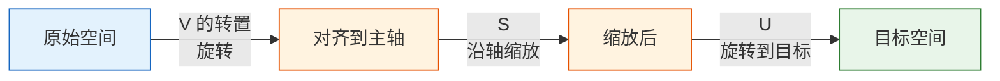

# 向量空间与线性变换【选修】

:::info 选修章节
本节内容帮助你**加深理解**。如果你只想快速上手 AI 项目，可以先跳过，后续遇到相关概念再回来看。
:::

## 学习目标

- 理解线性无关、基、维度的含义
- 理解线性变换的矩阵表示
- 直觉理解奇异值分解（SVD）

---

## 一、线性无关——"不冗余"的向量

### 1.1 什么是线性无关？

**直觉**：一组向量是"线性无关"的，意味着**每个向量都提供了独特的信息，没有谁是多余的**。

```python
import numpy as np
import matplotlib.pyplot as plt

plt.rcParams['font.sans-serif'] = ['Arial Unicode MS']
plt.rcParams['axes.unicode_minus'] = False

# 线性无关的例子：向右 和 向上，方向完全不同
v1 = np.array([1, 0])
v2 = np.array([0, 1])

# 线性相关的例子：v2 只是 v1 的 2 倍，方向完全一样
u1 = np.array([1, 2])
u2 = np.array([2, 4])  # u2 = 2 * u1，冗余！
```

```python
fig, axes = plt.subplots(1, 2, figsize=(12, 5))

# 线性无关
ax = axes[0]
ax.quiver(0, 0, v1[0], v1[1], angles='xy', scale_units='xy', scale=1,
          color='steelblue', linewidth=2.5, label='v1 = [1, 0]')
ax.quiver(0, 0, v2[0], v2[1], angles='xy', scale_units='xy', scale=1,
          color='coral', linewidth=2.5, label='v2 = [0, 1]')
ax.set_xlim(-0.5, 2)
ax.set_ylim(-0.5, 2)
ax.set_aspect('equal')
ax.grid(True, alpha=0.3)
ax.legend()
ax.set_title('线性无关\n两个方向不同，无冗余')

# 线性相关
ax = axes[1]
ax.quiver(0, 0, u1[0], u1[1], angles='xy', scale_units='xy', scale=1,
          color='steelblue', linewidth=2.5, label='u1 = [1, 2]')
ax.quiver(0, 0, u2[0], u2[1], angles='xy', scale_units='xy', scale=1,
          color='coral', linewidth=2.5, label='u2 = [2, 4]')
ax.set_xlim(-0.5, 3)
ax.set_ylim(-0.5, 5)
ax.set_aspect('equal')
ax.grid(True, alpha=0.3)
ax.legend()
ax.set_title('线性相关\nu2 = 2×u1，完全冗余')

plt.tight_layout()
plt.show()
```

### 1.2 在 AI 中的意义

| 场景 | 线性无关的意义 |
|------|--------------|
| 特征工程 | 如果两个特征线性相关（如"温度(℃)"和"温度(℉)"），其中一个是冗余的 |
| PCA 降维 | 主成分之间互相正交（线性无关），每个主成分都提供独特信息 |
| 神经网络 | 如果权重矩阵的列线性相关，说明有些神经元是冗余的 |

### 1.3 用矩阵的秩判断

**矩阵的秩（rank）** = 矩阵中线性无关的行（或列）的最大数量。

```python
# 3 列线性无关
A = np.array([[1, 0, 0],
              [0, 1, 0],
              [0, 0, 1]])
print(f"A 的秩: {np.linalg.matrix_rank(A)}")  # 3（满秩）

# 第 3 列 = 第 1 列 + 第 2 列，冗余！
B = np.array([[1, 0, 1],
              [0, 1, 1],
              [0, 0, 0]])
print(f"B 的秩: {np.linalg.matrix_rank(B)}")  # 2（不是满秩）
```

---

## 二、基与维度——描述空间的"坐标系"

### 2.1 基（Basis）

**基** = 一组线性无关的向量，它们能"张成"整个空间（即任何向量都能用它们的组合表示）。

最常见的基是**标准基**：

```python
# 二维空间的标准基
e1 = np.array([1, 0])  # x 方向
e2 = np.array([0, 1])  # y 方向

# 任何二维向量都可以用标准基表示
v = np.array([3, 5])
# v = 3 * e1 + 5 * e2

print(f"v = {v[0]} × e1 + {v[1]} × e2 = {v[0]*e1 + v[1]*e2}")
```

**非标准基也可以**：

```python
# 换一组基
b1 = np.array([1, 1])
b2 = np.array([1, -1])

# v = [3, 5] 在新基下的坐标是？
# v = c1 * b1 + c2 * b2
# 解方程组
B = np.column_stack([b1, b2])
coords = np.linalg.solve(B, v)
print(f"在新基下的坐标: {coords}")  # [4, -1]
# 验证: 4*[1,1] + (-1)*[1,-1] = [4,4]+[-1,1] = [3,5] ✓
```

### 2.2 维度（Dimension）

**维度** = 基向量的个数 = 描述空间需要的最少坐标数。

| 空间 | 维度 | 例子 |
|------|------|------|
| 直线 | 1 | 温度刻度 |
| 平面 | 2 | 地图上的位置 |
| 三维空间 | 3 | 现实世界的位置 |
| 词向量空间 | 100~300 | 每个词的"语义坐标" |
| 图片像素空间 | 几万~几百万 | 每个像素是一个维度 |

:::tip AI 中的维度
AI 中经常说"高维空间"——一张 28×28 的手写数字图片就是 784 维空间中的一个点。PCA 的本质就是找到一组新的"基"（主成分），让我们能用更少的维度（比如 2 维）来近似表示这些数据。
:::

---

## 三、线性变换的矩阵表示

### 3.1 线性变换 = 矩阵

一个很深刻的结论：**任何线性变换都可以用一个矩阵表示**。

什么是线性变换？满足两个条件的变换 T：
1. T(a + b) = T(a) + T(b)（加法可以"搬进搬出"）
2. T(ka) = k·T(a)（数乘可以"搬进搬出"）

```python
# 旋转、缩放、投影、剪切... 都是线性变换

# 看看标准基向量变换后去了哪里，就知道矩阵是什么
# 旋转 90° 的变换：
# e1 = [1, 0] → [0, 1]
# e2 = [0, 1] → [-1, 0]

# 把变换后的基向量排成列，就是变换矩阵！
R90 = np.array([[0, -1],
                [1,  0]])

# 验证
print(R90 @ np.array([1, 0]))  # [0, 1] ✓
print(R90 @ np.array([0, 1]))  # [-1, 0] ✓
```

### 3.2 变换的组合 = 矩阵的乘法

先旋转 45°，再缩放 2 倍？只需要把两个矩阵相乘。

```python
# 旋转 45°
theta = np.radians(45)
R45 = np.array([
    [np.cos(theta), -np.sin(theta)],
    [np.sin(theta),  np.cos(theta)]
])

# 缩放 2 倍
S2 = np.array([
    [2, 0],
    [0, 2]
])

# 先旋转再缩放 = S2 @ R45（注意：从右往左读！）
combined = S2 @ R45
print(f"组合变换矩阵:\n{combined.round(3)}")

# 对一个向量应用
v = np.array([1, 0])
result = combined @ v
print(f"[1, 0] → {result.round(3)}")  # ≈ [1.414, 1.414]
```

---

## 四、SVD——矩阵分解的"瑞士军刀"

### 4.1 什么是 SVD？

**奇异值分解（SVD）** 是特征值分解的推广——它对**任意形状**的矩阵都适用（不限于方阵）。

SVD 把一个矩阵 M 分解为三个矩阵的乘积：

**M = U × S × V 的转置**

其中：
- U：左奇异向量（正交矩阵）
- S：奇异值（对角矩阵，从大到小排列）
- V 的转置：右奇异向量（正交矩阵）

```python
# 任意矩阵的 SVD
M = np.array([
    [1, 2, 3],
    [4, 5, 6],
])  # 2×3 矩阵

U, S, Vt = np.linalg.svd(M, full_matrices=False)

print(f"U 的形状: {U.shape}")     # (2, 2)
print(f"奇异值 S: {S.round(3)}")  # [9.508, 0.773]
print(f"Vt 的形状: {Vt.shape}")   # (2, 3)

# 验证：M ≈ U @ diag(S) @ Vt
reconstructed = U @ np.diag(S) @ Vt
print(f"\n重构误差: {np.linalg.norm(M - reconstructed):.10f}")  # ≈ 0
```

### 4.2 SVD 的直觉

**SVD 把任何变换分解为三步**：



### 4.3 SVD 的应用：图像压缩

SVD 最直观的应用——用更少的数据近似一张图片：

```python
from sklearn.datasets import load_sample_image

# 用一张灰度图做示例
# 这里用随机数模拟一张灰度图
np.random.seed(42)
image = np.random.randint(0, 256, (100, 150)).astype(float)
# 加入一些结构（不是纯随机）
for i in range(100):
    for j in range(150):
        image[i, j] = 128 + 50 * np.sin(i/10) * np.cos(j/15) + np.random.randn() * 20

print(f"原始图片: {image.shape} = {image.size} 个值")

# SVD 分解
U, S, Vt = np.linalg.svd(image, full_matrices=False)
print(f"奇异值个数: {len(S)}")

# 用不同数量的奇异值重构
fig, axes = plt.subplots(1, 4, figsize=(16, 4))

for ax, k in zip(axes, [1, 5, 20, 100]):
    # 只保留前 k 个奇异值
    reconstructed = U[:, :k] @ np.diag(S[:k]) @ Vt[:k, :]
    
    # 压缩比 = 需要存储的数字数 / 原始数字数
    original_size = image.size
    compressed_size = k * (U.shape[0] + 1 + Vt.shape[1])
    ratio = compressed_size / original_size * 100
    
    ax.imshow(reconstructed, cmap='gray')
    ax.set_title(f'k = {k}\n存储量: {ratio:.0f}%')
    ax.axis('off')

plt.suptitle('SVD 图像压缩：用更少的奇异值近似', fontsize=13)
plt.tight_layout()
plt.show()
```

**解读**：只用前 20 个奇异值（原来 100 个），就能很好地还原图片，存储量大幅减少。

### 4.4 SVD 在 AI 中的应用

| 应用 | 说明 |
|------|------|
| 图像压缩 | 用少量奇异值近似原始图片 |
| 推荐系统 | 矩阵分解（如 Netflix 推荐） |
| NLP | 潜在语义分析（LSA）用 SVD 对词-文档矩阵降维 |
| 数据降维 | SVD 是 PCA 的底层实现 |
| 伪逆矩阵 | 解决超定/欠定方程组 |

---

## 五、小结

| 概念 | 直觉 | NumPy |
|------|------|-------|
| 线性无关 | 没有冗余的向量组 | `np.linalg.matrix_rank(A)` |
| 基 | 描述空间的坐标系 | — |
| 维度 | 需要多少个坐标 | `A.shape` |
| 线性变换 | 矩阵乘法 | `A @ v` |
| SVD | 任意矩阵 = 旋转 × 缩放 × 旋转 | `np.linalg.svd(A)` |
| 矩阵的秩 | 有效维度数 | `np.linalg.matrix_rank(A)` |

:::info 本章回顾
线性代数四节课，你学到了：
1. **向量**：AI 中的基本数据单元，余弦相似度衡量方向相似性
2. **矩阵**：批量变换数据，神经网络每层的核心操作
3. **特征值**：找到数据最重要的方向，PCA 降维
4. **向量空间**（本节）：理解维度、基、SVD

这些概念会在后续学习机器学习、深度学习、NLP 时反复出现。不用急着记住所有细节，随着后续的实践，理解会越来越深。
:::

---

## 动手练习

### 练习 1：判断线性无关

以下三组向量，哪组是线性无关的？用 `np.linalg.matrix_rank()` 验证。

```python
# 第 1 组
g1 = np.array([[1, 2], [3, 6]])

# 第 2 组
g2 = np.array([[1, 0], [0, 1]])

# 第 3 组
g3 = np.array([[1, 2, 3], [4, 5, 6], [5, 7, 9]])
```

### 练习 2：SVD 压缩

用 SVD 对 `np.random.randn(50, 80)` 做低秩近似，画出不同 k 值下的重构误差曲线。

```python
M = np.random.randn(50, 80)
U, S, Vt = np.linalg.svd(M, full_matrices=False)

errors = []
for k in range(1, 51):
    reconstructed = U[:, :k] @ np.diag(S[:k]) @ Vt[:k, :]
    error = np.linalg.norm(M - reconstructed)
    errors.append(error)

# 画图
```

### 练习 3：变换组合

构造两个 2×2 变换矩阵——先缩放 (x 放大 2 倍, y 不变)，再旋转 30°。把它们相乘得到组合矩阵，对一组三角形顶点做变换并画图。
