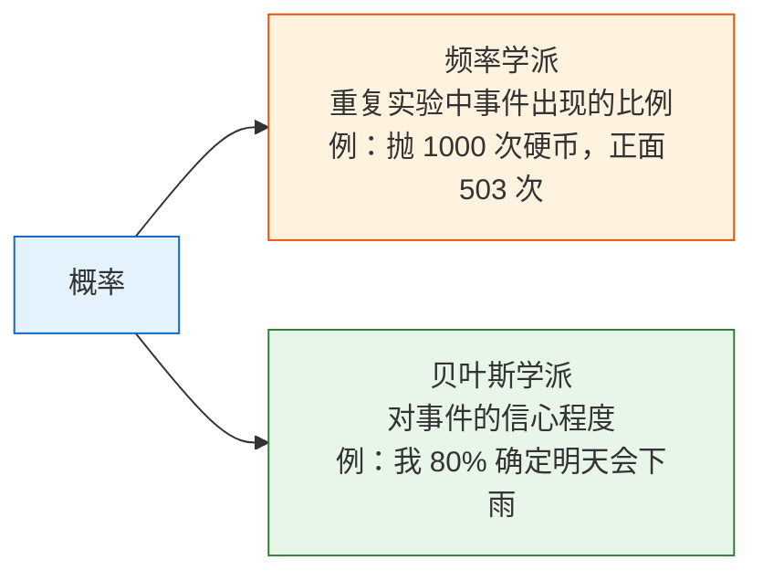
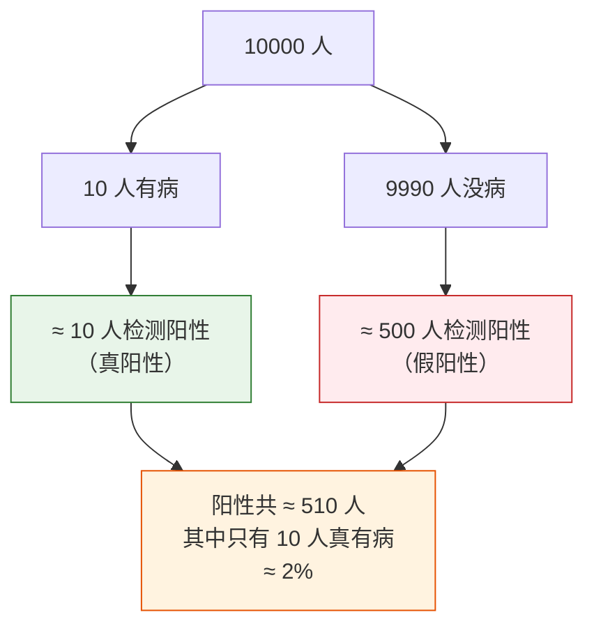
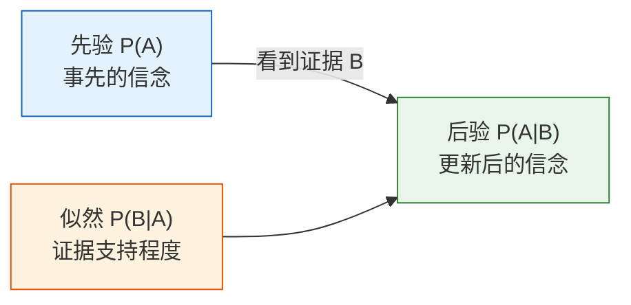

# 概率基础：不确定性的度量

:::tip 为什么学概率？
AI 本质上就是在"不确定性"中做决策。模型输出的不是"这张图一定是猫"，而是"这张图有 95% 的概率是猫"。概率论就是处理不确定性的数学工具。
:::

## 学习目标

- 理解概率的两种理解方式（频率 vs 信念）
- 掌握条件概率和联合概率
- 用经典案例理解贝叶斯定理
- 用 Python 模拟验证概率公式

---

## 一、概率是什么？

### 1.1 两种理解方式



在 AI 中，两种理解都用到：
- **训练模型**时：用频率学派的方法（大量数据统计规律）
- **模型推断**时：用贝叶斯的方法（根据观测更新信念）

### 1.2 用 Python 体验"频率即概率"

```python
import numpy as np
import matplotlib.pyplot as plt

plt.rcParams['font.sans-serif'] = ['Arial Unicode MS']
plt.rcParams['axes.unicode_minus'] = False

# 模拟抛硬币
np.random.seed(42)
n_flips = 10000
results = np.random.choice(['正面', '反面'], size=n_flips)

# 随着抛的次数增加，正面比例趋近 0.5
cumulative_ratio = np.cumsum(results == '正面') / np.arange(1, n_flips + 1)

plt.figure(figsize=(10, 5))
plt.plot(cumulative_ratio, color='steelblue', linewidth=1)
plt.axhline(y=0.5, color='red', linestyle='--', label='理论概率 0.5')
plt.xlabel('抛掷次数')
plt.ylabel('正面出现的比例')
plt.title('大数定律：抛的次数越多，比例越接近真实概率')
plt.legend()
plt.xscale('log')
plt.grid(True, alpha=0.3)
plt.show()
```

**大数定律**：实验次数越多，频率越接近真实概率。这就是为什么深度学习需要"大数据"。

---

## 二、条件概率——"在已知某些信息时"

### 2.1 直觉理解

**条件概率 P(A|B)** = 在已知 B 发生的前提下，A 发生的概率。

:::tip 生活例子
- P(迟到 | 堵车) = 在堵车的情况下迟到的概率（远高于平时）
- P(及格 | 认真复习) = 认真复习了及格的概率（也远高于平时）
- P(是垃圾邮件 | 包含"免费") = 包含"免费"这个词的邮件是垃圾邮件的概率
:::

### 2.2 公式与计算

**P(A|B) = P(A 且 B) / P(B)**

用一个直观的例子：

```python
# 一个班 100 个学生
# 60 人喜欢数学，50 人喜欢编程，30 人两者都喜欢

n_total = 100
n_math = 60
n_code = 50
n_both = 30

# P(喜欢编程 | 喜欢数学) = P(两者都喜欢) / P(喜欢数学)
p_code_given_math = n_both / n_math
print(f"喜欢数学的人中，也喜欢编程的比例: {p_code_given_math:.1%}")  # 50%

# P(喜欢数学 | 喜欢编程)
p_math_given_code = n_both / n_code
print(f"喜欢编程的人中，也喜欢数学的比例: {p_math_given_code:.1%}")  # 60%
```

**注意**：P(A|B) 和 P(B|A) 通常不相等！

### 2.3 联合概率与边缘概率

```python
# 用 NumPy 模拟数据
np.random.seed(42)
n = 10000

# 天气：晴(0.7) / 雨(0.3)
weather = np.random.choice(['晴', '雨'], n, p=[0.7, 0.3])

# 带伞概率取决于天气
umbrella = np.where(
    weather == '雨',
    np.random.choice(['带', '不带'], n, p=[0.8, 0.2]),  # 下雨时 80% 会带伞
    np.random.choice(['带', '不带'], n, p=[0.1, 0.9])   # 晴天时 10% 会带伞
)

# 联合概率表
import pandas as pd
df = pd.DataFrame({'天气': weather, '带伞': umbrella})
joint = pd.crosstab(df['天气'], df['带伞'], normalize=True)
print("联合概率表：")
print(joint.round(3))
print(f"\n边缘概率 P(雨): {(weather == '雨').mean():.3f}")
print(f"边缘概率 P(带伞): {(umbrella == '带').mean():.3f}")
```

| | 带伞 | 不带 | 合计（边缘概率） |
|---|------|------|---------|
| 晴 | 0.07 | 0.63 | 0.70 |
| 雨 | 0.24 | 0.06 | 0.30 |
| 合计 | 0.31 | 0.69 | 1.00 |

---

## 三、贝叶斯定理——AI 最重要的概率公式

### 3.1 引入：医院检查的故事

一种罕见疾病的发病率是 0.1%（1000 人中 1 人有病）。医院有一个检测方法：
- 如果你有病，检测出阳性的概率是 99%（灵敏度）
- 如果你没病，检测出阳性的概率是 5%（假阳率）

**问题：如果你检测出了阳性，你真正有病的概率是多少？**

很多人直觉会说"99%"——但答案会让你大吃一惊。

### 3.2 贝叶斯公式

**P(有病 | 阳性) = P(阳性 | 有病) × P(有病) / P(阳性)**

```python
# 已知条件
p_disease = 0.001       # 先验概率：发病率 0.1%
p_positive_if_disease = 0.99    # 有病 → 阳性的概率
p_positive_if_healthy = 0.05    # 没病 → 阳性的概率（假阳率）

# P(阳性) = P(阳性|有病)×P(有病) + P(阳性|没病)×P(没病)
p_positive = (p_positive_if_disease * p_disease + 
              p_positive_if_healthy * (1 - p_disease))
print(f"P(阳性): {p_positive:.4f}")

# 贝叶斯公式
p_disease_if_positive = (p_positive_if_disease * p_disease) / p_positive
print(f"P(有病|阳性): {p_disease_if_positive:.4f}")  # ≈ 0.0194
print(f"约等于 {p_disease_if_positive:.1%}")           # ≈ 1.9%
```

**结果：只有约 2%！** 即使检测阳性，你有病的概率也只有 2%。

### 3.3 为什么这么低？

因为发病率太低了（0.1%），绝大多数阳性结果其实是假阳性。

```python
# 用 10000 人模拟
n_people = 10000
n_sick = int(n_people * p_disease)        # 10 人有病
n_healthy = n_people - n_sick             # 9990 人没病

true_positive = n_sick * p_positive_if_disease    # 有病且检测阳性: ≈ 10
false_positive = n_healthy * p_positive_if_healthy # 没病但检测阳性: ≈ 500

total_positive = true_positive + false_positive

print(f"10000 人中：")
print(f"  有病的人: {n_sick}")
print(f"  检测阳性的人: {total_positive:.0f}")
print(f"    其中真阳性: {true_positive:.0f}")
print(f"    其中假阳性: {false_positive:.0f}")
print(f"  阳性中真有病的比例: {true_positive/total_positive:.1%}")
```



### 3.4 贝叶斯定理的核心思想



**后验 = 先验 × 似然 / 归一化因子**

这就是贝叶斯的核心：**不断用新证据更新你的信念**。

### 3.5 用模拟验证贝叶斯定理

```python
# 蒙特卡洛模拟
np.random.seed(42)
n_sim = 1_000_000

# 1. 每个人是否有病
has_disease = np.random.random(n_sim) < p_disease

# 2. 每个人的检测结果
test_positive = np.where(
    has_disease,
    np.random.random(n_sim) < p_positive_if_disease,  # 有病
    np.random.random(n_sim) < p_positive_if_healthy    # 没病
)

# 3. 在检测阳性的人中，有病的比例
positive_people = test_positive.sum()
positive_and_sick = (test_positive & has_disease).sum()

simulated_probability = positive_and_sick / positive_people
print(f"模拟结果 P(有病|阳性): {simulated_probability:.4f}")
print(f"公式计算: {p_disease_if_positive:.4f}")
print(f"两者差距: {abs(simulated_probability - p_disease_if_positive):.6f}")
```

---

## 四、贝叶斯定理在 AI 中的应用

### 4.1 朴素贝叶斯分类器

垃圾邮件过滤就是贝叶斯定理的经典应用：

```python
# 简化的垃圾邮件分类
# P(垃圾邮件 | 包含"免费") = P(包含"免费"|垃圾邮件) × P(垃圾邮件) / P(包含"免费")

p_spam = 0.3                      # 30% 的邮件是垃圾邮件
p_free_given_spam = 0.8           # 垃圾邮件中 80% 包含"免费"
p_free_given_ham = 0.05           # 正常邮件中 5% 包含"免费"

# P(包含"免费")
p_free = p_free_given_spam * p_spam + p_free_given_ham * (1 - p_spam)

# 贝叶斯
p_spam_given_free = p_free_given_spam * p_spam / p_free
print(f"包含'免费'的邮件是垃圾邮件的概率: {p_spam_given_free:.1%}")
# ≈ 87.3%
```

### 4.2 更多 AI 应用

| 应用 | 先验 | 似然 | 后验 |
|------|------|------|------|
| 垃圾邮件过滤 | 邮件是垃圾邮件的概率 | 垃圾邮件包含某词的概率 | 给定词后是垃圾邮件的概率 |
| 医学诊断 | 疾病的发病率 | 有病时检测阳性的概率 | 阳性后真有病的概率 |
| 推荐系统 | 用户喜欢某类型的概率 | 喜欢该类型的人看某电影的概率 | 用户会看这部电影的概率 |
| 语言模型 | 某个词出现的概率 | 前文给定后该词出现的概率 | 最可能的下一个词 |

---

## 五、独立性——简化计算的利器

### 5.1 什么是独立？

两个事件**独立**，意味着一个事件的发生不影响另一个事件的概率。

**P(A 且 B) = P(A) × P(B)**  （仅当 A、B 独立时）

```python
# 抛两次硬币——两次是独立的
p_head = 0.5

# 两次都是正面
p_both_heads = p_head * p_head
print(f"两次都正面: {p_both_heads}")  # 0.25

# 模拟验证
n = 100000
coin1 = np.random.random(n) < 0.5
coin2 = np.random.random(n) < 0.5
both = (coin1 & coin2).mean()
print(f"模拟结果: {both:.4f}")  # ≈ 0.25
```

### 5.2 AI 中的独立性假设

朴素贝叶斯之所以叫"朴素"，就是因为它**假设所有特征独立**（虽然实际中往往不独立，但效果依然不错）。

```python
# 朴素贝叶斯：假设各个词独立出现
# P(垃圾|"免费","中奖","点击") ∝ P(垃圾) × P("免费"|垃圾) × P("中奖"|垃圾) × P("点击"|垃圾)

p_spam = 0.3
words = {
    "免费": (0.8, 0.05),    # (P(词|垃圾), P(词|正常))
    "中奖": (0.6, 0.01),
    "点击": (0.7, 0.1),
}

# 计算分子
score_spam = p_spam
score_ham = 1 - p_spam

for word, (p_word_spam, p_word_ham) in words.items():
    score_spam *= p_word_spam
    score_ham *= p_word_ham

# 归一化
p_spam_given_words = score_spam / (score_spam + score_ham)
print(f"邮件包含 '免费'+'中奖'+'点击' 是垃圾邮件的概率: {p_spam_given_words:.1%}")
```

---

## 六、小结

| 概念 | 直觉 | 公式/代码 |
|------|------|----------|
| 概率 | 不确定性的度量（0~1） | `np.random.random() < p` |
| 条件概率 | 已知 B 发生时 A 的概率 | P(A\|B) = P(A且B) / P(B) |
| 联合概率 | A 和 B 同时发生的概率 | `pd.crosstab(normalize=True)` |
| 贝叶斯定理 | 用证据更新信念 | 后验 = 先验 × 似然 / 归一化 |
| 独立性 | 互不影响 | P(A且B) = P(A) × P(B) |

:::info 连接后续
- **下一节**：概率分布——数据背后的规律
- **第四阶段**：朴素贝叶斯分类器直接基于贝叶斯定理
- **第四阶段**：逻辑回归的输出就是条件概率 P(y=1|x)
- **第八A阶段**：大语言模型生成下一个 token 的概率分布
:::

---

## 动手练习

### 练习 1：条件概率

一副 52 张扑克牌，随机抽一张：
1. P(红心) = ?
2. P(红心 | 红色) = ?（已知是红色牌）
3. P(A | 红心) = ?（已知是红心）

用 Python 模拟 100000 次验证。

### 练习 2：贝叶斯更新

一个工厂有 A、B 两条生产线，A 生产 60% 的产品，B 生产 40%。A 的次品率是 2%，B 的次品率是 5%。

如果随机取一个产品发现是次品，它来自 B 生产线的概率是多少？

### 练习 3：模拟贝叶斯定理

修改疾病检测的例子，改为发病率 1%（而不是 0.1%），看看阳性后有病的概率变成多少。用模拟和公式两种方法验证。
