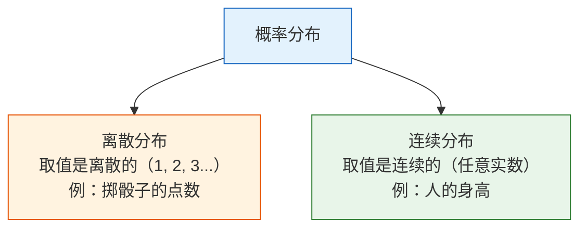
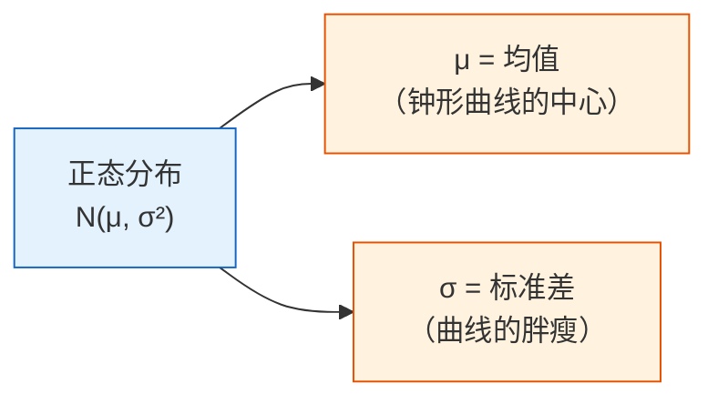

# 概率分布：数据背后的规律

## 学习目标

- 理解什么是概率分布
- 掌握常见的离散分布（伯努利、二项、泊松）
- 掌握常见的连续分布（均匀、正态/高斯）
- 直觉理解中心极限定理——为什么正态分布无处不在
- 用 Python 生成和可视化各种分布

---

## 一、什么是概率分布？

**概率分布 = 一个随机变量所有可能取值以及每个值出现的概率。**



```python
import numpy as np
import matplotlib.pyplot as plt
from scipy import stats

plt.rcParams['font.sans-serif'] = ['Arial Unicode MS']
plt.rcParams['axes.unicode_minus'] = False
```

---

## 二、离散分布

### 2.1 伯努利分布——只有两种结果

**只做一次实验**，结果只有"成功"（1）或"失败"（0）。

```python
# 伯努利分布：抛一次硬币
# p = 成功的概率
p = 0.6  # 不公平硬币，正面概率 60%

# 模拟 10000 次
samples = np.random.binomial(1, p, 10000)
print(f"正面比例: {samples.mean():.3f}")  # ≈ 0.6

fig, ax = plt.subplots(figsize=(6, 4))
values, counts = np.unique(samples, return_counts=True)
ax.bar(['反面 (0)', '正面 (1)'], counts / len(samples), 
       color=['coral', 'steelblue'], edgecolor='white')
ax.set_ylabel('概率')
ax.set_title(f'伯努利分布 (p={p})')
ax.set_ylim(0, 1)
plt.show()
```

**AI 中的应用**：二分类任务的标签就是伯努利分布（0 或 1）。

### 2.2 二项分布——多次伯努利的总和

**做 n 次伯努利实验，成功的总次数**服从二项分布。

```python
# 二项分布：抛 20 次硬币，正面出现的次数
n = 20   # 实验次数
p = 0.5  # 每次成功概率

# 理论分布
x = np.arange(0, n + 1)
pmf = stats.binom.pmf(x, n, p)

# 模拟
samples = np.random.binomial(n, p, 10000)

fig, axes = plt.subplots(1, 2, figsize=(14, 5))

# 理论
axes[0].bar(x, pmf, color='steelblue', edgecolor='white')
axes[0].set_xlabel('正面次数')
axes[0].set_ylabel('概率')
axes[0].set_title(f'二项分布 B(n={n}, p={p})（理论）')

# 模拟
axes[1].hist(samples, bins=range(n+2), density=True, color='coral', edgecolor='white', alpha=0.7)
axes[1].set_xlabel('正面次数')
axes[1].set_ylabel('频率')
axes[1].set_title(f'二项分布 B(n={n}, p={p})（模拟 10000 次）')

plt.tight_layout()
plt.show()
```

**关键参数**：
- 均值 = n × p（抛 20 次公平硬币，期望正面 10 次）
- 方差 = n × p × (1-p)

### 2.3 泊松分布——"稀有事件"的计数

**在固定时间/空间内，某稀有事件发生的次数**。

```python
# 泊松分布：一家奶茶店每小时平均来 5 个客人
lambda_ = 5  # 平均值（λ）

x = np.arange(0, 20)
pmf = stats.poisson.pmf(x, lambda_)

fig, ax = plt.subplots(figsize=(8, 5))
ax.bar(x, pmf, color='mediumseagreen', edgecolor='white')
ax.set_xlabel('每小时客人数')
ax.set_ylabel('概率')
ax.set_title(f'泊松分布 Poisson(λ={lambda_})')
ax.set_xticks(x)
plt.show()

print(f"来 0 个客人的概率: {stats.poisson.pmf(0, lambda_):.4f}")
print(f"来 5 个客人的概率: {stats.poisson.pmf(5, lambda_):.4f}")
print(f"来 10+ 个客人的概率: {1 - stats.poisson.cdf(9, lambda_):.4f}")
```

**AI 中的应用**：文本中某个罕见词出现的次数、网站的访问量、异常事件的检测。

---

## 三、连续分布

### 3.1 均匀分布——完全随机

每个值出现的概率完全相同。

```python
# 均匀分布 U(0, 1)
samples = np.random.uniform(0, 1, 10000)

fig, ax = plt.subplots(figsize=(8, 4))
ax.hist(samples, bins=50, density=True, color='steelblue', edgecolor='white', alpha=0.7)
ax.axhline(y=1, color='red', linestyle='--', label='理论密度 = 1')
ax.set_xlabel('值')
ax.set_ylabel('概率密度')
ax.set_title('均匀分布 U(0, 1)')
ax.legend()
plt.show()
```

**AI 中的应用**：随机初始化权重、随机采样、数据增强中的随机变换。

### 3.2 正态分布（高斯分布）——最重要的分布



```python
fig, axes = plt.subplots(1, 2, figsize=(14, 5))

# 不同均值
x = np.linspace(-8, 12, 1000)
for mu in [-2, 0, 3, 5]:
    axes[0].plot(x, stats.norm.pdf(x, mu, 1), linewidth=2, label=f'μ={mu}, σ=1')
axes[0].set_title('不同均值 μ（中心位置不同）')
axes[0].legend()
axes[0].set_xlabel('x')
axes[0].set_ylabel('概率密度')

# 不同标准差
for sigma in [0.5, 1, 2, 4]:
    axes[1].plot(x, stats.norm.pdf(x, 0, sigma), linewidth=2, label=f'μ=0, σ={sigma}')
axes[1].set_title('不同标准差 σ（胖瘦不同）')
axes[1].legend()
axes[1].set_xlabel('x')
axes[1].set_ylabel('概率密度')

plt.tight_layout()
plt.show()
```

### 3.3 68-95-99.7 法则

正态分布有一个非常实用的规律：

```python
mu, sigma = 0, 1

print("68-95-99.7 法则：")
for k, pct in [(1, '68.3%'), (2, '95.4%'), (3, '99.7%')]:
    area = stats.norm.cdf(mu + k*sigma) - stats.norm.cdf(mu - k*sigma)
    print(f"  μ ± {k}σ 范围内: {area:.1%} 的数据（理论 {pct}）")
```

```python
# 可视化 68-95-99.7
fig, ax = plt.subplots(figsize=(10, 5))
x = np.linspace(-4, 4, 1000)
y = stats.norm.pdf(x)

ax.plot(x, y, 'k-', linewidth=2)

# 填充区域
colors = ['steelblue', 'cornflowerblue', 'lightblue']
labels = ['68.3%（±1σ）', '95.4%（±2σ）', '99.7%（±3σ）']
for k, color, label in zip([3, 2, 1], colors[::-1], labels[::-1]):
    mask = (x >= -k) & (x <= k)
    ax.fill_between(x[mask], y[mask], alpha=0.5, color=color, label=label)

ax.set_xlabel('标准差')
ax.set_ylabel('概率密度')
ax.set_title('正态分布的 68-95-99.7 法则')
ax.legend(loc='upper right')
plt.show()
```

### 3.4 正态分布在 AI 中的应用

| 应用场景 | 说明 |
|---------|------|
| 权重初始化 | 神经网络的权重通常用正态分布初始化（如 He 初始化、Xavier 初始化） |
| 数据标准化 | 把数据变成均值 0、标准差 1 的"标准正态" |
| 噪声建模 | 传感器噪声、测量误差通常假设为正态分布 |
| 生成模型 | VAE 和扩散模型从正态分布采样生成新数据 |
| 异常检测 | 偏离均值超过 3σ 的数据点可能是异常值 |

---

## 四、中心极限定理——最重要的定理

### 4.1 核心思想

**不管原始数据是什么分布，大量独立样本的平均值趋近于正态分布。**

这就是为什么正态分布在自然界和数据科学中无处不在——很多现象本质上是大量独立因素的叠加效果。

### 4.2 用代码验证

```python
fig, axes = plt.subplots(2, 3, figsize=(16, 10))

# 三种完全不同的原始分布
distributions = [
    ('均匀分布', lambda n: np.random.uniform(0, 1, n)),
    ('指数分布', lambda n: np.random.exponential(1, n)),
    ('二项分布', lambda n: np.random.binomial(10, 0.3, n)),
]

for col, (name, dist_func) in enumerate(distributions):
    # 上面：原始分布
    samples = dist_func(10000)
    axes[0, col].hist(samples, bins=50, density=True, color='coral', 
                       edgecolor='white', alpha=0.7)
    axes[0, col].set_title(f'原始分布：{name}')
    axes[0, col].set_ylabel('概率密度')
    
    # 下面：取 30 个样本的平均值，重复 10000 次
    n_samples = 30
    means = np.array([dist_func(n_samples).mean() for _ in range(10000)])
    
    axes[1, col].hist(means, bins=50, density=True, color='steelblue', 
                       edgecolor='white', alpha=0.7)
    
    # 叠加正态分布曲线
    x = np.linspace(means.min(), means.max(), 100)
    axes[1, col].plot(x, stats.norm.pdf(x, means.mean(), means.std()), 
                       'r-', linewidth=2, label='正态分布拟合')
    axes[1, col].set_title(f'样本均值的分布（n={n_samples}）')
    axes[1, col].set_ylabel('概率密度')
    axes[1, col].legend()

plt.suptitle('中心极限定理：无论原始分布是什么，样本均值都趋近正态分布', 
             fontsize=14, y=1.01)
plt.tight_layout()
plt.show()
```

**解读**：不管原始数据是均匀的、偏斜的还是离散的，只要取足够多样本的平均值，分布就会变成正态分布。

### 4.3 样本量的影响

```python
fig, axes = plt.subplots(1, 4, figsize=(18, 4))

# 用指数分布（非常偏斜）做实验
for ax, n in zip(axes, [1, 5, 30, 100]):
    means = [np.random.exponential(1, n).mean() for _ in range(10000)]
    ax.hist(means, bins=50, density=True, color='steelblue', edgecolor='white', alpha=0.7)
    
    x = np.linspace(min(means), max(means), 100)
    ax.plot(x, stats.norm.pdf(x, np.mean(means), np.std(means)), 'r-', linewidth=2)
    ax.set_title(f'n = {n}')
    ax.set_xlabel('样本均值')

plt.suptitle('样本量越大，均值分布越接近正态', fontsize=13)
plt.tight_layout()
plt.show()
```

:::tip 经验法则
通常 n ≥ 30 时，中心极限定理的效果就很好了。这就是为什么很多统计方法要求"样本量至少 30"。
:::

---

## 五、分布一览表

| 分布 | 类型 | 参数 | 典型场景 | NumPy 生成 |
|------|------|------|---------|-----------|
| 伯努利 | 离散 | p（成功概率） | 二分类标签 | `np.random.binomial(1, p)` |
| 二项 | 离散 | n, p | n 次实验成功次数 | `np.random.binomial(n, p)` |
| 泊松 | 离散 | λ（平均次数） | 稀有事件计数 | `np.random.poisson(lam)` |
| 均匀 | 连续 | a, b（范围） | 随机初始化 | `np.random.uniform(a, b)` |
| 正态 | 连续 | μ, σ（均值, 标准差） | 噪声、权重初始化 | `np.random.normal(mu, sigma)` |
| 指数 | 连续 | λ（速率） | 事件间隔时间 | `np.random.exponential(1/lam)` |

---

## 六、小结

| 概念 | 直觉 |
|------|------|
| 概率分布 | 随机变量的"可能性地图" |
| 离散分布 | 取有限个值，每个值有确定的概率 |
| 连续分布 | 取任意值，用概率密度函数描述 |
| 正态分布 | 最重要的分布——钟形曲线，由 μ 和 σ 决定 |
| 中心极限定理 | 样本均值趋近正态分布，与原始分布无关 |

:::info 连接后续
- **下一节**：统计推断——从数据推断分布的参数
- **第四阶段**：逻辑回归用 sigmoid 函数输出伯努利分布的参数 p
- **第五阶段**：神经网络权重用正态分布初始化（He/Xavier 初始化）
- **第八A阶段**：VAE 模型假设隐变量服从正态分布
:::

---

## 动手练习

### 练习 1：画出所有分布

在一张 2×3 的子图中，分别画出伯努利、二项、泊松、均匀、正态、指数分布的图形。

### 练习 2：验证 68-95-99.7

生成 100000 个 N(170, 5) 的身高数据（均值 170cm，标准差 5cm），验证有多少比例的人身高在 160-180cm 之间（±2σ）。

### 练习 3：中心极限定理实验

用骰子（1-6 均匀分布）做中心极限定理实验：掷 1 次、10 次、50 次、200 次骰子取平均值，各重复 10000 组，画出平均值的分布图。
