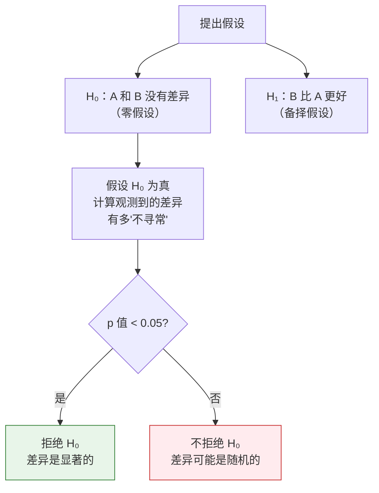
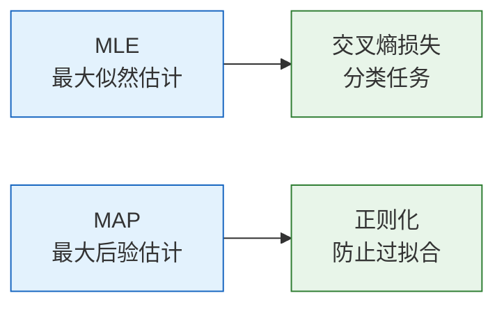

# 统计推断基础

:::tip 统计推断 = 从数据反推规律
上一节学了各种概率分布。但真实世界中，我们不知道分布的参数（比如硬币正面概率是多少）。统计推断就是**从观测到的数据，反推出分布的参数**。
:::

## 学习目标

- 理解最大似然估计（MLE）的直觉——为什么要"最大化概率"
- 理解最大后验估计（MAP）——加入先验知识
- 理解假设检验和 p 值（A/B 测试思维）
- 用 Python 实现 MLE

---

## 一、最大似然估计（MLE）

### 1.1 直觉：什么参数最能解释数据？

你捡到一枚硬币，不知道它公不公平。你抛了 10 次：**正正反正正正反正正正**（8 次正面，2 次反面）。

**问题：这枚硬币正面朝上的概率 p 最可能是多少？**

直觉告诉你：p ≈ 0.8。MLE 就是把这个直觉数学化——**找到那个让观测数据出现概率最大的参数值**。


### 1.2 用代码理解

```python
import numpy as np
import matplotlib.pyplot as plt
from scipy import stats

plt.rcParams['font.sans-serif'] = ['Arial Unicode MS']
plt.rcParams['axes.unicode_minus'] = False

# 观测数据：10 次抛掷，8 正 2 反
n_heads = 8
n_tails = 2
n_total = n_heads + n_tails

# 对于不同的 p 值，计算产生这组数据的概率（似然函数）
p_values = np.linspace(0.01, 0.99, 1000)

# 似然函数：L(p) = C(n,k) * p^k * (1-p)^(n-k)
# 我们可以忽略 C(n,k)（它不依赖于 p）
likelihood = p_values**n_heads * (1 - p_values)**n_tails

# MLE：似然最大的 p
p_mle = p_values[np.argmax(likelihood)]
print(f"MLE 估计: p = {p_mle:.3f}")

# 可视化
plt.figure(figsize=(10, 5))
plt.plot(p_values, likelihood, color='steelblue', linewidth=2)
plt.axvline(x=p_mle, color='red', linestyle='--', linewidth=2, label=f'MLE: p = {p_mle:.2f}')
plt.fill_between(p_values, likelihood, alpha=0.1, color='steelblue')
plt.xlabel('p（正面概率）')
plt.ylabel('似然 L(p)')
plt.title(f'似然函数：抛 10 次硬币，{n_heads} 正 {n_tails} 反')
plt.legend(fontsize=12)
plt.grid(True, alpha=0.3)
plt.show()
```

### 1.3 MLE 的数学直觉

MLE 的答案其实很简单：**p = 正面次数 / 总次数 = 8/10 = 0.8**

但 MLE 的价值在于它是一个**通用框架**——对于任何分布，都可以用同样的思路找参数。

### 1.4 更多数据 = 更准确的估计

```python
# 真实的 p = 0.6
true_p = 0.6
n_experiments = [10, 50, 100, 500, 2000]

fig, axes = plt.subplots(1, len(n_experiments), figsize=(20, 4))

for ax, n in zip(axes, n_experiments):
    # 抛 n 次硬币
    heads = np.random.binomial(n, true_p)
    
    # 似然函数
    p_vals = np.linspace(0.01, 0.99, 500)
    ll = heads * np.log(p_vals) + (n - heads) * np.log(1 - p_vals)
    ll = np.exp(ll - ll.max())  # 归一化
    
    p_mle = heads / n
    
    ax.plot(p_vals, ll, color='steelblue', linewidth=2)
    ax.axvline(x=true_p, color='green', linestyle='--', label=f'真实 p={true_p}')
    ax.axvline(x=p_mle, color='red', linestyle='--', label=f'MLE={p_mle:.3f}')
    ax.set_title(f'n = {n}')
    ax.set_xlabel('p')
    ax.legend(fontsize=8)

plt.suptitle('数据越多，MLE 越准、越确定（曲线越窄）', fontsize=13)
plt.tight_layout()
plt.show()
```

**解读**：数据越多，似然函数的峰越窄、越接近真实值。这就是"大数据"的力量。

---

## 二、最大后验估计（MAP）

### 2.1 MLE 的问题

如果你只抛了 3 次硬币，全是正面，MLE 会告诉你 p = 3/3 = 1.0——"这枚硬币永远正面朝上"。

这显然不合理。我们的**常识**告诉我们，大多数硬币的 p 应该接近 0.5。

### 2.2 MAP：加入先验知识

MAP 在 MLE 的基础上加了一个"先验"——你对参数的事先信念：

**MAP = 似然 × 先验**

```python
# 数据：3 次全正面
n, k = 3, 3

p_values = np.linspace(0.01, 0.99, 1000)

# 似然函数
likelihood = p_values**k * (1 - p_values)**(n - k)

# 先验：我们相信 p 大概率在 0.5 附近（用 Beta 分布表示）
prior = stats.beta.pdf(p_values, a=5, b=5)  # 以 0.5 为中心的先验

# 后验 ∝ 似然 × 先验
posterior = likelihood * prior
posterior = posterior / np.trapz(posterior, p_values)  # 归一化

# 找最大值
p_mle = p_values[np.argmax(likelihood)]
p_map = p_values[np.argmax(posterior)]

print(f"MLE: p = {p_mle:.3f}")
print(f"MAP: p = {p_map:.3f}")

# 可视化
fig, ax = plt.subplots(figsize=(10, 5))
ax.plot(p_values, likelihood / np.trapz(likelihood, p_values), 
        '--', color='coral', linewidth=2, label='似然函数')
ax.plot(p_values, prior / np.trapz(prior, p_values), 
        '--', color='green', linewidth=2, label='先验')
ax.plot(p_values, posterior, color='steelblue', linewidth=2.5, label='后验')
ax.axvline(x=p_mle, color='coral', linestyle=':', alpha=0.7, label=f'MLE = {p_mle:.2f}')
ax.axvline(x=p_map, color='steelblue', linestyle=':', alpha=0.7, label=f'MAP = {p_map:.2f}')
ax.set_xlabel('p')
ax.set_ylabel('概率密度')
ax.set_title('MLE vs MAP（只有 3 次数据时）')
ax.legend()
ax.grid(True, alpha=0.3)
plt.show()
```

**解读**：
- MLE 给出 p=1.0（完全被少量数据带偏）
- MAP 给出 p≈0.69（在数据和先验之间折中）
- 随着数据增多，MAP 和 MLE 会趋于一致

### 2.3 MLE vs MAP

| | MLE | MAP |
|---|-----|-----|
| 使用先验？ | 否 | 是 |
| 数据少时 | 容易过拟合 | 更稳定 |
| 数据多时 | 和 MAP 趋同 | 和 MLE 趋同 |
| AI 中的对应 | 普通训练 | 正则化（如 L2 正则化 = 高斯先验） |

:::tip AI 连接
**L2 正则化**（又叫 weight decay）本质上就是 MAP——它假设权重的先验是均值为 0 的正态分布，鼓励权重不要太大。这就是为什么正则化能防止过拟合。
:::

---

## 三、假设检验与 A/B 测试

### 3.1 日常场景

你改了网站的按钮颜色（A 版用蓝色，B 版用绿色），B 版的点击率高了 2%。

**问题：这个差异是真实的，还是只是随机波动？**

### 3.2 假设检验的思路



### 3.3 p 值的直觉

**p 值 = 假设没有真实差异，仅靠随机波动产生这么大（或更大）差异的概率。**

- p 值小（比如 0.01）→ "如果真没差异，这种结果几乎不可能出现" → 差异是真实的
- p 值大（比如 0.3）→ "就算没有真实差异，这种结果也很常见" → 可能只是随机波动

### 3.4 A/B 测试实战

```python
# 模拟 A/B 测试
np.random.seed(42)

# A 组：蓝色按钮，真实点击率 10%
n_a = 1000
clicks_a = np.random.binomial(n_a, 0.10)
rate_a = clicks_a / n_a

# B 组：绿色按钮，真实点击率 12%（真的更好）
n_b = 1000
clicks_b = np.random.binomial(n_b, 0.12)
rate_b = clicks_b / n_b

print(f"A 组点击率: {rate_a:.1%} ({clicks_a}/{n_a})")
print(f"B 组点击率: {rate_b:.1%} ({clicks_b}/{n_b})")
print(f"差异: {rate_b - rate_a:.1%}")

# 使用 z 检验
from scipy.stats import norm

# 合并比例
p_pool = (clicks_a + clicks_b) / (n_a + n_b)
# 标准误
se = np.sqrt(p_pool * (1 - p_pool) * (1/n_a + 1/n_b))
# z 统计量
z = (rate_b - rate_a) / se
# p 值（单侧）
p_value = 1 - norm.cdf(z)

print(f"\nz 统计量: {z:.3f}")
print(f"p 值: {p_value:.4f}")

if p_value < 0.05:
    print("→ p < 0.05，差异显著！B 版确实更好。")
else:
    print("→ p >= 0.05，差异不显著，可能是随机波动。")
```

### 3.5 用模拟理解 p 值

```python
# 模拟：如果 A 和 B 真的没有差异（都是 10%），会看到多大的差异？
np.random.seed(42)
n_simulations = 10000
simulated_diffs = []

for _ in range(n_simulations):
    # 两组用同样的概率 10%
    sim_a = np.random.binomial(1000, 0.10) / 1000
    sim_b = np.random.binomial(1000, 0.10) / 1000
    simulated_diffs.append(sim_b - sim_a)

simulated_diffs = np.array(simulated_diffs)

# 画分布
observed_diff = rate_b - rate_a

plt.figure(figsize=(10, 5))
plt.hist(simulated_diffs, bins=50, density=True, color='steelblue', 
         edgecolor='white', alpha=0.7, label='零假设下的差异分布')
plt.axvline(x=observed_diff, color='red', linewidth=2, linestyle='--',
            label=f'观测到的差异: {observed_diff:.3f}')

# p 值 = 红线右边的面积
p_sim = (simulated_diffs >= observed_diff).mean()
plt.fill_between(np.linspace(observed_diff, 0.08, 100),
                 0, 30, alpha=0.3, color='red', label=f'p 值 ≈ {p_sim:.4f}')

plt.xlabel('点击率差异 (B - A)')
plt.ylabel('密度')
plt.title('p 值的直觉：观测到的差异有多"不寻常"？')
plt.legend()
plt.grid(True, alpha=0.3)
plt.show()
```

---

## 四、MLE 与损失函数的联系

### 4.1 MLE = 最小化交叉熵

这是一个非常重要的联系——**分类问题中，最大化似然等价于最小化交叉熵损失**。

```python
# 二分类问题
# 模型预测：p_hat = 模型认为标签为 1 的概率
# 真实标签：y ∈ {0, 1}

# 似然函数
# L = ∏ p_hat^y * (1-p_hat)^(1-y)

# 取对数（对数似然）
# log L = Σ [y * log(p_hat) + (1-y) * log(1-p_hat)]

# 最大化 log L = 最小化 -log L = 最小化交叉熵！

# 示例
y_true = np.array([1, 0, 1, 1, 0])
p_pred = np.array([0.9, 0.2, 0.8, 0.7, 0.3])

# 交叉熵（手算）
cross_entropy = -np.mean(
    y_true * np.log(p_pred) + (1 - y_true) * np.log(1 - p_pred)
)
print(f"交叉熵损失: {cross_entropy:.4f}")

# 对数似然（手算）
log_likelihood = np.mean(
    y_true * np.log(p_pred) + (1 - y_true) * np.log(1 - p_pred)
)
print(f"对数似然: {log_likelihood:.4f}")
print(f"交叉熵 = -对数似然: {-log_likelihood:.4f}")
```

:::info 为什么这很重要？
当你看到 PyTorch 中的 `nn.CrossEntropyLoss()` 或 `nn.BCELoss()`，现在你知道了——**它们本质上是在做最大似然估计**。损失函数不是随便定义的，它有深刻的概率论基础。
:::

---

## 五、小结

| 概念 | 直觉 | 公式/代码 |
|------|------|----------|
| MLE | 找最能解释数据的参数 | 最大化似然函数 |
| MAP | MLE + 先验知识 | 最大化 似然 × 先验 |
| p 值 | 差异有多"不寻常" | 零假设下观测到该差异的概率 |
| A/B 测试 | 比较两组是否有真实差异 | `scipy.stats` |
| 交叉熵 | 最小化交叉熵 = MLE | `nn.CrossEntropyLoss()` |



:::info 连接后续
- **下一节**：信息论——从另一个角度理解交叉熵
- **第四阶段**：逻辑回归的损失函数就是交叉熵（来自 MLE）
- **第四阶段**：正则化（L1/L2）的概率解释是 MAP
- **第五阶段**：神经网络训练 = 最小化损失函数 = 做 MLE/MAP
:::

---

## 动手练习

### 练习 1：抛硬币 MLE

抛一枚硬币 100 次，得到 62 次正面。
1. 用 MLE 估计 p
2. 画出似然函数
3. 如果先验是 Beta(10, 10)，MAP 估计是多少？

### 练习 2：A/B 测试

模拟一个 A/B 测试：A 组（n=500）真实转化率 8%，B 组（n=500）真实转化率 8%（没有差异）。运行 1000 次实验，统计有多少次 p 值小于 0.05（这就是"假阳率"，理论上应该约 5%）。

### 练习 3：MLE 估计正态分布

从 N(5, 2) 生成 200 个样本，用 MLE 估计均值和标准差（正态分布的 MLE：均值=样本均值，标准差=样本标准差），和真实值对比。
