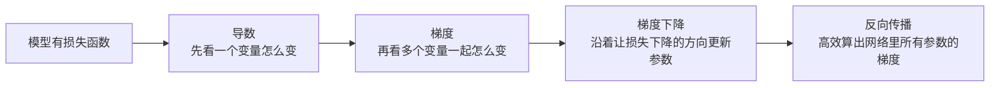

# 学前导读：微积分与优化这章到底在学什么

如果说线性代数告诉你“数据和变换怎样表示”，那这一章要回答的是：

> **模型到底是怎么学起来的？**

它的核心主线其实很简单：

- 导数：告诉你一个量变化得有多快
- 梯度：告诉你多变量函数朝哪个方向变化最快
- 梯度下降：告诉你怎样一步步把损失降下来
- 反向传播：告诉你神经网络里那么多参数的梯度怎么高效算出来

## 学习目标

- 建立“导数 -> 梯度 -> 梯度下降 -> 反向传播”的整章地图
- 知道微积分在 AI 训练里的实际作用
- 知道新人该抓哪些核心直觉，避免一开始掉进推导细节

## 先说一个很重要的学习预期

微积分这章最容易让新人害怕，因为一看到“导数、梯度、链式法则”就会觉得：

- 这是不是要开始背一大堆推导了？

其实这章更现实的目标不是把推导做熟，而是先让你知道：

- 导数为什么是在描述变化率
- 梯度为什么能告诉模型“往哪边改”
- 反向传播为什么只是把这件事高效做出来

也就是说，这章最重要的是先把**训练为什么能发生**这件事讲顺。

---

## 一、这一章四节之间是什么关系？



你可以把这章压缩成一句话：

> **先学会衡量变化，再学会利用变化去更新参数，最后学会在深层网络里高效传播这些变化。**

---

## 二、这一章和 AI 的关系

| 章节 | 在 AI 里最直接的作用 |
|---|---|
| 导数 | 理解“一个参数变一点，损失会怎样变” |
| 梯度 | 理解多参数模型该往哪个方向更新 |
| 梯度下降 | 理解模型训练为什么是一轮轮迭代优化 |
| 反向传播 | 理解神经网络为什么能在很多层里算梯度 |

当你以后在 PyTorch 里看到：

```python
loss.backward()
optimizer.step()
```

背后其实就是这整章在工作。

## 三、为什么 AI 特别依赖这一章？

因为训练模型本质上就在不断重复一件事：

1. 看当前结果错了多少
2. 判断参数该往哪里改
3. 改一点
4. 再看有没有更好

而这整套动作背后的数学语言，就是：

- 导数
- 梯度
- 梯度下降
- 反向传播

所以这一章可以先压成一句话：

> **它是在解释“模型为什么能学起来”。**

---

## 四、新人最应该怎么学这一章？

### 4.1 先抓“变化率”这个核心直觉

不要一开始就被复杂公式带走。先记住：

- 导数是变化率
- 梯度是多变量版本的变化率
- 负梯度方向通常是下降最快的方向

### 4.2 每节都要和“训练模型”连起来

如果你学导数时没有想到“损失怎么变”，学梯度时没有想到“参数怎么调”，那很容易觉得这些内容只是数学题。

### 4.3 先会看图、会看代码，再补推导

对自学 AI 的新人来说，优先级更应该是：

1. 看懂图像直觉
2. 看懂最小代码
3. 理解公式是什么意思
4. 最后再看更严格的推导

### 4.4 一个更适合新人的顺序

建议你每节都按这个顺序来：

1. 先看生活类比
2. 再看图
3. 再跑最小代码
4. 最后再回头看公式

这样会比一开始直接扑到链式法则和推导上更稳。

## 五、这一章建议怎么分配时间？

一个适合新人的参考节奏通常是：

1. 导数：2~3 小时  
   先把“变化率”这个词真的变成你的直觉。

2. 偏导数与梯度：2~4 小时  
   先把“一个变量怎么变”升级成“很多变量一起怎么变”。

3. 梯度下降：2~4 小时  
   先把“模型为什么是一轮轮学出来的”看懂。

4. 链式法则与反向传播：3~5 小时  
   这节最容易发虚，建议单独留更完整的一段时间。

如果你觉得这里学得慢，不代表你差，通常只是因为这章本来就更抽象。

---

## 六、学完这章后，你至少应该会什么？

- 看到导数时，知道它表示变化率
- 看到梯度时，知道它表示多变量函数上升最快的方向
- 看到梯度下降时，知道模型是在一点点往损失更小的地方走
- 看到反向传播时，知道它本质上是在应用链式法则

## 七、如果你读这章时觉得“还是太抽象”，先抓哪几件事最值？

最值得先抓的是：

1. 导数 = 某个量变得有多快
2. 梯度 = 多个量一起变时，哪边变得最快
3. 梯度下降 = 往损失更小的方向一点点走
4. 反向传播 = 把很多层里的梯度高效算出来

只要这四条稳了，第五阶段再看到 `loss.backward()` 时，你就不会只剩黑箱感。
