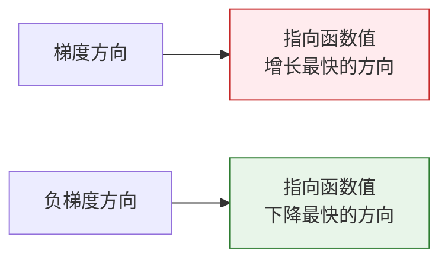

# 偏导数与梯度：多变量的变化方向

## 学习目标

- 理解偏导数——固定其他变量，看一个变量的影响
- 理解梯度——所有偏导数组成的向量，指向"上升最快"的方向
- 可视化三维曲面上的梯度
- 理解梯度在神经网络训练中的核心作用

---

## 一、偏导数——"只动一个变量"

### 1.1 从单变量到多变量

上一节的导数只有一个变量。但 AI 中，损失函数通常依赖**成千上万个参数**。

偏导数的想法很简单：**固定其他所有变量不动，只看一个变量的变化对结果的影响。**

```python
import numpy as np
import matplotlib.pyplot as plt
from mpl_toolkits.mplot3d import Axes3D

plt.rcParams['font.sans-serif'] = ['Arial Unicode MS']
plt.rcParams['axes.unicode_minus'] = False
```

### 1.2 生活直觉

假设你的考试成绩取决于"学习时间"和"睡眠时间"：

**成绩 = f(学习时间, 睡眠时间)**

- 偏导数 ∂f/∂学习时间 = **固定睡眠不变**，多学 1 小时，成绩提高多少？
- 偏导数 ∂f/∂睡眠时间 = **固定学习不变**，多睡 1 小时，成绩提高多少？

### 1.3 数学示例

f(x, y) = x² + y²

- ∂f/∂x = 2x（把 y 当常数，只对 x 求导）
- ∂f/∂y = 2y（把 x 当常数，只对 y 求导）

```python
# 数值偏导数
def partial_derivative(f, args, var_index, h=1e-7):
    """计算多变量函数 f 对第 var_index 个变量的偏导数"""
    args_plus = list(args)
    args_minus = list(args)
    args_plus[var_index] += h
    args_minus[var_index] -= h
    return (f(*args_plus) - f(*args_minus)) / (2 * h)

# f(x, y) = x² + y²
f = lambda x, y: x**2 + y**2

# 在 (1, 2) 处的偏导数
x0, y0 = 1, 2
df_dx = partial_derivative(f, [x0, y0], 0)
df_dy = partial_derivative(f, [x0, y0], 1)

print(f"在 ({x0}, {y0}) 处：")
print(f"  ∂f/∂x = {df_dx:.4f}（精确值: {2*x0}）")
print(f"  ∂f/∂y = {df_dy:.4f}（精确值: {2*y0}）")
```

---

## 二、梯度——"上升最快的方向"

### 2.1 定义

**梯度 = 所有偏导数组成的向量。**

对 f(x, y)：梯度 = [∂f/∂x, ∂f/∂y]

```python
def gradient(f, args, h=1e-7):
    """计算多变量函数的梯度"""
    grad = []
    for i in range(len(args)):
        grad.append(partial_derivative(f, args, i, h))
    return np.array(grad)

# 在 (1, 2) 处的梯度
grad = gradient(f, [1, 2])
print(f"梯度: {grad}")  # [2, 4]
```

### 2.2 梯度的方向意义



**关键洞察**：梯度指向"上坡"最快的方向。所以要让损失函数下降，就应该往**负梯度方向**走。这就是梯度下降的原理。

### 2.3 可视化：三维曲面上的梯度

```python
# f(x, y) = x² + y²（碗形曲面）
x = np.linspace(-3, 3, 100)
y = np.linspace(-3, 3, 100)
X, Y = np.meshgrid(x, y)
Z = X**2 + Y**2

# 三维曲面图
fig = plt.figure(figsize=(14, 5))

# 左：三维曲面
ax1 = fig.add_subplot(121, projection='3d')
ax1.plot_surface(X, Y, Z, cmap='coolwarm', alpha=0.8)
ax1.set_xlabel('x')
ax1.set_ylabel('y')
ax1.set_zlabel('f(x,y)')
ax1.set_title('f(x,y) = x² + y²（三维视图）')

# 右：等高线 + 梯度箭头
ax2 = fig.add_subplot(122)
contour = ax2.contourf(X, Y, Z, levels=20, cmap='coolwarm', alpha=0.7)
plt.colorbar(contour, ax=ax2)

# 在几个点画梯度箭头
points = [(-2, -2), (-1, 1), (1, -1), (2, 2), (0.5, 0.5)]
for px, py in points:
    gx, gy = 2*px, 2*py  # 解析梯度
    ax2.quiver(px, py, gx, gy, color='black', scale=30, width=0.005)

ax2.set_xlabel('x')
ax2.set_ylabel('y')
ax2.set_title('等高线 + 梯度方向（箭头）\n箭头指向上升最快的方向')
ax2.set_aspect('equal')

plt.tight_layout()
plt.show()
```

**解读**：
- 等高线图中，箭头（梯度）总是**垂直于等高线**指向高处
- 离中心越远，梯度越大（箭头越长）——表示函数变化越剧烈
- 在最低点 (0,0)，梯度为 [0,0]——已经到底了

### 2.4 非碗形曲面的梯度

```python
# 更有趣的函数：有多个极值点
def rosenbrock(x, y):
    return (1 - x)**2 + 100 * (y - x**2)**2

x = np.linspace(-2, 2, 200)
y = np.linspace(-1, 3, 200)
X, Y = np.meshgrid(x, y)
Z = rosenbrock(X, Y)

fig, ax = plt.subplots(figsize=(10, 8))
contour = ax.contourf(X, Y, np.log1p(Z), levels=30, cmap='viridis', alpha=0.8)
plt.colorbar(contour, ax=ax, label='log(1 + f(x,y))')

# 画几个点的梯度
for px, py in [(-1, 1), (0, 0), (1, 1), (1.5, 2)]:
    grad = gradient(rosenbrock, [px, py])
    # 缩放梯度方便显示
    norm = np.linalg.norm(grad)
    if norm > 0:
        grad_scaled = grad / norm * 0.3
        ax.quiver(px, py, -grad_scaled[0], -grad_scaled[1], 
                  color='red', scale=3, width=0.008)

ax.plot(1, 1, 'r*', markersize=20, label='最小值 (1, 1)')
ax.set_xlabel('x')
ax.set_ylabel('y')
ax.set_title('Rosenbrock 函数（优化的经典测试函数）\n红色箭头 = 负梯度方向（下降方向）')
ax.legend(fontsize=12)
plt.show()
```

---

## 三、梯度在神经网络中的意义

### 3.1 损失函数的梯度

在神经网络中：
- **参数** = 数千到数十亿个权重 [w1, w2, ..., wn]
- **损失函数** = L(w1, w2, ..., wn)
- **梯度** = [∂L/∂w1, ∂L/∂w2, ..., ∂L/∂wn]

梯度告诉我们：**每个权重应该增大还是减小，才能让损失减少。**

```python
# 模拟：一个只有 2 个参数的简单模型
# 损失函数 L(w1, w2) = (w1 - 3)² + (w2 + 1)²
# 最优解：w1 = 3, w2 = -1

def loss(w1, w2):
    return (w1 - 3)**2 + (w2 + 1)**2

# 当前参数
w1, w2 = 0, 0
grad = gradient(loss, [w1, w2])

print(f"当前参数: w1={w1}, w2={w2}")
print(f"当前损失: {loss(w1, w2)}")
print(f"梯度: {grad}")
print(f"→ w1 的偏导数 = {grad[0]:.1f}（负数 → w1 应该增大）")
print(f"→ w2 的偏导数 = {grad[1]:.1f}（正数 → w2 应该减小）")
```

### 3.2 高维梯度的挑战

| 模型 | 参数数量 | 梯度维度 |
|------|---------|---------|
| 线性回归 | 几个~几百 | 几个~几百 |
| CNN (ResNet-50) | 2500 万 | 2500 万维梯度 |
| BERT | 1.1 亿 | 1.1 亿维梯度 |
| GPT-3 | 1750 亿 | 1750 亿维梯度 |

虽然维度极高，但梯度的计算规则是一样的——每个参数的偏导数。PyTorch 的 `autograd` 会自动帮你高效计算。

---

## 四、小结

| 概念 | 直觉 | Python |
|------|------|--------|
| 偏导数 | 固定其他变量，看一个变量的影响 | `partial_derivative(f, args, i)` |
| 梯度 | 所有偏导数的向量，指向上升最快方向 | `gradient(f, args)` |
| 负梯度 | 指向下降最快方向 | `-gradient(f, args)` |
| 梯度大小 | 函数变化的剧烈程度 | `np.linalg.norm(grad)` |

:::info 连接后续
- **下一节**：梯度下降——沿负梯度方向一步步走，找到损失函数的最低点
- **3.4 节**：链式法则——如何高效计算复杂网络的梯度
- **第五阶段**：PyTorch 的 `loss.backward()` 就是在算梯度
:::

---

## 动手练习

### 练习 1：计算梯度

用 `gradient` 函数计算 f(x, y) = x²y + xy² 在 (2, 3) 处的梯度。手算验证（∂f/∂x = 2xy + y², ∂f/∂y = x² + 2xy）。

### 练习 2：可视化梯度场

画出 f(x, y) = sin(x) + cos(y) 的等高线图和梯度箭头（使用 `plt.quiver`）。

### 练习 3：三变量梯度

对 f(x, y, z) = x² + 2y² + 3z²，在 (1, 1, 1) 处计算梯度，判断哪个方向变化最快。
