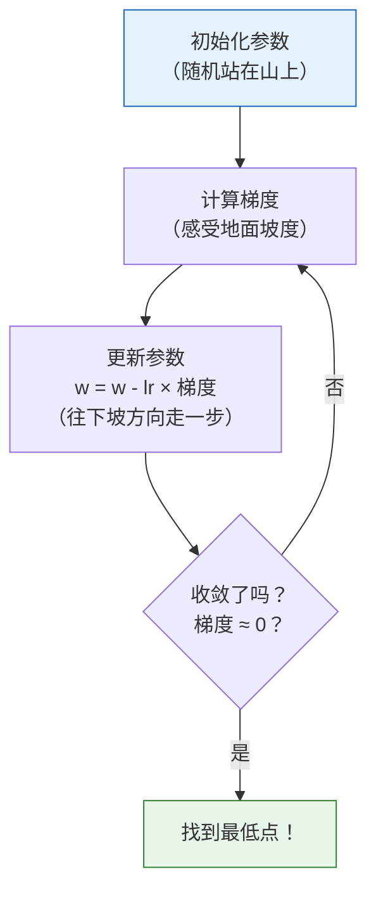
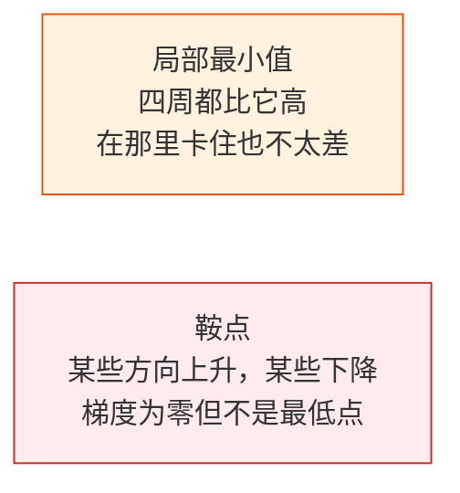

# 梯度下降：AI 最核心的优化算法

:::tip 本节是整个数学阶段的高潮
梯度下降是**所有深度学习模型训练的基础**。理解了它，你就理解了 AI 模型是如何"学习"的。
:::

## 学习目标

- 直觉理解梯度下降——"蒙着眼下山"
- 理解学习率的影响（太大/太小）
- **从头实现**梯度下降拟合一条直线
- 了解 BGD、SGD、Mini-batch SGD 的区别
- 理解局部最小值和鞍点

---

## 一、直觉：蒙着眼睛下山

想象你站在一座山上，被蒙住了眼睛，想走到山谷最低点。你会怎么做？

1. **用脚感受地面**：哪个方向最陡？（= 计算梯度）
2. **往最陡的下坡方向走一步**（= 沿负梯度方向更新参数）
3. **重复**，直到感觉周围都是平的（= 梯度接近零，到达最低点）



---

## 二、从代码开始理解

### 2.1 最简单的例子：找 f(x) = x² 的最小值

```python
import numpy as np
import matplotlib.pyplot as plt

plt.rcParams['font.sans-serif'] = ['Arial Unicode MS']
plt.rcParams['axes.unicode_minus'] = False

# 目标函数
def f(x):
    return x ** 2

# 导数
def df(x):
    return 2 * x

# 梯度下降
x = 4.0          # 初始位置
lr = 0.3          # 学习率
history = [x]     # 记录轨迹

for step in range(20):
    grad = df(x)              # 计算梯度
    x = x - lr * grad         # 更新参数
    history.append(x)
    if step < 8:
        print(f"步骤 {step+1}: x = {x:.4f}, f(x) = {f(x):.6f}, 梯度 = {grad:.4f}")

print(f"\n最终: x = {x:.6f}, f(x) = {f(x):.10f}")
```

### 2.2 可视化下降过程

```python
x_plot = np.linspace(-5, 5, 200)

plt.figure(figsize=(10, 6))
plt.plot(x_plot, f(x_plot), 'steelblue', linewidth=2, label='f(x) = x²')

# 画出每一步的位置
for i in range(len(history) - 1):
    plt.plot(history[i], f(history[i]), 'ro', markersize=8, alpha=0.5)
    plt.annotate('', xy=(history[i+1], f(history[i+1])),
                 xytext=(history[i], f(history[i])),
                 arrowprops=dict(arrowstyle='->', color='red', lw=1.5))

plt.plot(history[0], f(history[0]), 'ro', markersize=12, label=f'起点 x={history[0]}')
plt.plot(history[-1], f(history[-1]), 'g*', markersize=15, label=f'终点 x={history[-1]:.2f}')

plt.xlabel('x')
plt.ylabel('f(x)')
plt.title('梯度下降过程：从 x=4 出发，逐步走到最低点')
plt.legend()
plt.grid(True, alpha=0.3)
plt.show()
```

---

## 三、学习率——最关键的超参数

### 3.1 学习率太大 vs 太小

```python
fig, axes = plt.subplots(1, 3, figsize=(18, 5))
x_plot = np.linspace(-5, 5, 200)

for ax, lr, title in zip(axes, [0.01, 0.3, 0.95], 
                          ['太小 (lr=0.01)', '刚好 (lr=0.3)', '太大 (lr=0.95)']):
    x = 4.0
    history = [x]
    for _ in range(30):
        x = x - lr * df(x)
        history.append(x)
    
    ax.plot(x_plot, f(x_plot), 'steelblue', linewidth=2)
    
    for i in range(min(len(history)-1, 20)):
        ax.plot(history[i], f(history[i]), 'ro', markersize=5, alpha=0.6)
        if i < len(history)-1:
            ax.plot([history[i], history[i+1]], 
                    [f(history[i]), f(history[i+1])], 'r-', alpha=0.3)
    
    ax.set_title(f'{title}\n30 步后 x={history[-1]:.4f}')
    ax.set_xlabel('x')
    ax.set_ylabel('f(x)')
    ax.set_ylim(-1, 30)
    ax.grid(True, alpha=0.3)

plt.suptitle('学习率对梯度下降的影响', fontsize=14)
plt.tight_layout()
plt.show()
```

| 学习率 | 表现 | 问题 |
|--------|------|------|
| 太小（0.01） | 每步走太短 | 收敛极慢，需要上万步 |
| 合适（0.1~0.5） | 稳步下降 | 理想情况 |
| 太大（0.95+） | 来回震荡 | 可能永远不收敛 |
| 超大（>1.0） | 越跑越远 | 发散（损失爆炸） |

:::warning 学习率超过 1.0 时
对 f(x)=x²，如果 lr > 1，每一步 x 的绝对值会越来越大——模型"学爆了"。
```python
x = 4.0
for i in range(5):
    x = x - 1.1 * (2*x)
    print(f"步骤 {i+1}: x={x:.2f}, f(x)={x**2:.2f}")
# x 越来越大！
```
:::

---

## 四、实战：从头实现梯度下降拟合直线

### 4.1 问题设定

用梯度下降拟合 y = wx + b，找到最佳的 w 和 b。

```python
# 生成数据：y = 2x + 3 + 噪声
np.random.seed(42)
n = 100
X = np.random.uniform(-5, 5, n)
y_true = 2 * X + 3 + np.random.randn(n) * 1.5

plt.figure(figsize=(8, 5))
plt.scatter(X, y_true, alpha=0.5, s=30, color='steelblue')
plt.xlabel('x')
plt.ylabel('y')
plt.title('数据点（真实关系：y = 2x + 3 + 噪声）')
plt.grid(True, alpha=0.3)
plt.show()
```

### 4.2 损失函数

**均方误差（MSE）**：

MSE = (1/n) × Σ (预测值 - 真实值)²

```python
def predict(X, w, b):
    """预测函数：y = wx + b"""
    return w * X + b

def mse_loss(X, y, w, b):
    """均方误差损失"""
    y_pred = predict(X, w, b)
    return np.mean((y_pred - y) ** 2)

def compute_gradients(X, y, w, b):
    """计算损失对 w 和 b 的梯度"""
    y_pred = predict(X, w, b)
    n = len(y)
    dw = (2/n) * np.sum((y_pred - y) * X)
    db = (2/n) * np.sum(y_pred - y)
    return dw, db
```

### 4.3 梯度下降训练

```python
# 初始化参数
w = 0.0
b = 0.0
lr = 0.01
epochs = 200

# 记录训练过程
loss_history = []
w_history = []
b_history = []

for epoch in range(epochs):
    # 1. 计算损失
    loss = mse_loss(X, y_true, w, b)
    loss_history.append(loss)
    w_history.append(w)
    b_history.append(b)
    
    # 2. 计算梯度
    dw, db = compute_gradients(X, y_true, w, b)
    
    # 3. 更新参数
    w = w - lr * dw
    b = b - lr * db
    
    # 打印进度
    if epoch % 40 == 0:
        print(f"Epoch {epoch:4d}: loss={loss:.4f}, w={w:.4f}, b={b:.4f}")

print(f"\n最终结果: w={w:.4f}, b={b:.4f}")
print(f"真实参数: w=2.0000, b=3.0000")
```

### 4.4 可视化训练过程

```python
fig, axes = plt.subplots(1, 3, figsize=(18, 5))

# 1. 损失曲线
axes[0].plot(loss_history, color='coral', linewidth=2)
axes[0].set_xlabel('Epoch')
axes[0].set_ylabel('MSE Loss')
axes[0].set_title('训练损失曲线')
axes[0].grid(True, alpha=0.3)

# 2. 参数收敛过程
axes[1].plot(w_history, label='w', color='steelblue', linewidth=2)
axes[1].plot(b_history, label='b', color='coral', linewidth=2)
axes[1].axhline(y=2.0, color='steelblue', linestyle='--', alpha=0.5, label='w 真实值')
axes[1].axhline(y=3.0, color='coral', linestyle='--', alpha=0.5, label='b 真实值')
axes[1].set_xlabel('Epoch')
axes[1].set_ylabel('参数值')
axes[1].set_title('参数收敛过程')
axes[1].legend()
axes[1].grid(True, alpha=0.3)

# 3. 拟合结果
x_line = np.linspace(-5, 5, 100)
axes[2].scatter(X, y_true, alpha=0.4, s=20, color='gray')
axes[2].plot(x_line, 2*x_line + 3, 'g--', linewidth=2, label='真实: y=2x+3')
axes[2].plot(x_line, w*x_line + b, 'r-', linewidth=2, label=f'拟合: y={w:.2f}x+{b:.2f}')
axes[2].set_xlabel('x')
axes[2].set_ylabel('y')
axes[2].set_title('拟合结果')
axes[2].legend()
axes[2].grid(True, alpha=0.3)

plt.tight_layout()
plt.show()
```

---

## 五、梯度下降的三种变体

### 5.1 批梯度下降（BGD）

每步用**全部数据**计算梯度（上面的实现就是 BGD）。

```python
# BGD：用全部 n 个样本计算梯度
dw = (2/n) * np.sum((y_pred - y) * X)  # 用所有数据
```

### 5.2 随机梯度下降（SGD）

每步只用**一个样本**计算梯度。

```python
# SGD：每次只用 1 个样本
i = np.random.randint(0, n)
dw = 2 * (w * X[i] + b - y_true[i]) * X[i]
```

### 5.3 小批量梯度下降（Mini-batch SGD）

每步用一小批数据（如 32 个样本）——**最常用**。

```python
# Mini-batch SGD
batch_size = 32
indices = np.random.choice(n, batch_size, replace=False)
X_batch = X[indices]
y_batch = y_true[indices]
dw = (2/batch_size) * np.sum((w * X_batch + b - y_batch) * X_batch)
```

### 5.4 对比

| 方法 | 每步用的数据 | 梯度估计 | 速度 | 实际使用 |
|------|------------|---------|------|---------|
| BGD | 全部数据 | 精确 | 慢（数据多时） | 小数据集 |
| SGD | 1 个样本 | 噪声大 | 快但震荡 | 理论分析 |
| Mini-batch | 32~512 个 | 较准且快 | 最佳平衡 | **最常用** |

```python
# 对比三种方法的收敛曲线
fig, ax = plt.subplots(figsize=(10, 5))

for method, batch_size, color in [('BGD', n, 'steelblue'), 
                                    ('Mini-batch(32)', 32, 'coral'),
                                    ('SGD', 1, 'gray')]:
    w, b = 0.0, 0.0
    lr = 0.01
    losses = []
    
    for epoch in range(200):
        if batch_size == n:
            idx = np.arange(n)
        else:
            idx = np.random.choice(n, batch_size, replace=False)
        
        X_b, y_b = X[idx], y_true[idx]
        y_pred = w * X_b + b
        
        dw = (2/len(idx)) * np.sum((y_pred - y_b) * X_b)
        db = (2/len(idx)) * np.sum(y_pred - y_b)
        
        w -= lr * dw
        b -= lr * db
        
        losses.append(mse_loss(X, y_true, w, b))
    
    ax.plot(losses, label=method, color=color, linewidth=2, 
            alpha=0.7 if method != 'SGD' else 0.4)

ax.set_xlabel('Epoch')
ax.set_ylabel('MSE Loss')
ax.set_title('三种梯度下降方法的收敛对比')
ax.legend()
ax.grid(True, alpha=0.3)
plt.show()
```

---

## 六、局部最小值与鞍点

### 6.1 非凸函数的挑战

```python
# 有多个极值点的函数
def tricky_f(x):
    return x**4 - 4*x**2 + 0.5*x

def tricky_df(x):
    return 4*x**3 - 8*x + 0.5

x_plot = np.linspace(-2.5, 2.5, 200)

plt.figure(figsize=(10, 5))
plt.plot(x_plot, tricky_f(x_plot), 'steelblue', linewidth=2)

# 从不同起点出发
for x0, color in [(-2.0, 'red'), (0.5, 'green'), (2.0, 'orange')]:
    x = x0
    history = [x]
    for _ in range(100):
        x = x - 0.01 * tricky_df(x)
        history.append(x)
    
    for h in history[::5]:
        plt.plot(h, tricky_f(h), 'o', color=color, markersize=4, alpha=0.5)
    plt.plot(history[0], tricky_f(history[0]), 's', color=color, markersize=10,
             label=f'起点 x={x0} → 终点 x={history[-1]:.2f}')

plt.xlabel('x')
plt.ylabel('f(x)')
plt.title('不同起点可能找到不同的极值点')
plt.legend()
plt.grid(True, alpha=0.3)
plt.show()
```

**解读**：不同起点可能"下山"到不同的谷底（局部最小值）。在深度学习中，好消息是高维空间中局部最小值通常也足够好。

### 6.2 鞍点



在高维空间中，鞍点比局部最小值更常见。现代优化器（如 Adam）通过动量机制可以帮助跳过鞍点。

---

## 七、小结

| 概念 | 直觉 |
|------|------|
| 梯度下降 | 沿负梯度方向一步步走到最低点 |
| 学习率 | 每步走多远（太大震荡，太小太慢） |
| BGD | 用全部数据算梯度（精确但慢） |
| Mini-batch SGD | 用一小批数据（最常用） |
| 局部最小值 | 非全局最优但梯度为零的点 |

:::info 连接后续
- **下一节**：链式法则——如何高效计算复杂网络中每个参数的梯度
- **第四阶段**：线性回归、逻辑回归的训练都用梯度下降
- **第五阶段**：PyTorch 的 `optimizer.step()` 就是执行一步梯度下降
- **高级优化器**：Adam、AdamW 是梯度下降的改进版（自适应学习率 + 动量）
:::

---

## 动手练习

### 练习 1：调学习率

修改 4.3 节的代码，分别用 lr=0.001、0.01、0.1、0.5 训练，画出 4 条损失曲线对比。

### 练习 2：从头拟合二次函数

用梯度下降拟合 y = ax² + bx + c，找到最佳的 a、b、c。数据：
```python
X = np.linspace(-3, 3, 100)
y = 0.5 * X**2 - 2 * X + 1 + np.random.randn(100) * 0.5
```

### 练习 3：二维梯度下降可视化

对 f(x, y) = x² + 2y²，从 (4, 3) 出发做梯度下降，在等高线图上画出下降轨迹。
