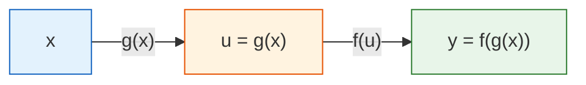
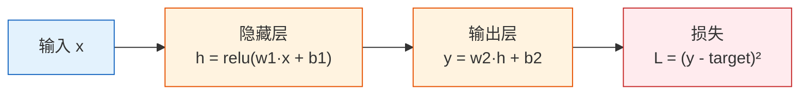
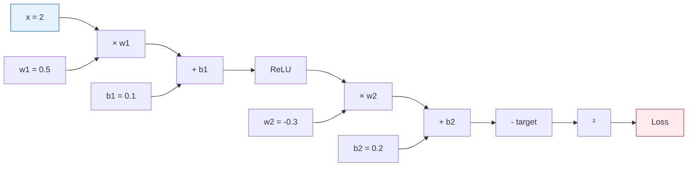

# 链式法则与反向传播预览

:::tip 本节是数学与深度学习的桥梁
链式法则解释了一个核心问题：**对于一个有几百层的神经网络，怎么算出损失函数对每个参数的导数？** 答案就是反向传播——它本质上就是链式法则的系统化应用。
:::

## 学习目标

- 理解链式法则——复合函数怎么求导
- 用简单的两层网络手动推导反向传播
- 理解计算图——为什么 PyTorch 需要它
- 为第五阶段的深度学习做好准备

---

## 一、链式法则——"洋葱剥皮法"

### 1.1 直觉

如果一个函数是"套娃"结构——外面套外面，那它的导数就是**一层一层剥开，每层的导数乘起来**。



**链式法则：dy/dx = (dy/du) × (du/dx)**

"y 对 x 的变化率 = y 对 u 的变化率 × u 对 x 的变化率"

### 1.2 生活直觉

你的工资涨了 10%，物价涨了 5%，你的实际购买力变了多少？

- 工资变化 → 影响钱包 → 影响购买力
- 总变化 = 工资变化率 × 转换率

每一环节的变化率相乘 = 总的变化率。

### 1.3 计算示例

```python
import numpy as np

# 例子：y = (3x + 2)²
# 分解：u = 3x + 2, y = u²
# dy/dx = dy/du × du/dx = 2u × 3 = 6(3x + 2)

# 方法 1：链式法则
def chain_rule_example(x):
    u = 3 * x + 2        # 内函数
    y = u ** 2            # 外函数
    
    du_dx = 3             # 内函数的导数
    dy_du = 2 * u         # 外函数的导数
    dy_dx = dy_du * du_dx # 链式法则
    
    return y, dy_dx

# 方法 2：数值验证
def numerical_derivative(f, x, h=1e-7):
    return (f(x + h) - f(x - h)) / (2 * h)

f = lambda x: (3*x + 2)**2

x0 = 1
y, dy_dx_chain = chain_rule_example(x0)
dy_dx_numerical = numerical_derivative(f, x0)

print(f"x = {x0}")
print(f"  链式法则: dy/dx = {dy_dx_chain}")
print(f"  数值验证: dy/dx = {dy_dx_numerical:.4f}")
```

### 1.4 多层链式法则

如果有更多层嵌套呢？照样一层层剥：

```python
# y = sin(exp(x²))
# 分解：a = x², b = exp(a), y = sin(b)
# dy/dx = dy/db × db/da × da/dx
#       = cos(b) × exp(a) × 2x

x0 = 0.5
a = x0 ** 2
b = np.exp(a)
y = np.sin(b)

da_dx = 2 * x0
db_da = np.exp(a)
dy_db = np.cos(b)

dy_dx = dy_db * db_da * da_dx

# 数值验证
f = lambda x: np.sin(np.exp(x**2))
dy_dx_num = numerical_derivative(f, x0)

print(f"链式法则: {dy_dx:.6f}")
print(f"数值验证: {dy_dx_num:.6f}")
```

---

## 二、反向传播——链式法则的系统化

### 2.1 一个两层神经网络



### 2.2 前向传播（Forward Pass）

```python
# 简单的两层网络
np.random.seed(42)

# 输入和目标
x = 2.0
target = 1.0

# 参数
w1 = 0.5
b1 = 0.1
w2 = -0.3
b2 = 0.2

# --- 前向传播 ---
# 第 1 层：线性 + ReLU
z1 = w1 * x + b1
h = max(0, z1)       # ReLU

# 第 2 层：线性
y = w2 * h + b2

# 损失
loss = (y - target) ** 2

print("=== 前向传播 ===")
print(f"z1 = w1*x + b1 = {w1}*{x} + {b1} = {z1}")
print(f"h  = ReLU(z1) = {h}")
print(f"y  = w2*h + b2 = {w2}*{h} + {b2} = {y}")
print(f"loss = (y - target)² = ({y} - {target})² = {loss:.4f}")
```

### 2.3 反向传播（Backward Pass）

**从损失开始，逐层往回算每个参数的梯度：**

```python
# --- 反向传播 ---
# 从最后一层开始，用链式法则一层层往回算

# dL/dy
dL_dy = 2 * (y - target)
print(f"\n=== 反向传播 ===")
print(f"dL/dy = 2*(y-target) = {dL_dy:.4f}")

# dL/dw2 = dL/dy × dy/dw2 = dL/dy × h
dL_dw2 = dL_dy * h
print(f"dL/dw2 = dL/dy × h = {dL_dy:.4f} × {h} = {dL_dw2:.4f}")

# dL/db2 = dL/dy × dy/db2 = dL/dy × 1
dL_db2 = dL_dy * 1
print(f"dL/db2 = dL/dy × 1 = {dL_db2:.4f}")

# dL/dh = dL/dy × dy/dh = dL/dy × w2
dL_dh = dL_dy * w2
print(f"dL/dh  = dL/dy × w2 = {dL_dy:.4f} × {w2} = {dL_dh:.4f}")

# dL/dz1 = dL/dh × dh/dz1（ReLU 的导数：z1>0 时为 1，否则为 0）
relu_grad = 1.0 if z1 > 0 else 0.0
dL_dz1 = dL_dh * relu_grad
print(f"dL/dz1 = dL/dh × relu'(z1) = {dL_dh:.4f} × {relu_grad} = {dL_dz1:.4f}")

# dL/dw1 = dL/dz1 × dz1/dw1 = dL/dz1 × x
dL_dw1 = dL_dz1 * x
print(f"dL/dw1 = dL/dz1 × x = {dL_dz1:.4f} × {x} = {dL_dw1:.4f}")

# dL/db1 = dL/dz1 × dz1/db1 = dL/dz1 × 1
dL_db1 = dL_dz1 * 1
print(f"dL/db1 = dL/dz1 × 1 = {dL_db1:.4f}")
```

### 2.4 用梯度更新参数

```python
lr = 0.1

print(f"\n=== 参数更新 (lr={lr}) ===")
print(f"w1: {w1:.4f} → {w1 - lr * dL_dw1:.4f}")
print(f"b1: {b1:.4f} → {b1 - lr * dL_db1:.4f}")
print(f"w2: {w2:.4f} → {w2 - lr * dL_dw2:.4f}")
print(f"b2: {b2:.4f} → {b2 - lr * dL_db2:.4f}")

# 更新
w1 -= lr * dL_dw1
b1 -= lr * dL_db1
w2 -= lr * dL_dw2
b2 -= lr * dL_db2

# 验证损失减小了
z1_new = w1 * x + b1
h_new = max(0, z1_new)
y_new = w2 * h_new + b2
loss_new = (y_new - target) ** 2

print(f"\n损失变化: {loss:.4f} → {loss_new:.4f} ({'↓ 减小了！' if loss_new < loss else '↑ 增大了'})")
```

---

## 三、计算图——反向传播的数据结构

### 3.1 什么是计算图？

**计算图 = 把每一步运算画成一个节点的有向图。**



**前向传播**：沿箭头方向计算，从输入算到损失。

**反向传播**：逆着箭头方向，从损失算回每个参数的梯度。

### 3.2 为什么 PyTorch 需要计算图？

```python
# 在 PyTorch 中（第五阶段会详细学）
# import torch
# 
# x = torch.tensor(2.0)
# w1 = torch.tensor(0.5, requires_grad=True)
# b1 = torch.tensor(0.1, requires_grad=True)
# w2 = torch.tensor(-0.3, requires_grad=True)
# b2 = torch.tensor(0.2, requires_grad=True)
# 
# # 前向传播（PyTorch 自动构建计算图）
# h = torch.relu(w1 * x + b1)
# y = w2 * h + b2
# loss = (y - 1.0) ** 2
# 
# # 反向传播（一行代码，自动算所有梯度！）
# loss.backward()
# 
# print(w1.grad)  # dL/dw1
# print(b1.grad)  # dL/db1
# print(w2.grad)  # dL/dw2
# print(b2.grad)  # dL/db2
```

PyTorch 在前向传播时自动记录每一步操作（构建计算图），然后 `loss.backward()` 沿着图反向传播，用链式法则自动计算每个参数的梯度。

:::info 为什么这么厉害？
手动算 4 个参数的梯度已经很麻烦了。GPT-3 有 1750 亿个参数——不可能手算。PyTorch 的自动微分引擎（autograd）让你只需要写前向传播代码，梯度计算完全自动化。
:::

---

## 四、完整示例：训练一个小网络

把前向传播 + 反向传播 + 参数更新放在一起，训练一个两层网络：

```python
import matplotlib.pyplot as plt

# 数据
np.random.seed(42)
X_data = np.random.uniform(-2, 2, 50)
y_data = X_data ** 2 + np.random.randn(50) * 0.3  # y = x² + 噪声

# 两层网络参数
w1 = np.random.randn()
b1 = 0.0
w2 = np.random.randn()
b2 = 0.0

lr = 0.01
losses = []

for epoch in range(500):
    total_loss = 0
    
    for x, target in zip(X_data, y_data):
        # === 前向传播 ===
        z1 = w1 * x + b1
        h = max(0, z1)
        y_pred = w2 * h + b2
        loss = (y_pred - target) ** 2
        total_loss += loss
        
        # === 反向传播 ===
        dL_dy = 2 * (y_pred - target)
        dL_dw2 = dL_dy * h
        dL_db2 = dL_dy
        dL_dh = dL_dy * w2
        dL_dz1 = dL_dh * (1.0 if z1 > 0 else 0.0)
        dL_dw1 = dL_dz1 * x
        dL_db1 = dL_dz1
        
        # === 更新参数 ===
        w1 -= lr * dL_dw1
        b1 -= lr * dL_db1
        w2 -= lr * dL_dw2
        b2 -= lr * dL_db2
    
    losses.append(total_loss / len(X_data))
    if epoch % 100 == 0:
        print(f"Epoch {epoch}: loss = {losses[-1]:.4f}")

# 可视化
fig, axes = plt.subplots(1, 2, figsize=(14, 5))

axes[0].plot(losses, color='coral', linewidth=2)
axes[0].set_xlabel('Epoch')
axes[0].set_ylabel('Loss')
axes[0].set_title('训练损失')
axes[0].grid(True, alpha=0.3)

x_test = np.linspace(-2, 2, 200)
y_pred_test = []
for x in x_test:
    z1 = w1 * x + b1
    h = max(0, z1)
    y_pred_test.append(w2 * h + b2)

axes[1].scatter(X_data, y_data, alpha=0.4, s=20, color='gray', label='数据')
axes[1].plot(x_test, x_test**2, 'g--', linewidth=2, label='y = x²（真实）')
axes[1].plot(x_test, y_pred_test, 'r-', linewidth=2, label='网络预测')
axes[1].set_title('拟合结果（两层网络，1 个隐藏神经元）')
axes[1].legend()
axes[1].grid(True, alpha=0.3)

plt.tight_layout()
plt.show()
```

:::tip 只有 1 个神经元的局限
这个网络只有 1 个隐藏神经元（本质上是一个分段线性函数），不足以完美拟合 x²。增加更多神经元就能更好地拟合——这就是第五阶段要学的内容。
:::

---

## 五、小结

| 概念 | 直觉 |
|------|------|
| 链式法则 | 复合函数的导数 = 每层导数相乘 |
| 前向传播 | 从输入到损失，逐步计算 |
| 反向传播 | 从损失到参数，逐步算梯度 |
| 计算图 | 记录运算步骤，支持自动求导 |
| 自动微分 | PyTorch 帮你自动算所有梯度 |


:::info 本章回顾 & 阶段总结
微积分三节课 + 本节，你学到了：
1. **导数**：变化的速度，优化的方向
2. **偏导数与梯度**：多变量时的方向，指向上升最快处
3. **梯度下降**：AI 训练的核心——沿负梯度方向一步步走
4. **链式法则与反向传播**：高效计算每个参数的梯度

**🔖 第三阶段完成！**

你现在已经掌握了 AI 所需的三大数学基础：
- **线性代数**：向量、矩阵、特征值——数据表示和变换
- **概率统计**：概率分布、贝叶斯、MLE——不确定性和损失函数
- **微积分**：导数、梯度、梯度下降——模型如何学习

**🔀 下一步**：进入**第四阶段·机器学习**，把这些数学工具用在实际的机器学习算法上。
:::

---

## 动手练习

### 练习 1：链式法则手算

对 y = (2x + 1)³，用链式法则求 dy/dx，在 x=1 处验证。

### 练习 2：扩展网络

把第四节的两层网络改为有 3 个隐藏神经元（w1 变成 3 个权重），手动写出前向传播和反向传播代码。

### 练习 3：对比手动 vs 自动

如果你已经安装了 PyTorch，用 `torch.autograd` 计算第二节中所有参数的梯度，和手算结果对比。

```python
# 提示
import torch

x = torch.tensor(2.0)
w1 = torch.tensor(0.5, requires_grad=True)
# ... 补充代码 ...
# loss.backward()
# print(w1.grad)
```
