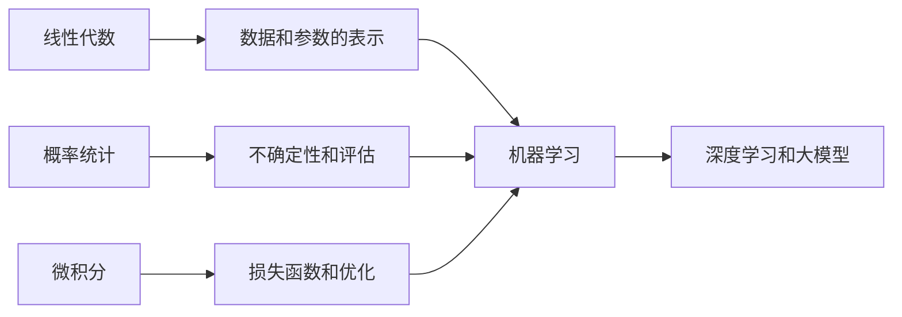

# 03 AI 数学最小必要基础

这一阶段解决的是“看见模型里的数学时不再害怕”。它不是要把你训练成数学专业学生，而是帮助你理解模型里最常出现的数学对象：向量、矩阵、概率、损失、梯度和优化。

## 阶段定位

| 信息 | 说明 |
|---|---|
| 适合对象 | 已完成 Python 和数据分析，希望进入机器学习但数学基础不稳的学习者 |
| 预估学时 | 40～60 小时 |
| 前置要求 | 完成数据分析与可视化，能使用 NumPy 做基础计算 |
| 阶段产出 | 用代码可视化向量、概率分布和梯度下降的最小实验 |

## 为什么这里叫“最小必要基础”

线性代数、概率论、微积分都可以单独学很久。但 AI 入门第一遍不应该追求完整数学体系，而应该先抓住最有用、最高频、最容易和模型连接的部分。

## 本阶段学习路径

第一章学习线性代数。你需要理解向量、矩阵、矩阵乘法、线性变换和特征值这些概念如何出现在数据矩阵、Embedding、神经网络参数和注意力计算中。

第二章学习概率与统计。你需要理解概率、分布、期望、方差、统计推断和信息熵，它们会出现在分类模型、损失函数、评估指标和生成模型里。

第三章学习微积分与优化。你需要理解导数、偏导、梯度、链式法则和梯度下降，因为它们解释了模型如何通过损失函数一点点更新参数。

## 学完后你应该能做到

- 能把表格数据理解成矩阵，把一行样本理解成向量
- 能解释为什么分类模型常输出概率
- 能理解损失函数、梯度下降和参数更新的大致过程
- 能用 NumPy 或简单代码演示向量运算、概率分布和梯度下降
- 后面看到机器学习和深度学习公式时，能判断它大概在表达什么

## 常见误区

不要因为数学细节没完全掌握就停在这里。AI 数学是循环学习的，第一次只要建立直觉，后面在机器学习、深度学习、Transformer 和 RAG 里会反复遇到这些概念。

也不要只看公式不写代码。对工程学习者来说，用数组、图像和小实验理解数学，通常比只看推导更有效。

## 阶段项目

本阶段建议做三个最小实验：用二维向量画相似度，用随机数据观察概率分布，用一元函数演示梯度下降如何逐步靠近最小值。

如果你想看更细的学习节奏，可以阅读 [学习指南：AI 数学基础怎么学最不容易放弃](./study-guide.md)。