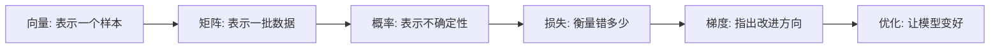
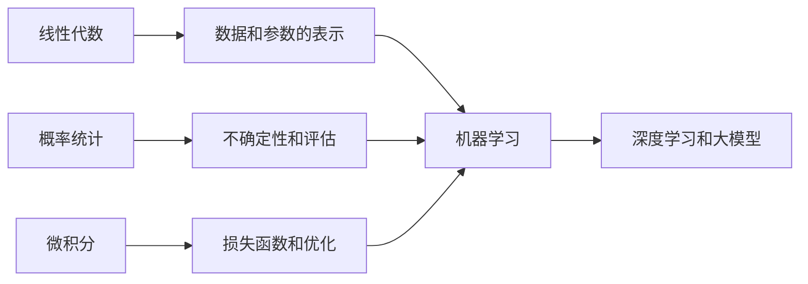

# 4 AI 数学最小必要基础

这一阶段解决的是“看见模型里的数学时不再害怕”。它不是要把你训练成数学专业学生，而是帮助你理解模型里最常出现的数学对象：向量、矩阵、概率、损失、梯度和优化。

## 故事化导入：给模型装上一副“数学眼镜”

很多初学者害怕 AI 数学，是因为公式看起来像一堵墙。这里换一种方式：把数学当成一副眼镜。向量让模型看见“方向和相似度”，矩阵让模型一次处理很多数据，概率让模型表达不确定性，梯度让模型知道应该往哪里改。你不需要先成为数学专家，只需要先看懂这些工具在模型里扮演什么角色。

## 学习闯关地图

## 互动练习：用代码把公式变成画面

学向量时，试着画出两个二维箭头，观察它们夹角越小相似度越高；学概率时，生成一组随机数并画出分布图；学梯度下降时，从一个随机点出发，看它如何一步步走向最低点。只要能把公式变成数组、曲线和动画感，你就已经跨过了最难的第一关。

## 项目彩蛋

本阶段的彩蛋不是一个大项目，而是一组“数学小实验”：向量相似度可视化、概率分布观察器、梯度下降演示器。后面学推荐系统、Embedding、神经网络和 Transformer 时，你会不断发现这些小实验原来都在真正的 AI 模型里出现过。

## 阶段定位

| 信息 | 说明 |
|---|---|
| 适合对象 | 已完成 Python 和数据分析，希望进入机器学习但数学基础不稳的学习者 |
| 预估学时 | 40～60 小时 |
| 前置要求 | 完成数据分析与可视化，能使用 NumPy 做基础计算 |
| 阶段产出 | 用代码可视化向量、概率分布和梯度下降的最小实验 |

## 新手最小通关路线

新手不要追求完整数学体系，先理解向量、矩阵、概率、损失、梯度这些概念在模型里分别解决什么问题。只要能用 NumPy 写出向量相似度、概率分布和梯度下降的小实验，就算完成最小通关。

## 进阶深入路线

有经验的学习者可以进一步理解矩阵乘法的几何意义、统计推断、信息熵、链式法则和反向传播。建议把每个公式都配一个代码实验或图像解释，为后面的机器学习和深度学习公式阅读做准备。

## 新人先做什么，进阶再做什么

新人第一次学这一阶段时，不要把数学学成公式背诵。先抓住向量表示“对象的位置”、概率表示“不确定性”、梯度表示“改进方向”这三个直觉，再回到模型里看它们怎么用。

有经验的学习者可以把重点放在模型解释上：为什么矩阵乘法能做特征变换，为什么概率能表达预测置信度，为什么梯度下降能训练模型。你的目标是读模型文章和调参时知道每个数学概念在解决什么问题。

## 为什么这里叫“最小必要基础”

线性代数、概率论、微积分都可以单独学很久。但 AI 入门第一遍不应该追求完整数学体系，而应该先抓住最有用、最高频、最容易和模型连接的部分。

## 本阶段学习路径

第一章学习线性代数。你需要理解向量、矩阵、矩阵乘法、线性变换和特征值这些概念如何出现在数据矩阵、Embedding、神经网络参数和注意力计算中。

第二章学习概率与统计。你需要理解概率、分布、期望、方差、统计推断和信息熵，它们会出现在分类模型、损失函数、评估指标和生成模型里。

第三章学习微积分与优化。你需要理解导数、偏导、梯度、链式法则和梯度下降，因为它们解释了模型如何通过损失函数一点点更新参数。

## 学完后你应该能做到

- 能把表格数据理解成矩阵，把一行样本理解成向量
- 能解释为什么分类模型常输出概率
- 能理解损失函数、梯度下降和参数更新的大致过程
- 能用 NumPy 或简单代码演示向量运算、概率分布和梯度下降
- 后面看到机器学习和深度学习公式时，能判断它大概在表达什么

## 常见误区

不要因为数学细节没完全掌握就停在这里。AI 数学是循环学习的，第一次只要建立直觉，后面在机器学习、深度学习、Transformer 和 RAG 里会反复遇到这些概念。

也不要只看公式不写代码。对工程学习者来说，用数组、图像和小实验理解数学，通常比只看推导更有效。

## 数学错误剧场：公式看懂了但不会用怎么办

如果公式一看就晕，先把它翻译成一句模型语言：它在表示对象、衡量不确定性，还是告诉模型往哪里改；如果推导跟不上，先用二维图、表格或小数字例子跑一遍；如果觉得数学和代码断开，回到模型输入、损失函数和参数更新里找它的位置。

## 阶段项目

基础版是完成三个最小实验：二维向量相似度、随机数据分布观察、一元函数梯度下降。标准版需要把实验画成图，并用文字解释每个数学概念对应模型里的什么动作。挑战版可以做一个交互式数学 Notebook，让学习者修改参数后观察向量角度、分布形状和优化路径如何变化。

如果你想看更细的学习节奏，可以阅读 [学习指南：AI 数学基础怎么学最不容易放弃](./study-guide.md)。