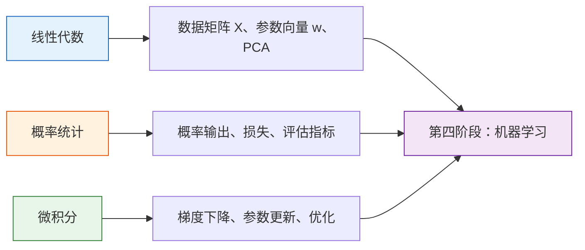

# 第三阶段：AI 数学基础

| 信息 | 说明 |
|---|---|
| **预估学时** | 40～60h |
| **前置要求** | 完成第二阶段 |

用代码和可视化掌握 AI 必备数学。

:::warning 融合学习
建议与第四阶段交叉学习！
:::

## 阶段导读

这一阶段不是为了把你训练成数学专业学生，而是帮助你看懂后面模型里的数学到底在做什么。

更适合新人的目标是：

1. 看到矩阵时不害怕
2. 知道概率、导数为什么会出现在模型里
3. 能把数学对象和代码里的数组、损失、梯度连起来

如果你想先看一版更具体的阅读顺序、建议时长和卡住时的处理方式，可以直接看：

- [学习指南：AI 数学基础怎么学最不容易放弃](./study-guide.md)

## 先说一个很重要的学习预期

线性代数、概率论、微积分，本来都是可以单独学很久的学科。  
所以这一阶段**不是要把整门数学学完**，而是要做一件更现实、也更适合 AI 新人的事：

> **先把最常出现、最有用、最容易和模型连起来的那部分数学学会第一遍。**

也就是说：

- 你不会因为看完这几篇就“学完了线性代数”
- 但你应该开始能看懂它们为什么会出现在 AI 里
- 后面每次再遇到这些概念时，会越来越熟，而不是每次都像第一次见

如果把这个阶段理解成：

- “给 AI 学习路线打地基的第一遍数学”

你会更不容易焦虑，也更容易坚持下去。

## 本阶段包含什么

| 章节 | 主题 | 主要解决什么问题 |
|---|---|---|
| 第一章 | 线性代数 | 向量、矩阵、线性变换在模型里怎么出现 |
| 第二章 | 概率统计 | 概率、分布、期望和统计思维怎么支撑建模 |
| 第三章 | 微积分 | 导数、梯度和优化为什么能让模型学起来 |

## 建议学习顺序

最稳的方式通常是：

1. 先看线性代数  
   因为后面神经网络、embedding、注意力都会反复用到。

2. 再看概率统计  
   因为分类、损失函数、评估会频繁用到概率视角。

3. 最后看微积分  
   把梯度下降、反向传播和优化主线接起来。

## 更像真实学习的建议时长

这一阶段最不适合的节奏是：

- 一天刷完整章
- 看完代码就算过

更稳的做法通常是给自己留出“看懂 -> 停一下 -> 再看一遍”的时间。  
一个比较适合新人的参考节奏是：

| 章节 | 建议时间 | 目标 |
|---|---|---|
| 线性代数 | 10~18 小时 | 不再怕向量、矩阵、PCA 这些对象 |
| 概率统计 | 10~18 小时 | 能接受模型输出概率、知道条件更新和交叉熵在说什么 |
| 微积分与优化 | 10~18 小时 | 看懂“模型为什么能一点点学起来” |

如果你感觉比这个更慢，也完全正常。  
这本来就不是速读型内容。

## 这一阶段应该怎么学才不容易崩

- 先看直觉和图像，不要一开始硬啃推导
- 每学一个概念，都对应回 `NumPy` 或模型代码
- 和第四阶段交叉学，边看模型边回头补数学

## 更适合新人的三步学习法

这一阶段最怕的一种学法是：

- 公式看一遍
- 代码跑一遍
- 然后以为“懂了”

更稳的方式通常是下面这个三步循环：

1. 先用类比和图像理解  
   先问“这个概念在现实世界像什么”。

2. 再用代码验证  
   先看它在 `NumPy` 里到底怎么长、怎么动。

3. 最后再回到公式  
   这时公式就不再只是符号，而会更像在描述一个你已经见过的过程。

## 如果你想把第三阶段读得更顺，推荐这样走

可以按下面这种“小步循环”的方式读：

1. 先读导读页  
   先知道这章到底在解决什么问题。

2. 只读第一篇主干页  
   例如向量、概率基础、导数。

3. 停下来，把这页里的类比和代码自己复述一遍  
   不要求全背，但要能说清“它在干什么”。

4. 再进入下一篇  
   用“上一节到底留下了什么问题”带着往前走。

这样学会比“直接连续刷完所有页”更不容易发虚。

## 学完第三阶段后，怎么最顺地接到第四阶段

最值得先建立的不是“我学了多少公式”，而是下面这张桥接图：

也就是说，第三阶段学的三条线在第四阶段里会自然变成：

- `X @ w + b` 这种模型表达
- `MSE / 概率 / 指标` 这种好坏定义
- `梯度下降` 这种参数更新方式

如果你想把这条桥接关系看得更具体，可以在进入第四阶段前先读：
[1.2 数学如何真正流到机器学习](../stage4/ch01-ml-basics/03-math-to-ml-bridge.md)

## 学这一阶段最容易卡住的地方

- 把公式当成需要死记的对象
- 数学和代码完全分开学
- 一开始就追求复杂推导，结果越学越虚

## 这一阶段最值得养成的 3 个习惯

1. 每学一个概念，都问它在 AI 里出现在哪里
2. 每看一段代码，都问它对应了哪条数学直觉
3. 每遇到公式，不急着硬背，先拆成“对象 + 关系 + 作用”三件事

## 学完后的出口能力

- 能看懂机器学习和深度学习里最常见的数学对象
- 知道矩阵、概率、梯度分别在模型里承担什么角色
- 能更顺地进入第四、第五阶段，不会被数学名词卡死

## 第三阶段结束时，你最好已经不再怕什么

到这一阶段结束时，一个比较扎实的新手，最好已经不再害怕下面这些东西：

- 看到矩阵就觉得像天书
- 看到概率和损失就觉得和模型没关系
- 看到梯度就觉得只能死记硬背

因为真正的目标不是“数学做题”，而是让你在第四阶段看到这些对象时，知道它们为什么会出现。

## 如果你读到某一节还是发虚，怎么判断是正常的？

很正常。尤其是：

- 第一次看特征值
- 第一次看贝叶斯
- 第一次看梯度和链式法则

这些地方本来就不是“一遍就特别稳”的内容。  
更实际的标准是：

- 你能不能说出它在干什么
- 你能不能看懂最小代码
- 你能不能把它和后面的模型连起来

如果这三件事开始成立，就说明你已经在真正进步了。

## 一句话版的第三阶段主线

如果要把第三阶段压成一句最核心的话，我会这样说：

> **线性代数在教你“数据怎样表示”，概率统计在教你“怎样面对不确定”，微积分在教你“模型怎样学起来”。**

只要这三句话开始立住，第三阶段就已经没有白学。
