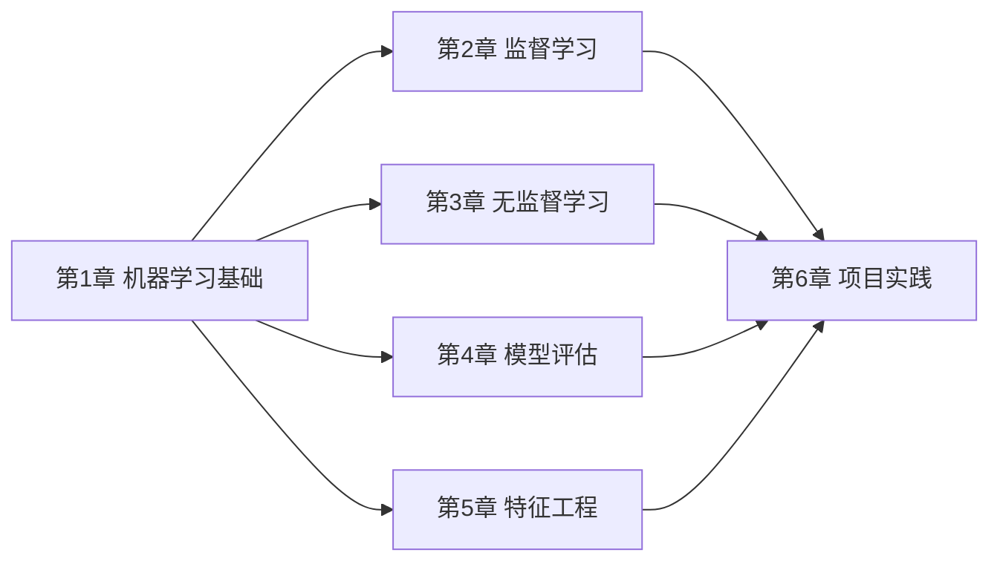

# 学前导读：机器学习基础这一章到底在学什么

这一章不是在教你某一个具体算法，而是在帮你先建立“机器学习项目的地图感”。

## 这一章要解决什么问题

- 机器学习和传统编程到底差在哪里
- 常见任务类型怎么分
- 一次完整建模流程长什么样
- `scikit-learn` 为什么会成为这一阶段的主工具

## 这一章和后面五章的关系

如果这一章没学稳，后面会出现一个常见问题：每个算法都看过，但不知道为什么用它、什么时候用它、怎么评估它。

## 新人这一章最该带走什么

- 知道分类、回归、聚类分别是什么问题
- 知道训练集、验证集、测试集为什么要分开
- 知道 baseline 为什么重要
- 知道 `fit / predict / score` 这条最基本的 sklearn 工作流
