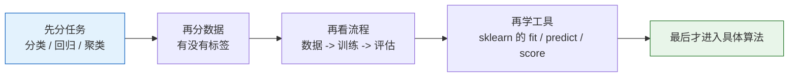
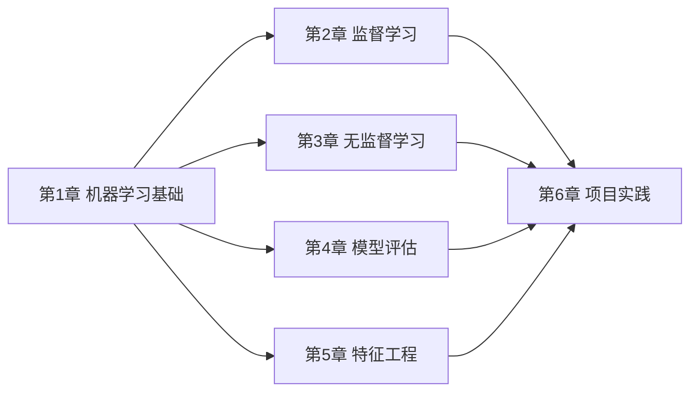

# 学前导读：机器学习基础这一章到底在学什么

这一章不是在教你某一个具体算法，而是在帮你先建立“机器学习项目的地图感”。

## 先建立一张地图

很多新人进入机器学习阶段时，最容易出现一种状态：

- 每个概念都见过一点
- 每个算法名字都听过
- 但真让自己说“这阶段到底在学什么”，会一下子说散掉

所以这一章最重要的任务不是“记住更多术语”，而是先把下面这张图装进脑子里：

如果这张图立住了，后面第四阶段就不容易学成“算法名单背诵”。

## 这一章要解决什么问题

- 机器学习和传统编程到底差在哪里
- 常见任务类型怎么分
- 一次完整建模流程长什么样
- `scikit-learn` 为什么会成为这一阶段的主工具

## 如果你是刚从第三阶段数学过来的，建议先这样看

更稳的顺序通常是：

1. 先看 [1.3 什么是机器学习](./01-what-is-ml.md)  
   先把任务类型和训练流程的地图立起来。

2. 再看 [1.4 Scikit-learn 框架入门](./02-sklearn-intro.md)  
   先把这些理解放进统一工具流里，知道后面代码到底在干什么。

3. 最后看 [1.2 数学如何真正流到机器学习](./03-math-to-ml-bridge.md)  
   把第三阶段的线性代数、概率统计、微积分真正接到模型里。

这个顺序会比“直接进算法”更顺，因为你先知道：

- `sklearn` 是在把这些动作怎样组织起来
- 数学在模型里又分别负责什么

## 这一章和后面五章的关系

如果这一章没学稳，后面会出现一个常见问题：每个算法都看过，但不知道为什么用它、什么时候用它、怎么评估它。

## 这一章更适合新人的学习顺序

建议按下面顺序看：

1. 先看“什么是机器学习”  
   先把监督学习、无监督学习、训练集/测试集这些最基础的坐标轴立起来。

2. 再看 `Scikit-learn` 入门  
   先把 `fit / predict / score` 这条最短工作流看懂。

3. 看完后自己用一句话复述  
   比如：
   “机器学习是在带标签或不带标签的数据上学规律，`sklearn` 是把训练、预测和评估统一起来的工具。”

如果你能自己复述出这句话，这一章就算真正进脑子了。

## 这一章最容易学歪的地方

- 一上来就想学最强模型，不先分清任务类型
- 以为机器学习就是“换个库调用”
- 还没理解训练和测试为什么要分开，就急着追求高分
- 只盯着代码能不能跑，不去问每一步在做什么

## 新人这一章最该带走什么

- 知道分类、回归、聚类分别是什么问题
- 知道训练集、验证集、测试集为什么要分开
- 知道 baseline 为什么重要
- 知道 `fit / predict / score` 这条最基本的 sklearn 工作流

## 学完这一章后，你应该能自己回答什么

到这一章结束时，你最好已经能自己回答这些问题：

- 一个任务为什么是分类，不是回归
- 为什么不能拿训练集分数当最终结果
- `fit`、`predict`、`score` 各自在做什么
- 为什么第四阶段后面要先学监督学习，再补评估和特征工程
