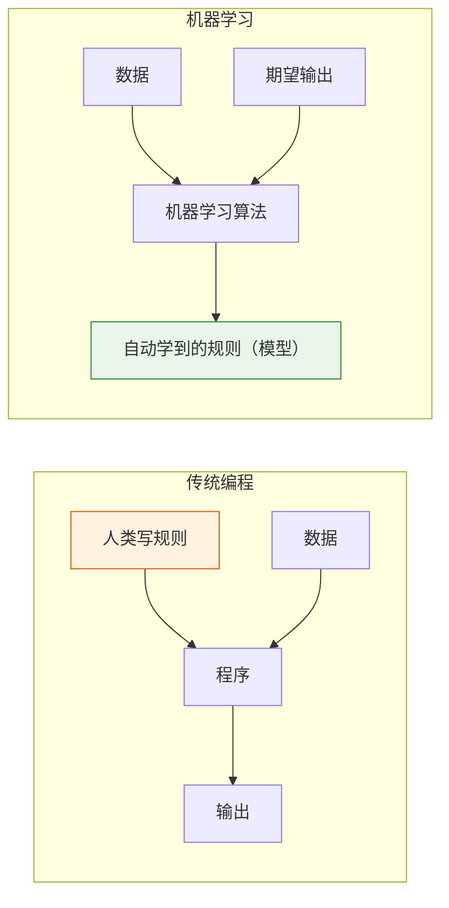
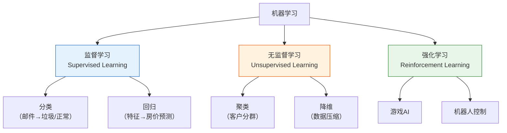
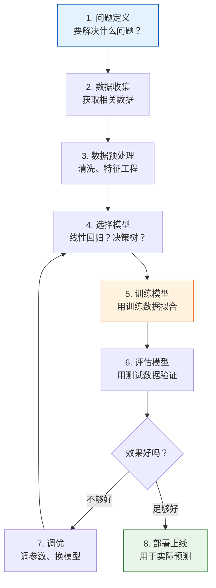
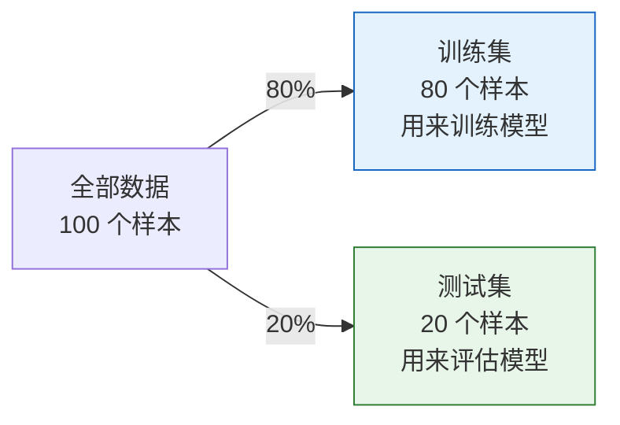
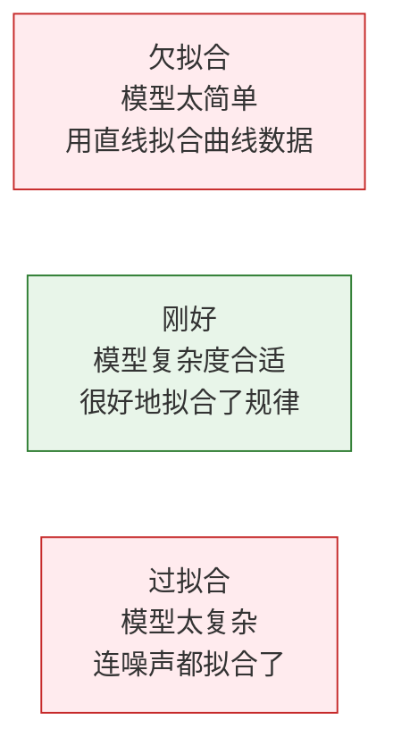

# 什么是机器学习

:::tip 欢迎来到机器学习阶段
前三个阶段你学了 Python、数据分析和数学基础。现在，你终于要开始让计算机**自己"学"东西**了。这是整个 AI 旅程中最激动人心的阶段之一。
:::

## 学习目标

- 理解什么是机器学习以及它与传统编程的区别
- 掌握机器学习的三大分类（监督学习、无监督学习、强化学习）
- 理解机器学习的完整工作流程
- 建立正确的 ML 思维框架

---

## 一、机器学习到底是什么？

### 1.1 一句话定义

**机器学习 = 让计算机从数据中自动发现规律，而不是由人类手写规则。**

### 1.2 传统编程 vs 机器学习



| | 传统编程 | 机器学习 |
|---|---------|---------|
| 输入 | 规则 + 数据 | 数据 + 期望输出 |
| 输出 | 结果 | 规则（模型） |
| 适用场景 | 规则明确（如计算税额） | 规则难以描述（如识别猫） |
| 编写方式 | 人工编写 if-else 逻辑 | 算法自动从数据中学习 |

### 1.3 为什么需要机器学习？

有些任务，人类**说不清规则**：

```python
# 传统编程：判断邮件是否是垃圾邮件
def is_spam_traditional(email):
    if "免费" in email:
        return True
    if "中奖" in email:
        return True
    if "点击领取" in email:
        return True
    # ... 还有多少规则？永远写不完！
    return False

# 机器学习：给模型 10 万封已标注的邮件，让它自己学
# model.fit(emails, labels)
# model.predict(new_email)  → 自动判断
```

机器学习适用的场景：
- 规则复杂或未知（图像识别、语音识别）
- 规则会变化（推荐系统、欺诈检测）
- 数据量大到人类无法手动分析
- 需要个性化的结果

---

## 二、机器学习的三大分类



### 2.1 监督学习——有"标准答案"

**核心**：给模型大量"输入-输出"配对数据，让它学习映射关系。

| 类型 | 输出 | 例子 |
|------|------|------|
| **分类** | 离散类别 | 邮件→垃圾/正常，图片→猫/狗 |
| **回归** | 连续数值 | 面积→房价，特征→温度 |

```python
# 监督学习的数据格式
# X（特征/输入）       y（标签/输出）
# [面积, 房间数, 楼层]   → 房价
# [120,  3,    15]      → 350万
# [80,   2,    8]       → 220万
# [200,  4,    20]      → 580万
```

**关键**：训练数据必须有**标签**（标准答案）。模型的目标是学会从 X 预测 y。

### 2.2 无监督学习——没有"标准答案"

**核心**：只有输入数据，没有标签。让模型自己发现数据中的结构和模式。

| 类型 | 做什么 | 例子 |
|------|--------|------|
| **聚类** | 把相似的数据分组 | 客户分群、新闻归类 |
| **降维** | 减少特征数量 | PCA（第三阶段学过） |
| **异常检测** | 找出不正常的数据 | 信用卡欺诈检测 |

```python
# 无监督学习的数据：没有标签
# X（特征）
# [消费金额, 消费频次, 最近消费]
# [500,      10,      3天前]
# [50,       2,       30天前]
# [1000,     20,      1天前]
# → 模型自动分成 "高价值客户"、"低频客户" 等群组
```

### 2.3 强化学习——通过"试错"学习

**核心**：智能体（Agent）在环境中采取行动，根据奖励/惩罚调整策略。

| 要素 | 说明 |
|------|------|
| 智能体 | 做决策的 AI |
| 环境 | 智能体所在的世界 |
| 状态 | 当前环境的信息 |
| 行动 | 智能体能做的选择 |
| 奖励 | 行动后得到的反馈 |

```python
# 强化学习的直觉：训练小狗
# 状态：小狗看到的环境
# 行动：坐下 / 站起 / 握手
# 奖励：做对了 → 给零食（+1），做错了 → 不给（0）
# 经过多次试错，小狗学会了正确的行为
```

:::info 本课程的重点
本阶段主要学习**监督学习**和**无监督学习**。强化学习会在第九阶段（AI Agent）中涉及。
:::

### 2.4 三种学习方式对比

| | 监督学习 | 无监督学习 | 强化学习 |
|---|---------|----------|---------|
| 数据有标签？ | 有 | 没有 | 有奖励信号 |
| 目标 | 预测标签 | 发现结构 | 最大化奖励 |
| 典型算法 | 线性回归、决策树 | K-Means、PCA | Q-Learning、PPO |
| AI 应用 | 图像分类、翻译 | 客户分群、推荐 | 游戏 AI、机器人 |

---

## 三、机器学习的工作流程

### 3.1 完整流程



### 3.2 训练集 vs 测试集

这是 ML 中最重要的概念之一：**不能用训练数据来评估模型。**

```python
import numpy as np

# 模拟数据集
np.random.seed(42)
n = 100
X = np.random.randn(n, 3)
y = np.random.randint(0, 2, n)

# 通常 80% 训练，20% 测试
from sklearn.model_selection import train_test_split

X_train, X_test, y_train, y_test = train_test_split(
    X, y, test_size=0.2, random_state=42
)

print(f"训练集: {X_train.shape[0]} 个样本")
print(f"测试集: {X_test.shape[0]} 个样本")
```



:::warning 为什么要分开？
如果你用同一份数据训练和评估，模型可以通过"记住"数据来获得满分——但面对新数据时表现很差。这叫**过拟合**（overfit）。就像考试前把答案背下来，换一套题就不会了。
:::

### 3.3 一个最小的完整例子

```python
from sklearn.datasets import load_iris
from sklearn.model_selection import train_test_split
from sklearn.tree import DecisionTreeClassifier
from sklearn.metrics import accuracy_score

# 1. 加载数据
iris = load_iris()
X, y = iris.data, iris.target
print(f"数据集: {X.shape[0]} 个样本, {X.shape[1]} 个特征, {len(set(y))} 个类别")

# 2. 划分训练集和测试集
X_train, X_test, y_train, y_test = train_test_split(X, y, test_size=0.2, random_state=42)

# 3. 选择模型并训练
model = DecisionTreeClassifier(random_state=42)
model.fit(X_train, y_train)  # 训练！

# 4. 预测和评估
y_pred = model.predict(X_test)
accuracy = accuracy_score(y_test, y_pred)
print(f"测试集准确率: {accuracy:.1%}")
```

**只用几行代码就完成了一个完整的 ML 项目！** 接下来的章节会逐步深入每个环节。

---

## 四、关键术语速查

| 术语 | 英文 | 含义 |
|------|------|------|
| 样本 | Sample | 一条数据 |
| 特征 | Feature | 描述样本的属性（输入的每一列） |
| 标签 | Label / Target | 样本的"答案"（要预测的值） |
| 训练集 | Training Set | 用来训练模型的数据 |
| 测试集 | Test Set | 用来评估模型的数据 |
| 过拟合 | Overfitting | 模型"死记硬背"训练数据，泛化能力差 |
| 欠拟合 | Underfitting | 模型太简单，连训练数据都学不好 |
| 泛化 | Generalization | 模型在新数据上表现好的能力 |
| 超参数 | Hyperparameter | 需要人为设定的参数（如学习率、树深度） |

### 过拟合 vs 欠拟合



```python
import matplotlib.pyplot as plt

np.random.seed(42)
x = np.linspace(0, 1, 20)
y = np.sin(2 * np.pi * x) + np.random.randn(20) * 0.3

fig, axes = plt.subplots(1, 3, figsize=(15, 4))
x_smooth = np.linspace(0, 1, 200)

# 欠拟合：1 次多项式（直线）
coeffs = np.polyfit(x, y, 1)
axes[0].scatter(x, y, color='steelblue', s=40)
axes[0].plot(x_smooth, np.polyval(coeffs, x_smooth), 'r-', linewidth=2)
axes[0].set_title('欠拟合（直线）\n太简单，无法捕捉规律')

# 刚好：3 次多项式
coeffs = np.polyfit(x, y, 3)
axes[1].scatter(x, y, color='steelblue', s=40)
axes[1].plot(x_smooth, np.polyval(coeffs, x_smooth), 'r-', linewidth=2)
axes[1].set_title('刚好（3 次多项式）\n较好地拟合了规律')

# 过拟合：18 次多项式
coeffs = np.polyfit(x, y, 18)
axes[2].scatter(x, y, color='steelblue', s=40)
y_overfit = np.polyval(coeffs, x_smooth)
y_overfit = np.clip(y_overfit, -3, 3)
axes[2].plot(x_smooth, y_overfit, 'r-', linewidth=2)
axes[2].set_title('过拟合（18 次多项式）\n连噪声都拟合了')
axes[2].set_ylim(-3, 3)

for ax in axes:
    ax.grid(True, alpha=0.3)

plt.tight_layout()
plt.show()
```

---

## 五、小结

| 要点 | 说明 |
|------|------|
| 机器学习 | 让计算机从数据中学习规律 |
| 监督学习 | 有标签，学预测（分类/回归） |
| 无监督学习 | 无标签，发现结构（聚类/降维） |
| 强化学习 | 通过试错学策略（奖励驱动） |
| 核心流程 | 数据 → 预处理 → 训练 → 评估 → 部署 |
| 训练/测试分割 | 必须分开，防止过拟合 |

:::info 连接后续
- **下一节**：Scikit-learn 框架入门——ML 实战的标准工具
- **第 2 章**：学习具体的算法（线性回归、逻辑回归、决策树等）
- **第 4 章**：深入模型评估——如何科学判断模型好不好
:::

---

## 动手练习

### 练习 1：分类 vs 回归

判断以下任务属于分类还是回归：
1. 预测明天的气温
2. 判断一张照片中是否有人脸
3. 预测一只股票明天的收盘价
4. 将新闻分为体育/科技/娱乐/财经
5. 预测一个用户会不会流失

### 练习 2：第一个 ML 模型

用 scikit-learn 的 `load_wine()` 数据集，训练一个决策树分类器，输出测试集的准确率。

```python
from sklearn.datasets import load_wine
# 你的代码...
```

### 练习 3：观察过拟合

修改 4.3 节的过拟合示例，用不同次数的多项式（1, 3, 5, 10, 18）拟合数据，画出 5 张子图，观察复杂度对拟合效果的影响。
