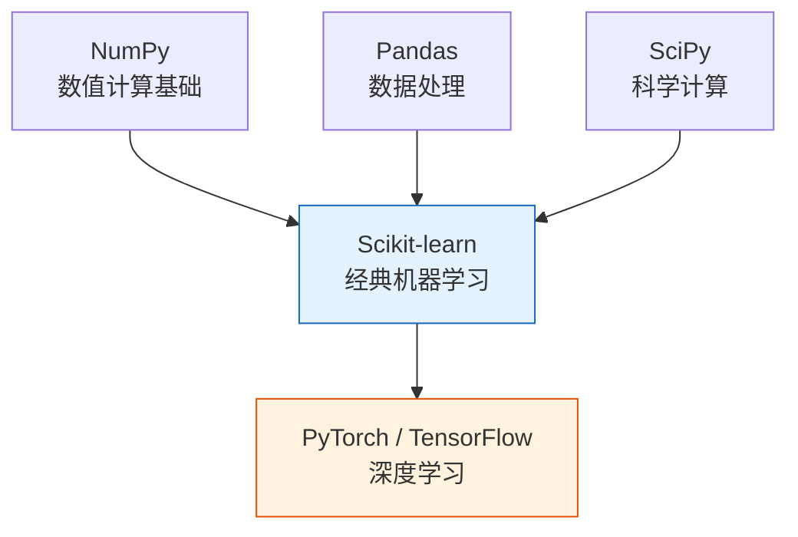
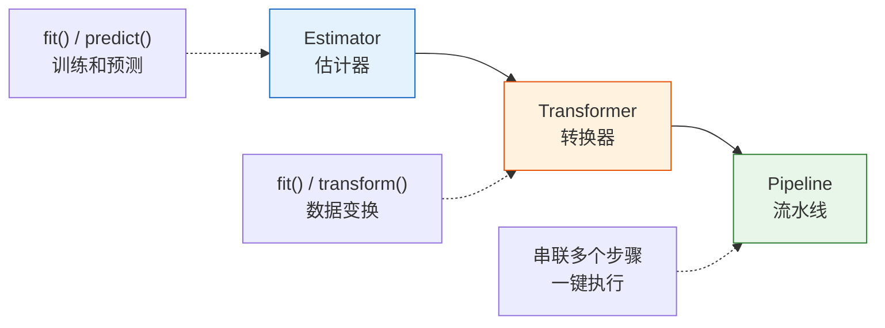
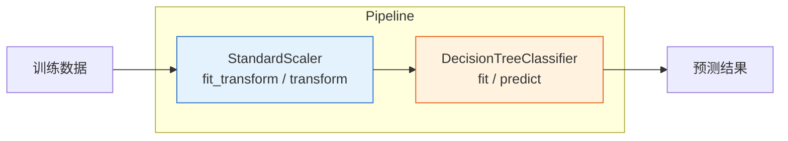

# Scikit-learn 框架入门

:::tip 本节定位
Scikit-learn 是 Python 机器学习的**事实标准库**。几乎所有经典 ML 任务都可以用它来完成。掌握 sklearn 的 API 模式，后续学任何算法都会非常顺畅。
:::

## 学习目标

- 理解 Scikit-learn 的设计哲学与统一 API
- 掌握 Estimator、Transformer、Pipeline 三大核心概念
- 学会加载和生成数据集
- 完成从训练到预测的完整流程
- 学会保存和加载模型

---

## 一、为什么是 Scikit-learn？

### 1.1 sklearn 在 ML 生态中的位置



| 特点 | 说明 |
|------|------|
| **统一的 API** | 所有算法用同样的 `fit` / `predict` / `transform` |
| **丰富的算法** | 分类、回归、聚类、降维、预处理一应俱全 |
| **优秀的文档** | 每个算法都有详细文档和示例 |
| **活跃的社区** | 全球最流行的 ML 库之一 |
| **生产就绪** | 可直接用于真实项目 |

### 1.2 安装

```bash
pip install scikit-learn
```

```python
import sklearn
print(sklearn.__version__)
```

---

## 二、Scikit-learn 的设计哲学

### 2.1 统一 API——一招鲜吃遍天

Scikit-learn 最厉害的地方是：**所有算法都遵循同一套 API 模式**。不管是线性回归、决策树还是 SVM，使用方法都一样。

```python
# 无论什么算法，代码结构都一样：
from sklearn.xxx import SomeModel

model = SomeModel(超参数)      # 创建模型
model.fit(X_train, y_train)   # 训练
y_pred = model.predict(X_test) # 预测
score = model.score(X_test, y_test)  # 评估
```

看几个具体例子——注意代码结构的一致性：

```python
from sklearn.tree import DecisionTreeClassifier
from sklearn.linear_model import LogisticRegression
from sklearn.svm import SVC
from sklearn.neighbors import KNeighborsClassifier

# 方法完全一样！只是换个模型名
models = {
    "决策树": DecisionTreeClassifier(),
    "逻辑回归": LogisticRegression(),
    "SVM": SVC(),
    "KNN": KNeighborsClassifier(),
}

for name, model in models.items():
    model.fit(X_train, y_train)
    score = model.score(X_test, y_test)
    print(f"{name}: {score:.1%}")
```

:::info 统一 API 的好处
你只需要学一次 `fit` / `predict` / `score`，就能使用 sklearn 中的所有算法。换模型就像换零件一样简单。
:::

### 2.2 三大核心角色



| 角色 | 核心方法 | 做什么 | 例子 |
|------|---------|--------|------|
| **Estimator** | `fit()`, `predict()` | 从数据中学习，然后做预测 | 决策树、线性回归、SVM |
| **Transformer** | `fit()`, `transform()` | 从数据中学参数，然后变换数据 | 标准化、PCA、独热编码 |
| **Pipeline** | 串联以上两者 | 把多个步骤串成流水线 | 标准化 → PCA → 分类器 |

---

## 三、Estimator——学习与预测

### 3.1 核心方法

```python
# Estimator 是所有"能学习"的对象的基类
# 所有 Estimator 必须实现：
#   fit(X, y)       — 从数据中学习
#   predict(X)      — 对新数据做预测
#   score(X, y)     — 评估预测质量

from sklearn.tree import DecisionTreeClassifier

# 创建 Estimator（可以传超参数）
model = DecisionTreeClassifier(max_depth=3, random_state=42)

# 查看超参数
print(model.get_params())
```

### 3.2 完整示例

```python
from sklearn.datasets import load_iris
from sklearn.model_selection import train_test_split
from sklearn.tree import DecisionTreeClassifier
import numpy as np

# 加载数据
iris = load_iris()
X, y = iris.data, iris.target
feature_names = iris.feature_names
target_names = iris.target_names

print(f"特征名: {feature_names}")
print(f"类别名: {target_names}")
print(f"数据形状: X={X.shape}, y={y.shape}")

# 划分数据
X_train, X_test, y_train, y_test = train_test_split(
    X, y, test_size=0.2, random_state=42
)

# 创建并训练模型
model = DecisionTreeClassifier(max_depth=3, random_state=42)
model.fit(X_train, y_train)

# 预测
y_pred = model.predict(X_test)
print(f"\n前 10 个预测: {y_pred[:10]}")
print(f"前 10 个真实: {y_test[:10]}")

# 评估
score = model.score(X_test, y_test)
print(f"\n准确率: {score:.1%}")

# 查看学到的属性（下划线结尾 = 训练后才有）
print(f"\n特征重要性: {model.feature_importances_}")
```

:::note fit 之后的属性
在 sklearn 中，以下划线 `_` 结尾的属性（如 `feature_importances_`）是**训练后才有的**。调用 `fit()` 之前访问会报错。这是 sklearn 的命名约定。
:::

### 3.3 预测概率

对于分类问题，很多模型还支持 `predict_proba()`：

```python
from sklearn.linear_model import LogisticRegression

model = LogisticRegression(max_iter=200, random_state=42)
model.fit(X_train, y_train)

# predict 返回类别
print("预测类别:", model.predict(X_test[:3]))

# predict_proba 返回每个类别的概率
proba = model.predict_proba(X_test[:3])
print("预测概率:")
for i, p in enumerate(proba):
    print(f"  样本 {i}: {dict(zip(target_names, np.round(p, 3)))}")
```

---

## 四、Transformer——数据变换

### 4.1 为什么需要数据变换？

很多 ML 算法对数据的**尺度敏感**。比如一个特征的范围是 [0, 1]，另一个是 [0, 1000000]，后者会"压制"前者。

```python
import numpy as np

# 问题演示：特征尺度差异巨大
salary = np.array([50000, 80000, 120000])   # 万元级
age = np.array([25, 35, 45])                 # 十位级

print(f"薪资均值: {salary.mean():.0f}, 标准差: {salary.std():.0f}")
print(f"年龄均值: {age.mean():.0f}, 标准差: {age.std():.0f}")
# 薪资的数值远大于年龄 → 如果直接用，模型可能被薪资主导
```

### 4.2 StandardScaler 标准化

```python
from sklearn.preprocessing import StandardScaler
import numpy as np

# 创建示例数据
X = np.array([
    [50000, 25],
    [80000, 35],
    [120000, 45],
    [60000, 28],
    [90000, 40],
])

# 创建 Transformer
scaler = StandardScaler()

# fit: 学习均值和标准差
scaler.fit(X)
print(f"学到的均值: {scaler.mean_}")
print(f"学到的标准差: {scaler.scale_}")

# transform: 用学到的参数变换数据
X_scaled = scaler.transform(X)
print(f"\n标准化前:\n{X}")
print(f"\n标准化后:\n{np.round(X_scaled, 2)}")
print(f"\n标准化后均值: {X_scaled.mean(axis=0).round(2)}")    # 接近 0
print(f"标准化后标准差: {X_scaled.std(axis=0).round(2)}")     # 接近 1
```

### 4.3 fit_transform 快捷方法

```python
# fit + transform 合一步（训练集常用）
X_scaled = scaler.fit_transform(X)

# 注意：测试集只能用 transform（不能 fit，要用训练集的参数）
# X_test_scaled = scaler.transform(X_test)  ← 用训练集学到的参数变换测试集
```

:::warning 关键区别
- **训练集**：用 `fit_transform()` — 学习参数并变换
- **测试集**：只用 `transform()` — 用训练集的参数变换
- **错误做法**：对测试集也用 `fit_transform()` → 数据泄漏！
:::

### 4.4 常用 Transformer

| Transformer | 做什么 | 公式/说明 |
|------------|--------|----------|
| `StandardScaler` | 标准化 | `(x - 均值) / 标准差` → 均值0, 标准差1 |
| `MinMaxScaler` | 归一化 | `(x - min) / (max - min)` → 缩放到 [0, 1] |
| `LabelEncoder` | 标签编码 | 把类别变成数字（猫→0, 狗→1） |
| `OneHotEncoder` | 独热编码 | 猫→[1,0], 狗→[0,1] |
| `PCA` | 降维 | 减少特征数量（第三阶段学过） |

```python
from sklearn.preprocessing import MinMaxScaler

# MinMaxScaler 归一化到 [0, 1]
mm_scaler = MinMaxScaler()
X_minmax = mm_scaler.fit_transform(X)
print("MinMaxScaler 归一化:")
print(np.round(X_minmax, 2))
print(f"最小值: {X_minmax.min(axis=0)}")  # [0, 0]
print(f"最大值: {X_minmax.max(axis=0)}")  # [1, 1]
```

---

## 五、数据集——加载与生成

### 5.1 内置真实数据集

sklearn 自带多个经典数据集，非常适合学习和实验：

```python
from sklearn import datasets

# ===== 小规模数据集（直接加载到内存） =====
iris = datasets.load_iris()         # 鸢尾花分类（150 样本，4 特征，3 类别）
wine = datasets.load_wine()         # 葡萄酒分类（178 样本，13 特征，3 类别）
digits = datasets.load_digits()     # 手写数字（1797 样本，64 特征，10 类别）
boston = datasets.load_diabetes()    # 糖尿病回归（442 样本，10 特征）

# 查看数据集结构
print("Iris 数据集:")
print(f"  特征矩阵形状: {iris.data.shape}")
print(f"  标签形状: {iris.target.shape}")
print(f"  特征名: {iris.feature_names}")
print(f"  类别名: {iris.target_names}")
print(f"  描述: {iris.DESCR[:200]}...")
```

### 5.2 生成模拟数据

有时需要"定制化"数据来理解算法行为：

```python
from sklearn.datasets import make_classification, make_regression, make_blobs
import matplotlib.pyplot as plt

fig, axes = plt.subplots(1, 3, figsize=(15, 4))

# 1. 生成分类数据
X, y = make_classification(
    n_samples=200, n_features=2, n_informative=2,
    n_redundant=0, n_clusters_per_class=1, random_state=42
)
axes[0].scatter(X[:, 0], X[:, 1], c=y, cmap='coolwarm', s=20, alpha=0.7)
axes[0].set_title('make_classification\n（分类数据）')

# 2. 生成回归数据
X_reg, y_reg = make_regression(
    n_samples=200, n_features=1, noise=20, random_state=42
)
axes[1].scatter(X_reg, y_reg, s=20, alpha=0.7, color='steelblue')
axes[1].set_title('make_regression\n（回归数据）')

# 3. 生成聚类数据
X_blob, y_blob = make_blobs(
    n_samples=200, centers=4, cluster_std=0.8, random_state=42
)
axes[2].scatter(X_blob[:, 0], X_blob[:, 1], c=y_blob, cmap='viridis', s=20, alpha=0.7)
axes[2].set_title('make_blobs\n（聚类数据）')

for ax in axes:
    ax.grid(True, alpha=0.3)

plt.tight_layout()
plt.show()
```

### 5.3 常用数据生成函数

| 函数 | 用途 | 关键参数 |
|------|------|---------|
| `make_classification` | 分类数据 | `n_samples`, `n_features`, `n_classes` |
| `make_regression` | 回归数据 | `n_samples`, `n_features`, `noise` |
| `make_blobs` | 聚类数据 | `n_samples`, `centers`, `cluster_std` |
| `make_moons` | 半月形数据 | `n_samples`, `noise` |
| `make_circles` | 同心圆数据 | `n_samples`, `noise` |

```python
from sklearn.datasets import make_moons, make_circles

fig, axes = plt.subplots(1, 2, figsize=(10, 4))

X_m, y_m = make_moons(n_samples=300, noise=0.15, random_state=42)
axes[0].scatter(X_m[:, 0], X_m[:, 1], c=y_m, cmap='coolwarm', s=20)
axes[0].set_title('make_moons（半月形）')

X_c, y_c = make_circles(n_samples=300, noise=0.08, factor=0.5, random_state=42)
axes[1].scatter(X_c[:, 0], X_c[:, 1], c=y_c, cmap='coolwarm', s=20)
axes[1].set_title('make_circles（同心圆）')

for ax in axes:
    ax.grid(True, alpha=0.3)
    ax.set_aspect('equal')

plt.tight_layout()
plt.show()
```

---

## 六、Pipeline——把一切串起来

### 6.1 为什么需要 Pipeline？

在真实项目中，数据处理和模型训练往往是多个步骤：

```python
# 没有 Pipeline 的写法（容易出错）
scaler = StandardScaler()
X_train_scaled = scaler.fit_transform(X_train)
X_test_scaled = scaler.transform(X_test)  # 容易忘记只用 transform

model = DecisionTreeClassifier()
model.fit(X_train_scaled, y_train)
score = model.score(X_test_scaled, y_test)
```

问题：步骤多了容易**遗漏或搞混**。Pipeline 把所有步骤打包在一起：

### 6.2 创建 Pipeline

```python
from sklearn.pipeline import Pipeline
from sklearn.preprocessing import StandardScaler
from sklearn.tree import DecisionTreeClassifier
from sklearn.datasets import load_iris
from sklearn.model_selection import train_test_split

# 加载数据
X, y = load_iris(return_X_y=True)
X_train, X_test, y_train, y_test = train_test_split(X, y, test_size=0.2, random_state=42)

# 创建 Pipeline：标准化 → 决策树
pipe = Pipeline([
    ("scaler", StandardScaler()),           # 步骤1：标准化
    ("classifier", DecisionTreeClassifier(max_depth=3, random_state=42)),  # 步骤2：分类
])

# 一步搞定训练（自动依次执行 fit_transform → fit）
pipe.fit(X_train, y_train)

# 一步搞定预测（自动依次执行 transform → predict）
score = pipe.score(X_test, y_test)
print(f"Pipeline 准确率: {score:.1%}")
```



### 6.3 make_pipeline 快捷方式

```python
from sklearn.pipeline import make_pipeline

# 自动命名步骤（用类名小写）
pipe = make_pipeline(
    StandardScaler(),
    DecisionTreeClassifier(max_depth=3, random_state=42)
)

pipe.fit(X_train, y_train)
print(f"准确率: {pipe.score(X_test, y_test):.1%}")

# 查看步骤名
print(f"步骤: {pipe.named_steps}")
```

### 6.4 Pipeline 的好处

| 好处 | 说明 |
|------|------|
| **防止数据泄漏** | 自动确保 fit 只在训练集上执行 |
| **代码简洁** | 把多个步骤封装成一个对象 |
| **方便调参** | 配合 GridSearchCV 对所有步骤统一调参 |
| **方便部署** | 保存一个 Pipeline 对象就包含了所有预处理步骤 |

---

## 七、模型持久化——保存和加载

训练好的模型需要**保存**下来，以后可以直接使用，不用重新训练。

### 7.1 使用 joblib（推荐）

```python
import joblib
from sklearn.pipeline import make_pipeline
from sklearn.preprocessing import StandardScaler
from sklearn.tree import DecisionTreeClassifier
from sklearn.datasets import load_iris
from sklearn.model_selection import train_test_split

# 训练模型
X, y = load_iris(return_X_y=True)
X_train, X_test, y_train, y_test = train_test_split(X, y, test_size=0.2, random_state=42)

pipe = make_pipeline(StandardScaler(), DecisionTreeClassifier(max_depth=3, random_state=42))
pipe.fit(X_train, y_train)
print(f"训练准确率: {pipe.score(X_test, y_test):.1%}")

# 保存模型
joblib.dump(pipe, "iris_model.joblib")
print("模型已保存为 iris_model.joblib")

# 加载模型
loaded_model = joblib.load("iris_model.joblib")
print(f"加载后准确率: {loaded_model.score(X_test, y_test):.1%}")
```

### 7.2 使用 pickle

```python
import pickle

# 保存
with open("iris_model.pkl", "wb") as f:
    pickle.dump(pipe, f)

# 加载
with open("iris_model.pkl", "rb") as f:
    loaded_model = pickle.load(f)

print(f"pickle 加载后准确率: {loaded_model.score(X_test, y_test):.1%}")
```

:::tip joblib vs pickle
- **joblib** 对包含大量 NumPy 数组的对象更高效（推荐用于 sklearn 模型）
- **pickle** 是 Python 标准库，更通用
- 两者保存的模型**只能在相同 sklearn 版本**下加载（版本不匹配可能报错）
:::

---

## 八、综合实战：多模型对比

把前面学的串起来，用同一份数据对比多个模型：

```python
from sklearn.datasets import load_wine
from sklearn.model_selection import train_test_split
from sklearn.pipeline import make_pipeline
from sklearn.preprocessing import StandardScaler
from sklearn.tree import DecisionTreeClassifier
from sklearn.linear_model import LogisticRegression
from sklearn.neighbors import KNeighborsClassifier
from sklearn.svm import SVC
import matplotlib.pyplot as plt

# 1. 准备数据
X, y = load_wine(return_X_y=True)
X_train, X_test, y_train, y_test = train_test_split(X, y, test_size=0.2, random_state=42)

print(f"Wine 数据集: {X.shape[0]} 样本, {X.shape[1]} 特征, {len(set(y))} 类别")

# 2. 定义多个模型（全部使用 Pipeline + 标准化）
models = {
    "决策树": make_pipeline(StandardScaler(), DecisionTreeClassifier(max_depth=5, random_state=42)),
    "逻辑回归": make_pipeline(StandardScaler(), LogisticRegression(max_iter=1000, random_state=42)),
    "KNN (k=5)": make_pipeline(StandardScaler(), KNeighborsClassifier(n_neighbors=5)),
    "SVM": make_pipeline(StandardScaler(), SVC(random_state=42)),
}

# 3. 训练并评估
results = {}
for name, model in models.items():
    model.fit(X_train, y_train)
    train_score = model.score(X_train, y_train)
    test_score = model.score(X_test, y_test)
    results[name] = {"train": train_score, "test": test_score}
    print(f"{name:10s} | 训练: {train_score:.1%} | 测试: {test_score:.1%}")

# 4. 可视化对比
fig, ax = plt.subplots(figsize=(10, 5))
x = range(len(results))
train_scores = [v["train"] for v in results.values()]
test_scores = [v["test"] for v in results.values()]

bars1 = ax.bar([i - 0.2 for i in x], train_scores, 0.35, label='训练集', color='steelblue')
bars2 = ax.bar([i + 0.2 for i in x], test_scores, 0.35, label='测试集', color='coral')

ax.set_xticks(list(x))
ax.set_xticklabels(results.keys())
ax.set_ylabel('准确率')
ax.set_title('多模型对比（Wine 数据集）')
ax.set_ylim(0.7, 1.05)
ax.legend()

# 添加数值标签
for bar in bars1:
    ax.text(bar.get_x() + bar.get_width()/2, bar.get_height() + 0.01,
            f'{bar.get_height():.1%}', ha='center', fontsize=9)
for bar in bars2:
    ax.text(bar.get_x() + bar.get_width()/2, bar.get_height() + 0.01,
            f'{bar.get_height():.1%}', ha='center', fontsize=9)

ax.grid(axis='y', alpha=0.3)
plt.tight_layout()
plt.show()
```

---

## 九、sklearn API 速查表

### 核心方法

| 方法 | 所属 | 说明 |
|------|------|------|
| `fit(X, y)` | Estimator | 从数据中学习 |
| `predict(X)` | Estimator | 对新数据做预测 |
| `predict_proba(X)` | 分类器 | 返回预测概率 |
| `score(X, y)` | Estimator | 评估模型（分类→准确率，回归→R²） |
| `transform(X)` | Transformer | 用学到的参数变换数据 |
| `fit_transform(X)` | Transformer | fit + transform 合一步 |
| `get_params()` | 所有 | 查看超参数 |
| `set_params()` | 所有 | 修改超参数 |

### 常用模块

| 模块 | 说明 |
|------|------|
| `sklearn.datasets` | 数据集加载与生成 |
| `sklearn.model_selection` | 数据划分、交叉验证、调参 |
| `sklearn.preprocessing` | 数据预处理（标准化、编码） |
| `sklearn.linear_model` | 线性模型（线性回归、逻辑回归） |
| `sklearn.tree` | 决策树 |
| `sklearn.ensemble` | 集成方法（随机森林、梯度提升） |
| `sklearn.svm` | 支持向量机 |
| `sklearn.neighbors` | 近邻算法 |
| `sklearn.cluster` | 聚类算法 |
| `sklearn.decomposition` | 降维（PCA） |
| `sklearn.metrics` | 评估指标 |
| `sklearn.pipeline` | Pipeline |

---

## 十、小结

| 要点 | 说明 |
|------|------|
| 统一 API | 所有模型都用 `fit` / `predict` / `score` |
| Estimator | 能学习和预测的对象 |
| Transformer | 能变换数据的对象（如 StandardScaler） |
| Pipeline | 把预处理和模型串成流水线 |
| 数据集 | `load_*` 加载真实数据，`make_*` 生成模拟数据 |
| 模型保存 | `joblib.dump()` / `joblib.load()` |

:::info 连接后续
- **第 2 章**：深入学习具体算法——线性回归、逻辑回归、决策树、集成方法
- **第 4 章**：模型评估——怎样科学地比较和选择模型
- **第 5 章**：特征工程——用 Pipeline 实现完整的数据处理流程
:::

---

## 动手练习

### 练习 1：探索数据集

加载 `load_digits()` 数据集，回答：
- 有多少个样本？多少个特征？多少个类别？
- 每个特征代表什么？（提示：查看 `digits.DESCR`）
- 用 Matplotlib 画出前 20 个手写数字（提示：`plt.imshow(digits.images[i], cmap='gray')`）

### 练习 2：多模型 Pipeline 对比

用 `make_moons()` 数据生成非线性分类数据，对比以下 4 个模型的表现：
- 逻辑回归
- 决策树
- KNN
- SVM（使用 RBF 核）

所有模型都用 Pipeline 包含 StandardScaler。

### 练习 3：数据生成与可视化

使用 `make_classification` 生成不同难度的分类数据（通过调节 `n_informative` 和 `class_sep` 参数），观察数据分布的变化，并用决策树分类器观察准确率的变化。

### 练习 4：模型保存与加载

1. 用 Wine 数据集训练一个 SVM 模型
2. 用 joblib 保存模型
3. 用 joblib 加载模型
4. 验证加载后的模型预测结果是否一致
