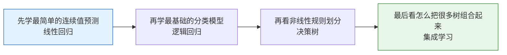

# 学前导读：监督学习这一章到底在学什么

监督学习这一章是第四阶段的主干，它解决的是：

> **当我们手上有带标签的数据时，怎样学出一个能做预测的模型。**

## 零、先建立一张地图

这一章最容易学成“一个模型接一个模型”。  
但更稳的理解方式是先把它看成一条渐进主线：

如果你先抓住“从简单到复杂、从单模型到多模型”这条线，这一章就会顺很多。

## 这一章的学习顺序为什么这样排

这条线是有层次的：

- 线性回归：先学最简单的连续值预测
- 逻辑回归：再学最基础的分类模型
- 决策树：再看非线性和规则划分
- 集成学习：最后看怎样把多个弱模型组合成更强模型

## 这一章更适合新人的读法

建议不要把它读成“4 篇互相独立的算法说明”，而是读成下面 4 个问题：

1. 如果关系大致线性，能不能先用最简单模型解决？
2. 如果任务变成分类，线性思路还能不能继续用？
3. 如果关系明显非线性，能不能改成规则切分？
4. 如果单个模型不够稳或不够强，能不能组合很多模型？

这会比单纯记模型名字更容易形成完整理解。

## 学这一章时最该养成什么习惯

- 每学一个模型，都问它更适合什么任务
- 每学一个模型，都问它最容易在哪种数据上吃亏
- 每学一个模型，都问它和前一个模型相比到底解决了什么新问题

这样你学到的就不是“工具列表”，而是“模型选择的判断链”。

## 新人这一章最该带走什么

- 知道回归和分类是两类不同任务
- 知道线性模型和树模型的差异
- 知道集成学习为什么常常更强
- 知道模型效果差时，不一定是算法太弱，也可能是数据和特征没处理好

## 学完这一章后，你应该能自己回答什么

- 为什么线性回归是起点
- 为什么逻辑回归虽然叫“回归”，却是分类模型
- 为什么树模型会更灵活，也更容易过拟合
- 为什么表格数据任务里，集成树模型常常特别强
