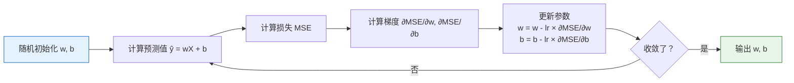
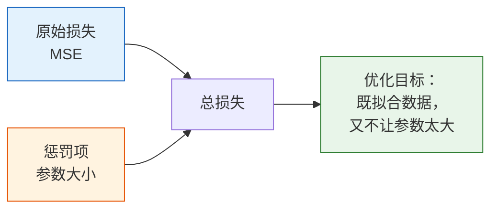
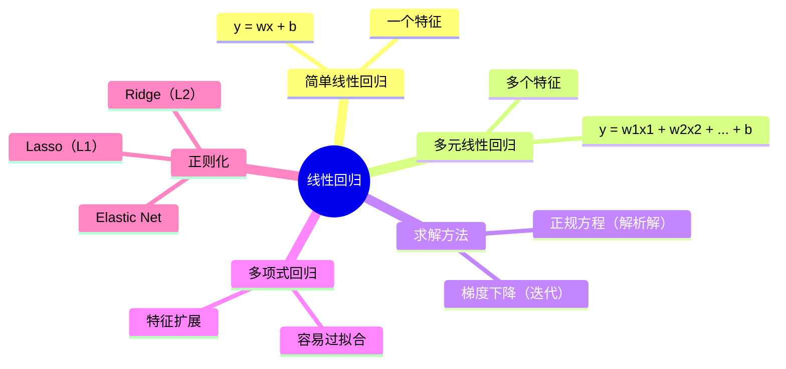

# 线性回归

:::tip 本节定位
线性回归是**最简单也最重要**的机器学习算法。它是理解所有后续算法的基石——逻辑回归、神经网络、甚至 GPT 的底层都能看到它的影子。
:::

## 学习目标

- 理解简单线性回归与多元线性回归
- 掌握最小二乘法与正规方程
- 理解梯度下降法求解（与第三阶段衔接）
- 掌握多项式回归与过拟合
- 理解正则化（Ridge、Lasso、Elastic Net）

---

## 一、简单线性回归

### 1.1 直觉：找一条"最佳拟合线"

**问题**：已知房屋面积和价格的数据，能否预测一个新面积对应的价格？

```python
import numpy as np
import matplotlib.pyplot as plt

# 模拟数据：面积 → 价格
np.random.seed(42)
X = np.random.uniform(50, 200, 30)    # 面积（平方米）
y = 2.5 * X + 50 + np.random.randn(30) * 30  # 价格（万元）

plt.figure(figsize=(8, 5))
plt.scatter(X, y, color='steelblue', s=50, alpha=0.7)
plt.xlabel('面积（平方米）')
plt.ylabel('价格（万元）')
plt.title('房屋面积 vs 价格')
plt.grid(True, alpha=0.3)
plt.show()
```

**目标**：找一条直线 `y = wx + b`，让这条线尽可能"贴近"所有的数据点。

- **w**（weight）= 斜率 = 面积每增加 1 平方米，价格增加多少
- **b**（bias）= 截距 = 面积为 0 时的基础价格

### 1.2 什么是"最佳"？——损失函数

"贴近"需要数学定义。我们用**均方误差（MSE）**来衡量：

> **MSE = (1/n) × Σ(yi - ŷi)²**

其中 `ŷi = w×xi + b` 是模型的预测值。

**直觉**：每个数据点的预测误差取平方，然后求平均。MSE 越小，拟合越好。

```python
def mse_loss(y_true, y_pred):
    """均方误差"""
    return np.mean((y_true - y_pred) ** 2)

# 试几条不同的线
fig, axes = plt.subplots(1, 3, figsize=(15, 4))
params = [(1.0, 100, '斜率太小'), (2.5, 50, '刚刚好'), (4.0, -50, '斜率太大')]

for ax, (w, b, title) in zip(axes, params):
    y_pred = w * X + b
    loss = mse_loss(y, y_pred)
    ax.scatter(X, y, color='steelblue', s=30, alpha=0.7)
    x_line = np.linspace(40, 210, 100)
    ax.plot(x_line, w * x_line + b, 'r-', linewidth=2)
    ax.set_title(f'{title}\nw={w}, b={b}, MSE={loss:.0f}')
    ax.set_xlabel('面积')
    ax.set_ylabel('价格')
    ax.grid(True, alpha=0.3)

plt.tight_layout()
plt.show()
```

---

## 二、求解方法一：正规方程（解析解）

### 2.1 公式

对于线性回归，MSE 有**闭合公式解**：

> **w = (Xᵀ X)⁻¹ Xᵀ y**

这就是**正规方程（Normal Equation）**。

### 2.2 手动实现

```python
# 准备数据（增加截距列）
X_b = np.c_[np.ones(len(X)), X]  # 在 X 前面加一列 1（对应截距 b）
print(f"X_b 形状: {X_b.shape}")  # (30, 2)

# 正规方程求解
w = np.linalg.inv(X_b.T @ X_b) @ X_b.T @ y
b_fit, w_fit = w[0], w[1]
print(f"截距 b = {b_fit:.2f}")
print(f"斜率 w = {w_fit:.2f}")

# 可视化
plt.figure(figsize=(8, 5))
plt.scatter(X, y, color='steelblue', s=50, alpha=0.7, label='数据点')
x_line = np.linspace(40, 210, 100)
plt.plot(x_line, w_fit * x_line + b_fit, 'r-', linewidth=2,
         label=f'拟合线: y = {w_fit:.2f}x + {b_fit:.2f}')
plt.xlabel('面积（平方米）')
plt.ylabel('价格（万元）')
plt.title('正规方程求解线性回归')
plt.legend()
plt.grid(True, alpha=0.3)
plt.show()
```

### 2.3 正规方程的优缺点

| 优点 | 缺点 |
|------|------|
| 直接算出结果，不需要迭代 | 需要计算矩阵逆，复杂度 O(n³) |
| 不需要调学习率 | 特征数量大时非常慢 |
| 一定能找到全局最优 | 特征数 > 样本数时无法使用 |

---

## 三、求解方法二：梯度下降

### 3.1 与第三阶段的衔接

在第三阶段微积分章节，你已经学过梯度下降的原理。现在把它应用到线性回归：



### 3.2 梯度推导

MSE 对 w 和 b 的梯度：

> **∂MSE/∂w = -(2/n) × Σ xi(yi - ŷi)**
>
> **∂MSE/∂b = -(2/n) × Σ (yi - ŷi)**

### 3.3 从零实现

```python
# 梯度下降求解线性回归
np.random.seed(42)

# 参数初始化
w_gd = 0.0
b_gd = 0.0
lr = 0.00005   # 学习率（注意：特征值较大时学习率要小）
epochs = 500

# 记录训练过程
history = {'loss': [], 'w': [], 'b': []}

for epoch in range(epochs):
    # 前向：预测
    y_pred = w_gd * X + b_gd

    # 计算损失
    loss = mse_loss(y, y_pred)

    # 计算梯度
    dw = -2 * np.mean(X * (y - y_pred))
    db = -2 * np.mean(y - y_pred)

    # 更新参数
    w_gd -= lr * dw
    b_gd -= lr * db

    history['loss'].append(loss)
    history['w'].append(w_gd)
    history['b'].append(b_gd)

print(f"梯度下降结果: w = {w_gd:.2f}, b = {b_gd:.2f}")
print(f"正规方程结果: w = {w_fit:.2f}, b = {b_fit:.2f}")

# 可视化训练过程
fig, axes = plt.subplots(1, 3, figsize=(15, 4))

axes[0].plot(history['loss'])
axes[0].set_title('损失曲线')
axes[0].set_xlabel('Epoch')
axes[0].set_ylabel('MSE')
axes[0].set_yscale('log')

axes[1].plot(history['w'], label='w')
axes[1].axhline(y=w_fit, color='r', linestyle='--', label=f'最优 w={w_fit:.2f}')
axes[1].set_title('w 的收敛过程')
axes[1].legend()

axes[2].plot(history['b'], label='b')
axes[2].axhline(y=b_fit, color='r', linestyle='--', label=f'最优 b={b_fit:.2f}')
axes[2].set_title('b 的收敛过程')
axes[2].legend()

for ax in axes:
    ax.grid(True, alpha=0.3)

plt.tight_layout()
plt.show()
```

---

## 四、多元线性回归

### 4.1 从一个特征到多个特征

实际问题中，房价不只取决于面积，还取决于房间数、楼层、距地铁距离等。

> **ŷ = w₁x₁ + w₂x₂ + ... + wpxp + b = wᵀx + b**

### 4.2 用 Scikit-learn 实现

```python
from sklearn.linear_model import LinearRegression
from sklearn.model_selection import train_test_split
from sklearn.metrics import mean_squared_error, r2_score
import pandas as pd

# 模拟多特征房价数据
np.random.seed(42)
n = 200
data = pd.DataFrame({
    '面积': np.random.uniform(50, 200, n),
    '房间数': np.random.randint(1, 6, n),
    '楼层': np.random.randint(1, 30, n),
    '距地铁(km)': np.random.uniform(0.1, 5, n),
})
# 真实关系 + 噪声
data['价格'] = (2.5 * data['面积']
               + 30 * data['房间数']
               + 2 * data['楼层']
               - 20 * data['距地铁(km)']
               + 50
               + np.random.randn(n) * 30)

print(data.head())
print(f"\n数据形状: {data.shape}")

# 准备数据
X = data[['面积', '房间数', '楼层', '距地铁(km)']].values
y = data['价格'].values

X_train, X_test, y_train, y_test = train_test_split(X, y, test_size=0.2, random_state=42)

# 训练模型
model = LinearRegression()
model.fit(X_train, y_train)

# 查看学到的参数
print("\n模型参数:")
for name, coef in zip(['面积', '房间数', '楼层', '距地铁(km)'], model.coef_):
    print(f"  {name}: {coef:.2f}")
print(f"  截距: {model.intercept_:.2f}")

# 评估
y_pred = model.predict(X_test)
print(f"\nMSE: {mean_squared_error(y_test, y_pred):.2f}")
print(f"R² Score: {r2_score(y_test, y_pred):.4f}")
```

### 4.3 R² 分数

R² 是回归模型最常用的评估指标：

> **R² = 1 - Σ(yi - ŷi)² / Σ(yi - ȳ)²**

| R² 值 | 含义 |
|-------|------|
| 1.0 | 完美拟合 |
| 0.8~1.0 | 模型很好 |
| 0.5~0.8 | 模型一般 |
| < 0.5 | 模型较差 |
| < 0 | 还不如直接用平均值预测 |

```python
# 可视化预测 vs 实际
plt.figure(figsize=(6, 6))
plt.scatter(y_test, y_pred, alpha=0.6, s=30, color='steelblue')
plt.plot([y_test.min(), y_test.max()], [y_test.min(), y_test.max()],
         'r--', linewidth=2, label='完美预测线')
plt.xlabel('实际价格')
plt.ylabel('预测价格')
plt.title(f'预测 vs 实际 (R² = {r2_score(y_test, y_pred):.4f})')
plt.legend()
plt.grid(True, alpha=0.3)
plt.axis('equal')
plt.tight_layout()
plt.show()
```

---

## 五、多项式回归——当数据不是直线

### 5.1 问题：直线不够用

```python
# 生成非线性数据
np.random.seed(42)
X_nl = np.linspace(-3, 3, 50)
y_nl = 0.5 * X_nl**2 - X_nl + 2 + np.random.randn(50) * 0.8

# 线性回归强行拟合
lr = LinearRegression()
lr.fit(X_nl.reshape(-1, 1), y_nl)
y_pred_linear = lr.predict(X_nl.reshape(-1, 1))

plt.figure(figsize=(8, 5))
plt.scatter(X_nl, y_nl, color='steelblue', s=30, alpha=0.7)
plt.plot(X_nl, y_pred_linear, 'r-', linewidth=2, label='线性回归（欠拟合）')
plt.title('直线无法拟合曲线数据')
plt.legend()
plt.grid(True, alpha=0.3)
plt.show()
```

### 5.2 多项式回归

**思路**：把原始特征 `x` 扩展为 `[x, x², x³, ...]`，然后依然用线性回归。

```python
from sklearn.preprocessing import PolynomialFeatures

# 创建多项式特征
poly = PolynomialFeatures(degree=2, include_bias=False)
X_poly = poly.fit_transform(X_nl.reshape(-1, 1))
print(f"原始特征: {X_nl[:3]}")
print(f"多项式特征:\n{X_poly[:3]}")  # [x, x²]

# 用线性回归拟合多项式特征
lr_poly = LinearRegression()
lr_poly.fit(X_poly, y_nl)
y_pred_poly = lr_poly.predict(X_poly)

plt.figure(figsize=(8, 5))
plt.scatter(X_nl, y_nl, color='steelblue', s=30, alpha=0.7)
plt.plot(X_nl, y_pred_linear, 'r--', linewidth=2, label='线性回归')
plt.plot(X_nl, y_pred_poly, 'g-', linewidth=2, label='多项式回归 (degree=2)')
plt.title('多项式回归可以拟合曲线')
plt.legend()
plt.grid(True, alpha=0.3)
plt.show()
```

### 5.3 多项式阶数与过拟合

```python
fig, axes = plt.subplots(2, 3, figsize=(15, 9))

degrees = [1, 2, 3, 5, 10, 18]
x_smooth = np.linspace(-3.2, 3.2, 200)

for ax, deg in zip(axes.ravel(), degrees):
    poly = PolynomialFeatures(degree=deg, include_bias=False)
    X_p = poly.fit_transform(X_nl.reshape(-1, 1))
    X_s = poly.transform(x_smooth.reshape(-1, 1))

    lr = LinearRegression()
    lr.fit(X_p, y_nl)

    y_s = lr.predict(X_s)
    y_s = np.clip(y_s, -10, 20)  # 防止极端值

    train_score = lr.score(X_p, y_nl)

    ax.scatter(X_nl, y_nl, color='steelblue', s=20, alpha=0.6)
    ax.plot(x_smooth, y_s, 'r-', linewidth=2)
    ax.set_title(f'degree = {deg}, R² = {train_score:.3f}')
    ax.set_ylim(-5, 15)
    ax.grid(True, alpha=0.3)

plt.suptitle('多项式阶数与过拟合', fontsize=14, y=1.02)
plt.tight_layout()
plt.show()
```

:::warning 过拟合警告
degree 越高，训练集 R² 越接近 1，但模型在新数据上可能表现很差。这就是**过拟合**。解决方案：正则化。
:::

---

## 六、正则化——防止过拟合

### 6.1 正则化的思想

正则化 = 在损失函数中加一个**惩罚项**，惩罚过大的参数值。



**直觉**：惩罚大的参数 → 模型更简单 → 减少过拟合。

### 6.2 三种正则化

| 方法 | 惩罚项 | 效果 |
|------|--------|------|
| **Ridge（L2）** | `α × Σ(wi²)` | 参数缩小但不为零 |
| **Lasso（L1）** | `α × Σ|wi|` | 部分参数变为零（特征选择） |
| **Elastic Net** | L1 + L2 混合 | 兼具两者优点 |

### 6.3 Ridge 回归（L2 正则化）

```python
from sklearn.linear_model import Ridge

# 用高阶多项式 + Ridge 对比
poly = PolynomialFeatures(degree=10, include_bias=False)
X_p = poly.fit_transform(X_nl.reshape(-1, 1))
X_s = poly.transform(x_smooth.reshape(-1, 1))

fig, axes = plt.subplots(1, 3, figsize=(15, 4))
alphas = [0, 0.1, 10]
titles = ['无正则化 (α=0)', 'Ridge α=0.1', 'Ridge α=10']

for ax, alpha, title in zip(axes, alphas, titles):
    if alpha == 0:
        model = LinearRegression()
    else:
        model = Ridge(alpha=alpha)

    model.fit(X_p, y_nl)
    y_s = np.clip(model.predict(X_s), -10, 20)

    ax.scatter(X_nl, y_nl, color='steelblue', s=20, alpha=0.6)
    ax.plot(x_smooth, y_s, 'r-', linewidth=2)
    ax.set_title(title)
    ax.set_ylim(-5, 15)
    ax.grid(True, alpha=0.3)

plt.suptitle('Ridge 正则化的效果（degree=10）', fontsize=13)
plt.tight_layout()
plt.show()
```

### 6.4 Lasso 回归（L1 正则化）——自动特征选择

```python
from sklearn.linear_model import Lasso

# Lasso 能让部分参数变为零 → 自动特征选择
poly = PolynomialFeatures(degree=10, include_bias=False)
X_p = poly.fit_transform(X_nl.reshape(-1, 1))

# 对比 Ridge 和 Lasso 的参数
ridge = Ridge(alpha=1.0)
ridge.fit(X_p, y_nl)

lasso = Lasso(alpha=0.1, max_iter=10000)
lasso.fit(X_p, y_nl)

# 可视化参数
fig, axes = plt.subplots(1, 2, figsize=(12, 4))

axes[0].bar(range(len(ridge.coef_)), np.abs(ridge.coef_), color='steelblue')
axes[0].set_title('Ridge 参数（全部非零）')
axes[0].set_xlabel('特征序号')
axes[0].set_ylabel('|参数值|')

axes[1].bar(range(len(lasso.coef_)), np.abs(lasso.coef_), color='coral')
axes[1].set_title('Lasso 参数（部分为零 → 特征选择）')
axes[1].set_xlabel('特征序号')
axes[1].set_ylabel('|参数值|')

for ax in axes:
    ax.grid(axis='y', alpha=0.3)

plt.tight_layout()
plt.show()

# 看看 Lasso 保留了哪些特征
print("Lasso 参数:", np.round(lasso.coef_, 4))
print(f"非零参数个数: {np.sum(lasso.coef_ != 0)} / {len(lasso.coef_)}")
```

### 6.5 Elastic Net

```python
from sklearn.linear_model import ElasticNet

# Elastic Net = L1 + L2 的混合
# l1_ratio 控制 L1 和 L2 的比例（1.0 = 纯 Lasso，0.0 = 纯 Ridge）
en = ElasticNet(alpha=0.1, l1_ratio=0.5, max_iter=10000)
en.fit(X_p, y_nl)

print("Elastic Net 参数:", np.round(en.coef_, 4))
print(f"非零参数个数: {np.sum(en.coef_ != 0)} / {len(en.coef_)}")
```

### 6.6 正则化对比总结

| | Ridge（L2） | Lasso（L1） | Elastic Net |
|---|-----------|-----------|-------------|
| 惩罚项 | `α × Σ(wi²)` | `α × Σ\|wi\|` | 两者的加权和 |
| 参数效果 | 缩小但不为零 | 部分为零 | 部分为零 |
| 适用场景 | 所有特征都有用 | 有很多无用特征 | 特征多且有相关性 |
| sklearn 类 | `Ridge` | `Lasso` | `ElasticNet` |

---

## 七、完整实战：糖尿病数据集

```python
from sklearn.datasets import load_diabetes
from sklearn.model_selection import train_test_split
from sklearn.linear_model import LinearRegression, Ridge, Lasso
from sklearn.preprocessing import StandardScaler
from sklearn.pipeline import make_pipeline
from sklearn.metrics import mean_squared_error, r2_score
import matplotlib.pyplot as plt

# 加载数据
diabetes = load_diabetes()
X, y = diabetes.data, diabetes.target
print(f"数据集: {X.shape[0]} 样本, {X.shape[1]} 特征")
print(f"特征名: {diabetes.feature_names}")

# 划分数据
X_train, X_test, y_train, y_test = train_test_split(X, y, test_size=0.2, random_state=42)

# 对比多个模型
models = {
    "线性回归": make_pipeline(StandardScaler(), LinearRegression()),
    "Ridge α=1": make_pipeline(StandardScaler(), Ridge(alpha=1.0)),
    "Ridge α=10": make_pipeline(StandardScaler(), Ridge(alpha=10.0)),
    "Lasso α=0.1": make_pipeline(StandardScaler(), Lasso(alpha=0.1, max_iter=10000)),
    "Lasso α=1": make_pipeline(StandardScaler(), Lasso(alpha=1.0, max_iter=10000)),
}

results = {}
for name, model in models.items():
    model.fit(X_train, y_train)
    y_pred = model.predict(X_test)
    mse = mean_squared_error(y_test, y_pred)
    r2 = r2_score(y_test, y_pred)
    results[name] = {'MSE': mse, 'R²': r2}
    print(f"{name:15s} | MSE: {mse:.1f} | R²: {r2:.4f}")

# 可视化 R² 对比
fig, ax = plt.subplots(figsize=(10, 5))
names = list(results.keys())
r2_scores = [v['R²'] for v in results.values()]
colors = ['steelblue', 'coral', 'coral', 'seagreen', 'seagreen']
bars = ax.bar(names, r2_scores, color=colors, alpha=0.8)

for bar, score in zip(bars, r2_scores):
    ax.text(bar.get_x() + bar.get_width()/2, bar.get_height() + 0.005,
            f'{score:.4f}', ha='center', fontsize=10)

ax.set_ylabel('R² Score')
ax.set_title('不同正则化方法对比（糖尿病数据集）')
ax.set_ylim(0, 0.6)
ax.grid(axis='y', alpha=0.3)
plt.xticks(rotation=15)
plt.tight_layout()
plt.show()
```

---

## 八、小结



| 要点 | 说明 |
|------|------|
| 核心思想 | 找一个线性函数拟合数据，最小化 MSE |
| 正规方程 | 直接求解，小数据快，大数据慢 |
| 梯度下降 | 迭代求解，大数据友好 |
| 多项式回归 | 用高次特征拟合非线性数据 |
| 正则化 | 惩罚大参数，防止过拟合 |

:::info 连接后续
- **下一节**：逻辑回归——从回归到分类，只需加一个 Sigmoid
- **第三阶段回顾**：梯度下降（3.3 节）、交叉熵（2.4 节）
:::

---

## 动手练习

### 练习 1：手动实现梯度下降

用上面的多特征房价数据，手动实现多元线性回归的梯度下降（提示：先对特征做标准化）。

### 练习 2：正则化调参

用 `load_diabetes()` 数据集，尝试不同的 Ridge alpha 值（0.01, 0.1, 1, 10, 100），画出 alpha 与测试集 R² 的关系图，找到最优 alpha。

### 练习 3：多项式阶数选择

生成非线性数据，用不同阶数的多项式回归拟合，分别计算训练集和测试集的 R²。画出"阶数 vs R²"图，观察过拟合的拐点。
