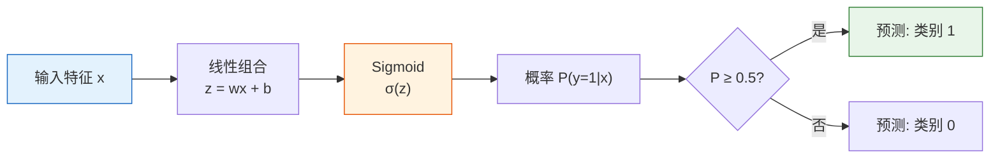
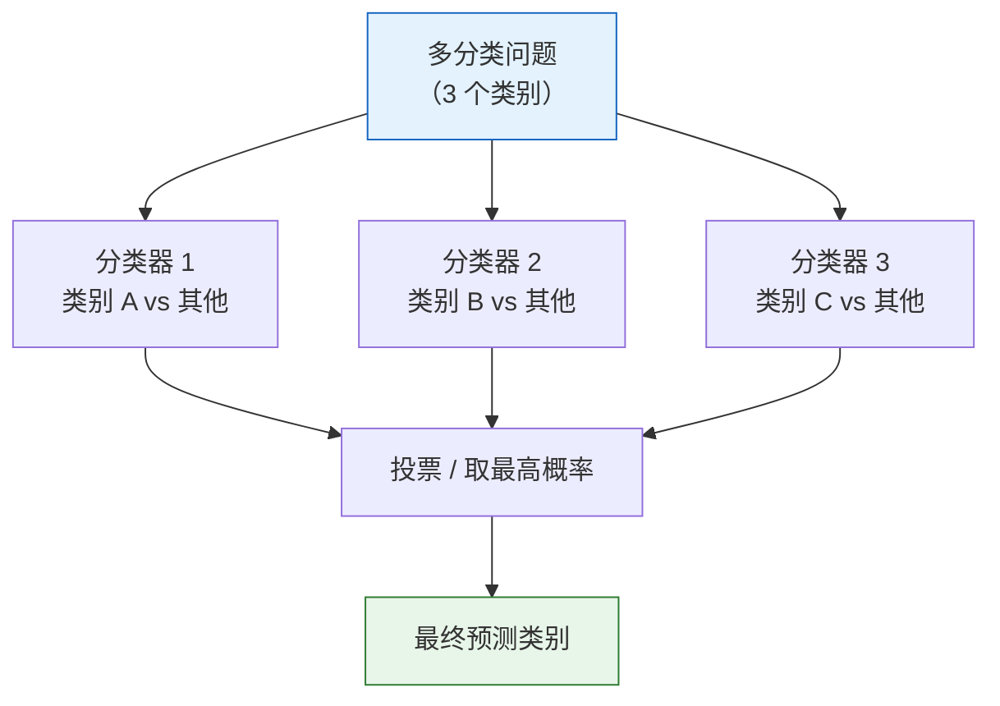

# 逻辑回归

:::tip 本节定位
逻辑回归虽然名字里带"回归"，其实是一个**分类**算法。它在线性回归的基础上加了一个 Sigmoid 函数，就能把连续值映射为概率。这是最经典的分类算法，也是理解神经网络的关键。
:::

## 学习目标

- 理解从线性回归到分类的过渡
- 掌握 Sigmoid 函数与决策边界
- 理解交叉熵损失函数（与第三阶段信息论衔接）
- 掌握多分类扩展（One-vs-Rest、Softmax）
- 能用 Scikit-learn 实现逻辑回归

---

## 一、从回归到分类

### 1.1 问题：输出不再是数值

| 线性回归 | 逻辑回归 |
|---------|---------|
| 预测连续值（房价、温度） | 预测类别（垃圾/正常、猫/狗） |
| 输出：任意实数 | 输出：概率 [0, 1] |

**关键问题**：线性回归的输出 `wx + b` 可以是任意实数，但概率必须在 [0, 1] 之间。怎么转换？

### 1.2 Sigmoid 函数——压缩到 [0, 1]

> **σ(z) = 1 / (1 + e⁻ᶻ)**

```python
import numpy as np
import matplotlib.pyplot as plt

def sigmoid(z):
    return 1 / (1 + np.exp(-z))

z = np.linspace(-8, 8, 200)
plt.figure(figsize=(8, 5))
plt.plot(z, sigmoid(z), 'b-', linewidth=2)
plt.axhline(y=0.5, color='r', linestyle='--', alpha=0.5, label='y = 0.5')
plt.axvline(x=0, color='gray', linestyle='--', alpha=0.5)
plt.fill_between(z, sigmoid(z), alpha=0.1, color='blue')
plt.xlabel('z = wx + b')
plt.ylabel('σ(z) = 概率')
plt.title('Sigmoid 函数：把任意实数压缩到 (0, 1)')
plt.legend()
plt.grid(True, alpha=0.3)
plt.ylim(-0.05, 1.05)
plt.show()
```

Sigmoid 的性质：
| 性质 | 说明 |
|------|------|
| z → +∞ | σ(z) → 1 |
| z → -∞ | σ(z) → 0 |
| z = 0 | σ(z) = 0.5 |
| 导数 | σ'(z) = σ(z) × (1 - σ(z)) |

### 1.3 逻辑回归的完整模型



> **P(y=1|x) = σ(wᵀx + b) = 1 / (1 + e^-(wᵀx + b))**

---

## 二、决策边界

### 2.1 什么是决策边界？

决策边界是**模型判断"类别 0"和"类别 1"的分界线**。

对于逻辑回归，决策边界是 `wᵀx + b = 0` 的直线（或超平面）。

```python
from sklearn.datasets import make_classification
from sklearn.linear_model import LogisticRegression

# 生成二分类数据
X, y = make_classification(n_samples=200, n_features=2, n_informative=2,
                           n_redundant=0, n_clusters_per_class=1, random_state=42)

# 训练逻辑回归
model = LogisticRegression(random_state=42)
model.fit(X, y)

# 可视化决策边界
fig, ax = plt.subplots(figsize=(8, 6))

# 画数据点
scatter = ax.scatter(X[:, 0], X[:, 1], c=y, cmap='coolwarm', s=30, alpha=0.7, edgecolors='w', linewidth=0.5)

# 画决策边界
x_min, x_max = X[:, 0].min() - 1, X[:, 0].max() + 1
y_min, y_max = X[:, 1].min() - 1, X[:, 1].max() + 1
xx, yy = np.meshgrid(np.linspace(x_min, x_max, 200),
                      np.linspace(y_min, y_max, 200))
Z = model.predict_proba(np.c_[xx.ravel(), yy.ravel()])[:, 1]
Z = Z.reshape(xx.shape)

ax.contourf(xx, yy, Z, levels=np.linspace(0, 1, 11), cmap='coolwarm', alpha=0.3)
ax.contour(xx, yy, Z, levels=[0.5], colors='black', linewidths=2)

ax.set_xlabel('特征 1')
ax.set_ylabel('特征 2')
ax.set_title('逻辑回归的决策边界')
plt.colorbar(scatter, label='类别')
plt.grid(True, alpha=0.3)
plt.show()

print(f"权重: w = {model.coef_[0]}")
print(f"截距: b = {model.intercept_[0]:.4f}")
print(f"准确率: {model.score(X, y):.1%}")
```

---

## 三、损失函数——交叉熵

### 3.1 为什么不用 MSE？

对于分类问题，MSE 的损失曲面是**非凸的**，梯度下降容易陷入局部最优。需要一个更好的损失函数。

### 3.2 二元交叉熵

> **BCE = -(1/n) × Σ[ yi × log(p̂i) + (1-yi) × log(1-p̂i) ]**

:::info 与第三阶段的衔接
这就是你在第三阶段"2.4 信息论基础"中学过的**交叉熵**。当时的公式是 `H(P,Q) = -Σ p(x) log q(x)`。现在，`p` 是真实标签，`q` 是模型预测的概率。
:::

```python
def binary_cross_entropy(y_true, y_pred_prob):
    """二元交叉熵损失"""
    eps = 1e-15  # 防止 log(0)
    y_pred_prob = np.clip(y_pred_prob, eps, 1 - eps)
    return -np.mean(
        y_true * np.log(y_pred_prob) + (1 - y_true) * np.log(1 - y_pred_prob)
    )

# 直觉：当真实标签为 1 时
p = np.linspace(0.01, 0.99, 100)
loss_y1 = -np.log(p)      # y=1 时的损失
loss_y0 = -np.log(1 - p)  # y=0 时的损失

fig, axes = plt.subplots(1, 2, figsize=(12, 4))
axes[0].plot(p, loss_y1, 'b-', linewidth=2)
axes[0].set_xlabel('预测概率 P(y=1)')
axes[0].set_ylabel('损失')
axes[0].set_title('真实标签 y=1 时\n预测越接近 1，损失越小')

axes[1].plot(p, loss_y0, 'r-', linewidth=2)
axes[1].set_xlabel('预测概率 P(y=1)')
axes[1].set_ylabel('损失')
axes[1].set_title('真实标签 y=0 时\n预测越接近 0，损失越小')

for ax in axes:
    ax.grid(True, alpha=0.3)

plt.tight_layout()
plt.show()
```

### 3.3 从零实现逻辑回归

```python
# 用梯度下降从零实现逻辑回归
np.random.seed(42)

# 生成简单数据
from sklearn.datasets import make_classification
X_train, y_train = make_classification(n_samples=200, n_features=2, n_informative=2,
                                        n_redundant=0, random_state=42)

# 标准化
X_mean = X_train.mean(axis=0)
X_std = X_train.std(axis=0)
X_norm = (X_train - X_mean) / X_std

# 初始化参数
w = np.zeros(2)
b = 0.0
lr = 0.1
epochs = 200
history = []

for epoch in range(epochs):
    # 前向传播
    z = X_norm @ w + b
    p = sigmoid(z)

    # 计算损失
    loss = binary_cross_entropy(y_train, p)
    history.append(loss)

    # 计算梯度
    error = p - y_train
    dw = (X_norm.T @ error) / len(y_train)
    db = np.mean(error)

    # 更新参数
    w -= lr * dw
    b -= lr * db

print(f"训练完成: w = {w}, b = {b:.4f}")
print(f"最终损失: {history[-1]:.4f}")

# 计算训练准确率
predictions = (sigmoid(X_norm @ w + b) >= 0.5).astype(int)
accuracy = np.mean(predictions == y_train)
print(f"训练准确率: {accuracy:.1%}")

# 可视化损失曲线
plt.figure(figsize=(8, 4))
plt.plot(history)
plt.xlabel('Epoch')
plt.ylabel('交叉熵损失')
plt.title('从零实现逻辑回归的训练过程')
plt.grid(True, alpha=0.3)
plt.show()
```

---

## 四、多分类扩展

### 4.1 One-vs-Rest（OvR）

对于 K 个类别，训练 K 个二分类器，每个分类器判断"是这个类 vs 不是这个类"。



### 4.2 Softmax 回归

直接输出 K 个类别的概率分布：

> **P(y=k|x) = e^(zk) / Σ e^(zj)**

其中 `zk = wk·x + bk`。

**直觉**：Softmax 就是多类别的 Sigmoid。所有类别的概率之和为 1。

```python
def softmax(z):
    """Softmax 函数"""
    exp_z = np.exp(z - np.max(z))  # 减去最大值防止溢出
    return exp_z / exp_z.sum()

# 示例
z = np.array([2.0, 1.0, 0.5])
probs = softmax(z)
print(f"原始分数: {z}")
print(f"Softmax 概率: {probs.round(3)}")
print(f"概率之和: {probs.sum():.4f}")
```

### 4.3 sklearn 多分类实战

```python
from sklearn.datasets import load_iris
from sklearn.linear_model import LogisticRegression
from sklearn.model_selection import train_test_split
from sklearn.metrics import classification_report, confusion_matrix
import matplotlib.pyplot as plt
import numpy as np

# 加载数据
iris = load_iris()
X, y = iris.data, iris.target
X_train, X_test, y_train, y_test = train_test_split(X, y, test_size=0.2, random_state=42)

# 多分类逻辑回归
# multi_class='multinomial' 使用 Softmax
# multi_class='ovr' 使用 One-vs-Rest
model = LogisticRegression(multi_class='multinomial', max_iter=200, random_state=42)
model.fit(X_train, y_train)

# 评估
y_pred = model.predict(X_test)
print("分类报告:")
print(classification_report(y_test, y_pred, target_names=iris.target_names))

# 混淆矩阵
cm = confusion_matrix(y_test, y_pred)
fig, ax = plt.subplots(figsize=(6, 5))
im = ax.imshow(cm, cmap='Blues')
ax.set_xticks(range(3))
ax.set_yticks(range(3))
ax.set_xticklabels(iris.target_names, rotation=45)
ax.set_yticklabels(iris.target_names)
ax.set_xlabel('预测类别')
ax.set_ylabel('真实类别')
ax.set_title('混淆矩阵')

# 在每个格子中显示数值
for i in range(3):
    for j in range(3):
        color = 'white' if cm[i, j] > cm.max() / 2 else 'black'
        ax.text(j, i, str(cm[i, j]), ha='center', va='center', color=color, fontsize=16)

plt.colorbar(im)
plt.tight_layout()
plt.show()
```

### 4.4 预测概率

```python
# 查看 Softmax 输出的概率
proba = model.predict_proba(X_test[:5])
print("前 5 个样本的预测概率:")
for i, p in enumerate(proba):
    pred_class = iris.target_names[y_pred[i]]
    true_class = iris.target_names[y_test[i]]
    print(f"  样本 {i}: {dict(zip(iris.target_names, np.round(p, 3)))} "
          f"→ 预测: {pred_class}, 真实: {true_class}")
```

---

## 五、正则化与超参数

### 5.1 C 参数

sklearn 的逻辑回归用 `C` 参数控制正则化强度（注意：**C 越小，正则化越强**，与 Ridge 的 alpha 相反）。

> **C = 1 / α**

```python
from sklearn.datasets import make_classification
from sklearn.linear_model import LogisticRegression
from sklearn.model_selection import train_test_split

# 生成数据
X, y = make_classification(n_samples=300, n_features=20, n_informative=5,
                           n_redundant=10, random_state=42)
X_train, X_test, y_train, y_test = train_test_split(X, y, test_size=0.2, random_state=42)

# 不同 C 值
C_values = [0.001, 0.01, 0.1, 1, 10, 100]
train_scores = []
test_scores = []

for C in C_values:
    model = LogisticRegression(C=C, max_iter=1000, random_state=42)
    model.fit(X_train, y_train)
    train_scores.append(model.score(X_train, y_train))
    test_scores.append(model.score(X_test, y_test))

plt.figure(figsize=(8, 5))
plt.plot(C_values, train_scores, 'bo-', label='训练集')
plt.plot(C_values, test_scores, 'ro-', label='测试集')
plt.xscale('log')
plt.xlabel('C（正则化强度的倒数）')
plt.ylabel('准确率')
plt.title('C 参数对模型性能的影响')
plt.legend()
plt.grid(True, alpha=0.3)
plt.show()
```

### 5.2 L1 vs L2 正则化

```python
# L1 正则化 → 稀疏参数（特征选择）
# L2 正则化 → 参数缩小（默认）

model_l1 = LogisticRegression(penalty='l1', solver='saga', C=1.0, max_iter=5000, random_state=42)
model_l2 = LogisticRegression(penalty='l2', C=1.0, max_iter=5000, random_state=42)

model_l1.fit(X_train, y_train)
model_l2.fit(X_train, y_train)

fig, axes = plt.subplots(1, 2, figsize=(12, 4))

axes[0].bar(range(20), np.abs(model_l1.coef_[0]), color='coral')
axes[0].set_title(f'L1 正则化（非零参数: {np.sum(model_l1.coef_[0] != 0)}/20）')
axes[0].set_xlabel('特征序号')
axes[0].set_ylabel('|参数值|')

axes[1].bar(range(20), np.abs(model_l2.coef_[0]), color='steelblue')
axes[1].set_title(f'L2 正则化（非零参数: {np.sum(model_l2.coef_[0] != 0)}/20）')
axes[1].set_xlabel('特征序号')
axes[1].set_ylabel('|参数值|')

for ax in axes:
    ax.grid(axis='y', alpha=0.3)

plt.tight_layout()
plt.show()

print(f"L1 测试准确率: {model_l1.score(X_test, y_test):.1%}")
print(f"L2 测试准确率: {model_l2.score(X_test, y_test):.1%}")
```

---

## 六、决策边界可视化对比

```python
from sklearn.datasets import make_moons, make_circles

datasets = [
    ("线性可分", make_classification(n_samples=200, n_features=2,
                                    n_informative=2, n_redundant=0, random_state=42)),
    ("半月形", make_moons(n_samples=200, noise=0.2, random_state=42)),
    ("同心圆", make_circles(n_samples=200, noise=0.1, factor=0.5, random_state=42)),
]

fig, axes = plt.subplots(1, 3, figsize=(15, 4))

for ax, (title, (X_d, y_d)) in zip(axes, datasets):
    model = LogisticRegression(random_state=42)
    model.fit(X_d, y_d)

    x_min, x_max = X_d[:, 0].min() - 0.5, X_d[:, 0].max() + 0.5
    y_min, y_max = X_d[:, 1].min() - 0.5, X_d[:, 1].max() + 0.5
    xx, yy = np.meshgrid(np.linspace(x_min, x_max, 200),
                          np.linspace(y_min, y_max, 200))
    Z = model.predict(np.c_[xx.ravel(), yy.ravel()]).reshape(xx.shape)

    ax.contourf(xx, yy, Z, alpha=0.3, cmap='coolwarm')
    ax.scatter(X_d[:, 0], X_d[:, 1], c=y_d, cmap='coolwarm', s=20, edgecolors='w', linewidth=0.5)
    ax.set_title(f'{title}\n准确率: {model.score(X_d, y_d):.1%}')
    ax.grid(True, alpha=0.3)

plt.suptitle('逻辑回归的决策边界（线性分界线）', fontsize=13)
plt.tight_layout()
plt.show()
```

:::note 逻辑回归的局限
逻辑回归的决策边界是**线性**的（直线/平面）。对于非线性数据（半月形、同心圆），效果较差。后续的决策树、SVM 等可以处理非线性数据。
:::

---

## 七、小结

| 要点 | 说明 |
|------|------|
| 核心公式 | `P(y=1) = σ(wx + b)` |
| Sigmoid | 把线性输出压缩到 (0, 1) |
| 损失函数 | 二元交叉熵（BCE） |
| 决策边界 | 线性（直线/超平面） |
| 多分类 | OvR 或 Softmax |
| 正则化 | C 参数（C 越小，正则化越强） |

:::info 连接后续
- **下一节**：决策树——非线性决策边界，高可解释性
- **第三阶段回顾**：Sigmoid 导数（3.1 节）、交叉熵（2.4 节）、梯度下降（3.3 节）
:::

---

## 动手练习

### 练习 1：从零实现 Softmax 回归

扩展本节的"从零实现逻辑回归"，改为 Softmax 多分类版本，在 Iris 数据集上训练。

### 练习 2：决策边界对比

用 `make_moons` 数据，对比不同 C 值（0.01, 1, 100）的逻辑回归决策边界有什么变化。

### 练习 3：特征重要性分析

用 Iris 数据集训练逻辑回归，查看 `model.coef_`，分析哪些特征对区分不同鸢尾花品种最重要。用柱状图可视化。
