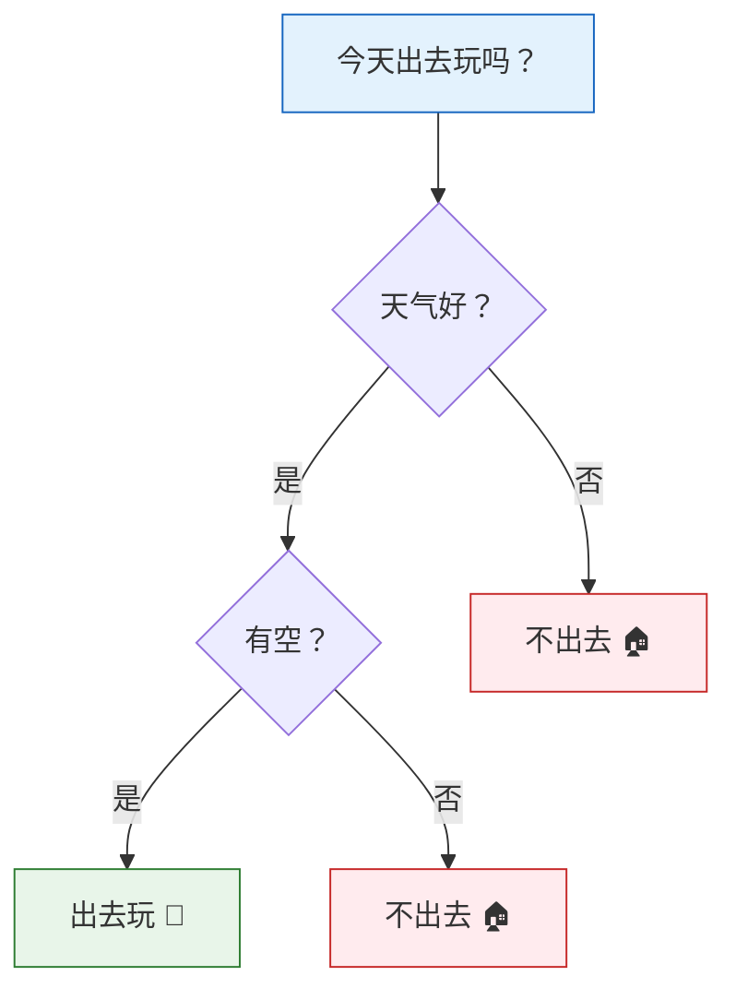

# 决策树

:::tip 本节定位
决策树是**最直觉、最易解释**的 ML 算法。它就像一个"20 个问题"游戏：通过一连串的是/否判断，把数据分类。更重要的是，决策树是后面集成学习（随机森林、XGBoost）的基础。
:::

## 学习目标

- 理解决策树的构建过程
- 掌握信息增益、基尼指数（与第三阶段熵的概念衔接）
- 理解剪枝策略（预剪枝、后剪枝）
- 掌握决策树的可视化与解释性
- 了解回归树

---

## 一、决策树的直觉

### 1.1 生活中的决策树



决策树就是一系列的**if-else 判断**，每次根据一个特征的值把数据分成两（或多）组。

### 1.2 机器学习中的决策树

| 要素 | 说明 |
|------|------|
| **根节点** | 最顶部的节点，包含所有数据 |
| **内部节点** | 做判断的节点（按某个特征分裂） |
| **叶节点** | 最终的决策结果（类别或数值） |
| **分裂条件** | 如"花瓣长度 ≤ 2.5cm" |
| **深度** | 从根到叶的最长路径 |

### 1.3 一个简单例子

```python
from sklearn.datasets import load_iris
from sklearn.tree import DecisionTreeClassifier, plot_tree
import matplotlib.pyplot as plt

# 只用 2 个特征，方便可视化
iris = load_iris()
X = iris.data[:, 2:4]  # 花瓣长度和宽度
y = iris.target

# 训练一棵浅层决策树
tree = DecisionTreeClassifier(max_depth=3, random_state=42)
tree.fit(X, y)

# 可视化决策树
fig, ax = plt.subplots(figsize=(14, 8))
plot_tree(tree, feature_names=['花瓣长度', '花瓣宽度'],
          class_names=iris.target_names, filled=True,
          rounded=True, fontsize=10, ax=ax)
plt.title('鸢尾花决策树（max_depth=3）')
plt.tight_layout()
plt.show()
```

---

## 二、决策树如何"学习"？——分裂准则

### 2.1 核心问题

每个节点上，算法需要决定：
1. **用哪个特征**分裂？
2. **用什么阈值**分裂？

目标：让每次分裂后，子节点的数据尽可能**"纯"**（同类数据聚在一起）。

### 2.2 信息增益与熵

:::info 与第三阶段的衔接
你在第三阶段"2.4 信息论基础"中学过**熵**——它衡量一个集合的"不确定性"。决策树就是用熵来决定如何分裂。
:::

**熵（Entropy）**：

> **H(S) = -Σ pk × log₂(pk)**

- `pk` = 类别 k 在集合 S 中的比例
- 熵越大 = 越"混乱"；熵 = 0 = 完全纯（只有一个类别）

**信息增益**：分裂前后熵的减少量。

> **IG(S, A) = H(S) - Σ (|Sv|/|S|) × H(Sv)**

```python
import numpy as np

def entropy(y):
    """计算熵"""
    classes, counts = np.unique(y, return_counts=True)
    probs = counts / len(y)
    return -np.sum(probs * np.log2(probs + 1e-10))

def information_gain(y, y_left, y_right):
    """计算信息增益"""
    n = len(y)
    return entropy(y) - (len(y_left)/n * entropy(y_left) + len(y_right)/n * entropy(y_right))

# 示例：10 个样本
y_parent = np.array([0, 0, 0, 0, 0, 1, 1, 1, 1, 1])  # 5:5 混合
print(f"父节点熵: {entropy(y_parent):.4f}")

# 分裂方案 A：完美分裂
y_left_a = np.array([0, 0, 0, 0, 0])  # 全 0
y_right_a = np.array([1, 1, 1, 1, 1])  # 全 1
ig_a = information_gain(y_parent, y_left_a, y_right_a)
print(f"方案 A（完美分裂）信息增益: {ig_a:.4f}")

# 分裂方案 B：很差的分裂
y_left_b = np.array([0, 0, 1, 1, 1])   # 2:3 混合
y_right_b = np.array([0, 0, 0, 1, 1])   # 3:2 混合
ig_b = information_gain(y_parent, y_left_b, y_right_b)
print(f"方案 B（差的分裂）信息增益: {ig_b:.4f}")
```

### 2.3 基尼指数（Gini Impurity）

另一种衡量"纯度"的指标，计算更快：

> **Gini(S) = 1 - Σ pk²**

- Gini = 0 → 完全纯
- Gini 最大 → 完全混乱

```python
def gini(y):
    """计算基尼指数"""
    classes, counts = np.unique(y, return_counts=True)
    probs = counts / len(y)
    return 1 - np.sum(probs ** 2)

# 对比熵和基尼指数
p = np.linspace(0.01, 0.99, 100)
entropy_vals = -p * np.log2(p) - (1-p) * np.log2(1-p)
gini_vals = 2 * p * (1 - p)

plt.figure(figsize=(8, 5))
plt.plot(p, entropy_vals, 'b-', linewidth=2, label='熵 (Entropy)')
plt.plot(p, gini_vals, 'r-', linewidth=2, label='基尼指数 (Gini)')
plt.xlabel('正类比例 p')
plt.ylabel('不纯度')
plt.title('熵 vs 基尼指数')
plt.legend()
plt.grid(True, alpha=0.3)
plt.show()
```

### 2.4 sklearn 中的选择

| 参数 | 选项 | 说明 |
|------|------|------|
| `criterion='gini'` | 基尼指数 | sklearn **默认**，计算快 |
| `criterion='entropy'` | 信息增益 | 分裂更精确，但计算稍慢 |

实际使用中两者差异不大，默认用 `gini` 即可。

---

## 三、决策边界可视化

```python
from sklearn.datasets import make_classification, make_moons
from sklearn.tree import DecisionTreeClassifier
import numpy as np
import matplotlib.pyplot as plt

def plot_decision_boundary(ax, model, X, y, title):
    x_min, x_max = X[:, 0].min() - 0.5, X[:, 0].max() + 0.5
    y_min, y_max = X[:, 1].min() - 0.5, X[:, 1].max() + 0.5
    xx, yy = np.meshgrid(np.linspace(x_min, x_max, 200),
                          np.linspace(y_min, y_max, 200))
    Z = model.predict(np.c_[xx.ravel(), yy.ravel()]).reshape(xx.shape)
    ax.contourf(xx, yy, Z, alpha=0.3, cmap='coolwarm')
    ax.scatter(X[:, 0], X[:, 1], c=y, cmap='coolwarm', s=20, edgecolors='w', linewidth=0.5)
    ax.set_title(title)
    ax.grid(True, alpha=0.3)

# 不同深度的决策树
X, y = make_moons(n_samples=300, noise=0.25, random_state=42)

fig, axes = plt.subplots(1, 4, figsize=(18, 4))
depths = [1, 3, 5, None]

for ax, depth in zip(axes, depths):
    tree = DecisionTreeClassifier(max_depth=depth, random_state=42)
    tree.fit(X, y)
    label = f'深度不限' if depth is None else f'深度={depth}'
    plot_decision_boundary(ax, tree, X, y,
                          f'{label}\n训练准确率: {tree.score(X, y):.1%}')

plt.suptitle('决策树深度对决策边界的影响', fontsize=13)
plt.tight_layout()
plt.show()
```

:::warning 决策树的过拟合
不限深度的决策树会把每个训练样本都"记住"（训练准确率 100%），但决策边界会非常复杂。这就是过拟合——需要通过**剪枝**来控制。
:::

---

## 四、剪枝——控制复杂度

### 4.1 预剪枝（Pre-pruning）

**在构建过程中**限制树的生长：

| 参数 | 说明 | 默认值 |
|------|------|--------|
| `max_depth` | 最大深度 | None（不限） |
| `min_samples_split` | 节点最少样本数才能分裂 | 2 |
| `min_samples_leaf` | 叶子节点最少样本数 | 1 |
| `max_leaf_nodes` | 最大叶节点数 | None（不限） |

```python
from sklearn.model_selection import train_test_split

X, y = make_moons(n_samples=500, noise=0.3, random_state=42)
X_train, X_test, y_train, y_test = train_test_split(X, y, test_size=0.2, random_state=42)

# 对比不同深度
fig, axes = plt.subplots(1, 4, figsize=(18, 4))
configs = [
    (None, '不剪枝'),
    (3, 'max_depth=3'),
    (5, 'max_depth=5'),
    (10, 'max_depth=10'),
]

for ax, (depth, title) in zip(axes, configs):
    tree = DecisionTreeClassifier(max_depth=depth, random_state=42)
    tree.fit(X_train, y_train)
    train_acc = tree.score(X_train, y_train)
    test_acc = tree.score(X_test, y_test)
    plot_decision_boundary(ax, tree, X_train, y_train,
                          f'{title}\n训练: {train_acc:.1%}, 测试: {test_acc:.1%}')

plt.suptitle('预剪枝对过拟合的控制', fontsize=13)
plt.tight_layout()
plt.show()
```

### 4.2 后剪枝（Post-pruning）——代价复杂度剪枝

**先长成完全树，再回头"修剪"**。sklearn 使用 `ccp_alpha`（Cost Complexity Pruning）参数。

```python
# 找到最优的 ccp_alpha
tree_full = DecisionTreeClassifier(random_state=42)
tree_full.fit(X_train, y_train)

# 获取不同 alpha 对应的子树
path = tree_full.cost_complexity_pruning_path(X_train, y_train)
ccp_alphas = path.ccp_alphas

# 对每个 alpha 训练一棵树
train_scores = []
test_scores = []
for alpha in ccp_alphas:
    tree = DecisionTreeClassifier(ccp_alpha=alpha, random_state=42)
    tree.fit(X_train, y_train)
    train_scores.append(tree.score(X_train, y_train))
    test_scores.append(tree.score(X_test, y_test))

plt.figure(figsize=(8, 5))
plt.plot(ccp_alphas, train_scores, 'b-o', markersize=3, label='训练集')
plt.plot(ccp_alphas, test_scores, 'r-o', markersize=3, label='测试集')
plt.xlabel('ccp_alpha')
plt.ylabel('准确率')
plt.title('代价复杂度剪枝')
plt.legend()
plt.grid(True, alpha=0.3)

# 标注最优点
best_idx = np.argmax(test_scores)
plt.axvline(x=ccp_alphas[best_idx], color='green', linestyle='--',
            label=f'最优 alpha={ccp_alphas[best_idx]:.4f}')
plt.legend()
plt.show()

print(f"最优 ccp_alpha: {ccp_alphas[best_idx]:.4f}")
print(f"最优测试准确率: {test_scores[best_idx]:.1%}")
```

---

## 五、特征重要性

决策树天然提供**特征重要性**——表示每个特征对分类决策的贡献程度。

```python
from sklearn.datasets import load_wine
from sklearn.tree import DecisionTreeClassifier

wine = load_wine()
X, y = wine.data, wine.target

tree = DecisionTreeClassifier(max_depth=4, random_state=42)
tree.fit(X, y)

# 特征重要性
importance = tree.feature_importances_
sorted_idx = np.argsort(importance)

plt.figure(figsize=(8, 6))
plt.barh(range(len(sorted_idx)), importance[sorted_idx], color='steelblue')
plt.yticks(range(len(sorted_idx)), np.array(wine.feature_names)[sorted_idx])
plt.xlabel('特征重要性')
plt.title('决策树的特征重要性（Wine 数据集）')
plt.grid(axis='x', alpha=0.3)
plt.tight_layout()
plt.show()
```

---

## 六、回归树

决策树不只能做分类，也能做**回归**。

### 6.1 原理

分类树的叶节点输出**类别**；回归树的叶节点输出**数值**（该区域所有样本的平均值）。

### 6.2 示例

```python
from sklearn.tree import DecisionTreeRegressor

# 生成非线性数据
np.random.seed(42)
X_reg = np.sort(np.random.uniform(0, 10, 200)).reshape(-1, 1)
y_reg = np.sin(X_reg.ravel()) + np.random.randn(200) * 0.3

# 不同深度的回归树
fig, axes = plt.subplots(1, 3, figsize=(15, 4))
depths = [2, 5, None]

for ax, depth in zip(axes, depths):
    tree = DecisionTreeRegressor(max_depth=depth, random_state=42)
    tree.fit(X_reg, y_reg)

    X_test_reg = np.linspace(0, 10, 500).reshape(-1, 1)
    y_pred = tree.predict(X_test_reg)

    ax.scatter(X_reg, y_reg, s=10, alpha=0.5, color='steelblue')
    ax.plot(X_test_reg, y_pred, 'r-', linewidth=2)
    label = '不限' if depth is None else str(depth)
    ax.set_title(f'深度={label}, R²={tree.score(X_reg, y_reg):.3f}')
    ax.grid(True, alpha=0.3)

plt.suptitle('回归树的不同深度', fontsize=13)
plt.tight_layout()
plt.show()
```

:::note 回归树 vs 线性回归
回归树的预测是**阶梯状**的（每个区间输出一个常数），而不是平滑的。它天然可以拟合非线性数据，但也容易过拟合。
:::

---

## 七、决策树的优缺点

| 优点 | 缺点 |
|------|------|
| 易于理解和解释（可视化） | 容易过拟合 |
| 不需要特征缩放 | 对数据微小变化敏感 |
| 可处理分类和回归 | 决策边界是轴对齐的 |
| 可处理多类别问题 | 贪心算法，不保证全局最优 |
| 隐式特征选择 | 单棵树表达能力有限 |

:::info 解决缺点的方法
决策树的多数缺点可以通过**集成学习**（下一节）来解决：
- 多棵树投票 → 减少过拟合
- 随机采样 → 减少对单个数据点的敏感性
:::

---

## 八、小结

| 要点 | 说明 |
|------|------|
| 核心思想 | 通过一系列判断条件将数据递归分割 |
| 分裂准则 | 信息增益（熵）或基尼指数 |
| 过拟合控制 | 预剪枝（限制深度/样本数）或后剪枝（ccp_alpha） |
| 可解释性 | 可视化决策路径，输出特征重要性 |
| 回归树 | 叶节点输出数值而非类别 |

:::info 连接后续
- **下一节**：集成学习——把多棵决策树组合起来，效果远超单棵树
- **第三阶段回顾**：熵和信息增益（2.4 节信息论）
:::

---

## 动手练习

### 练习 1：手动计算信息增益

有 10 个样本：标签为 `[是,是,否,是,否,否,是,是,否,否]`（5 个"是"，5 个"否"）。按特征 A 分裂后，左子节点 = `[是,是,是,否]`，右子节点 = `[否,否,否,否,是,是]`。手动计算信息增益。

### 练习 2：深度调优

用 `make_moons` 数据（noise=0.3），尝试不同的 `max_depth`（1~20），画出训练集和测试集准确率的变化曲线，找到最优深度。

### 练习 3：回归树 vs 线性回归

用 `y = sin(x) + 噪声` 生成数据，分别用 `LinearRegression`、`PolynomialFeatures(degree=5) + LinearRegression`、`DecisionTreeRegressor(max_depth=5)` 三种方法拟合，画出对比图。

### 练习 4：特征重要性

用 `load_iris()` 训练决策树，画出特征重要性柱状图。尝试去掉不重要的特征后重新训练，看准确率是否下降。
