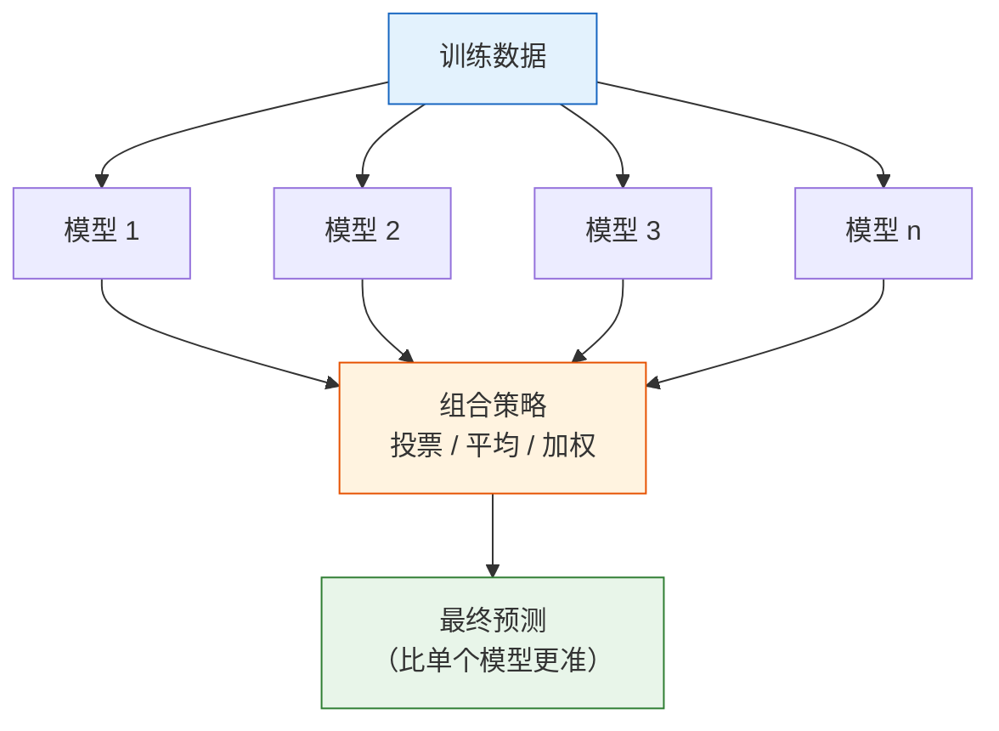
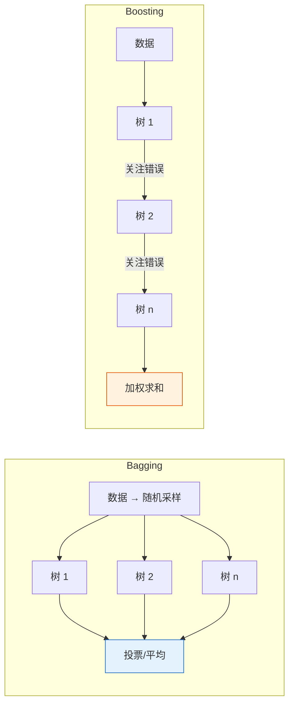
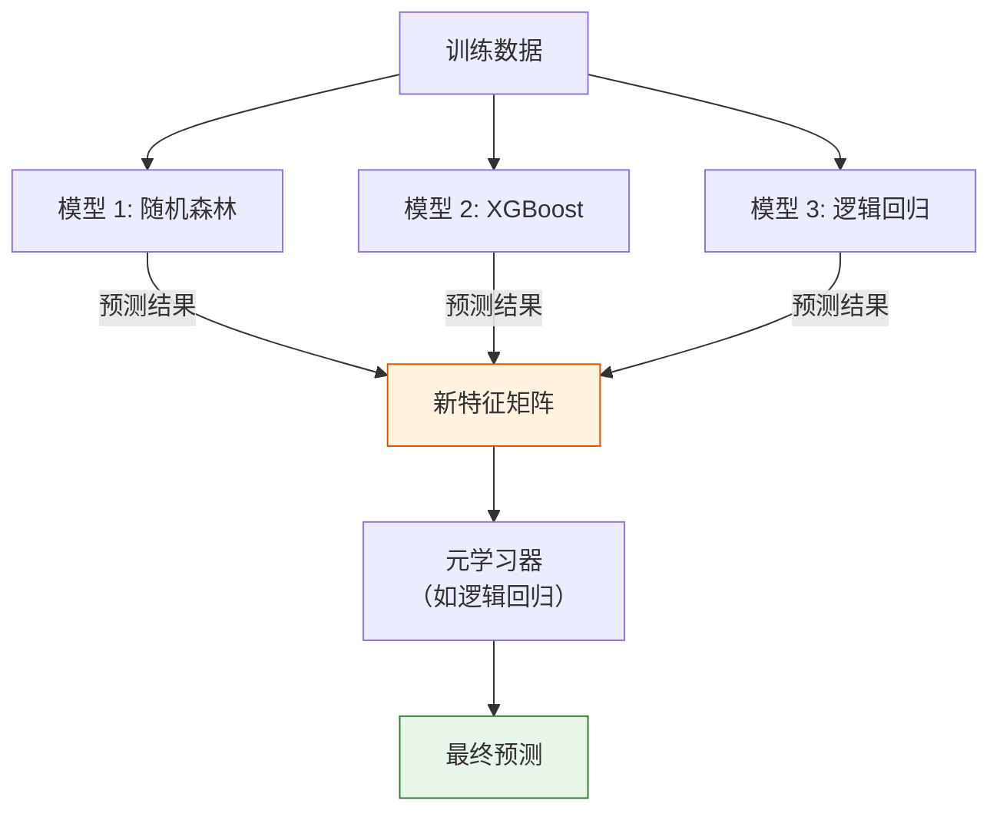
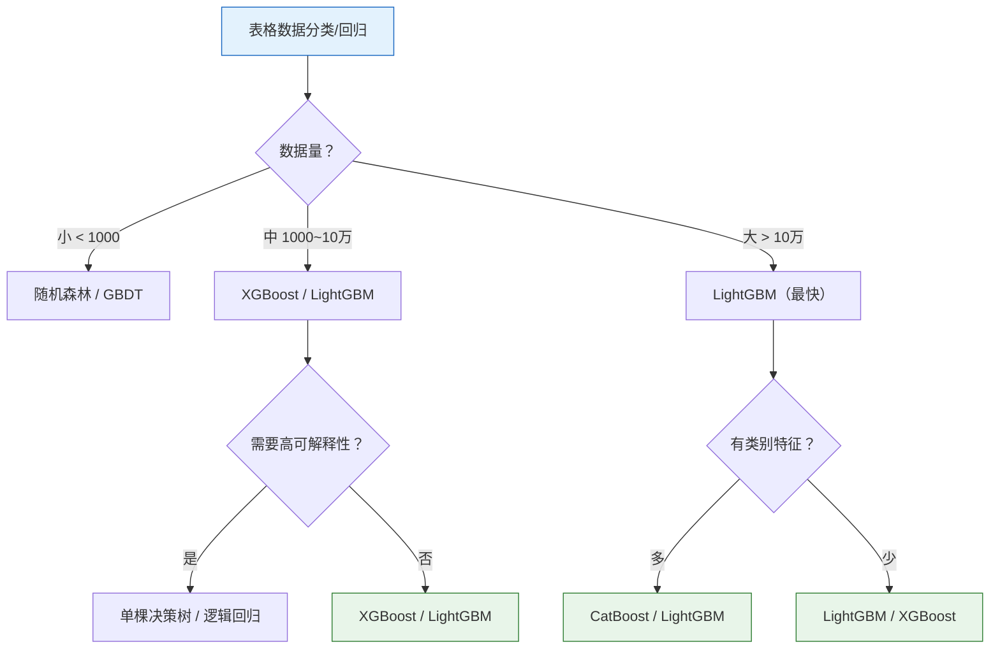

# 集成学习

:::tip 本节定位
集成学习是 ML 竞赛和工业界中**最常用**的技术。核心思想很简单：**三个臭皮匠，顶个诸葛亮**——多个弱模型组合起来，比一个强模型更好。XGBoost 和 LightGBM 至今仍是表格数据的"默认首选"。
:::

## 学习目标

- 理解 Bagging 原理与随机森林
- 理解 Boosting 原理与 AdaBoost
- 掌握 GBDT 和 XGBoost
- 了解 LightGBM 和 CatBoost
- 了解 Stacking 策略

---

## 一、集成学习的核心思想

### 1.1 一张图理解集成学习



### 1.2 为什么有效？

每个模型都会犯错，但**不同模型犯的错往往不同**。多个模型"投票"可以互相纠正。

```python
import numpy as np

# 模拟：3 个准确率 70% 的独立模型
np.random.seed(42)
n = 10000
true_labels = np.random.randint(0, 2, n)

# 每个模型独立预测
accs = []
for _ in range(3):
    # 70% 概率正确
    correct = np.random.random(n) < 0.7
    pred = np.where(correct, true_labels, 1 - true_labels)
    accs.append(pred)

accs = np.array(accs)

# 多数投票
ensemble_pred = (accs.sum(axis=0) >= 2).astype(int)

print(f"模型 1 准确率: {np.mean(accs[0] == true_labels):.1%}")
print(f"模型 2 准确率: {np.mean(accs[1] == true_labels):.1%}")
print(f"模型 3 准确率: {np.mean(accs[2] == true_labels):.1%}")
print(f"投票集成准确率: {np.mean(ensemble_pred == true_labels):.1%}")
```

### 1.3 两大流派

| | Bagging | Boosting |
|---|---------|---------|
| 思路 | 并行训练，投票 | 串行训练，纠错 |
| 多样性来源 | 随机采样数据和特征 | 关注前一轮的错误 |
| 减少什么 | 方差（variance） | 偏差（bias） |
| 代表算法 | 随机森林 | AdaBoost、GBDT、XGBoost |
| 过拟合倾向 | 不容易 | 容易（需要早停） |



---

## 二、Bagging 与随机森林

### 2.1 Bagging 原理

**Bootstrap Aggregating = 自助采样 + 聚合**

1. 从训练集中**有放回地随机采样**多份数据
2. 用每份数据训练一棵决策树
3. 分类：多数投票；回归：取平均

```python
# 自助采样（Bootstrap）的直觉
np.random.seed(42)
data = np.arange(1, 11)  # 原始数据: [1, 2, ..., 10]

print("原始数据:", data)
for i in range(3):
    sample = np.random.choice(data, size=len(data), replace=True)
    print(f"自助样本 {i+1}: {sorted(sample)}")
    # 注意：有些数据重复了，有些没被选中
```

### 2.2 随机森林（Random Forest）

随机森林 = Bagging + **特征随机选择**

在每次分裂时，只从**随机选取的一部分特征**中选最优分裂点。这增加了树之间的多样性。

```python
from sklearn.ensemble import RandomForestClassifier
from sklearn.datasets import make_moons
from sklearn.model_selection import train_test_split
import matplotlib.pyplot as plt
import numpy as np

# 生成数据
X, y = make_moons(n_samples=500, noise=0.3, random_state=42)
X_train, X_test, y_train, y_test = train_test_split(X, y, test_size=0.2, random_state=42)

# 对比单棵树 vs 随机森林
from sklearn.tree import DecisionTreeClassifier

dt = DecisionTreeClassifier(random_state=42)
dt.fit(X_train, y_train)

rf = RandomForestClassifier(n_estimators=100, random_state=42)
rf.fit(X_train, y_train)

print(f"单棵决策树 | 训练: {dt.score(X_train, y_train):.1%} | 测试: {dt.score(X_test, y_test):.1%}")
print(f"随机森林   | 训练: {rf.score(X_train, y_train):.1%} | 测试: {rf.score(X_test, y_test):.1%}")

# 可视化决策边界对比
fig, axes = plt.subplots(1, 2, figsize=(12, 5))

for ax, model, name in zip(axes, [dt, rf], ['单棵决策树', '随机森林 (100 棵)']):
    x_min, x_max = X[:, 0].min() - 0.5, X[:, 0].max() + 0.5
    y_min, y_max = X[:, 1].min() - 0.5, X[:, 1].max() + 0.5
    xx, yy = np.meshgrid(np.linspace(x_min, x_max, 200),
                          np.linspace(y_min, y_max, 200))
    Z = model.predict(np.c_[xx.ravel(), yy.ravel()]).reshape(xx.shape)
    ax.contourf(xx, yy, Z, alpha=0.3, cmap='coolwarm')
    ax.scatter(X_test[:, 0], X_test[:, 1], c=y_test, cmap='coolwarm', s=20, edgecolors='w', linewidth=0.5)
    test_acc = model.score(X_test, y_test)
    ax.set_title(f'{name}\n测试准确率: {test_acc:.1%}')
    ax.grid(True, alpha=0.3)

plt.tight_layout()
plt.show()
```

### 2.3 随机森林的关键超参数

| 参数 | 说明 | 推荐 |
|------|------|------|
| `n_estimators` | 树的数量 | 100~500 |
| `max_depth` | 单棵树最大深度 | None 或 10~20 |
| `max_features` | 每次分裂考虑的特征数 | 'sqrt'（分类）, 'log2' |
| `min_samples_split` | 节点分裂最小样本数 | 2~10 |
| `min_samples_leaf` | 叶节点最小样本数 | 1~5 |

```python
# 树的数量 vs 准确率
n_trees = [1, 5, 10, 30, 50, 100, 200, 500]
train_scores = []
test_scores = []

for n in n_trees:
    rf = RandomForestClassifier(n_estimators=n, random_state=42)
    rf.fit(X_train, y_train)
    train_scores.append(rf.score(X_train, y_train))
    test_scores.append(rf.score(X_test, y_test))

plt.figure(figsize=(8, 5))
plt.plot(n_trees, train_scores, 'bo-', label='训练集')
plt.plot(n_trees, test_scores, 'ro-', label='测试集')
plt.xlabel('树的数量 (n_estimators)')
plt.ylabel('准确率')
plt.title('树的数量对随机森林性能的影响')
plt.legend()
plt.grid(True, alpha=0.3)
plt.show()
```

---

## 三、Boosting 系列

### 3.1 AdaBoost

**思路**：每一轮关注**上一轮分错的样本**，给它们更高的权重。


```python
from sklearn.ensemble import AdaBoostClassifier
from sklearn.tree import DecisionTreeClassifier

# AdaBoost 默认使用浅层决策树（决策树桩）
ada = AdaBoostClassifier(
    estimator=DecisionTreeClassifier(max_depth=1),
    n_estimators=50,
    learning_rate=1.0,
    random_state=42
)
ada.fit(X_train, y_train)
print(f"AdaBoost | 训练: {ada.score(X_train, y_train):.1%} | 测试: {ada.score(X_test, y_test):.1%}")
```

### 3.2 GBDT（梯度提升决策树）

**思路**：每棵新树拟合的不是原始标签，而是前面所有树的**残差**（预测误差）。

> **Fm(x) = Fm-1(x) + η × hm(x)**

其中 `hm(x)` 是第 m 棵树拟合的残差，`η` 是学习率。

```python
from sklearn.ensemble import GradientBoostingClassifier

gbdt = GradientBoostingClassifier(
    n_estimators=100,
    learning_rate=0.1,
    max_depth=3,
    random_state=42
)
gbdt.fit(X_train, y_train)
print(f"GBDT | 训练: {gbdt.score(X_train, y_train):.1%} | 测试: {gbdt.score(X_test, y_test):.1%}")
```

### 3.3 GBDT 回归——直觉理解

```python
from sklearn.ensemble import GradientBoostingRegressor
from sklearn.tree import DecisionTreeRegressor

# 用回归问题直观理解"拟合残差"
np.random.seed(42)
X_demo = np.linspace(0, 10, 100).reshape(-1, 1)
y_demo = np.sin(X_demo.ravel()) + np.random.randn(100) * 0.2

fig, axes = plt.subplots(2, 3, figsize=(15, 9))

# 手动模拟 GBDT 的过程
current_pred = np.zeros(len(y_demo))
learning_rate = 0.5

for i in range(6):
    ax = axes[i // 3][i % 3]

    # 计算残差
    residual = y_demo - current_pred

    # 用决策树拟合残差
    tree = DecisionTreeRegressor(max_depth=2, random_state=42)
    tree.fit(X_demo, residual)
    tree_pred = tree.predict(X_demo)

    # 更新预测
    current_pred += learning_rate * tree_pred

    ax.scatter(X_demo, y_demo, s=10, alpha=0.5, color='steelblue')
    ax.plot(X_demo, current_pred, 'r-', linewidth=2, label=f'当前预测')
    ax.set_title(f'第 {i+1} 棵树后\nMSE={np.mean((y_demo - current_pred)**2):.4f}')
    ax.legend(fontsize=8)
    ax.grid(True, alpha=0.3)

plt.suptitle('GBDT 逐步拟合残差', fontsize=13)
plt.tight_layout()
plt.show()
```

---

## 四、XGBoost

### 4.1 XGBoost 的改进

XGBoost (eXtreme Gradient Boosting) 是 GBDT 的**工程优化版**：

| 特性 | GBDT | XGBoost |
|------|------|---------|
| 正则化 | 无 | L1 + L2 正则化（减少过拟合） |
| 缺失值 | 需要预处理 | 自动处理 |
| 并行 | 串行 | 特征级并行（快 10 倍） |
| 列采样 | 无 | 支持（类似随机森林） |
| 早停 | 无 | 支持 early_stopping_rounds |

### 4.2 安装与使用

```bash
pip install xgboost
```

```python
import xgboost as xgb
from sklearn.datasets import load_wine
from sklearn.model_selection import train_test_split
from sklearn.metrics import accuracy_score

# 加载数据
wine = load_wine()
X, y = wine.data, wine.target
X_train, X_test, y_train, y_test = train_test_split(X, y, test_size=0.2, random_state=42)

# 训练 XGBoost
xgb_model = xgb.XGBClassifier(
    n_estimators=100,
    max_depth=4,
    learning_rate=0.1,
    random_state=42,
    use_label_encoder=False,
    eval_metric='mlogloss',
)
xgb_model.fit(X_train, y_train)

print(f"XGBoost | 训练: {xgb_model.score(X_train, y_train):.1%} | 测试: {xgb_model.score(X_test, y_test):.1%}")
```

### 4.3 XGBoost 关键超参数

| 参数 | 说明 | 推荐范围 |
|------|------|---------|
| `n_estimators` | 树的数量 | 100~1000 |
| `max_depth` | 树的最大深度 | 3~8 |
| `learning_rate` | 学习率（缩减） | 0.01~0.3 |
| `subsample` | 每棵树使用的样本比例 | 0.6~1.0 |
| `colsample_bytree` | 每棵树使用的特征比例 | 0.6~1.0 |
| `reg_alpha` | L1 正则化系数 | 0~1 |
| `reg_lambda` | L2 正则化系数 | 1~5 |

### 4.4 早停（Early Stopping）

```python
# 早停：验证集上连续 N 轮没有提升就停止
xgb_model = xgb.XGBClassifier(
    n_estimators=1000,   # 设一个很大的数
    max_depth=4,
    learning_rate=0.1,
    random_state=42,
    eval_metric='mlogloss',
    early_stopping_rounds=20,  # 连续 20 轮不提升就停
)

xgb_model.fit(
    X_train, y_train,
    eval_set=[(X_test, y_test)],
    verbose=False
)

print(f"最佳迭代次数: {xgb_model.best_iteration}")
print(f"测试准确率: {xgb_model.score(X_test, y_test):.1%}")
```

### 4.5 特征重要性

```python
# XGBoost 的特征重要性
importance = xgb_model.feature_importances_
sorted_idx = np.argsort(importance)

plt.figure(figsize=(8, 6))
plt.barh(range(len(sorted_idx)), importance[sorted_idx], color='coral')
plt.yticks(range(len(sorted_idx)), np.array(wine.feature_names)[sorted_idx])
plt.xlabel('特征重要性')
plt.title('XGBoost 特征重要性（Wine 数据集）')
plt.grid(axis='x', alpha=0.3)
plt.tight_layout()
plt.show()
```

---

## 五、LightGBM 与 CatBoost

### 5.1 LightGBM

LightGBM 是微软开发的高效梯度提升框架，比 XGBoost **更快**：

| 特性 | 说明 |
|------|------|
| **Leaf-wise 生长** | 按叶子生长（不是层级），更高效 |
| **直方图优化** | 对特征值分桶，加速分裂点查找 |
| **类别特征原生支持** | 不需要手动 One-Hot 编码 |
| **极快的训练速度** | 大数据集上比 XGBoost 快数倍 |

```bash
pip install lightgbm
```

```python
import lightgbm as lgb

lgb_model = lgb.LGBMClassifier(
    n_estimators=100,
    max_depth=4,
    learning_rate=0.1,
    random_state=42,
    verbose=-1,
)
lgb_model.fit(X_train, y_train)
print(f"LightGBM | 训练: {lgb_model.score(X_train, y_train):.1%} | 测试: {lgb_model.score(X_test, y_test):.1%}")
```

### 5.2 CatBoost

CatBoost（Categorical Boosting）是 Yandex 开发的框架，擅长处理**类别特征**：

| 特性 | 说明 |
|------|------|
| **类别特征处理** | 自动处理，不需要编码 |
| **Ordered Boosting** | 减少预测偏移 |
| **默认参数强** | 开箱即用效果通常不错 |

```bash
pip install catboost
```

```python
from catboost import CatBoostClassifier

cat_model = CatBoostClassifier(
    iterations=100,
    depth=4,
    learning_rate=0.1,
    random_seed=42,
    verbose=0,
)
cat_model.fit(X_train, y_train)
print(f"CatBoost | 训练: {cat_model.score(X_train, y_train):.1%} | 测试: {cat_model.score(X_test, y_test):.1%}")
```

### 5.3 三大 Boosting 框架对比

| | XGBoost | LightGBM | CatBoost |
|---|---------|----------|----------|
| 开发者 | 陈天奇 | 微软 | Yandex |
| 生长策略 | Level-wise | Leaf-wise | 对称树 |
| 速度 | 中等 | 最快 | 中等 |
| 类别特征 | 需编码 | 原生支持 | 最佳支持 |
| 默认效果 | 好 | 好 | 通常最佳 |
| Kaggle 使用 | 非常广泛 | 非常广泛 | 较广泛 |

---

## 六、Stacking——模型堆叠

### 6.1 原理

用多个不同模型的预测结果作为**新特征**，再训练一个模型来做最终预测。



### 6.2 sklearn 实现

```python
from sklearn.ensemble import StackingClassifier, RandomForestClassifier, GradientBoostingClassifier
from sklearn.linear_model import LogisticRegression
from sklearn.svm import SVC

# 基础模型
estimators = [
    ('rf', RandomForestClassifier(n_estimators=50, random_state=42)),
    ('gbdt', GradientBoostingClassifier(n_estimators=50, random_state=42)),
    ('svm', SVC(probability=True, random_state=42)),
]

# Stacking
stack = StackingClassifier(
    estimators=estimators,
    final_estimator=LogisticRegression(max_iter=1000),
    cv=5  # 用 5 折交叉验证生成元特征
)

stack.fit(X_train, y_train)
print(f"Stacking | 训练: {stack.score(X_train, y_train):.1%} | 测试: {stack.score(X_test, y_test):.1%}")
```

---

## 七、综合对比实战

```python
from sklearn.ensemble import (
    RandomForestClassifier, AdaBoostClassifier,
    GradientBoostingClassifier, StackingClassifier
)
from sklearn.tree import DecisionTreeClassifier
from sklearn.linear_model import LogisticRegression
from sklearn.datasets import load_wine
from sklearn.model_selection import train_test_split, cross_val_score
import numpy as np
import matplotlib.pyplot as plt

# 数据
wine = load_wine()
X, y = wine.data, wine.target
X_train, X_test, y_train, y_test = train_test_split(X, y, test_size=0.2, random_state=42)

# 所有模型
models = {
    "决策树": DecisionTreeClassifier(max_depth=5, random_state=42),
    "随机森林": RandomForestClassifier(n_estimators=100, random_state=42),
    "AdaBoost": AdaBoostClassifier(n_estimators=100, random_state=42),
    "GBDT": GradientBoostingClassifier(n_estimators=100, random_state=42),
}

# 尝试导入 XGBoost 和 LightGBM
try:
    import xgboost as xgb
    models["XGBoost"] = xgb.XGBClassifier(n_estimators=100, random_state=42,
                                            eval_metric='mlogloss')
except ImportError:
    pass

try:
    import lightgbm as lgb
    models["LightGBM"] = lgb.LGBMClassifier(n_estimators=100, random_state=42, verbose=-1)
except ImportError:
    pass

# 交叉验证评估
results = {}
for name, model in models.items():
    cv_scores = cross_val_score(model, X_train, y_train, cv=5, scoring='accuracy')
    model.fit(X_train, y_train)
    test_score = model.score(X_test, y_test)
    results[name] = {
        'cv_mean': cv_scores.mean(),
        'cv_std': cv_scores.std(),
        'test': test_score
    }
    print(f"{name:12s} | CV: {cv_scores.mean():.1%} ± {cv_scores.std():.1%} | 测试: {test_score:.1%}")

# 可视化
fig, ax = plt.subplots(figsize=(10, 5))
names = list(results.keys())
cv_means = [v['cv_mean'] for v in results.values()]
cv_stds = [v['cv_std'] for v in results.values()]
test_scores = [v['test'] for v in results.values()]

x = np.arange(len(names))
width = 0.35
bars1 = ax.bar(x - width/2, cv_means, width, yerr=cv_stds, label='CV 平均', color='steelblue', capsize=3)
bars2 = ax.bar(x + width/2, test_scores, width, label='测试集', color='coral')

ax.set_xticks(x)
ax.set_xticklabels(names, rotation=20, ha='right')
ax.set_ylabel('准确率')
ax.set_title('集成学习方法对比（Wine 数据集）')
ax.set_ylim(0.8, 1.05)
ax.legend()
ax.grid(axis='y', alpha=0.3)

plt.tight_layout()
plt.show()
```

---

## 八、如何选择算法？



:::tip 实用建议
1. **第一选择**：先用 LightGBM 或 XGBoost 跑一个 baseline
2. **调参顺序**：`n_estimators` → `learning_rate` → `max_depth` → 正则化参数
3. **早停**：一定要用 `early_stopping_rounds`
4. **竞赛冲分**：多个模型 Stacking
:::

---

## 九、小结

| 方法 | 思路 | 代表 | 特点 |
|------|------|------|------|
| **Bagging** | 并行 + 投票 | 随机森林 | 减少方差，不易过拟合 |
| **Boosting** | 串行 + 纠错 | XGBoost、LightGBM | 减少偏差，效果通常最好 |
| **Stacking** | 模型堆叠 | 多种组合 | 充分利用不同模型的优势 |

:::info 连接后续
- **第 3 章**：无监督学习——聚类、降维、异常检测
- **第 4 章**：模型评估——交叉验证、偏差方差权衡、超参数调优
:::

---

## 动手练习

### 练习 1：随机森林调参

用 `make_moons` 数据，尝试不同的 `n_estimators`（10, 50, 100, 200, 500）和 `max_depth`（3, 5, 10, None），找到最优组合。画出热力图。

### 练习 2：XGBoost 早停

用 Wine 数据集训练 XGBoost，设置 `n_estimators=1000`，`early_stopping_rounds=10`，观察最佳迭代次数。尝试不同的 `learning_rate` 看看最佳迭代次数如何变化。

### 练习 3：全面对比

用 Iris 数据集，对比本节介绍的所有算法（决策树、随机森林、AdaBoost、GBDT、XGBoost、LightGBM），用 5 折交叉验证评估，画出对比柱状图。

### 练习 4：Stacking 实验

创建一个 Stacking 模型，基础模型用随机森林 + XGBoost + KNN，元学习器用逻辑回归。与各基础模型单独使用对比效果。
