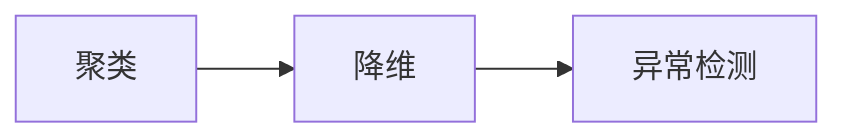

# 学前导读：无监督学习这一章到底在学什么

无监督学习和监督学习最大的区别是：**没有标签**。

这意味着你不能直接问模型“答对了吗”，而是要先问：

- 数据里有没有自然分组
- 数据能不能压缩到更少维度
- 数据里有没有明显异常点

## 先说一个很重要的学习预期

这一章最容易让新人发虚的地方，不是算法本身，而是：

- 没有标签
- 没有标准答案
- 看起来“好像都能讲”，又不知道怎样才算合理

更适合第一遍先建立的认知是：

> **无监督学习不是在直接判断对错，而是在帮助你发现数据里可能存在的结构。**

所以这一章更像“探索和假设生成”，而不是前面监督学习那种“直接学会怎么判”。

## 这一章三节是怎么串起来的

- 聚类：在没有标签时，先看数据能不能自动分群
- 降维：再看能不能把高维数据压缩得更容易看、更容易算
- 异常检测：最后看怎样找出少数“不正常”的点

## 如果你是第一次学无监督学习，最稳的顺序

更适合新人的顺序通常是：

1. 先看 [3.2 聚类算法](./01-clustering.md)  
   先建立“没有标签时，数据也可能有结构”这件事。

2. 再看 [3.3 降维算法](./02-dimensionality-reduction.md)  
   先分清“为了建模预处理”和“为了可视化探索”。

3. 最后看 [3.4 异常检测](./03-anomaly-detection.md)  
   这时你会更容易接受：不是所有任务都在分组，有些任务是在找“不属于大多数”的点。

这样学的好处是：

- 先从最容易理解的“分群”进入
- 再去理解“压缩表示”
- 最后再进入“找少数异常”这种更依赖阈值和业务判断的任务

## 这一章最容易学乱的地方

- 把无监督结果误会成唯一真相
- 只盯着图好不好看，不问结果有没有业务意义
- 聚类、降维、异常检测都学了，但不知道它们各自解决什么问题

所以这一章最值得先带走的，不是更多模型名字，而是这三个问题：

1. 我现在是在找群体，还是在压缩表示，还是在找异常？
2. 我手上的结果能不能被业务解释？
3. 如果没有标签，我要用什么证据来判断这个结果有没有价值？

## 新人这一章最该带走什么

- 知道没有标签时，问题该怎样重新表述
- 知道 K-Means、PCA、异常检测分别解决什么问题
- 知道无监督结果通常更依赖解释和业务理解，而不只是一个分数
