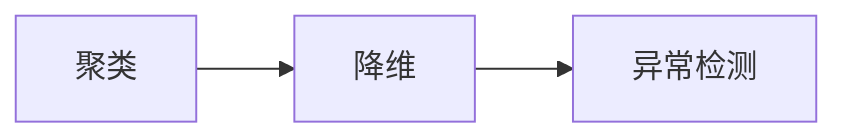

# 学前导读：无监督学习这一章到底在学什么

无监督学习和监督学习最大的区别是：**没有标签**。

这意味着你不能直接问模型“答对了吗”，而是要先问：

- 数据里有没有自然分组
- 数据能不能压缩到更少维度
- 数据里有没有明显异常点

## 这一章三节是怎么串起来的

- 聚类：在没有标签时，先看数据能不能自动分群
- 降维：再看能不能把高维数据压缩得更容易看、更容易算
- 异常检测：最后看怎样找出少数“不正常”的点

## 新人这一章最该带走什么

- 知道没有标签时，问题该怎样重新表述
- 知道 K-Means、PCA、异常检测分别解决什么问题
- 知道无监督结果通常更依赖解释和业务理解，而不只是一个分数
