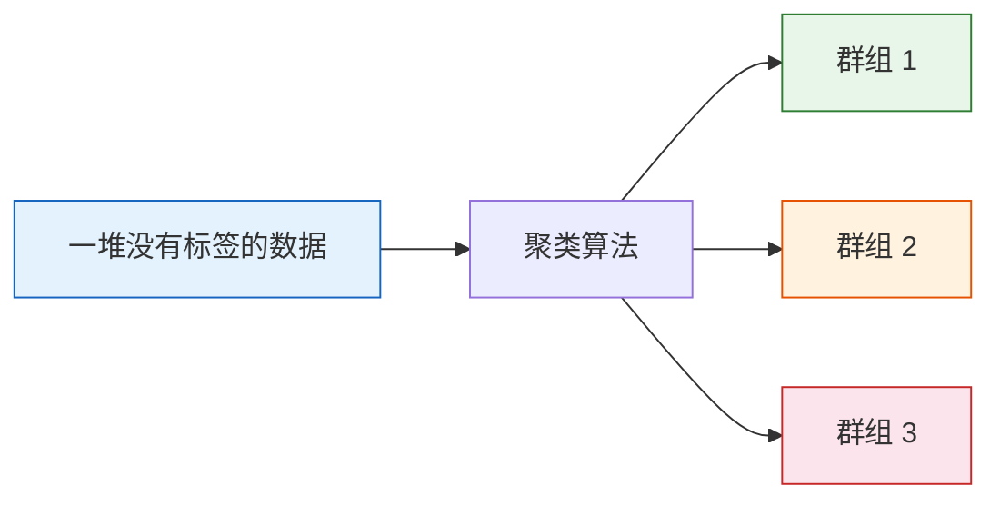
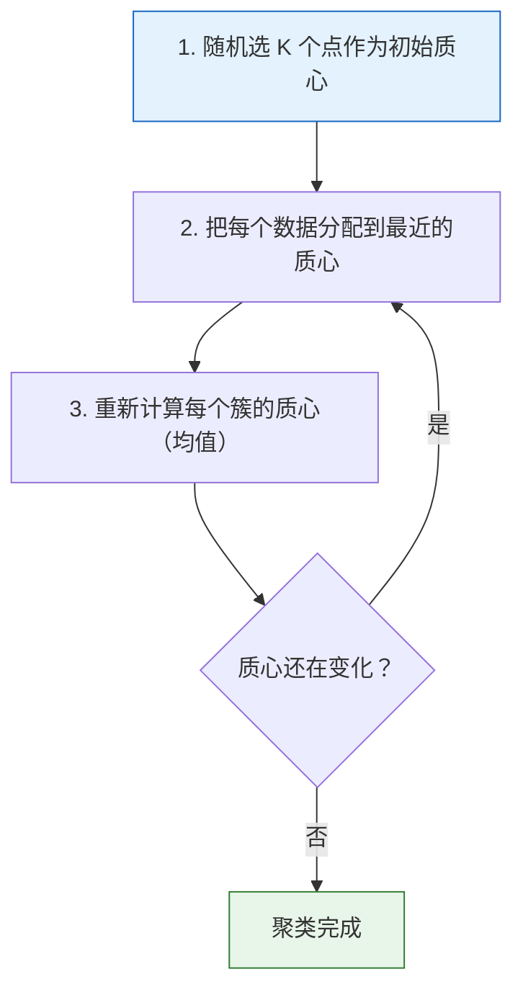
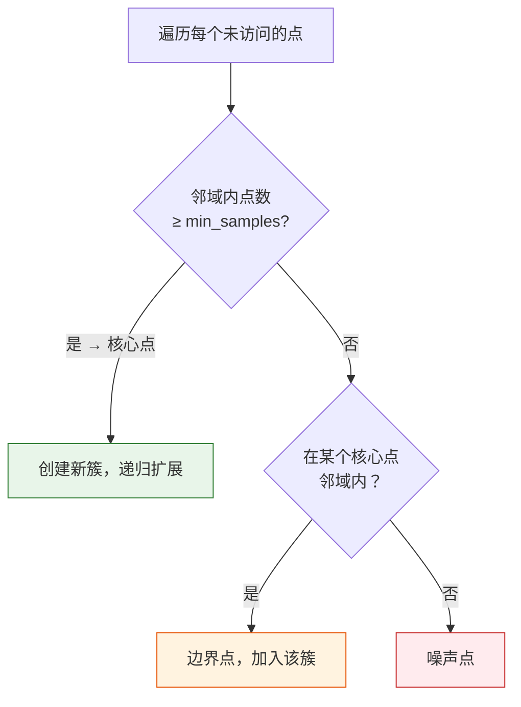

# 聚类算法

:::tip 本节定位
聚类是无监督学习中最常用的任务——**在没有标签的情况下，自动把相似的数据分到一组**。客户分群、文档归类、图像分割等场景都离不开聚类。
:::

## 学习目标

- 掌握 K-Means 聚类的原理与实现
- 理解 K-Means++ 初始化策略
- 了解层次聚类（凝聚与分裂）
- 掌握 DBSCAN 密度聚类
- 掌握 K 值选择方法与聚类评估指标

---

## 一、聚类的直觉

### 1.1 什么是聚类？

**聚类 = 把"相似的"放在一起，把"不同的"分开。**



| 应用场景 | 数据 | 聚类目标 |
|---------|------|---------|
| 客户分群 | 消费行为数据 | 找出高价值/低频/流失客户群 |
| 文档归类 | 文本向量 | 按主题自动分类 |
| 图像分割 | 像素颜色值 | 把图像分成前景/背景 |
| 基因分析 | 基因表达数据 | 找出功能相似的基因组 |

### 1.2 生成演示数据

```python
import numpy as np
import matplotlib.pyplot as plt
from sklearn.datasets import make_blobs

# 生成 3 个簇的数据
X, y_true = make_blobs(n_samples=300, centers=3, cluster_std=0.8, random_state=42)

plt.figure(figsize=(8, 6))
plt.scatter(X[:, 0], X[:, 1], s=30, alpha=0.7, color='gray')
plt.title('未标注的数据——你能看出几个群组？')
plt.xlabel('特征 1')
plt.ylabel('特征 2')
plt.grid(True, alpha=0.3)
plt.show()
```

---

## 二、K-Means 聚类

### 2.1 算法原理

K-Means 是最经典的聚类算法，步骤非常简单：



### 2.2 从零实现 K-Means

```python
def kmeans_simple(X, k, max_iters=100):
    """简易 K-Means 实现"""
    np.random.seed(42)
    # 1. 随机初始化质心
    idx = np.random.choice(len(X), k, replace=False)
    centroids = X[idx].copy()

    for iteration in range(max_iters):
        # 2. 分配每个点到最近的质心
        distances = np.sqrt(((X[:, np.newaxis] - centroids) ** 2).sum(axis=2))
        labels = distances.argmin(axis=1)

        # 3. 更新质心
        new_centroids = np.array([X[labels == i].mean(axis=0) for i in range(k)])

        # 检查收敛
        if np.allclose(centroids, new_centroids):
            print(f"在第 {iteration+1} 轮收敛")
            break
        centroids = new_centroids

    return labels, centroids

# 运行
labels, centroids = kmeans_simple(X, k=3)

# 可视化
plt.figure(figsize=(8, 6))
plt.scatter(X[:, 0], X[:, 1], c=labels, cmap='viridis', s=30, alpha=0.7)
plt.scatter(centroids[:, 0], centroids[:, 1], c='red', marker='X', s=200,
            edgecolors='black', linewidth=2, label='质心')
plt.title('K-Means 聚类结果（手动实现）')
plt.legend()
plt.grid(True, alpha=0.3)
plt.show()
```

### 2.3 用 sklearn 实现

```python
from sklearn.cluster import KMeans

kmeans = KMeans(n_clusters=3, random_state=42, n_init=10)
kmeans.fit(X)

print(f"簇标签: {np.unique(kmeans.labels_)}")
print(f"质心:\n{kmeans.cluster_centers_}")
print(f"总惯性（SSE）: {kmeans.inertia_:.2f}")

# 可视化
fig, axes = plt.subplots(1, 2, figsize=(14, 5))

# 聚类结果
axes[0].scatter(X[:, 0], X[:, 1], c=kmeans.labels_, cmap='viridis', s=30, alpha=0.7)
axes[0].scatter(kmeans.cluster_centers_[:, 0], kmeans.cluster_centers_[:, 1],
                c='red', marker='X', s=200, edgecolors='black', linewidth=2)
axes[0].set_title('K-Means 聚类结果')

# 与真实标签对比
axes[1].scatter(X[:, 0], X[:, 1], c=y_true, cmap='viridis', s=30, alpha=0.7)
axes[1].set_title('真实标签（用于对比）')

for ax in axes:
    ax.grid(True, alpha=0.3)

plt.tight_layout()
plt.show()
```

### 2.4 K-Means 的迭代过程可视化

```python
fig, axes = plt.subplots(2, 3, figsize=(15, 9))

np.random.seed(42)
idx = np.random.choice(len(X), 3, replace=False)
centroids = X[idx].copy()

for i, ax in enumerate(axes.ravel()):
    # 分配
    distances = np.sqrt(((X[:, np.newaxis] - centroids) ** 2).sum(axis=2))
    labels = distances.argmin(axis=1)

    ax.scatter(X[:, 0], X[:, 1], c=labels, cmap='viridis', s=20, alpha=0.6)
    ax.scatter(centroids[:, 0], centroids[:, 1], c='red', marker='X', s=200,
               edgecolors='black', linewidth=2)
    ax.set_title(f'第 {i+1} 轮迭代')
    ax.grid(True, alpha=0.3)

    # 更新质心
    centroids = np.array([X[labels == j].mean(axis=0) for j in range(3)])

plt.suptitle('K-Means 迭代过程', fontsize=13)
plt.tight_layout()
plt.show()
```

---

## 三、K-Means++ 初始化

### 3.1 为什么需要更好的初始化？

普通 K-Means 随机选初始质心，可能选到很差的位置，导致：
- 收敛慢
- 结果不稳定
- 陷入局部最优

### 3.2 K-Means++ 策略

**核心思想**：让初始质心尽可能分散。

1. 随机选第 1 个质心
2. 对于后续每个质心，选择**离已有质心最远**的点（概率正比于距离的平方）
3. 重复直到选够 K 个

```python
# sklearn 默认就是 K-Means++
kmeans_pp = KMeans(n_clusters=3, init='k-means++', random_state=42, n_init=10)
kmeans_random = KMeans(n_clusters=3, init='random', random_state=0, n_init=1)

kmeans_pp.fit(X)
kmeans_random.fit(X)

print(f"K-Means++ 惯性: {kmeans_pp.inertia_:.2f}")
print(f"随机初始化惯性: {kmeans_random.inertia_:.2f}")
```

:::info sklearn 默认
sklearn 的 `KMeans` 默认使用 `init='k-means++'`，所以你平时不需要特别设置。`n_init=10` 表示运行 10 次取最好的结果。
:::

---

## 四、如何选择 K 值？

K-Means 的最大问题：**需要事先指定 K**。常用两种方法来确定最优 K。

### 4.1 肘部法（Elbow Method）

计算不同 K 值下的 SSE（Sum of Squared Errors，即 `inertia_`），找"拐点"。

```python
sse = []
K_range = range(1, 11)

for k in K_range:
    km = KMeans(n_clusters=k, random_state=42, n_init=10)
    km.fit(X)
    sse.append(km.inertia_)

plt.figure(figsize=(8, 5))
plt.plot(K_range, sse, 'bo-', markersize=8)
plt.xlabel('K（簇的数量）')
plt.ylabel('SSE（惯性）')
plt.title('肘部法——选择最优 K')
plt.xticks(K_range)
plt.grid(True, alpha=0.3)

# 标注肘部
plt.annotate('肘部 → K=3', xy=(3, sse[2]), xytext=(5, sse[2] + 200),
             arrowprops=dict(arrowstyle='->', color='red'),
             fontsize=12, color='red')
plt.show()
```

### 4.2 轮廓系数（Silhouette Score）

轮廓系数衡量每个样本的聚类质量，取值范围 [-1, 1]：
- **接近 1**：样本与自己簇很紧密，与其他簇很远（好）
- **接近 0**：样本在两个簇的边界上
- **接近 -1**：样本可能被分错了

```python
from sklearn.metrics import silhouette_score, silhouette_samples

sil_scores = []
for k in range(2, 11):
    km = KMeans(n_clusters=k, random_state=42, n_init=10)
    labels = km.fit_predict(X)
    score = silhouette_score(X, labels)
    sil_scores.append(score)
    print(f"K={k}: 轮廓系数 = {score:.4f}")

plt.figure(figsize=(8, 5))
plt.plot(range(2, 11), sil_scores, 'bo-', markersize=8)
plt.xlabel('K（簇的数量）')
plt.ylabel('轮廓系数')
plt.title('轮廓系数——选择最优 K')
plt.xticks(range(2, 11))
plt.grid(True, alpha=0.3)
plt.show()
```

### 4.3 轮廓图可视化

```python
from sklearn.metrics import silhouette_samples

fig, axes = plt.subplots(1, 3, figsize=(18, 5))

for ax, k in zip(axes, [2, 3, 4]):
    km = KMeans(n_clusters=k, random_state=42, n_init=10)
    labels = km.fit_predict(X)
    sil_vals = silhouette_samples(X, labels)
    avg_score = silhouette_score(X, labels)

    y_lower = 10
    for i in range(k):
        cluster_sil = np.sort(sil_vals[labels == i])
        y_upper = y_lower + len(cluster_sil)
        ax.fill_betweenx(np.arange(y_lower, y_upper), 0, cluster_sil, alpha=0.7)
        ax.text(-0.05, y_lower + 0.5 * len(cluster_sil), str(i), fontsize=12)
        y_lower = y_upper + 10

    ax.axvline(x=avg_score, color='red', linestyle='--', label=f'平均={avg_score:.3f}')
    ax.set_title(f'K={k}')
    ax.set_xlabel('轮廓系数')
    ax.set_ylabel('样本')
    ax.legend()

plt.suptitle('不同 K 值的轮廓图', fontsize=13)
plt.tight_layout()
plt.show()
```

---

## 五、层次聚类

### 5.1 原理

层次聚类不需要预设 K 值，它构建一棵**树状图（Dendrogram）**：

**凝聚法（自底向上）**：
1. 每个点作为一个簇
2. 找最近的两个簇，合并
3. 重复直到只剩一个簇

```python
from sklearn.cluster import AgglomerativeClustering
from scipy.cluster.hierarchy import dendrogram, linkage

# 用少量数据展示树状图
X_small = X[:50]

# 计算层次结构
linkage_matrix = linkage(X_small, method='ward')

fig, axes = plt.subplots(1, 2, figsize=(15, 5))

# 树状图
dendrogram(linkage_matrix, ax=axes[0], truncate_mode='level', p=5)
axes[0].set_title('树状图（Dendrogram）')
axes[0].set_xlabel('样本')
axes[0].set_ylabel('距离')

# 聚类结果
agg = AgglomerativeClustering(n_clusters=3)
labels_agg = agg.fit_predict(X)
axes[1].scatter(X[:, 0], X[:, 1], c=labels_agg, cmap='viridis', s=30, alpha=0.7)
axes[1].set_title('层次聚类结果 (K=3)')
axes[1].grid(True, alpha=0.3)

plt.tight_layout()
plt.show()
```

### 5.2 链接方法

| 方法 | 两个簇间的距离定义 | 特点 |
|------|-------------------|------|
| `ward` | 合并后 SSE 增量最小 | 最常用，倾向大小均匀的簇 |
| `complete` | 最远点之间的距离 | 对异常值敏感 |
| `average` | 所有点对的平均距离 | 折中方案 |
| `single` | 最近点之间的距离 | 容易产生链式效应 |

---

## 六、DBSCAN 密度聚类

### 6.1 K-Means 的局限

K-Means 假设簇是**球形**的，对非球形数据效果很差：

```python
from sklearn.datasets import make_moons, make_circles

fig, axes = plt.subplots(1, 2, figsize=(12, 5))

# 半月形数据 + K-Means
X_moons, y_moons = make_moons(n_samples=300, noise=0.1, random_state=42)
km_moons = KMeans(n_clusters=2, random_state=42, n_init=10)
labels_km = km_moons.fit_predict(X_moons)
axes[0].scatter(X_moons[:, 0], X_moons[:, 1], c=labels_km, cmap='coolwarm', s=20)
axes[0].set_title('K-Means 在半月形数据上（失败）')

# 同心圆数据 + K-Means
X_circles, y_circles = make_circles(n_samples=300, noise=0.05, factor=0.5, random_state=42)
km_circles = KMeans(n_clusters=2, random_state=42, n_init=10)
labels_km2 = km_circles.fit_predict(X_circles)
axes[1].scatter(X_circles[:, 0], X_circles[:, 1], c=labels_km2, cmap='coolwarm', s=20)
axes[1].set_title('K-Means 在同心圆数据上（失败）')

for ax in axes:
    ax.grid(True, alpha=0.3)
    ax.set_aspect('equal')

plt.tight_layout()
plt.show()
```

### 6.2 DBSCAN 原理

DBSCAN（Density-Based Spatial Clustering of Applications with Noise）基于**密度**聚类：

| 概念 | 说明 |
|------|------|
| **eps** | 邻域半径 |
| **min_samples** | 核心点所需的最少邻居数 |
| **核心点** | 邻域内至少有 min_samples 个点 |
| **边界点** | 在核心点邻域内，但自己不是核心点 |
| **噪声点** | 既不是核心点也不在任何核心点邻域内 |



### 6.3 DBSCAN 实战

```python
from sklearn.cluster import DBSCAN

fig, axes = plt.subplots(2, 2, figsize=(12, 10))

# 半月形数据
db_moons = DBSCAN(eps=0.2, min_samples=5)
labels_db_moons = db_moons.fit_predict(X_moons)
axes[0][0].scatter(X_moons[:, 0], X_moons[:, 1], c=labels_db_moons, cmap='viridis', s=20)
n_noise = (labels_db_moons == -1).sum()
axes[0][0].set_title(f'DBSCAN 半月形（噪声点: {n_noise}）')

# 同心圆数据
db_circles = DBSCAN(eps=0.15, min_samples=5)
labels_db_circles = db_circles.fit_predict(X_circles)
axes[0][1].scatter(X_circles[:, 0], X_circles[:, 1], c=labels_db_circles, cmap='viridis', s=20)
n_noise = (labels_db_circles == -1).sum()
axes[0][1].set_title(f'DBSCAN 同心圆（噪声点: {n_noise}）')

# 普通数据
db_blobs = DBSCAN(eps=0.8, min_samples=5)
labels_db_blobs = db_blobs.fit_predict(X)
axes[1][0].scatter(X[:, 0], X[:, 1], c=labels_db_blobs, cmap='viridis', s=20)
n_clusters = len(set(labels_db_blobs)) - (1 if -1 in labels_db_blobs else 0)
axes[1][0].set_title(f'DBSCAN 球形数据（发现 {n_clusters} 个簇）')

# 对比 K-Means vs DBSCAN
axes[1][1].scatter(X_moons[:, 0], X_moons[:, 1], c=labels_km, cmap='coolwarm', s=20)
axes[1][1].set_title('K-Means 半月形（对比）')

for ax in axes.ravel():
    ax.grid(True, alpha=0.3)

plt.tight_layout()
plt.show()
```

### 6.4 DBSCAN 参数调优

```python
# eps 的影响
fig, axes = plt.subplots(1, 4, figsize=(18, 4))
eps_values = [0.1, 0.2, 0.5, 1.0]

for ax, eps in zip(axes, eps_values):
    db = DBSCAN(eps=eps, min_samples=5)
    labels = db.fit_predict(X_moons)
    n_clusters = len(set(labels)) - (1 if -1 in labels else 0)
    n_noise = (labels == -1).sum()
    ax.scatter(X_moons[:, 0], X_moons[:, 1], c=labels, cmap='viridis', s=20)
    ax.set_title(f'eps={eps}\n簇: {n_clusters}, 噪声: {n_noise}')
    ax.grid(True, alpha=0.3)

plt.suptitle('DBSCAN eps 参数的影响', fontsize=13)
plt.tight_layout()
plt.show()
```

### 6.5 DBSCAN 的优缺点

| 优点 | 缺点 |
|------|------|
| 不需要预设 K | 需要调 eps 和 min_samples |
| 可以发现任意形状的簇 | 对高维数据效果差 |
| 自动识别噪声点 | 不同密度的簇难以处理 |
| 对异常值鲁棒 | 对参数敏感 |

---

## 七、聚类算法对比

```python
from sklearn.cluster import KMeans, AgglomerativeClustering, DBSCAN
from sklearn.datasets import make_blobs, make_moons, make_circles

datasets = [
    ("球形簇", make_blobs(n_samples=300, centers=3, cluster_std=0.8, random_state=42)),
    ("半月形", make_moons(n_samples=300, noise=0.1, random_state=42)),
    ("同心圆", make_circles(n_samples=300, noise=0.05, factor=0.5, random_state=42)),
]

algorithms = [
    ("K-Means", lambda: KMeans(n_clusters=3 if True else 2, random_state=42, n_init=10)),
    ("层次聚类", lambda: AgglomerativeClustering(n_clusters=3 if True else 2)),
    ("DBSCAN", lambda: DBSCAN(eps=0.5, min_samples=5)),
]

fig, axes = plt.subplots(3, 3, figsize=(15, 14))

for row, (data_name, (X_d, y_d)) in enumerate(datasets):
    n_real = len(set(y_d))
    for col, (algo_name, make_algo) in enumerate(algorithms):
        ax = axes[row][col]

        if algo_name in ['K-Means', '层次聚类']:
            algo = make_algo()
            algo.n_clusters = n_real
            labels = algo.fit_predict(X_d)
        else:
            # 调整 DBSCAN eps
            eps_map = {0: 0.8, 1: 0.2, 2: 0.15}
            algo = DBSCAN(eps=eps_map[row], min_samples=5)
            labels = algo.fit_predict(X_d)

        ax.scatter(X_d[:, 0], X_d[:, 1], c=labels, cmap='viridis', s=15, alpha=0.7)
        if row == 0:
            ax.set_title(algo_name, fontsize=12)
        if col == 0:
            ax.set_ylabel(data_name, fontsize=12)
        ax.grid(True, alpha=0.3)

plt.suptitle('三种聚类算法在不同数据上的表现', fontsize=14)
plt.tight_layout()
plt.show()
```

| | K-Means | 层次聚类 | DBSCAN |
|---|---------|---------|--------|
| 需要指定 K | 是 | 是 | 否 |
| 簇形状 | 球形 | 球形/链状 | 任意形状 |
| 噪声处理 | 差 | 差 | 好 |
| 大数据 | 快 | 慢 | 中等 |
| 适用场景 | 球形、大数据 | 需要层次结构 | 非规则形状、有噪声 |

---

## 八、小结

| 要点 | 说明 |
|------|------|
| K-Means | 最经典，分配到最近质心，迭代更新 |
| K-Means++ | 更好的初始化，sklearn 默认 |
| K 值选择 | 肘部法（SSE 拐点）+ 轮廓系数（越大越好） |
| 层次聚类 | 不需预设 K，可看树状图 |
| DBSCAN | 基于密度，可发现任意形状簇，自动标记噪声 |

:::info 连接后续
- **下一节**：降维算法——PCA、t-SNE、UMAP
- **第三阶段回顾**：特征值与 PCA（1.3 节）
:::

---

## 动手练习

### 练习 1：K 值选择

用 `make_blobs(centers=5)` 生成 5 个簇的数据，但假装不知道 K=5。用肘部法和轮廓系数找到最优 K。

### 练习 2：DBSCAN 调参

用 `make_moons(noise=0.15)` 数据，尝试不同的 `eps`（0.05~1.0）和 `min_samples`（3~15）组合，画出 3×3 的子图网格，找到最优参数。

### 练习 3：真实数据聚类

用 sklearn 的 `load_iris()` 数据集（去掉标签），对比 K-Means、层次聚类、DBSCAN 的效果。用真实标签计算调整兰德指数（`adjusted_rand_score`）评估质量。

### 练习 4：客户分群

生成模拟的客户数据（消费金额、消费频次、最近消费天数），先标准化，再用 K-Means 聚类，分析每个群组的特征（用 Pandas groupby）。
