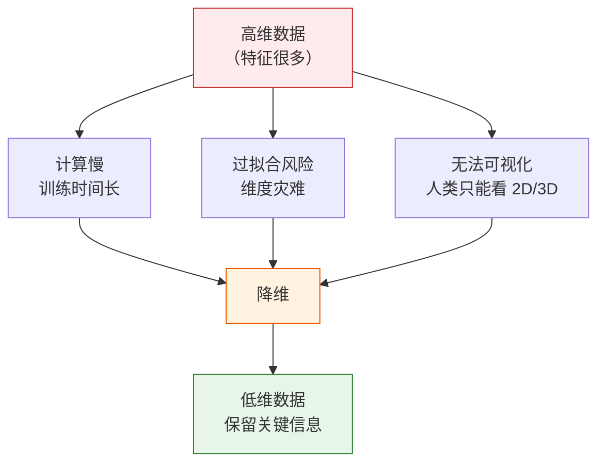
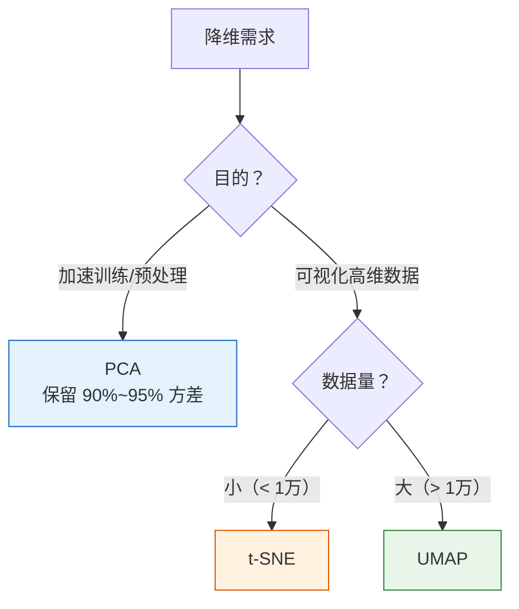

# 降维算法

:::tip 本节定位
真实数据往往有几十甚至上千个特征。降维能**减少特征数量，同时保留重要信息**——既能加速训练，又能帮助可视化。本节在第三阶段 PCA 基础上深入实战应用。
:::

## 学习目标

- 深入理解 PCA 的原理与实战应用（与第三阶段衔接）
- 掌握方差解释比分析
- 了解 t-SNE 可视化原理与使用
- 了解 UMAP 降维方法

---

## 一、为什么需要降维？

### 1.1 高维数据的问题



| 问题 | 说明 |
|------|------|
| **维度灾难** | 特征越多，数据越稀疏，模型越难学习 |
| **计算成本** | 特征多 → 训练慢、内存大 |
| **多重共线性** | 很多特征高度相关，是冗余的 |
| **可视化** | 超过 3 维的数据无法直接画图 |

### 1.2 降维的两种思路

| 思路 | 方法 | 说明 |
|------|------|------|
| **特征选择** | 挑选重要特征 | 保留原始特征的子集 |
| **特征提取** | 生成新特征 | 把原始特征变换成更少的新特征（PCA、t-SNE） |

---

## 二、PCA 实战

### 2.1 回顾原理

:::info 与第三阶段的衔接
在第三阶段 1.3 节"特征值与特征向量"中，你已经学过 PCA 的数学原理：
- 计算协方差矩阵
- 求特征值和特征向量
- 选最大特征值对应的方向作为主成分

本节重点是**实战应用**——如何在真实数据上使用 PCA。
:::

**PCA 核心思想**：找到数据方差最大的方向，投影过去。

### 2.2 手写数字降维

```python
from sklearn.datasets import load_digits
from sklearn.preprocessing import StandardScaler
from sklearn.decomposition import PCA
import numpy as np
import matplotlib.pyplot as plt

# 加载手写数字数据
digits = load_digits()
X, y = digits.data, digits.target
print(f"原始数据: {X.shape[0]} 样本, {X.shape[1]} 特征")

# 先看几个样本
fig, axes = plt.subplots(2, 10, figsize=(15, 3))
for i, ax in enumerate(axes.ravel()):
    ax.imshow(digits.images[i], cmap='gray')
    ax.set_title(str(y[i]), fontsize=9)
    ax.axis('off')
plt.suptitle('手写数字样本（8×8 = 64 个特征）')
plt.tight_layout()
plt.show()

# 标准化
scaler = StandardScaler()
X_scaled = scaler.fit_transform(X)

# PCA 降到 2 维
pca_2d = PCA(n_components=2)
X_2d = pca_2d.fit_transform(X_scaled)
print(f"降维后: {X_2d.shape}")
print(f"保留方差比: {pca_2d.explained_variance_ratio_.sum():.1%}")

# 可视化
plt.figure(figsize=(10, 8))
scatter = plt.scatter(X_2d[:, 0], X_2d[:, 1], c=y, cmap='tab10', s=10, alpha=0.6)
plt.colorbar(scatter, label='数字')
plt.xlabel(f'PC1（方差占比 {pca_2d.explained_variance_ratio_[0]:.1%}）')
plt.ylabel(f'PC2（方差占比 {pca_2d.explained_variance_ratio_[1]:.1%}）')
plt.title('PCA 降维到 2D（手写数字）')
plt.grid(True, alpha=0.3)
plt.show()
```

### 2.3 方差解释比分析

**关键问题**：保留多少个主成分才够？

```python
# 用全部主成分
pca_full = PCA()
pca_full.fit(X_scaled)

# 方差解释比
explained = pca_full.explained_variance_ratio_
cumulative = np.cumsum(explained)

fig, axes = plt.subplots(1, 2, figsize=(14, 5))

# 每个主成分的方差占比
axes[0].bar(range(1, len(explained)+1), explained, color='steelblue', alpha=0.7)
axes[0].set_xlabel('主成分编号')
axes[0].set_ylabel('方差解释比')
axes[0].set_title('各主成分的方差占比')
axes[0].set_xlim(0, 30)

# 累积方差
axes[1].plot(range(1, len(cumulative)+1), cumulative, 'bo-', markersize=3)
axes[1].axhline(y=0.9, color='r', linestyle='--', label='90% 阈值')
axes[1].axhline(y=0.95, color='orange', linestyle='--', label='95% 阈值')

# 标注达到 90% 的点
n_90 = np.argmax(cumulative >= 0.9) + 1
n_95 = np.argmax(cumulative >= 0.95) + 1
axes[1].axvline(x=n_90, color='r', linestyle=':', alpha=0.5)
axes[1].axvline(x=n_95, color='orange', linestyle=':', alpha=0.5)

axes[1].set_xlabel('主成分数量')
axes[1].set_ylabel('累积方差解释比')
axes[1].set_title('累积方差解释比（Scree Plot）')
axes[1].legend()

for ax in axes:
    ax.grid(True, alpha=0.3)

plt.tight_layout()
plt.show()

print(f"保留 90% 方差需要 {n_90} 个主成分（原始 64 个）")
print(f"保留 95% 方差需要 {n_95} 个主成分（原始 64 个）")
```

### 2.4 PCA 对模型性能的影响

```python
from sklearn.model_selection import train_test_split
from sklearn.linear_model import LogisticRegression
from sklearn.pipeline import make_pipeline
import time

X_train, X_test, y_train, y_test = train_test_split(X, y, test_size=0.2, random_state=42)

# 对比不同主成分数量
n_components_list = [2, 5, 10, 20, 30, 64]
results = []

for n in n_components_list:
    pipe = make_pipeline(
        StandardScaler(),
        PCA(n_components=n) if n < 64 else PCA(),
        LogisticRegression(max_iter=5000, random_state=42)
    )

    start = time.time()
    pipe.fit(X_train, y_train)
    train_time = time.time() - start

    score = pipe.score(X_test, y_test)
    results.append({'n': n, 'score': score, 'time': train_time})
    print(f"PC={n:3d} | 准确率: {score:.1%} | 训练时间: {train_time:.3f}s")

# 可视化
fig, ax1 = plt.subplots(figsize=(8, 5))
ax2 = ax1.twinx()

ns = [r['n'] for r in results]
scores = [r['score'] for r in results]
times = [r['time'] for r in results]

ax1.plot(ns, scores, 'bo-', label='准确率')
ax2.plot(ns, times, 'rs-', label='训练时间')

ax1.set_xlabel('主成分数量')
ax1.set_ylabel('准确率', color='blue')
ax2.set_ylabel('训练时间 (s)', color='red')
ax1.set_title('PCA 降维对模型性能与速度的影响')

ax1.legend(loc='lower right')
ax2.legend(loc='center right')
ax1.grid(True, alpha=0.3)
plt.tight_layout()
plt.show()
```

---

## 三、t-SNE 可视化

### 3.1 PCA 的局限

PCA 是**线性**降维——它只能找到线性方向。对于复杂的高维数据，不同类别可能在 PCA 2D 图上重叠。

### 3.2 t-SNE 原理

t-SNE（t-distributed Stochastic Neighbor Embedding）是专门为**可视化**设计的非线性降维方法。

**核心思想**：
- 在高维空间中计算点对之间的"相似度"
- 在低维空间中也计算"相似度"
- 调整低维坐标，使两个空间的相似度分布尽可能一致

| 特点 | 说明 |
|------|------|
| 非线性 | 可以展示复杂的数据结构 |
| 专为可视化 | 通常降到 2D 或 3D |
| 保持局部结构 | 相近的点在低维空间也相近 |
| 随机性 | 每次运行结果可能不同 |

### 3.3 t-SNE 实战

```python
from sklearn.manifold import TSNE

# t-SNE 降维
tsne = TSNE(n_components=2, random_state=42, perplexity=30)
X_tsne = tsne.fit_transform(X_scaled)

# PCA vs t-SNE 对比
fig, axes = plt.subplots(1, 2, figsize=(16, 6))

axes[0].scatter(X_2d[:, 0], X_2d[:, 1], c=y, cmap='tab10', s=10, alpha=0.6)
axes[0].set_title('PCA 降维到 2D')
axes[0].set_xlabel('PC1')
axes[0].set_ylabel('PC2')

axes[1].scatter(X_tsne[:, 0], X_tsne[:, 1], c=y, cmap='tab10', s=10, alpha=0.6)
axes[1].set_title('t-SNE 降维到 2D')
axes[1].set_xlabel('t-SNE 1')
axes[1].set_ylabel('t-SNE 2')

for ax in axes:
    ax.grid(True, alpha=0.3)

plt.suptitle('PCA vs t-SNE（手写数字数据）', fontsize=13)
plt.tight_layout()
plt.show()
```

### 3.4 perplexity 参数

`perplexity` 控制 t-SNE 关注的"邻居数量"，影响可视化效果：

```python
fig, axes = plt.subplots(1, 4, figsize=(20, 4))
perplexities = [5, 15, 30, 50]

for ax, perp in zip(axes, perplexities):
    tsne = TSNE(n_components=2, perplexity=perp, random_state=42)
    X_t = tsne.fit_transform(X_scaled)
    ax.scatter(X_t[:, 0], X_t[:, 1], c=y, cmap='tab10', s=8, alpha=0.6)
    ax.set_title(f'perplexity = {perp}')
    ax.grid(True, alpha=0.3)

plt.suptitle('t-SNE perplexity 参数的影响', fontsize=13)
plt.tight_layout()
plt.show()
```

:::warning t-SNE 注意事项
1. **只用于可视化**，不要用 t-SNE 做特征提取后再训练模型
2. **速度慢**，大数据集先用 PCA 降到 50 维再跑 t-SNE
3. **距离无意义**，不同簇之间的距离不能比较大小
4. **每次运行结果不同**（设 `random_state` 可固定）
:::

---

## 四、UMAP 降维

### 4.1 UMAP 简介

UMAP（Uniform Manifold Approximation and Projection）是比 t-SNE 更快、更能保持全局结构的降维方法。

| | t-SNE | UMAP |
|---|-------|------|
| 速度 | 慢 | 快得多 |
| 全局结构 | 不保持 | 较好保持 |
| 可用于特征提取 | 不推荐 | 可以 |
| 参数 | `perplexity` | `n_neighbors`, `min_dist` |

### 4.2 UMAP 实战

```bash
pip install umap-learn
```

```python
# UMAP 需要安装: pip install umap-learn
try:
    import umap

    reducer = umap.UMAP(n_components=2, random_state=42)
    X_umap = reducer.fit_transform(X_scaled)

    # 三种方法对比
    fig, axes = plt.subplots(1, 3, figsize=(18, 5))

    axes[0].scatter(X_2d[:, 0], X_2d[:, 1], c=y, cmap='tab10', s=10, alpha=0.6)
    axes[0].set_title('PCA')

    axes[1].scatter(X_tsne[:, 0], X_tsne[:, 1], c=y, cmap='tab10', s=10, alpha=0.6)
    axes[1].set_title('t-SNE')

    axes[2].scatter(X_umap[:, 0], X_umap[:, 1], c=y, cmap='tab10', s=10, alpha=0.6)
    axes[2].set_title('UMAP')

    for ax in axes:
        ax.grid(True, alpha=0.3)

    plt.suptitle('PCA vs t-SNE vs UMAP（手写数字）', fontsize=13)
    plt.tight_layout()
    plt.show()

except ImportError:
    print("请先安装 umap-learn: pip install umap-learn")
```

### 4.3 UMAP 参数

| 参数 | 说明 | 推荐 |
|------|------|------|
| `n_neighbors` | 局部邻居数（类似 perplexity） | 15（默认） |
| `min_dist` | 低维空间中点的最小距离 | 0.1（默认） |
| `n_components` | 降维到的维度 | 2 或 3 |
| `metric` | 距离度量 | 'euclidean'（默认） |

---

## 五、降维方法总结

| 方法 | 类型 | 速度 | 适用场景 |
|------|------|------|---------|
| **PCA** | 线性 | 快 | 特征提取、数据压缩、预处理 |
| **t-SNE** | 非线性 | 慢 | 高维数据可视化（2D/3D） |
| **UMAP** | 非线性 | 中等 | 可视化 + 特征提取 |



---

## 六、小结

| 要点 | 说明 |
|------|------|
| PCA | 线性降维，保留最大方差方向，可用于特征提取 |
| 方差解释比 | 累积达 90%~95% 即可确定保留多少主成分 |
| t-SNE | 非线性，专为可视化，保持局部结构 |
| UMAP | 比 t-SNE 快，能保持全局结构 |

:::info 连接后续
- **下一节**：异常检测——找出数据中的"不正常"
- **第三阶段回顾**：PCA 的特征值原理（1.3 节）
:::

---

## 动手练习

### 练习 1：Iris PCA 降维

用 `load_iris()` 做 PCA 降维到 2D 和 3D（用 `mpl_toolkits.mplot3d`），对比哪种更好地分开了三个品种。

### 练习 2：方差解释比

用 `load_wine()` 数据做 PCA，画出 Scree Plot，确定保留多少主成分能达到 95% 的方差解释比。

### 练习 3：t-SNE vs PCA

用 `load_digits()` 数据，对比 PCA 和 t-SNE 在 2D 可视化上的效果。尝试不同的 `perplexity` 值（5, 15, 30, 50, 100），观察哪个效果最好。

### 练习 4：降维 + 分类

在 `load_digits()` 上，先用 PCA 降维到不同维度（5, 10, 20, 30, 50），再用逻辑回归分类，画出"维度 vs 准确率"曲线，找到最优维度。
