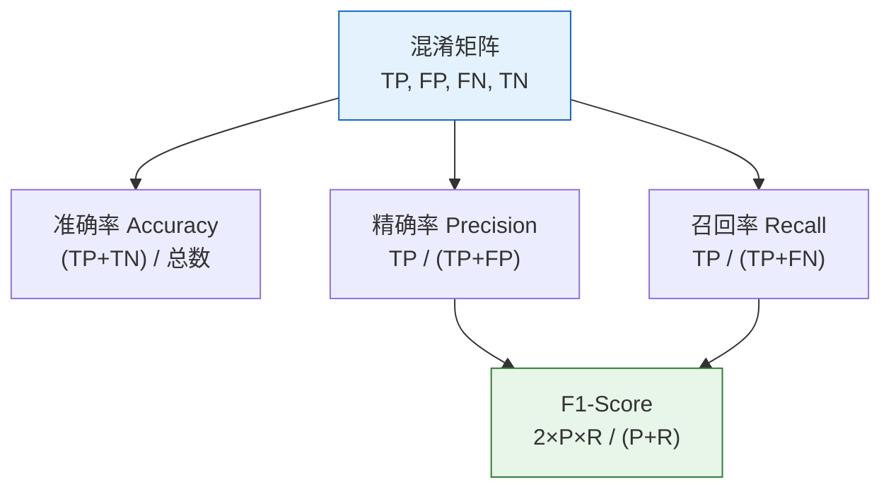
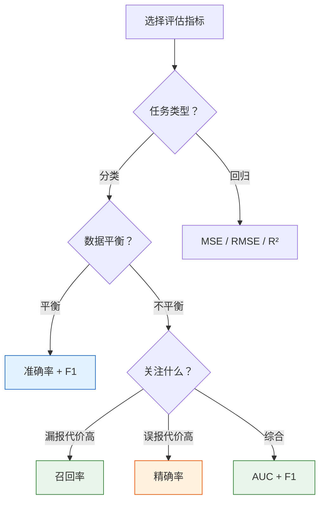

# 评估指标

:::tip 本节定位
训练完模型后，**怎么判断模型好不好**？准确率 95% 一定好吗？不一定！选错了指标，可能做出完全错误的决策。本节帮你掌握各种场景下应该关注什么指标。
:::

## 学习目标

- 掌握分类指标：准确率、精确率、召回率、F1-score、混淆矩阵
- 理解 ROC 曲线与 AUC
- 掌握回归指标：MSE、RMSE、MAE、R²
- 理解多分类评估（macro、micro、weighted）

---

## 一、为什么准确率不够？

### 1.1 不平衡数据的陷阱

```python
import numpy as np

# 假设：1000 封邮件中有 10 封是垃圾邮件
y_true = np.array([0] * 990 + [1] * 10)

# "聪明"的模型：全部预测为正常
y_pred = np.zeros(1000)

accuracy = np.mean(y_true == y_pred)
print(f"准确率: {accuracy:.1%}")
# 准确率 99%！但一封垃圾邮件都没抓到！
```

:::warning 准确率的陷阱
在不平衡数据中，**永远预测多数类**就能获得很高的准确率。但这样的模型毫无用处。我们需要更精细的指标。
:::

---

## 二、混淆矩阵——一切分类指标的基础

### 2.1 四个基本量

| | 预测为正（Positive） | 预测为负（Negative） |
|---|---------------------|---------------------|
| **实际为正** | TP（真正例） | FN（假负例/漏报） |
| **实际为负** | FP（假正例/误报） | TN（真负例） |

```python
from sklearn.metrics import confusion_matrix, ConfusionMatrixDisplay
from sklearn.datasets import load_breast_cancer
from sklearn.model_selection import train_test_split
from sklearn.linear_model import LogisticRegression
import matplotlib.pyplot as plt

# 乳腺癌数据集
cancer = load_breast_cancer()
X_train, X_test, y_train, y_test = train_test_split(
    cancer.data, cancer.target, test_size=0.2, random_state=42
)

model = LogisticRegression(max_iter=10000, random_state=42)
model.fit(X_train, y_train)
y_pred = model.predict(X_test)

# 混淆矩阵
cm = confusion_matrix(y_test, y_pred)
print("混淆矩阵:")
print(cm)

fig, ax = plt.subplots(figsize=(6, 5))
disp = ConfusionMatrixDisplay(cm, display_labels=['恶性', '良性'])
disp.plot(ax=ax, cmap='Blues')
ax.set_title('乳腺癌分类混淆矩阵')
plt.tight_layout()
plt.show()
```

### 2.2 从混淆矩阵推导指标



---

## 三、分类指标详解

### 3.1 精确率（Precision）

> **Precision = TP / (TP + FP)**
>
> "模型说是正例的里面，有多少真的是正例？"

**关注场景**：**误报代价高**——如推荐系统（推错了用户体验差）、垃圾邮件检测（误判正常邮件很烦）。

### 3.2 召回率（Recall / Sensitivity）

> **Recall = TP / (TP + FN)**
>
> "真正的正例里面，模型抓到了多少？"

**关注场景**：**漏报代价高**——如疾病筛查（漏诊很危险）、欺诈检测（漏过欺诈损失大）。

### 3.3 F1-Score

> **F1 = 2 × Precision × Recall / (Precision + Recall)**
>
> 精确率和召回率的调和平均。

```python
from sklearn.metrics import accuracy_score, precision_score, recall_score, f1_score

print(f"准确率 (Accuracy):  {accuracy_score(y_test, y_pred):.4f}")
print(f"精确率 (Precision): {precision_score(y_test, y_pred):.4f}")
print(f"召回率 (Recall):    {recall_score(y_test, y_pred):.4f}")
print(f"F1-Score:           {f1_score(y_test, y_pred):.4f}")
```

### 3.4 精确率 vs 召回率的权衡

```python
from sklearn.metrics import precision_recall_curve

# 获取不同阈值下的精确率和召回率
y_proba = model.predict_proba(X_test)[:, 1]
precisions, recalls, thresholds = precision_recall_curve(y_test, y_proba)

fig, axes = plt.subplots(1, 2, figsize=(14, 5))

# PR 曲线
axes[0].plot(recalls, precisions, 'b-', linewidth=2)
axes[0].set_xlabel('召回率 (Recall)')
axes[0].set_ylabel('精确率 (Precision)')
axes[0].set_title('Precision-Recall 曲线')
axes[0].grid(True, alpha=0.3)

# 阈值的影响
axes[1].plot(thresholds, precisions[:-1], 'b-', label='精确率')
axes[1].plot(thresholds, recalls[:-1], 'r-', label='召回率')
axes[1].set_xlabel('分类阈值')
axes[1].set_ylabel('分数')
axes[1].set_title('阈值对精确率/召回率的影响')
axes[1].legend()
axes[1].grid(True, alpha=0.3)

plt.tight_layout()
plt.show()
```

:::info 如何选择？
- **宁可误报也不漏报**（如疾病筛查）→ 优先**召回率**，降低阈值
- **宁可漏报也不误报**（如垃圾邮件）→ 优先**精确率**，提高阈值
- **两者都重要** → 看 **F1-Score**
:::

---

## 四、ROC 曲线与 AUC

### 4.1 ROC 曲线

ROC（Receiver Operating Characteristic）曲线展示不同阈值下的 **True Positive Rate vs False Positive Rate**。

- **TPR（召回率）= TP / (TP + FN)**
- **FPR = FP / (FP + TN)**

```python
from sklearn.metrics import roc_curve, roc_auc_score

fpr, tpr, thresholds_roc = roc_curve(y_test, y_proba)
auc = roc_auc_score(y_test, y_proba)

plt.figure(figsize=(7, 6))
plt.plot(fpr, tpr, 'b-', linewidth=2, label=f'逻辑回归 (AUC = {auc:.4f})')
plt.plot([0, 1], [0, 1], 'k--', alpha=0.5, label='随机猜测 (AUC = 0.5)')
plt.fill_between(fpr, tpr, alpha=0.1, color='blue')
plt.xlabel('False Positive Rate (FPR)')
plt.ylabel('True Positive Rate (TPR)')
plt.title('ROC 曲线')
plt.legend()
plt.grid(True, alpha=0.3)
plt.show()
```

### 4.2 AUC 含义

**AUC（Area Under Curve）= ROC 曲线下方的面积。**

| AUC 值 | 含义 |
|--------|------|
| 1.0 | 完美分类 |
| 0.9~1.0 | 优秀 |
| 0.8~0.9 | 好 |
| 0.7~0.8 | 一般 |
| 0.5 | 等于随机猜测 |
| < 0.5 | 比随机还差（模型有问题） |

### 4.3 多模型 ROC 对比

```python
from sklearn.tree import DecisionTreeClassifier
from sklearn.ensemble import RandomForestClassifier
from sklearn.svm import SVC

models = {
    '逻辑回归': LogisticRegression(max_iter=10000, random_state=42),
    '决策树': DecisionTreeClassifier(max_depth=5, random_state=42),
    '随机森林': RandomForestClassifier(n_estimators=100, random_state=42),
}

plt.figure(figsize=(8, 6))
for name, m in models.items():
    m.fit(X_train, y_train)
    if hasattr(m, 'predict_proba'):
        proba = m.predict_proba(X_test)[:, 1]
    else:
        proba = m.decision_function(X_test)
    fpr, tpr, _ = roc_curve(y_test, proba)
    auc = roc_auc_score(y_test, proba)
    plt.plot(fpr, tpr, linewidth=2, label=f'{name} (AUC={auc:.4f})')

plt.plot([0, 1], [0, 1], 'k--', alpha=0.5)
plt.xlabel('FPR')
plt.ylabel('TPR')
plt.title('多模型 ROC 曲线对比')
plt.legend()
plt.grid(True, alpha=0.3)
plt.show()
```

---

## 五、回归指标

### 5.1 常用指标

| 指标 | 公式 | 说明 |
|------|------|------|
| **MSE** | `mean((y - ŷ)²)` | 均方误差，惩罚大误差 |
| **RMSE** | `sqrt(MSE)` | 与 y 同单位，更直觉 |
| **MAE** | `mean(\|y - ŷ\|)` | 平均绝对误差，对异常值更鲁棒 |
| **R²** | `1 - SS_res/SS_tot` | 可解释方差比，越接近 1 越好 |

```python
from sklearn.datasets import load_diabetes
from sklearn.linear_model import LinearRegression, Ridge
from sklearn.model_selection import train_test_split
from sklearn.metrics import mean_squared_error, mean_absolute_error, r2_score
import numpy as np

# 加载数据
diabetes = load_diabetes()
X_train, X_test, y_train, y_test = train_test_split(
    diabetes.data, diabetes.target, test_size=0.2, random_state=42
)

# 训练模型
model = LinearRegression()
model.fit(X_train, y_train)
y_pred = model.predict(X_test)

# 计算指标
mse = mean_squared_error(y_test, y_pred)
rmse = np.sqrt(mse)
mae = mean_absolute_error(y_test, y_pred)
r2 = r2_score(y_test, y_pred)

print(f"MSE:  {mse:.2f}")
print(f"RMSE: {rmse:.2f}")
print(f"MAE:  {mae:.2f}")
print(f"R²:   {r2:.4f}")
```

### 5.2 可视化：残差分析

```python
residuals = y_test - y_pred

fig, axes = plt.subplots(1, 3, figsize=(16, 4))

# 预测 vs 实际
axes[0].scatter(y_test, y_pred, alpha=0.6, s=20, color='steelblue')
axes[0].plot([y_test.min(), y_test.max()], [y_test.min(), y_test.max()], 'r--', linewidth=2)
axes[0].set_xlabel('实际值')
axes[0].set_ylabel('预测值')
axes[0].set_title(f'预测 vs 实际 (R²={r2:.3f})')

# 残差分布
axes[1].hist(residuals, bins=20, color='steelblue', edgecolor='white', alpha=0.7)
axes[1].axvline(x=0, color='red', linestyle='--')
axes[1].set_xlabel('残差')
axes[1].set_ylabel('频数')
axes[1].set_title('残差分布（应接近正态）')

# 残差 vs 预测值
axes[2].scatter(y_pred, residuals, alpha=0.6, s=20, color='steelblue')
axes[2].axhline(y=0, color='red', linestyle='--')
axes[2].set_xlabel('预测值')
axes[2].set_ylabel('残差')
axes[2].set_title('残差 vs 预测值（应随机分布）')

for ax in axes:
    ax.grid(True, alpha=0.3)

plt.tight_layout()
plt.show()
```

---

## 六、多分类评估

### 6.1 三种平均方式

对于多分类问题，精确率/召回率/F1 有三种计算方式：

| 方式 | 说明 | 适用场景 |
|------|------|---------|
| **macro** | 每个类别算一次，取平均 | 各类同等重要 |
| **micro** | 全局 TP/FP/FN，算一次 | 关注整体表现 |
| **weighted** | 按类别样本数加权平均 | 类别不平衡时 |

```python
from sklearn.datasets import load_iris
from sklearn.metrics import classification_report
from sklearn.model_selection import train_test_split
from sklearn.linear_model import LogisticRegression

iris = load_iris()
X_train, X_test, y_train, y_test = train_test_split(
    iris.data, iris.target, test_size=0.2, random_state=42
)

model = LogisticRegression(max_iter=200, random_state=42)
model.fit(X_train, y_train)
y_pred = model.predict(X_test)

print(classification_report(y_test, y_pred, target_names=iris.target_names))
```

### 6.2 多分类混淆矩阵

```python
from sklearn.metrics import confusion_matrix

cm = confusion_matrix(y_test, y_pred)

fig, ax = plt.subplots(figsize=(6, 5))
im = ax.imshow(cm, cmap='Blues')
ax.set_xticks(range(3))
ax.set_yticks(range(3))
ax.set_xticklabels(iris.target_names, rotation=45)
ax.set_yticklabels(iris.target_names)
ax.set_xlabel('预测')
ax.set_ylabel('真实')
ax.set_title('多分类混淆矩阵（Iris）')

for i in range(3):
    for j in range(3):
        color = 'white' if cm[i, j] > cm.max() / 2 else 'black'
        ax.text(j, i, str(cm[i, j]), ha='center', va='center', color=color, fontsize=16)

plt.colorbar(im)
plt.tight_layout()
plt.show()
```

---

## 七、指标选择指南



| 场景 | 推荐指标 |
|------|---------|
| 数据平衡的分类 | Accuracy, F1 |
| 不平衡的分类 | F1, AUC, PR-AUC |
| 疾病筛查 | Recall（不漏诊） |
| 垃圾邮件过滤 | Precision（不误判） |
| 回归问题 | RMSE, R² |
| 模型对比 | AUC（不受阈值影响） |

---

## 八、小结

| 要点 | 说明 |
|------|------|
| 混淆矩阵 | TP/FP/FN/TN，一切分类指标的基础 |
| 精确率 | 预测为正的里面，真正为正的比例 |
| 召回率 | 真正为正的里面，被预测为正的比例 |
| F1-Score | 精确率和召回率的调和平均 |
| ROC/AUC | 不受阈值影响的综合评估指标 |
| 回归指标 | MSE、RMSE、MAE、R² |

:::info 连接后续
- **下一节**：交叉验证——更可靠地估计模型表现
- **4.3 节**：偏差-方差权衡——理解过拟合和欠拟合的本质
:::

---

## 动手练习

### 练习 1：不平衡数据实验

用 `make_classification(weights=[0.95, 0.05])` 生成不平衡数据，训练逻辑回归。对比准确率和 F1 哪个更能反映真实性能。

### 练习 2：ROC 曲线对比

用 Wine 数据集（二分类：取前两个类别），对比逻辑回归、决策树、随机森林、SVM 的 ROC 曲线和 AUC。

### 练习 3：阈值调优

在乳腺癌数据集上训练逻辑回归，手动调整分类阈值（0.1~0.9），画出"阈值 vs 精确率/召回率/F1"曲线，找到 F1 最大的阈值。

### 练习 4：回归指标对比

用 `load_diabetes()` 对比线性回归和 Ridge 的 MSE、RMSE、MAE、R²，画出残差分布对比图。
