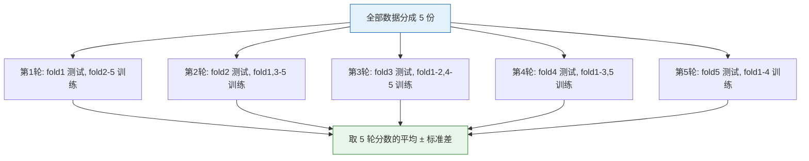

# 交叉验证

:::tip 本节定位
只用一次 train/test 分割来评估模型，结果可能受**随机划分**的影响很大。交叉验证让每个数据都有机会被用作训练和测试，给出更**稳定、可靠**的评估结果。
:::

## 学习目标

- 理解留出法的局限性
- 掌握 K 折交叉验证
- 掌握分层 K 折交叉验证
- 了解留一法和时间序列交叉验证
- 会用 `cross_val_score` 和 `cross_validate`

---

## 一、留出法的问题

### 1.1 一次划分够吗？

```python
from sklearn.datasets import load_iris
from sklearn.model_selection import train_test_split
from sklearn.tree import DecisionTreeClassifier
import numpy as np

iris = load_iris()
X, y = iris.data, iris.target

# 不同 random_state 导致不同结果
scores = []
for seed in range(50):
    X_train, X_test, y_train, y_test = train_test_split(X, y, test_size=0.2, random_state=seed)
    model = DecisionTreeClassifier(max_depth=3, random_state=42)
    model.fit(X_train, y_train)
    scores.append(model.score(X_test, y_test))

import matplotlib.pyplot as plt

plt.figure(figsize=(10, 4))
plt.bar(range(50), scores, color='steelblue', alpha=0.7)
plt.axhline(y=np.mean(scores), color='red', linestyle='--', label=f'平均: {np.mean(scores):.3f}')
plt.xlabel('随机种子')
plt.ylabel('准确率')
plt.title(f'50 次不同划分的准确率（标准差: {np.std(scores):.3f}）')
plt.legend()
plt.grid(axis='y', alpha=0.3)
plt.show()

print(f"最低: {min(scores):.3f}, 最高: {max(scores):.3f}, 差距: {max(scores)-min(scores):.3f}")
```

:::warning 问题
一次划分的结果**不稳定**——不同的随机种子可能差异很大。我们需要更可靠的评估方式。
:::

---

## 二、K 折交叉验证

### 2.1 原理

把数据分成 K 份，每次用 1 份做测试、其余 K-1 份做训练。重复 K 次，取平均。



### 2.2 sklearn 实现

```python
from sklearn.model_selection import cross_val_score, KFold
from sklearn.tree import DecisionTreeClassifier

model = DecisionTreeClassifier(max_depth=3, random_state=42)

# 最简单的用法
scores = cross_val_score(model, X, y, cv=5, scoring='accuracy')
print(f"5 折交叉验证:")
print(f"  每折分数: {scores}")
print(f"  平均: {scores.mean():.4f} ± {scores.std():.4f}")
```

### 2.3 手动控制 KFold

```python
from sklearn.model_selection import KFold

kf = KFold(n_splits=5, shuffle=True, random_state=42)

# 可视化每折的划分
fig, axes = plt.subplots(5, 1, figsize=(12, 6), sharex=True)

for fold, (train_idx, test_idx) in enumerate(kf.split(X)):
    ax = axes[fold]
    ax.scatter(train_idx, [0]*len(train_idx), c='steelblue', s=3, label='训练')
    ax.scatter(test_idx, [0]*len(test_idx), c='red', s=10, label='测试')
    ax.set_ylabel(f'折 {fold+1}')
    ax.set_yticks([])
    if fold == 0:
        ax.legend(loc='upper right', ncol=2)

axes[-1].set_xlabel('样本索引')
plt.suptitle('5 折交叉验证的数据划分', fontsize=13)
plt.tight_layout()
plt.show()
```

### 2.4 K 值怎么选？

| K 值 | 优点 | 缺点 |
|------|------|------|
| K=3 | 速度快 | 方差大，不够稳定 |
| **K=5** | **常用默认值** | **平衡了速度和稳定性** |
| **K=10** | **更稳定** | **速度稍慢** |
| K=n（留一法） | 最稳定 | 非常慢 |

---

## 三、分层 K 折交叉验证

### 3.1 为什么需要分层？

普通 KFold 随机划分，可能导致某一折的类别比例与整体不同（尤其不平衡数据）。

**分层 KFold 保证每折的类别比例与整体一致。**

```python
from sklearn.model_selection import StratifiedKFold

# 模拟不平衡数据
from sklearn.datasets import make_classification
X_imb, y_imb = make_classification(n_samples=100, n_features=5,
                                     weights=[0.9, 0.1], random_state=42)

print(f"正类比例: {y_imb.mean():.1%}")

# 对比 KFold 和 StratifiedKFold
kf = KFold(n_splits=5, shuffle=True, random_state=42)
skf = StratifiedKFold(n_splits=5, shuffle=True, random_state=42)

print("\n普通 KFold 每折正类比例:")
for fold, (_, test_idx) in enumerate(kf.split(X_imb)):
    print(f"  折 {fold+1}: {y_imb[test_idx].mean():.1%}")

print("\n分层 StratifiedKFold 每折正类比例:")
for fold, (_, test_idx) in enumerate(skf.split(X_imb, y_imb)):
    print(f"  折 {fold+1}: {y_imb[test_idx].mean():.1%}")
```

### 3.2 sklearn 中的默认行为

```python
# cross_val_score 对分类任务默认使用 StratifiedKFold
# 你可以显式指定
from sklearn.model_selection import cross_val_score

scores = cross_val_score(
    DecisionTreeClassifier(max_depth=3, random_state=42),
    X_imb, y_imb,
    cv=StratifiedKFold(n_splits=5, shuffle=True, random_state=42),
    scoring='f1'
)
print(f"分层 5 折 F1: {scores.mean():.4f} ± {scores.std():.4f}")
```

:::info 最佳实践
- **分类任务**：始终使用 `StratifiedKFold`（`cross_val_score` 默认就是）
- **回归任务**：使用普通 `KFold`
- **时间序列**：使用 `TimeSeriesSplit`
:::

---

## 四、留一法（LOO）

**Leave-One-Out**：每次只留 1 个样本做测试，其余 n-1 个做训练。重复 n 次。

```python
from sklearn.model_selection import LeaveOneOut, cross_val_score

# 用小数据集演示（LOO 在大数据集上太慢）
from sklearn.datasets import load_iris
X_small, y_small = load_iris(return_X_y=True)

loo = LeaveOneOut()
model = DecisionTreeClassifier(max_depth=3, random_state=42)

scores = cross_val_score(model, X_small, y_small, cv=loo)
print(f"LOO 交叉验证:")
print(f"  总轮数: {len(scores)}")
print(f"  平均准确率: {scores.mean():.4f}")
```

| 优点 | 缺点 |
|------|------|
| 训练数据量最大化 | 计算开销大（n 次训练） |
| 评估偏差最小 | 方差可能较大 |
| | 大数据集上不实用 |

---

## 五、时间序列交叉验证

### 5.1 为什么不能随机划分？

时间序列数据有**时间顺序**——用未来数据训练去预测过去，是"数据泄漏"。

### 5.2 TimeSeriesSplit

```python
from sklearn.model_selection import TimeSeriesSplit
import numpy as np

# 模拟时间序列数据
n = 100
X_ts = np.arange(n).reshape(-1, 1)
y_ts = np.sin(X_ts.ravel() / 10) + np.random.randn(n) * 0.1

tscv = TimeSeriesSplit(n_splits=5)

fig, axes = plt.subplots(5, 1, figsize=(12, 8), sharex=True)

for fold, (train_idx, test_idx) in enumerate(tscv.split(X_ts)):
    ax = axes[fold]
    ax.scatter(train_idx, y_ts[train_idx], c='steelblue', s=10, label='训练')
    ax.scatter(test_idx, y_ts[test_idx], c='red', s=20, label='测试')
    ax.set_ylabel(f'折 {fold+1}')
    if fold == 0:
        ax.legend(loc='upper left', ncol=2)

axes[-1].set_xlabel('时间步')
plt.suptitle('时间序列交叉验证（训练集逐步扩大）', fontsize=13)
plt.tight_layout()
plt.show()
```

---

## 六、cross_validate——更丰富的输出

```python
from sklearn.model_selection import cross_validate
from sklearn.ensemble import RandomForestClassifier

model = RandomForestClassifier(n_estimators=50, random_state=42)

# cross_validate 比 cross_val_score 返回更多信息
results = cross_validate(
    model, X, y, cv=5,
    scoring=['accuracy', 'f1_macro'],
    return_train_score=True
)

print("5 折交叉验证详细结果:")
print(f"  训练准确率: {results['train_accuracy'].mean():.4f} ± {results['train_accuracy'].std():.4f}")
print(f"  测试准确率: {results['test_accuracy'].mean():.4f} ± {results['test_accuracy'].std():.4f}")
print(f"  测试 F1:    {results['test_f1_macro'].mean():.4f} ± {results['test_f1_macro'].std():.4f}")
print(f"  每折耗时:   {results['fit_time'].mean():.3f}s")
```

---

## 七、综合对比

```python
from sklearn.model_selection import cross_val_score
from sklearn.tree import DecisionTreeClassifier
from sklearn.linear_model import LogisticRegression
from sklearn.ensemble import RandomForestClassifier
from sklearn.svm import SVC

models = {
    '决策树': DecisionTreeClassifier(max_depth=5, random_state=42),
    '逻辑回归': LogisticRegression(max_iter=1000, random_state=42),
    '随机森林': RandomForestClassifier(n_estimators=100, random_state=42),
    'SVM': SVC(random_state=42),
}

results = {}
for name, model in models.items():
    scores = cross_val_score(model, X, y, cv=10, scoring='accuracy')
    results[name] = scores
    print(f"{name:10s} | {scores.mean():.4f} ± {scores.std():.4f}")

# 箱线图对比
fig, ax = plt.subplots(figsize=(8, 5))
data = [results[name] for name in models]
bp = ax.boxplot(data, labels=models.keys(), patch_artist=True)

colors = ['steelblue', 'coral', 'seagreen', 'gold']
for patch, color in zip(bp['boxes'], colors):
    patch.set_facecolor(color)
    patch.set_alpha(0.7)

ax.set_ylabel('准确率')
ax.set_title('10 折交叉验证对比（箱线图）')
ax.grid(axis='y', alpha=0.3)
plt.tight_layout()
plt.show()
```

---

## 八、小结

| 方法 | 说明 | 适用 |
|------|------|------|
| **Hold-out** | 一次 train/test 划分 | 快速实验 |
| **K-Fold** | K 次划分取平均 | 通用（K=5 或 10） |
| **Stratified K-Fold** | 保持类别比例的 K-Fold | 分类（默认） |
| **LOO** | 每次留 1 个样本 | 小数据集 |
| **TimeSeriesSplit** | 按时间顺序划分 | 时间序列 |

:::info 连接后续
- **下一节**：偏差-方差权衡——为什么交叉验证和单次评估结果不同
- **4.4 节**：超参数调优——用交叉验证来选最优参数
:::

---

## 动手练习

### 练习 1：K 值对比

用 Iris 数据集和决策树，对比 K=3, 5, 10, 20 的交叉验证结果（平均准确率和标准差）。K 越大，标准差越小吗？

### 练习 2：多指标评估

用 `cross_validate` 在乳腺癌数据集上同时评估 accuracy、precision、recall、f1，返回训练集和测试集分数。哪个模型过拟合最严重？

### 练习 3：分层 vs 非分层

创建一个严重不平衡的数据集（正负比 9:1），对比 `KFold` 和 `StratifiedKFold` 的评估结果差异。
