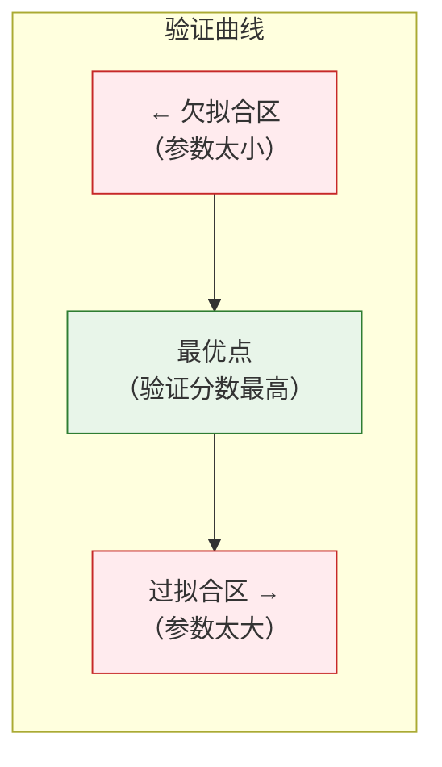
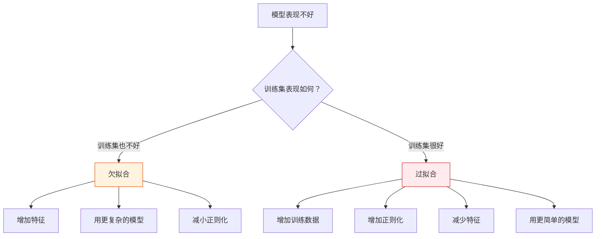

# 偏差-方差权衡

:::tip 本节定位
**偏差-方差权衡（Bias-Variance Tradeoff）** 是机器学习中最重要的理论框架之一。它解释了为什么模型会欠拟合或过拟合，以及如何找到两者之间的最佳平衡。
:::

## 学习目标

- 深入理解偏差（Bias）和方差（Variance）
- 理解欠拟合和过拟合的本质
- 掌握学习曲线分析
- 掌握验证曲线分析
- 理解正则化如何影响偏差-方差

---

## 一、什么是偏差和方差？

### 1.1 直觉理解——打靶比喻


| | 偏差（Bias） | 方差（Variance） |
|---|-------------|-----------------|
| 含义 | 模型预测值与真实值的系统性偏移 | 模型对不同训练数据的敏感程度 |
| 高 → | 欠拟合（模型太简单） | 过拟合（模型太复杂） |
| 解决 | 增加模型复杂度 | 减少模型复杂度、增加数据 |

### 1.2 总误差分解

> **总误差 = 偏差² + 方差 + 不可约误差（噪声）**

```python
import numpy as np
import matplotlib.pyplot as plt

# 可视化偏差-方差权衡
complexity = np.linspace(0.1, 10, 100)
bias_sq = 5 / complexity
variance = 0.5 * complexity
noise = 0.5 * np.ones_like(complexity)
total = bias_sq + variance + noise

plt.figure(figsize=(8, 5))
plt.plot(complexity, bias_sq, 'b-', linewidth=2, label='偏差²')
plt.plot(complexity, variance, 'r-', linewidth=2, label='方差')
plt.plot(complexity, noise, 'g--', linewidth=1, label='噪声（不可约）')
plt.plot(complexity, total, 'k-', linewidth=2, label='总误差')

best_idx = np.argmin(total)
plt.axvline(x=complexity[best_idx], color='orange', linestyle=':', label='最优复杂度')

plt.xlabel('模型复杂度')
plt.ylabel('误差')
plt.title('偏差-方差权衡')
plt.legend()
plt.grid(True, alpha=0.3)
plt.show()
```

---

## 二、实际观察偏差和方差

### 2.1 用多项式回归演示

```python
from sklearn.preprocessing import PolynomialFeatures
from sklearn.linear_model import LinearRegression
from sklearn.pipeline import make_pipeline

# 生成非线性数据
np.random.seed(42)
n = 30
X = np.sort(np.random.uniform(-3, 3, n))
y_true_func = lambda x: np.sin(x)
y = y_true_func(X) + np.random.randn(n) * 0.3

x_plot = np.linspace(-3.5, 3.5, 200)

fig, axes = plt.subplots(1, 3, figsize=(15, 4))
configs = [
    (1, '欠拟合（degree=1）\n高偏差，低方差'),
    (4, '刚好（degree=4）\n偏差方差平衡'),
    (15, '过拟合（degree=15）\n低偏差，高方差'),
]

for ax, (deg, title) in zip(axes, configs):
    # 用不同数据子集训练多次，观察方差
    for seed in range(10):
        np.random.seed(seed)
        X_sample = np.sort(np.random.uniform(-3, 3, n))
        y_sample = y_true_func(X_sample) + np.random.randn(n) * 0.3

        model = make_pipeline(PolynomialFeatures(deg, include_bias=False), LinearRegression())
        model.fit(X_sample.reshape(-1, 1), y_sample)
        y_pred = model.predict(x_plot.reshape(-1, 1))
        y_pred = np.clip(y_pred, -3, 3)
        ax.plot(x_plot, y_pred, alpha=0.3, color='steelblue')

    ax.plot(x_plot, y_true_func(x_plot), 'r--', linewidth=2, label='真实函数')
    ax.scatter(X, y, color='black', s=20, zorder=5)
    ax.set_title(title)
    ax.set_ylim(-3, 3)
    ax.legend(fontsize=8)
    ax.grid(True, alpha=0.3)

plt.suptitle('偏差-方差直觉（10 次不同数据训练）', fontsize=13)
plt.tight_layout()
plt.show()
```

:::note 观察要点
- **degree=1**：10 条线几乎重合（低方差），但都偏离真实函数（高偏差）
- **degree=15**：10 条线差异很大（高方差），但平均更接近真实（低偏差）
- **degree=4**：10 条线较一致（适当方差），且接近真实函数（适当偏差）
:::

---

## 三、学习曲线

### 3.1 什么是学习曲线？

学习曲线展示**训练集大小**对模型性能的影响。它能告诉你：
- 模型是欠拟合还是过拟合
- 增加数据是否有帮助

```python
from sklearn.model_selection import learning_curve
from sklearn.tree import DecisionTreeClassifier
from sklearn.datasets import load_digits

digits = load_digits()
X, y = digits.data, digits.target

def plot_learning_curve(model, X, y, title, ax):
    train_sizes, train_scores, val_scores = learning_curve(
        model, X, y, cv=5,
        train_sizes=np.linspace(0.1, 1.0, 10),
        scoring='accuracy', n_jobs=-1
    )

    train_mean = train_scores.mean(axis=1)
    train_std = train_scores.std(axis=1)
    val_mean = val_scores.mean(axis=1)
    val_std = val_scores.std(axis=1)

    ax.fill_between(train_sizes, train_mean - train_std, train_mean + train_std, alpha=0.1, color='blue')
    ax.fill_between(train_sizes, val_mean - val_std, val_mean + val_std, alpha=0.1, color='red')
    ax.plot(train_sizes, train_mean, 'bo-', label='训练集')
    ax.plot(train_sizes, val_mean, 'ro-', label='验证集')
    ax.set_xlabel('训练样本数')
    ax.set_ylabel('准确率')
    ax.set_title(title)
    ax.legend()
    ax.grid(True, alpha=0.3)

fig, axes = plt.subplots(1, 3, figsize=(18, 5))

# 欠拟合模型
plot_learning_curve(
    DecisionTreeClassifier(max_depth=1, random_state=42),
    X, y, '欠拟合（max_depth=1）\n训练和验证都低', axes[0]
)

# 刚好的模型
plot_learning_curve(
    DecisionTreeClassifier(max_depth=10, random_state=42),
    X, y, '适当复杂度（max_depth=10）', axes[1]
)

# 过拟合模型
plot_learning_curve(
    DecisionTreeClassifier(max_depth=None, random_state=42),
    X, y, '过拟合（max_depth=None）\n训练和验证差距大', axes[2]
)

plt.tight_layout()
plt.show()
```

### 3.2 如何解读学习曲线

| 现象 | 诊断 | 解决方案 |
|------|------|---------|
| 训练和验证都低 | **欠拟合** | 增加模型复杂度 |
| 训练高，验证低 | **过拟合** | 更多数据 / 正则化 / 简化模型 |
| 两条线收敛且都高 | **刚好** | 模型不错 |
| 验证还在上升 | 需要更多数据 | 收集更多数据 |

---

## 四、验证曲线

### 4.1 什么是验证曲线？

验证曲线展示**某个超参数**对模型性能的影响，帮你找到最优值。

```python
from sklearn.model_selection import validation_curve

# max_depth 对决策树的影响
param_range = range(1, 25)
train_scores, val_scores = validation_curve(
    DecisionTreeClassifier(random_state=42), X, y,
    param_name='max_depth', param_range=param_range,
    cv=5, scoring='accuracy', n_jobs=-1
)

train_mean = train_scores.mean(axis=1)
train_std = train_scores.std(axis=1)
val_mean = val_scores.mean(axis=1)
val_std = val_scores.std(axis=1)

plt.figure(figsize=(8, 5))
plt.fill_between(param_range, train_mean - train_std, train_mean + train_std, alpha=0.1, color='blue')
plt.fill_between(param_range, val_mean - val_std, val_mean + val_std, alpha=0.1, color='red')
plt.plot(param_range, train_mean, 'bo-', label='训练集')
plt.plot(param_range, val_mean, 'ro-', label='验证集')
plt.xlabel('max_depth')
plt.ylabel('准确率')
plt.title('验证曲线：max_depth 的影响')
plt.legend()
plt.grid(True, alpha=0.3)

best_depth = param_range[np.argmax(val_mean)]
plt.axvline(x=best_depth, color='green', linestyle='--', label=f'最优 depth={best_depth}')
plt.legend()
plt.show()
```

### 4.2 如何解读验证曲线



---

## 五、正则化对偏差-方差的影响

```python
from sklearn.linear_model import Ridge
from sklearn.preprocessing import PolynomialFeatures, StandardScaler
from sklearn.pipeline import make_pipeline
from sklearn.model_selection import cross_val_score

# 非线性数据
np.random.seed(42)
X_nl = np.sort(np.random.uniform(-3, 3, 100)).reshape(-1, 1)
y_nl = np.sin(X_nl.ravel()) + np.random.randn(100) * 0.3

# 高阶多项式 + 不同正则化强度
alphas = [0.0001, 0.001, 0.01, 0.1, 1, 10, 100]
train_scores = []
cv_scores = []

for alpha in alphas:
    model = make_pipeline(
        StandardScaler(),
        PolynomialFeatures(degree=10, include_bias=False),
        Ridge(alpha=alpha)
    )
    model.fit(X_nl, y_nl)
    train_scores.append(model.score(X_nl, y_nl))

    cv = cross_val_score(model, X_nl, y_nl, cv=5)
    cv_scores.append(cv.mean())

fig, axes = plt.subplots(1, 2, figsize=(14, 5))

# alpha vs 分数
axes[0].plot(alphas, train_scores, 'bo-', label='训练集')
axes[0].plot(alphas, cv_scores, 'ro-', label='CV 验证集')
axes[0].set_xscale('log')
axes[0].set_xlabel('正则化强度 α')
axes[0].set_ylabel('R² 分数')
axes[0].set_title('正则化强度 vs 模型表现')
axes[0].legend()
axes[0].grid(True, alpha=0.3)

# 拟合曲线对比
x_plot = np.linspace(-3.5, 3.5, 200).reshape(-1, 1)
for alpha, color, ls in [(0.0001, 'blue', '--'), (0.1, 'green', '-'), (100, 'orange', ':')]:
    model = make_pipeline(
        StandardScaler(),
        PolynomialFeatures(degree=10, include_bias=False),
        Ridge(alpha=alpha)
    )
    model.fit(X_nl, y_nl)
    y_pred = model.predict(x_plot)
    axes[1].plot(x_plot, np.clip(y_pred, -3, 3), color=color, linestyle=ls,
                  linewidth=2, label=f'α={alpha}')

axes[1].scatter(X_nl, y_nl, s=15, alpha=0.5, color='gray')
axes[1].plot(x_plot, np.sin(x_plot), 'r--', linewidth=1, label='真实函数')
axes[1].set_title('不同正则化强度的拟合效果')
axes[1].set_ylim(-3, 3)
axes[1].legend()
axes[1].grid(True, alpha=0.3)

plt.tight_layout()
plt.show()
```

| α 值 | 偏差 | 方差 | 状态 |
|------|------|------|------|
| 很小（0.0001） | 低 | 高 | 过拟合 |
| 适中（0.1） | 适中 | 适中 | 刚好 |
| 很大（100） | 高 | 低 | 欠拟合 |

---

## 六、实用诊断流程



---

## 七、小结

| 要点 | 说明 |
|------|------|
| 偏差 | 模型的系统性误差，模型太简单导致 |
| 方差 | 模型对数据变化的敏感度，模型太复杂导致 |
| 权衡 | 减少偏差通常增加方差，反之亦然 |
| 学习曲线 | 训练集大小 vs 表现，诊断欠拟合/过拟合 |
| 验证曲线 | 超参数 vs 表现，找最优值 |
| 正则化 | 增大 α → 增大偏差、减小方差 |

:::info 连接后续
- **下一节**：超参数调优——系统化搜索最优参数
:::

---

## 动手练习

### 练习 1：学习曲线诊断

用 `load_digits()` 分别画随机森林（n_estimators=100）和逻辑回归的学习曲线。哪个更倾向过拟合？

### 练习 2：验证曲线

用 `load_wine()` 画随机森林 `n_estimators`（10~500）的验证曲线，找到最优树数量。

### 练习 3：正则化实验

用多项式回归（degree=15）+ Ridge 回归，画 alpha（从 0.0001 到 1000）的验证曲线。在同一张图上标注欠拟合区和过拟合区。
