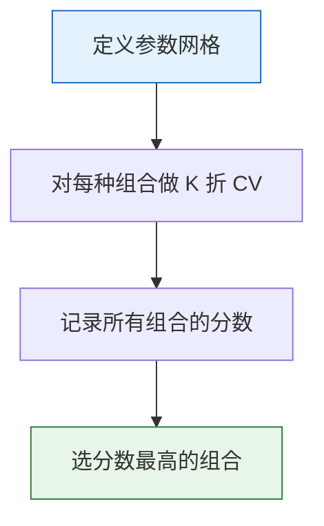
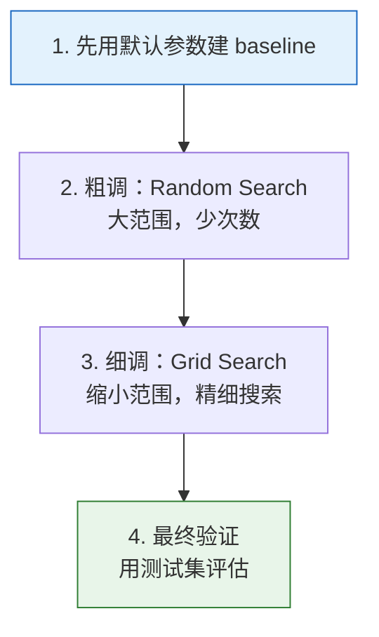

# 超参数调优

:::tip 本节定位
模型的**超参数**（如树的深度、学习率、正则化强度）需要手动设定，它们对模型性能影响巨大。本节教你**系统化**地搜索最优超参数，而不是靠感觉瞎试。
:::

## 学习目标

- 区分参数和超参数
- 掌握网格搜索（GridSearchCV）
- 掌握随机搜索（RandomizedSearchCV）
- 了解贝叶斯优化（Optuna）
- 掌握超参数调优的最佳实践

---

## 一、参数 vs 超参数

| | 参数（Parameter） | 超参数（Hyperparameter） |
|---|-------------------|------------------------|
| 由谁决定 | 模型自动从数据中学习 | 人为手动设定 |
| 什么时候确定 | 训练过程中 | 训练之前 |
| 例子 | 线性回归的 w, b | 树的 max_depth, 学习率 |
| 存储位置 | `model.coef_` | `model.get_params()` |

```python
from sklearn.tree import DecisionTreeClassifier

model = DecisionTreeClassifier(max_depth=5, min_samples_split=10)
print("超参数（训练前设定）:")
print(model.get_params())
```

---

## 二、网格搜索（Grid Search）

### 2.1 原理

穷举所有超参数组合，用交叉验证评估每一种，选最好的。



### 2.2 GridSearchCV 实战

```python
from sklearn.model_selection import GridSearchCV
from sklearn.ensemble import RandomForestClassifier
from sklearn.datasets import load_wine
from sklearn.model_selection import train_test_split
import numpy as np

wine = load_wine()
X_train, X_test, y_train, y_test = train_test_split(
    wine.data, wine.target, test_size=0.2, random_state=42
)

# 定义参数网格
param_grid = {
    'n_estimators': [50, 100, 200],
    'max_depth': [3, 5, 10, None],
    'min_samples_split': [2, 5, 10],
}

# 总共 3 × 4 × 3 = 36 种组合 × 5 折 = 180 次训练
print(f"总组合数: {3*4*3}")

# 网格搜索
grid = GridSearchCV(
    RandomForestClassifier(random_state=42),
    param_grid,
    cv=5,
    scoring='accuracy',
    n_jobs=-1,
    verbose=1
)

grid.fit(X_train, y_train)

print(f"\n最佳参数: {grid.best_params_}")
print(f"最佳 CV 分数: {grid.best_score_:.4f}")
print(f"测试集分数: {grid.best_estimator_.score(X_test, y_test):.4f}")
```

### 2.3 查看所有结果

```python
import pandas as pd
import matplotlib.pyplot as plt

# 结果转为 DataFrame
results = pd.DataFrame(grid.cv_results_)
print(results[['params', 'mean_test_score', 'rank_test_score']].head(10))

# 可视化：不同 n_estimators 和 max_depth 的效果
fig, ax = plt.subplots(figsize=(8, 5))

for depth in [3, 5, 10, None]:
    mask = results['param_max_depth'] == depth
    subset = results[mask & (results['param_min_samples_split'] == 2)]
    label = f'depth={depth}' if depth else 'depth=None'
    ax.plot(subset['param_n_estimators'], subset['mean_test_score'], 'o-', label=label)

ax.set_xlabel('n_estimators')
ax.set_ylabel('CV 准确率')
ax.set_title('GridSearch 结果可视化')
ax.legend()
ax.grid(True, alpha=0.3)
plt.tight_layout()
plt.show()
```

### 2.4 网格搜索的优缺点

| 优点 | 缺点 |
|------|------|
| 保证找到网格中的最优 | 组合爆炸（维度多时极慢） |
| 实现简单 | 网格粒度粗会错过最优值 |
| 结果可复现 | 浪费计算在差的区域 |

---

## 三、随机搜索（Random Search）

### 3.1 原理

不穷举所有组合，而是**随机采样** N 种组合。在相同计算预算下，随机搜索往往更高效。

### 3.2 RandomizedSearchCV 实战

```python
from sklearn.model_selection import RandomizedSearchCV
from scipy.stats import randint, uniform

# 定义参数分布（不是固定值，而是范围）
param_dist = {
    'n_estimators': randint(50, 500),
    'max_depth': [3, 5, 10, 15, 20, None],
    'min_samples_split': randint(2, 20),
    'min_samples_leaf': randint(1, 10),
    'max_features': ['sqrt', 'log2', None],
}

# 随机搜索 50 种组合
random_search = RandomizedSearchCV(
    RandomForestClassifier(random_state=42),
    param_dist,
    n_iter=50,       # 只尝试 50 种组合
    cv=5,
    scoring='accuracy',
    random_state=42,
    n_jobs=-1,
    verbose=1
)

random_search.fit(X_train, y_train)

print(f"\n最佳参数: {random_search.best_params_}")
print(f"最佳 CV 分数: {random_search.best_score_:.4f}")
print(f"测试集分数: {random_search.best_estimator_.score(X_test, y_test):.4f}")
```

### 3.3 Grid vs Random 对比

```python
# 可视化对比
fig, axes = plt.subplots(1, 2, figsize=(14, 5))

# Grid Search 搜索空间
grid_n = [50, 100, 200]
grid_d = [3, 5, 10]
grid_points = [(n, d) for n in grid_n for d in grid_d]
axes[0].scatter([p[0] for p in grid_points], [p[1] for p in grid_points],
                s=100, color='steelblue', zorder=5)
axes[0].set_xlabel('n_estimators')
axes[0].set_ylabel('max_depth')
axes[0].set_title(f'Grid Search（{len(grid_points)} 个点）\n只搜索网格交叉点')
axes[0].grid(True, alpha=0.3)

# Random Search 搜索空间
np.random.seed(42)
rand_n = np.random.randint(50, 500, 20)
rand_d = np.random.choice([3, 5, 10, 15, 20], 20)
axes[1].scatter(rand_n, rand_d, s=100, color='coral', zorder=5)
axes[1].set_xlabel('n_estimators')
axes[1].set_ylabel('max_depth')
axes[1].set_title(f'Random Search（20 个点）\n覆盖更广的搜索空间')
axes[1].grid(True, alpha=0.3)

plt.tight_layout()
plt.show()
```

| | Grid Search | Random Search |
|---|------------|---------------|
| 搜索方式 | 穷举所有组合 | 随机采样 |
| 计算量 | 组合数 × K 折 | n_iter × K 折 |
| 覆盖范围 | 网格交叉点 | 更广 |
| 适用 | 少量参数，范围已知 | 参数多，范围不确定 |
| 推荐 | 参数少于 3 个 | 参数多于 3 个 |

---

## 四、贝叶斯优化（Optuna）

### 4.1 原理

贝叶斯优化比随机搜索更"聪明"——它**根据之前的试验结果来指导下一次搜索**。


### 4.2 Optuna 实战

```bash
pip install optuna
```

```python
try:
    import optuna
    from sklearn.model_selection import cross_val_score

    # 定义优化目标
    def objective(trial):
        params = {
            'n_estimators': trial.suggest_int('n_estimators', 50, 500),
            'max_depth': trial.suggest_int('max_depth', 3, 20),
            'min_samples_split': trial.suggest_int('min_samples_split', 2, 20),
            'min_samples_leaf': trial.suggest_int('min_samples_leaf', 1, 10),
            'max_features': trial.suggest_categorical('max_features', ['sqrt', 'log2', None]),
        }

        model = RandomForestClassifier(**params, random_state=42)
        score = cross_val_score(model, X_train, y_train, cv=5, scoring='accuracy').mean()
        return score

    # 运行优化
    study = optuna.create_study(direction='maximize')
    study.optimize(objective, n_trials=50, show_progress_bar=True)

    print(f"\n最佳参数: {study.best_params}")
    print(f"最佳 CV 分数: {study.best_value:.4f}")

    # 用最佳参数训练
    best_model = RandomForestClassifier(**study.best_params, random_state=42)
    best_model.fit(X_train, y_train)
    print(f"测试集分数: {best_model.score(X_test, y_test):.4f}")

except ImportError:
    print("请先安装 optuna: pip install optuna")
```

### 4.3 Optuna 可视化

```python
try:
    import optuna
    from optuna.visualization import plot_optimization_history, plot_param_importances

    # 优化历史（需要先运行上面的代码）
    fig = optuna.visualization.plot_optimization_history(study)
    fig.show()

    # 参数重要性
    fig = optuna.visualization.plot_param_importances(study)
    fig.show()

except (ImportError, NameError):
    print("需要先安装 optuna 并运行优化")
```

### 4.4 三种方法对比

| | Grid Search | Random Search | 贝叶斯优化 |
|---|------------|--------------|-----------|
| 智能程度 | 无（穷举） | 低（随机） | 高（学习历史） |
| 效率 | 低 | 中 | 高 |
| 实现 | `GridSearchCV` | `RandomizedSearchCV` | `optuna` |
| 适用 | 参数少，范围小 | 通用 | 参数多，计算贵 |

---

## 五、超参数调优最佳实践

### 5.1 调参策略



### 5.2 常见模型调参优先级

**随机森林 / GBDT**：

| 优先级 | 参数 | 搜索范围 |
|--------|------|---------|
| 1 | `n_estimators` | 100~1000 |
| 2 | `max_depth` | 3~20 |
| 3 | `learning_rate`（GBDT） | 0.01~0.3 |
| 4 | `min_samples_split` | 2~20 |
| 5 | `subsample`（GBDT） | 0.6~1.0 |

**XGBoost / LightGBM**：

| 优先级 | 参数 | 搜索范围 |
|--------|------|---------|
| 1 | `n_estimators` + `learning_rate` | 联合调 |
| 2 | `max_depth` | 3~10 |
| 3 | `subsample` / `colsample_bytree` | 0.6~1.0 |
| 4 | `reg_alpha` / `reg_lambda` | 0~5 |

### 5.3 注意事项

:::warning 调参陷阱
1. **不要在测试集上调参**——测试集只用一次，做最终评估
2. **使用交叉验证**——用 CV 分数选参数，而不是单次划分
3. **固定 random_state**——保证结果可复现
4. **先粗后细**——别一开始就用细粒度网格
5. **关注重要参数**——不是所有参数都值得调
:::

### 5.4 Pipeline + GridSearch

```python
from sklearn.pipeline import Pipeline
from sklearn.preprocessing import StandardScaler
from sklearn.model_selection import GridSearchCV
from sklearn.svm import SVC

# 在 Pipeline 中调参
pipe = Pipeline([
    ('scaler', StandardScaler()),
    ('svm', SVC(random_state=42)),
])

# 参数名格式：步骤名__参数名
param_grid = {
    'svm__C': [0.1, 1, 10, 100],
    'svm__kernel': ['rbf', 'poly'],
    'svm__gamma': ['scale', 'auto', 0.01, 0.1],
}

grid = GridSearchCV(pipe, param_grid, cv=5, scoring='accuracy', n_jobs=-1)
grid.fit(X_train, y_train)

print(f"最佳参数: {grid.best_params_}")
print(f"最佳 CV 分数: {grid.best_score_:.4f}")
print(f"测试集分数: {grid.score(X_test, y_test):.4f}")
```

---

## 六、完整调参实战

```python
from sklearn.datasets import load_digits
from sklearn.model_selection import train_test_split, RandomizedSearchCV
from sklearn.ensemble import GradientBoostingClassifier
from scipy.stats import randint, uniform
import time

digits = load_digits()
X_train, X_test, y_train, y_test = train_test_split(
    digits.data, digits.target, test_size=0.2, random_state=42
)

# Step 1: Baseline
baseline = GradientBoostingClassifier(random_state=42)
baseline.fit(X_train, y_train)
print(f"Baseline 测试准确率: {baseline.score(X_test, y_test):.4f}")

# Step 2: 随机搜索
param_dist = {
    'n_estimators': randint(50, 300),
    'max_depth': randint(2, 10),
    'learning_rate': uniform(0.01, 0.3),
    'subsample': uniform(0.6, 0.4),
    'min_samples_split': randint(2, 15),
}

start = time.time()
rs = RandomizedSearchCV(
    GradientBoostingClassifier(random_state=42),
    param_dist,
    n_iter=30,
    cv=5,
    scoring='accuracy',
    random_state=42,
    n_jobs=-1,
)
rs.fit(X_train, y_train)
elapsed = time.time() - start

print(f"\nRandomSearch 最佳参数: {rs.best_params_}")
print(f"RandomSearch CV 分数: {rs.best_score_:.4f}")
print(f"RandomSearch 测试分数: {rs.score(X_test, y_test):.4f}")
print(f"耗时: {elapsed:.1f}s")

# Step 3: 对比
print(f"\n提升: {rs.score(X_test, y_test) - baseline.score(X_test, y_test):+.4f}")
```

---

## 七、小结

| 方法 | 说明 | 推荐场景 |
|------|------|---------|
| **Grid Search** | 穷举所有组合 | 参数少（≤3），范围已知 |
| **Random Search** | 随机采样组合 | 参数多，首选探索 |
| **Optuna** | 贝叶斯优化 | 计算昂贵，参数多 |
| **Pipeline + Search** | 预处理和模型一起调 | 生产环境 |

:::info 连接后续
- **第 5 章**：特征工程——用更好的特征提升模型（比调参更有效）
- **第 6 章**：实战项目——综合应用所有调参技巧
:::

---

## 动手练习

### 练习 1：Grid vs Random

在 Wine 数据集上，对比 GridSearchCV 和 RandomizedSearchCV 在相同时间内找到的最优分数。谁更高效？

### 练习 2：XGBoost 调参

用 XGBoost 在 `load_digits()` 上调参。先用 RandomizedSearchCV 找到大致范围，再用 GridSearchCV 精调。记录每步的提升。

### 练习 3：Optuna 实战

用 Optuna 优化一个 LightGBM 分类器。用 `optuna.visualization` 画出优化历史和参数重要性图。

### 练习 4：Pipeline 调参

创建 `StandardScaler → PCA → RandomForest` 的 Pipeline，用 GridSearchCV 同时调优 PCA 的 `n_components` 和 RandomForest 的参数。
