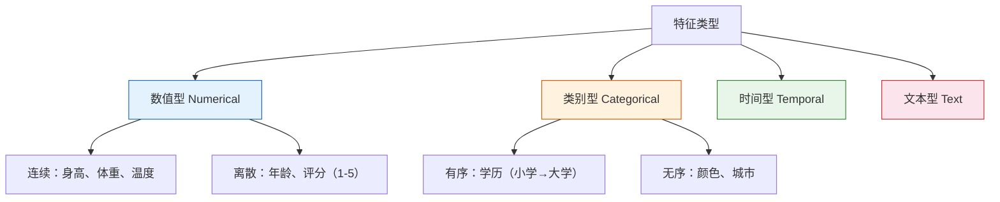

# 特征理解与探索

:::tip 本节定位
特征工程是 ML 项目中**投入产出比最高**的环节——好的特征比好的算法更重要。而一切特征工程的前提是**理解你的数据**。
:::

## 学习目标

- 掌握特征类型分析（数值型、类别型、时间型、文本型）
- 掌握特征分布分析
- 掌握特征间相关性分析

---

## 一、特征类型



### 1.1 快速识别特征类型

```python
import pandas as pd
import numpy as np
import seaborn as sns

# 加载 Titanic 数据集
df = sns.load_dataset('titanic')
print(df.head())
print(f"\n数据形状: {df.shape}")
print(f"\n数据类型:\n{df.dtypes}")

# 自动识别
numerical = df.select_dtypes(include=['number']).columns.tolist()
categorical = df.select_dtypes(include=['object', 'category']).columns.tolist()
print(f"\n数值特征 ({len(numerical)}): {numerical}")
print(f"类别特征 ({len(categorical)}): {categorical}")
```

---

## 二、特征分布分析

### 2.1 数值特征分布

```python
import matplotlib.pyplot as plt

num_cols = ['age', 'fare', 'sibsp', 'parch']
fig, axes = plt.subplots(2, 2, figsize=(12, 8))

for ax, col in zip(axes.ravel(), num_cols):
    df[col].hist(bins=30, ax=ax, color='steelblue', edgecolor='white', alpha=0.7)
    ax.set_title(f'{col} 分布')
    ax.axvline(df[col].mean(), color='red', linestyle='--', label=f'均值={df[col].mean():.1f}')
    ax.axvline(df[col].median(), color='green', linestyle='--', label=f'中位数={df[col].median():.1f}')
    ax.legend(fontsize=8)

plt.suptitle('数值特征分布', fontsize=13)
plt.tight_layout()
plt.show()

# 统计摘要
print(df[num_cols].describe())
```

### 2.2 类别特征分布

```python
cat_cols = ['sex', 'embarked', 'class', 'who']
fig, axes = plt.subplots(1, 4, figsize=(16, 4))

for ax, col in zip(axes, cat_cols):
    df[col].value_counts().plot.bar(ax=ax, color='coral', edgecolor='white', alpha=0.8)
    ax.set_title(f'{col} 分布')
    ax.set_xticklabels(ax.get_xticklabels(), rotation=45)

plt.tight_layout()
plt.show()
```

### 2.3 目标变量与特征的关系

```python
fig, axes = plt.subplots(1, 3, figsize=(15, 4))

# 数值特征 vs 目标
axes[0].hist([df[df['survived']==1]['age'].dropna(),
              df[df['survived']==0]['age'].dropna()],
             bins=20, label=['存活', '未存活'], color=['steelblue', 'coral'], alpha=0.7)
axes[0].set_title('年龄 vs 存活')
axes[0].legend()

# 类别特征 vs 目标
pd.crosstab(df['sex'], df['survived']).plot.bar(ax=axes[1], color=['coral', 'steelblue'])
axes[1].set_title('性别 vs 存活')
axes[1].set_xticklabels(['女', '男'], rotation=0)

pd.crosstab(df['class'], df['survived']).plot.bar(ax=axes[2], color=['coral', 'steelblue'])
axes[2].set_title('船舱等级 vs 存活')
axes[2].set_xticklabels(axes[2].get_xticklabels(), rotation=0)

plt.tight_layout()
plt.show()
```

---

## 三、相关性分析

### 3.1 数值特征相关矩阵

```python
corr = df[['survived', 'age', 'fare', 'sibsp', 'parch', 'pclass']].corr()

plt.figure(figsize=(8, 6))
sns.heatmap(corr, annot=True, cmap='coolwarm', center=0, fmt='.2f',
            square=True, linewidths=0.5)
plt.title('特征相关性热图')
plt.tight_layout()
plt.show()
```

### 3.2 与目标变量的相关性排序

```python
target_corr = corr['survived'].drop('survived').abs().sort_values(ascending=False)

plt.figure(figsize=(8, 4))
target_corr.plot.barh(color='steelblue')
plt.xlabel('与目标变量的相关系数（绝对值）')
plt.title('各特征与存活的相关性')
plt.grid(axis='x', alpha=0.3)
plt.tight_layout()
plt.show()
```

---

## 四、小结

| 步骤 | 内容 | 工具 |
|------|------|------|
| 1. 识别类型 | 数值/类别/时间/文本 | `dtypes`, `select_dtypes` |
| 2. 分布分析 | 直方图、箱线图、计数图 | `hist`, `boxplot`, `value_counts` |
| 3. 相关性 | 热图、相关系数排序 | `corr`, `sns.heatmap` |
| 4. 目标关系 | 各特征与目标的关联 | `crosstab`, 分组可视化 |

---

## 动手练习

### 练习 1：Wine 数据探索

用 `load_wine()` 做完整的特征探索：识别特征类型、画分布图、计算相关矩阵、找出与目标最相关的 3 个特征。

### 练习 2：缺失值分析

用 Titanic 数据集，分析每个特征的缺失率，画出缺失值柱状图，思考哪些特征的缺失值需要处理。
