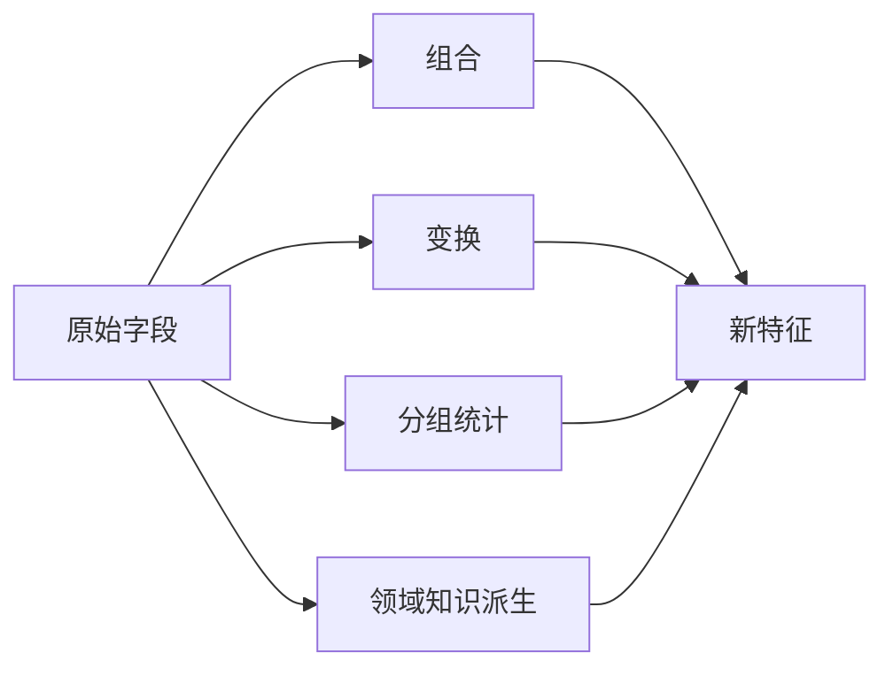

# 特征构造

:::tip 本节定位
特征构造是从已有数据中**创造新特征**，往往是提升模型效果最有效的手段。Kaggle 竞赛的胜负，常常取决于谁构造了更好的特征。
:::

## 学习目标

- 掌握多项式特征与交互特征
- 掌握时间特征提取
- 掌握统计特征（分组统计）
- 理解领域知识驱动的特征设计

---

## 先建立一张地图

特征构造不是“随便多造一些列”，而是：

> **把原始字段变成更接近问题本质的表示。**



### 一个更适合新人的总类比

你可以把特征构造理解成：

- 把原材料加工成更适合模型入口的半成品

原始字段常常像：

- 还没切好的菜

而构造后的特征更像：

- 已经按用途切好、配好、能直接下锅的食材

所以特征构造真正重要的，不是“多造几列”，而是：

- 让数据更接近问题本质

## 什么时候值得构造特征

- 原始字段太“生”，模型很难直接学到关系
- 你已经从 EDA 里看出一些组合规律
- 业务上有明显更自然的派生指标

## 什么时候不要乱造

- 你还没理解原始特征本身
- 新特征只是为了“看起来更复杂”
- 特征数量已经很多，却没有做选择和验证

## 一个新人可直接照抄的构造顺序

更稳的顺序通常是：

1. 先从最自然的业务比例或差值开始
2. 再做少量交互特征
3. 再看时间特征和分组统计
4. 最后才考虑更激进的自动组合

这样会比一开始就堆多项式特征更容易看清收益来自哪里。

## 一、多项式特征与交互特征

```python
from sklearn.preprocessing import PolynomialFeatures
import numpy as np
import pandas as pd

# 原始特征
X = np.array([[2, 3], [4, 5]])
feature_names = ['x1', 'x2']

# 二阶多项式（包含交互项）
poly = PolynomialFeatures(degree=2, include_bias=False)
X_poly = poly.fit_transform(X)
print("原始特征:", feature_names)
print("多项式特征:", poly.get_feature_names_out(feature_names))
print(f"特征数: {X.shape[1]} → {X_poly.shape[1]}")
```

| 原始 | 生成 | 说明 |
|------|------|------|
| x1, x2 | x1², x2² | 二次项 |
| x1, x2 | x1×x2 | 交互项 |

:::warning 注意
多项式特征会让特征数**爆炸式增长**。10 个特征的 3 阶多项式会产生 286 个特征。通常只用 `degree=2`，并配合特征选择。
:::

### 1.1 第一次做交互特征时，最值得先记什么？

最值得先记的不是公式，而是：

- 有些关系不是单个字段能表达的

例如：

- 房价不只和面积有关
- 还可能和“面积 × 地段”这类组合有关

所以交互特征本质上是在问：

- 两个因素放在一起，会不会比单看其中一个更有解释力

---

## 二、时间特征提取

```python
# 从日期中提取丰富的特征
dates = pd.date_range('2024-01-01', periods=100, freq='D')
df_time = pd.DataFrame({'date': dates})

df_time['year'] = df_time['date'].dt.year
df_time['month'] = df_time['date'].dt.month
df_time['day'] = df_time['date'].dt.day
df_time['dayofweek'] = df_time['date'].dt.dayofweek     # 0=周一, 6=周日
df_time['is_weekend'] = df_time['dayofweek'].isin([5, 6]).astype(int)
df_time['quarter'] = df_time['date'].dt.quarter
df_time['day_of_year'] = df_time['date'].dt.dayofyear

print(df_time.head(10))
```

| 提取特征 | 适用场景 |
|---------|---------|
| 年/月/日 | 趋势和季节性 |
| 星期几/是否周末 | 消费行为差异 |
| 小时/分钟 | 日内模式 |
| 季度 | 季度性业务分析 |
| 距某事件的天数 | 节假日效应 |

### 2.1 一个新人很值得先记的判断

时间字段往往不是“一个字段”，而是一串潜在规律：

- 周期
- 节奏
- 距离某事件的远近

所以时间特征最常做的，不是只取年/月/日，  
而是把“什么时候”拆成“周期和位置”。

---

## 三、统计特征（分组统计）

```python
import seaborn as sns

df = sns.load_dataset('tips')

# 基于分组的统计特征
df['avg_tip_by_day'] = df.groupby('day')['tip'].transform('mean')
df['max_bill_by_time'] = df.groupby('time')['total_bill'].transform('max')
df['tip_pct'] = df['tip'] / df['total_bill']
df['bill_rank_in_day'] = df.groupby('day')['total_bill'].rank(pct=True)

print(df[['day', 'total_bill', 'tip', 'avg_tip_by_day', 'tip_pct', 'bill_rank_in_day']].head(10))
```

| 统计类型 | 示例 | 场景 |
|---------|------|------|
| 分组均值 | 每天的平均消费 | 同组对比 |
| 分组计数 | 每个用户的订单数 | 活跃度 |
| 排名/百分位 | 消费在同组中的排名 | 相对位置 |
| 差值/比例 | 小费/账单比例 | 派生指标 |

### 3.1 再看一个最小“同组中的相对位置”示例

```python
df_small = pd.DataFrame({
    "city": ["A", "A", "A", "B", "B"],
    "income": [10, 20, 30, 5, 15],
})

df_small["city_mean_income"] = df_small.groupby("city")["income"].transform("mean")
df_small["income_minus_city_mean"] = df_small["income"] - df_small["city_mean_income"]

print(df_small)
```

这个例子很适合初学者，因为它会帮助你先看到：

- 有时候绝对值不够
- “它在自己那一组里算高还是算低”更重要

---

## 四、领域知识驱动

**好的特征往往来自对业务的理解：**

| 领域 | 原始特征 | 构造特征 |
|------|---------|---------|
| 电商 | 总消费、订单数 | 客单价 = 总消费/订单数 |
| 房产 | 面积、房间数 | 每房间面积 = 面积/房间数 |
| 金融 | 收入、负债 | 负债比 = 负债/收入 |
| 用户 | 注册时间、最后登录 | 沉默天数 = 今天 - 最后登录 |

```python
# 房价数据的领域特征示例
np.random.seed(42)
house = pd.DataFrame({
    'area': np.random.uniform(50, 200, 100),
    'rooms': np.random.randint(1, 6, 100),
    'floor': np.random.randint(1, 30, 100),
    'age': np.random.randint(0, 30, 100),
})

# 领域特征
house['area_per_room'] = house['area'] / house['rooms']
house['is_new'] = (house['age'] <= 5).astype(int)
house['is_high_floor'] = (house['floor'] >= 15).astype(int)

print(house.head())
```

### 4.1 为什么领域知识特征经常最值钱？

因为它往往最接近业务问题真正关心的指标。  
比如：

- 房产里看“每房间面积”
- 电商里看“客单价”
- 金融里看“负债比”

这些特征常常比原始字段本身更像决策变量。

---

## 六、构造完特征后别忘了做这三件事

1. 看维度有没有爆炸
2. 看交叉验证分数是不是真的提升
3. 看新特征是否让模型更难解释或更容易泄漏

## 一个新人可直接照抄的特征构造检查表

第一次做特征构造时，最稳的检查表通常是：

1. 这个新特征有没有明确业务含义？
2. 它是不是和目标变量太直接，存在泄漏风险？
3. 加进去后交叉验证有没有真的提升？
4. 如果提升了，我能不能解释为什么？

如果这 4 个问题答不清，  
这个特征通常还不值得急着保留。

## 七、如果把这节放进项目里，最值得展示什么

- 原始特征和新特征的对照
- 新特征为什么有业务意义
- baseline 和加特征后的分数对比
- 一两个“新特征确实帮到了模型”的例子

---

## 小结

| 方法 | 说明 | 要点 |
|------|------|------|
| 多项式/交互 | 自动生成高阶和组合特征 | 注意特征爆炸 |
| 时间特征 | 从日期中提取周期信息 | 周几、月份、是否假日 |
| 统计特征 | 分组聚合生成相对指标 | transform 保持行数不变 |
| 领域知识 | 基于业务理解构造 | 最有效但依赖经验 |

## 动手练习

### 练习 1：Titanic 特征构造

在 Titanic 数据集上构造：家庭大小（sibsp+parch+1）、是否独自旅行、票价分段、姓名中的称谓。观察对模型的提升。

### 练习 2：时间序列特征

生成一年的日期数据，提取所有时间特征（月、周、季度、是否工作日），用柱状图展示不同特征的分布。
