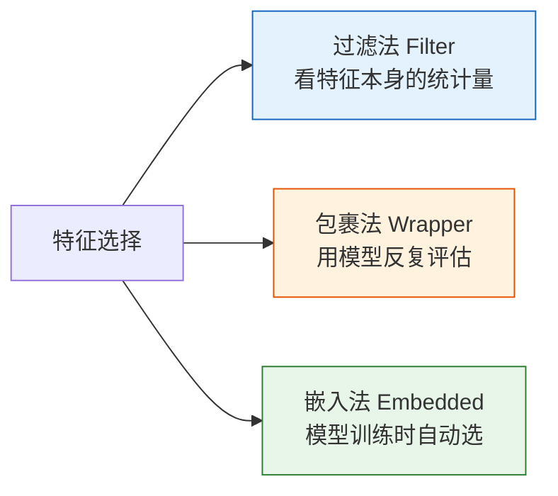

# 特征选择

:::tip 本节定位
太多特征不一定是好事——无关特征会增加噪声、拖慢训练、导致过拟合。特征选择帮你**留下真正有用的特征**。
:::

## 学习目标

- 掌握过滤法（方差阈值、相关系数、互信息）
- 掌握包裹法（递归特征消除 RFE）
- 掌握嵌入法（L1 正则化、树模型特征重要性）

---

## 一、三大方法概览



---

## 二、过滤法

### 2.1 方差阈值

去掉几乎不变的特征（方差接近 0）。

```python
from sklearn.feature_selection import VarianceThreshold
from sklearn.datasets import load_digits
import numpy as np

X, y = load_digits(return_X_y=True)
print(f"原始特征数: {X.shape[1]}")

# 去掉方差小于阈值的特征
selector = VarianceThreshold(threshold=10)
X_selected = selector.fit_transform(X)
print(f"选择后特征数: {X_selected.shape[1]}")
```

### 2.2 互信息

衡量特征与目标之间的非线性关系。

```python
from sklearn.feature_selection import mutual_info_classif, SelectKBest
import matplotlib.pyplot as plt

mi_scores = mutual_info_classif(X, y, random_state=42)

# 选 Top-K
selector = SelectKBest(mutual_info_classif, k=30)
X_selected = selector.fit_transform(X, y)
print(f"互信息选择后: {X_selected.shape[1]} 个特征")

# 可视化
plt.figure(figsize=(12, 4))
plt.bar(range(len(mi_scores)), mi_scores, color='steelblue', alpha=0.7)
plt.xlabel('特征序号')
plt.ylabel('互信息分数')
plt.title('各特征的互信息分数')
plt.grid(axis='y', alpha=0.3)
plt.show()
```

---

## 三、包裹法——递归特征消除（RFE）

反复训练模型，每次去掉**最不重要**的特征。

```python
from sklearn.feature_selection import RFE
from sklearn.ensemble import RandomForestClassifier

model = RandomForestClassifier(n_estimators=50, random_state=42)
rfe = RFE(model, n_features_to_select=20, step=5)
rfe.fit(X, y)

print(f"选择的特征数: {rfe.n_features_}")
print(f"特征排名: {rfe.ranking_[:10]}...")  # 1 = 被选中

# 评估
from sklearn.model_selection import cross_val_score
score_all = cross_val_score(model, X, y, cv=5).mean()
score_rfe = cross_val_score(model, rfe.transform(X), y, cv=5).mean()
print(f"全部特征准确率: {score_all:.4f}")
print(f"RFE 选择后准确率: {score_rfe:.4f}")
```

---

## 四、嵌入法

### 4.1 L1 正则化

Lasso 回归会把不重要特征的系数置零——天然的特征选择。

```python
from sklearn.linear_model import LogisticRegression
from sklearn.feature_selection import SelectFromModel

lasso = LogisticRegression(penalty='l1', solver='saga', C=1.0, max_iter=5000, random_state=42)
selector = SelectFromModel(lasso)
X_l1 = selector.fit_transform(X, y)
print(f"L1 选择后特征数: {X_l1.shape[1]}")
```

### 4.2 树模型特征重要性

```python
from sklearn.ensemble import RandomForestClassifier

rf = RandomForestClassifier(n_estimators=100, random_state=42)
rf.fit(X, y)

importance = rf.feature_importances_
top_k = 20
top_idx = np.argsort(importance)[-top_k:]

plt.figure(figsize=(8, 6))
plt.barh(range(top_k), importance[top_idx], color='coral')
plt.yticks(range(top_k), [f'特征{i}' for i in top_idx])
plt.xlabel('重要性')
plt.title(f'Top {top_k} 重要特征（随机森林）')
plt.grid(axis='x', alpha=0.3)
plt.tight_layout()
plt.show()
```

---

## 五、方法对比

| 方法 | 速度 | 效果 | 适用 |
|------|------|------|------|
| **过滤法** | 快 | 一般 | 快速筛选、预处理 |
| **包裹法** | 慢 | 好 | 精细选择 |
| **嵌入法** | 中等 | 好 | 实用首选 |

---

## 动手练习

### 练习 1：三种方法对比

在 `load_digits()` 上，分别用方差阈值、RFE、L1 正则化选择 20 个特征，对比逻辑回归的准确率。

### 练习 2：特征数 vs 准确率

用 `SelectKBest(k=...)` 选择不同数量的特征（5, 10, 20, 30, 50, 64），画出"特征数 vs CV 准确率"曲线。
