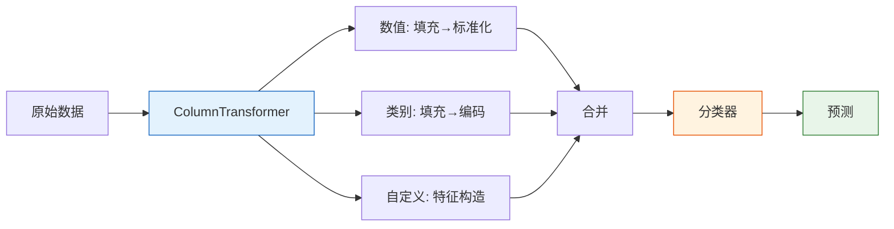

# Pipeline 与工作流

:::tip 本节定位
真实项目中，数值特征、类别特征需要**不同的预处理**。本节教你用 `ColumnTransformer` + `Pipeline` 构建**完整的特征工程流水线**，一个对象搞定所有。
:::

## 学习目标

- 掌握 ColumnTransformer 处理混合类型
- 学会自定义 Transformer
- 构建完整的特征工程流水线

---

## 一、ColumnTransformer——分列处理

```python
import pandas as pd
import numpy as np
import seaborn as sns
from sklearn.compose import ColumnTransformer
from sklearn.preprocessing import StandardScaler, OneHotEncoder
from sklearn.impute import SimpleImputer
from sklearn.pipeline import Pipeline

df = sns.load_dataset('titanic').dropna(subset=['embarked'])

# 定义特征
num_features = ['age', 'fare']
cat_features = ['sex', 'embarked', 'class']

# 数值处理流水线
num_pipeline = Pipeline([
    ('imputer', SimpleImputer(strategy='median')),
    ('scaler', StandardScaler()),
])

# 类别处理流水线
cat_pipeline = Pipeline([
    ('imputer', SimpleImputer(strategy='most_frequent')),
    ('encoder', OneHotEncoder(drop='first', sparse_output=False)),
])

# 组合
preprocessor = ColumnTransformer([
    ('num', num_pipeline, num_features),
    ('cat', cat_pipeline, cat_features),
])

X = df[num_features + cat_features]
y = df['survived']
X_transformed = preprocessor.fit_transform(X)
print(f"原始: {X.shape} → 处理后: {X_transformed.shape}")
```

---

## 二、完整 Pipeline：预处理 + 模型

```python
from sklearn.ensemble import RandomForestClassifier
from sklearn.model_selection import cross_val_score

# 预处理 + 模型 一步到位
full_pipeline = Pipeline([
    ('preprocessor', preprocessor),
    ('classifier', RandomForestClassifier(n_estimators=100, random_state=42)),
])

scores = cross_val_score(full_pipeline, X, y, cv=5, scoring='accuracy')
print(f"5 折 CV 准确率: {scores.mean():.4f} ± {scores.std():.4f}")
```

---

## 三、自定义 Transformer

```python
from sklearn.base import BaseEstimator, TransformerMixin

class FamilySizeTransformer(BaseEstimator, TransformerMixin):
    """从 sibsp 和 parch 构造家庭大小特征"""
    def fit(self, X, y=None):
        return self

    def transform(self, X):
        X = X.copy()
        X['family_size'] = X['sibsp'] + X['parch'] + 1
        X['is_alone'] = (X['family_size'] == 1).astype(int)
        return X[['family_size', 'is_alone']]

# 使用
custom_features = ['sibsp', 'parch']
full_preprocessor = ColumnTransformer([
    ('num', num_pipeline, num_features),
    ('cat', cat_pipeline, cat_features),
    ('custom', FamilySizeTransformer(), custom_features),
])

pipe = Pipeline([
    ('preprocessor', full_preprocessor),
    ('classifier', RandomForestClassifier(n_estimators=100, random_state=42)),
])

scores = cross_val_score(pipe, df[num_features + cat_features + custom_features], y, cv=5)
print(f"含自定义特征: {scores.mean():.4f} ± {scores.std():.4f}")
```

---

## 四、Pipeline + GridSearch

```python
from sklearn.model_selection import GridSearchCV

param_grid = {
    'classifier__n_estimators': [50, 100, 200],
    'classifier__max_depth': [5, 10, None],
}

grid = GridSearchCV(pipe, param_grid, cv=5, scoring='accuracy', n_jobs=-1)
grid.fit(df[num_features + cat_features + custom_features], y)

print(f"最佳参数: {grid.best_params_}")
print(f"最佳 CV: {grid.best_score_:.4f}")
```

---

## 五、小结

| 组件 | 说明 |
|------|------|
| `Pipeline` | 串联多个步骤 |
| `ColumnTransformer` | 对不同列用不同处理 |
| 自定义 Transformer | 继承 `BaseEstimator` + `TransformerMixin` |
| Pipeline + GridSearch | 预处理和模型一起调参 |



---

## 动手练习

### 练习 1：完整 Titanic Pipeline

构建一个完整的 Pipeline（含数值处理、类别编码、自定义特征），对比随机森林和逻辑回归的效果。

### 练习 2：Pipeline 调参

在练习 1 的 Pipeline 上用 GridSearchCV 同时调优预处理参数（如 PCA n_components）和模型参数。
