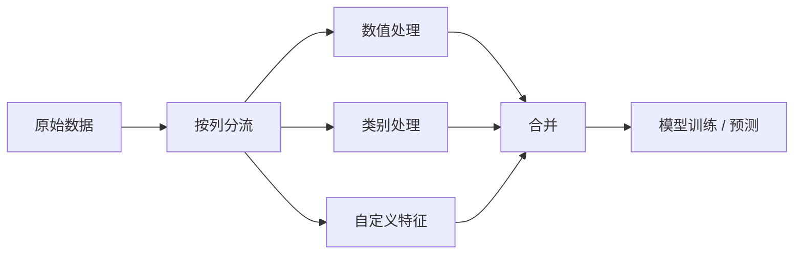
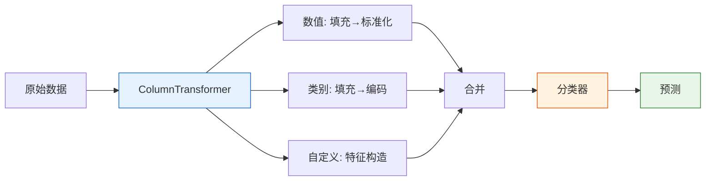

# Pipeline 与工作流

:::tip 本节定位
真实项目中，数值特征、类别特征需要**不同的预处理**。本节教你用 `ColumnTransformer` + `Pipeline` 构建**完整的特征工程流水线**，一个对象搞定所有。
:::

## 学习目标

- 掌握 ColumnTransformer 处理混合类型
- 学会自定义 Transformer
- 构建完整的特征工程流水线

---

## 先建立一张地图

很多新人前面每一步都能单独做，但一到真实项目就会乱掉。Pipeline 解决的就是：

> **怎样把“数据处理 -> 特征工程 -> 模型训练”固化成一条稳定、可复现、不会泄漏的工作流。**


```mermaid
flowchart LR
    A["原始数据"] --> B["按列分流"]
    B --> C["数值处理"]
    B --> D["类别处理"]
    B --> E["自定义特征"]
    C --> F["合并"]
    D --> F
    E --> F
    F --> G["模型训练 / 预测"]
```

### 一个更适合新人的总类比

你可以把 Pipeline 理解成：

- 把零散手工步骤装进一条自动装配线

如果没有 Pipeline，你很容易变成：

- 手动补缺失值
- 手动编码
- 手动缩放
- 手动把结果喂给模型

这就很像：

- 每次都拿纸记一遍流程，特别容易漏步骤

而 Pipeline 的价值就在于：

- 把这条流程固定下来，训练和预测都走同一套规则

## 为什么真实项目必须用 Pipeline

- 避免训练集和测试集处理方式不一致
- 避免数据泄漏
- 方便交叉验证和调参
- 方便把整套流程复用到新数据上

### 什么时候最容易踩坑？

最常见的坑其实是：

- 训练集手工做了一套处理
- 测试集又手工做了另一套

结果模型看见的根本不是同一种数据。  
Pipeline 最重要的作用，就是防这种“流程跑歪但你自己没发现”的问题。

## 一、ColumnTransformer——分列处理

```python
import pandas as pd
import numpy as np
import seaborn as sns
from sklearn.compose import ColumnTransformer
from sklearn.preprocessing import StandardScaler, OneHotEncoder
from sklearn.impute import SimpleImputer
from sklearn.pipeline import Pipeline

df = sns.load_dataset('titanic').dropna(subset=['embarked'])

# 定义特征
num_features = ['age', 'fare']
cat_features = ['sex', 'embarked', 'class']

# 数值处理流水线
num_pipeline = Pipeline([
    ('imputer', SimpleImputer(strategy='median')),
    ('scaler', StandardScaler()),
])

# 类别处理流水线
cat_pipeline = Pipeline([
    ('imputer', SimpleImputer(strategy='most_frequent')),
    ('encoder', OneHotEncoder(drop='first', sparse_output=False)),
])

# 组合
preprocessor = ColumnTransformer([
    ('num', num_pipeline, num_features),
    ('cat', cat_pipeline, cat_features),
])

X = df[num_features + cat_features]
y = df['survived']
X_transformed = preprocessor.fit_transform(X)
print(f"原始: {X.shape} → 处理后: {X_transformed.shape}")
```

### 1.1 这个例子最值得先抓住什么？

最值得先抓住的是：

- 不同列，应该走不同处理线

也就是说：

- 数值列不要用类别编码的方法处理
- 类别列也不要直接拿去做标准化

很多新人第一次做表格数据时，问题不是模型没选对，  
而是列处理方式一开始就混了。

---

## 二、完整 Pipeline：预处理 + 模型

```python
from sklearn.ensemble import RandomForestClassifier
from sklearn.model_selection import cross_val_score

# 预处理 + 模型 一步到位
full_pipeline = Pipeline([
    ('preprocessor', preprocessor),
    ('classifier', RandomForestClassifier(n_estimators=100, random_state=42)),
])

scores = cross_val_score(full_pipeline, X, y, cv=5, scoring='accuracy')
print(f"5 折 CV 准确率: {scores.mean():.4f} ± {scores.std():.4f}")
```

### 2.1 为什么 Pipeline 和交叉验证特别搭？

因为交叉验证的本质是：

- 每一折都重新训练一遍

如果你的预处理写在 Pipeline 里，  
那每一折都会自动：

- 只在训练折里 fit
- 再把同样规则应用到验证折

这正是防止数据泄漏的关键。

---

## 三、自定义 Transformer

```python
from sklearn.base import BaseEstimator, TransformerMixin

class FamilySizeTransformer(BaseEstimator, TransformerMixin):
    """从 sibsp 和 parch 构造家庭大小特征"""
    def fit(self, X, y=None):
        return self

    def transform(self, X):
        X = X.copy()
        X['family_size'] = X['sibsp'] + X['parch'] + 1
        X['is_alone'] = (X['family_size'] == 1).astype(int)
        return X[['family_size', 'is_alone']]

# 使用
custom_features = ['sibsp', 'parch']
full_preprocessor = ColumnTransformer([
    ('num', num_pipeline, num_features),
    ('cat', cat_pipeline, cat_features),
    ('custom', FamilySizeTransformer(), custom_features),
])

pipe = Pipeline([
    ('preprocessor', full_preprocessor),
    ('classifier', RandomForestClassifier(n_estimators=100, random_state=42)),
])

scores = cross_val_score(pipe, df[num_features + cat_features + custom_features], y, cv=5)
print(f"含自定义特征: {scores.mean():.4f} ± {scores.std():.4f}")
```

### 3.1 自定义 Transformer 最适合什么时候上？

最适合在这种时候上：

- 你已经知道某个特征构造很有价值
- 而且它需要被稳定复用到训练和预测中

比如：

- 家庭大小
- 是否独居
- 每房间面积

这时把它写成 Transformer，会比零散地到处复制代码稳很多。

---

## 四、Pipeline + GridSearch

```python
from sklearn.model_selection import GridSearchCV

param_grid = {
    'classifier__n_estimators': [50, 100, 200],
    'classifier__max_depth': [5, 10, None],
}

grid = GridSearchCV(pipe, param_grid, cv=5, scoring='accuracy', n_jobs=-1)
grid.fit(df[num_features + cat_features + custom_features], y)

print(f"最佳参数: {grid.best_params_}")
print(f"最佳 CV: {grid.best_score_:.4f}")
```

---

## 新人最应该先掌握的最小流水线

如果你刚开始做 ML 项目，至少先学会把下面这条链写顺：

1. 缺失值填充
2. 数值缩放
3. 类别编码
4. 模型训练
5. 交叉验证

这条链一旦写顺，后面你再加复杂特征和调参都会轻松很多。


```mermaid
flowchart LR
    D["原始数据"] --> CT["ColumnTransformer"]
    CT --> N["数值: 填充→标准化"]
    CT --> C["类别: 填充→编码"]
    CT --> CU["自定义: 特征构造"]
    N --> M["合并"]
    C --> M
    CU --> M
    M --> CL["分类器"]
    CL --> R["预测"]

    style CT fill:#e3f2fd,stroke:#1565c0,color:#333
    style CL fill:#fff3e0,stroke:#e65100,color:#333
    style R fill:#e8f5e9,stroke:#2e7d32,color:#333
```

## 一个新人可直接照抄的工作流检查表

第一次做表格项目时，最稳的检查表通常是：

1. 缺失值处理有没有写进 Pipeline
2. 数值列和类别列有没有明确分开
3. 交叉验证是不是跑在完整 Pipeline 上
4. 自定义特征有没有跟着训练和预测一起走

如果这 4 件事都做到位，  
你的项目就已经比很多“能跑但不可复现”的版本稳很多。

---

## 小结

| 组件 | 说明 |
|------|------|
| `Pipeline` | 串联多个步骤 |
| `ColumnTransformer` | 对不同列用不同处理 |
| 自定义 Transformer | 继承 `BaseEstimator` + `TransformerMixin` |
| Pipeline + GridSearch | 预处理和模型一起调参 |

## 动手练习

### 练习 1：完整 Titanic Pipeline

构建一个完整的 Pipeline（含数值处理、类别编码、自定义特征），对比随机森林和逻辑回归的效果。

### 练习 2：Pipeline 调参

在练习 1 的 Pipeline 上用 GridSearchCV 同时调优预处理参数（如 PCA n_components）和模型参数。
