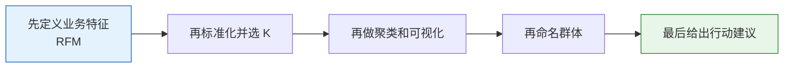

# 项目三：用户分群分析（聚类问题）

:::tip 项目定位
用户分群是**无监督学习最常见的商业应用**。本项目用 RFM 模型构建客户特征，通过聚类发现不同价值的客户群体，并给出营销建议。
:::

## 项目概览

| 信息 | 说明 |
|------|------|
| 任务类型 | 聚类（无监督） |
| 方法 | RFM 模型 + K-Means |
| 评估指标 | 轮廓系数 |
| 涉及技能 | 特征构造、标准化、降维、聚类、业务解读 |

## 先说一个很重要的学习预期

这题最容易让新人掉进去的坑，不是聚类不会跑，而是项目会很容易做成：

- 图很好看
- 群组名字也起了
- 但业务上其实不知道怎么用

更适合第一遍先练会的，不是把聚类图画得更漂亮，而是：

> **怎样把“群组结构”真正翻译成“可以行动的用户画像和策略”。**

只要这条线先立住，这题就会更像真实项目，而不是一个可视化练习。

---

## 先建立一张地图

这题最容易做成“图很好看，但解释很空”。  
所以最稳的推进方式不是先跑聚类，而是先把“什么样的群才算有价值”想清楚。



无监督项目最重要的不是“算法跑完了”，而是你能不能把聚类结果讲成一个可行动的用户画像故事。

## 这题你真正要练什么

这个项目真正难的地方，不是跑出聚类标签，而是：

1. 用业务语言定义特征
2. 判断 K 值是否合理
3. 把聚类结果解释成“可以行动的用户群体”

## 这题第一版最该先确认什么

第一次做这题时，最该先确认的是：

- 你选的特征是不是业务上真的有意义
- 每个特征的方向是不是讲得通
- 你最后到底打算按什么方式给群体命名

因为聚类项目里，后面所有“解释质量”的上限，往往在特征定义那一步就已经决定了。

## 一个更适合新人的类比

你可以先把这题想成：

- 给一大批用户做“可执行的分层名单”

重点不是：

- 机器把人硬分成几类

而是：

- 这些分层是否真的能帮助运营、营销或产品团队采取不同动作

所以这题里最值钱的部分，不是聚类本身，而是：

- 命名
- 解释
- 行动建议

## 推荐推进顺序

1. 先把 RFM 含义解释清楚
2. 再做标准化和选 K
3. 再做 PCA 可视化
4. 最后再写群体命名和业务建议

无监督项目最怕“图做出来了，但解释不出来”。

## 第一次做这题时，最稳的默认顺序

如果你第一次做用户分群，建议按这个顺序：

1. 先把业务目标说清楚
2. 先确定画像特征为什么是 RFM
3. 先做标准化和选 K
4. 先给每个群做统计画像
5. 再做 PCA 图辅助展示
6. 最后才写群体命名和业务建议

这样会更稳，因为你先建立的是：

- 特征语义
- 聚类依据
- 群体画像
- 业务动作

这条完整链，而不是先被图带着走。

## Step 1：生成 RFM 数据

```python
import pandas as pd
import numpy as np
import matplotlib.pyplot as plt

np.random.seed(42)
n_customers = 1000

df = pd.DataFrame({
    'customer_id': range(1, n_customers + 1),
    'recency': np.random.exponential(30, n_customers).astype(int) + 1,       # 最近一次购买距今天数
    'frequency': np.random.poisson(5, n_customers) + 1,                       # 购买频次
    'monetary': np.random.exponential(200, n_customers).round(2) + 10,        # 总消费金额
})

print(df.describe())
```

### RFM 简介

| 指标 | 含义 | 值大的含义 |
|------|------|-----------|
| **R**ecency | 最近一次购买距今天数 | 越小越好（最近买过） |
| **F**requency | 购买频次 | 越大越好（常客） |
| **M**onetary | 总消费金额 | 越大越好（高消费） |

### Step 1.1 为什么 RFM 特别适合当第一个聚类项目

因为它有两个很适合新人的优点：

- 业务语义非常清楚
- 后面的群体解释天然比较顺

也就是说，你不是在对一堆抽象数值做聚类，而是在对：

- 最近有没有来
- 来得频不频繁
- 花得多不多

这三种很直观的行为做分群。

---

## Step 2：特征标准化与聚类

```python
from sklearn.preprocessing import StandardScaler
from sklearn.cluster import KMeans

features = ['recency', 'frequency', 'monetary']
scaler = StandardScaler()
X_scaled = scaler.fit_transform(df[features])

# 肘部法选 K
inertias = []
sil_scores = []
K_range = range(2, 9)

from sklearn.metrics import silhouette_score
for k in K_range:
    km = KMeans(n_clusters=k, random_state=42, n_init=10)
    labels = km.fit_predict(X_scaled)
    inertias.append(km.inertia_)
    sil_scores.append(silhouette_score(X_scaled, labels))

fig, axes = plt.subplots(1, 2, figsize=(12, 4))
axes[0].plot(K_range, inertias, 'bo-')
axes[0].set_xlabel('K')
axes[0].set_ylabel('Inertia')
axes[0].set_title('肘部法')

axes[1].plot(K_range, sil_scores, 'ro-')
axes[1].set_xlabel('K')
axes[1].set_ylabel('轮廓系数')
axes[1].set_title('轮廓系数法')

plt.tight_layout()
plt.show()
```

---

## Step 3：聚类与可视化

```python
from sklearn.decomposition import PCA

# 选择最佳 K
best_k = K_range[np.argmax(sil_scores)]
print(f"最佳 K: {best_k}, 轮廓系数: {max(sil_scores):.4f}")

km = KMeans(n_clusters=best_k, random_state=42, n_init=10)
df['cluster'] = km.fit_predict(X_scaled)

# PCA 降维可视化
pca = PCA(n_components=2)
X_2d = pca.fit_transform(X_scaled)

plt.figure(figsize=(8, 6))
scatter = plt.scatter(X_2d[:, 0], X_2d[:, 1], c=df['cluster'], cmap='Set2', s=15, alpha=0.6)
plt.colorbar(scatter, label='聚类')
plt.xlabel(f'PC1 ({pca.explained_variance_ratio_[0]:.1%})')
plt.ylabel(f'PC2 ({pca.explained_variance_ratio_[1]:.1%})')
plt.title('用户分群（PCA 投影）')
plt.show()
```

### Step 3.1 PCA 图最该怎么解释

这张图的作用主要是帮助你：

- 看群体是否大致有分开
- 看是否存在明显离群群体
- 辅助展示结果

但它不是最终证据。  
真正决定项目质量的，还是后面的：

- 群体统计画像
- 命名是否合理
- 业务建议是否可执行

---

## Step 4：聚类结果解读

```python
# 各群体的 RFM 统计
cluster_summary = df.groupby('cluster')[features].mean().round(1)
cluster_summary['客户数'] = df.groupby('cluster').size()
print(cluster_summary)

# 雷达图
fig, axes = plt.subplots(1, best_k, figsize=(4*best_k, 4), subplot_kw=dict(polar=True))
if best_k == 1:
    axes = [axes]

angles = np.linspace(0, 2*np.pi, len(features), endpoint=False).tolist()
angles += angles[:1]

# 归一化到 [0, 1] 以便比较
from sklearn.preprocessing import MinMaxScaler
mms = MinMaxScaler()
radar_data = mms.fit_transform(cluster_summary[features])
# recency 越小越好，翻转
radar_data[:, 0] = 1 - radar_data[:, 0]

for i, ax in enumerate(axes):
    values = radar_data[i].tolist() + [radar_data[i][0]]
    ax.fill(angles, values, alpha=0.25)
    ax.plot(angles, values, linewidth=2)
    ax.set_xticks(angles[:-1])
    ax.set_xticklabels(['近期活跃', '购买频次', '消费金额'])
    ax.set_title(f'群体 {i}', pad=15)

plt.suptitle('各群体 RFM 雷达图', y=1.02, fontsize=13)
plt.tight_layout()
plt.show()
```

---

## Step 5：业务建议

```python
# 根据聚类特征给出标签和建议
print("\n=== 业务建议 ===")
for i in range(best_k):
    row = cluster_summary.loc[i]
    label = ""
    suggestion = ""
    if row['recency'] < cluster_summary['recency'].median() and row['monetary'] > cluster_summary['monetary'].median():
        label = "高价值活跃客户"
        suggestion = "VIP 服务、专属优惠，保持忠诚度"
    elif row['recency'] > cluster_summary['recency'].median() and row['monetary'] > cluster_summary['monetary'].median():
        label = "高价值流失风险"
        suggestion = "召回营销、个性化推荐"
    elif row['frequency'] > cluster_summary['frequency'].median():
        label = "高频低消客户"
        suggestion = "提升客单价、交叉销售"
    else:
        label = "低活跃客户"
        suggestion = "低成本触达、优惠券激活"

    print(f"  群体 {i} ({int(row['客户数'])} 人): {label}")
    print(f"    建议: {suggestion}")
```

### Step 5.1 给群体命名时，一个很实用的模板

可以按下面这个模板来命名：

- 先看活跃度
- 再看价值
- 最后看风险

比如：

- 高价值活跃客户
- 高价值流失风险客户
- 高频低客单客户
- 低活跃待激活客户

这样命名的好处是，后续业务方一看就能知道怎么行动。

---

## 项目交付时最好补上的内容

- 一张选 K 曲线图
- 一张 PCA 聚类可视化
- 一张群体画像表
- 一段“为什么这样命名这些群体”的解释

## 一个更完整的项目交付结构

1. 为什么选 RFM 做画像
2. 怎么选 K
3. 每个群的画像是什么
4. 为什么这样命名
5. 每个群对应什么策略
6. 如果继续迭代，下一步还想补哪些特征

## 做成作品集时，最值得展示什么

- 选 K 的依据
- 每个群的 RFM 画像表
- 一张聚类可视化图
- 一页群体命名与策略表
- 一段你对“这个聚类是否真的有业务价值”的判断

---

## 项目检查清单

- [ ] 构建 RFM 特征
- [ ] 标准化 + 肘部法/轮廓系数选 K
- [ ] PCA 降维可视化聚类结果
- [ ] 分析各群体的 RFM 特征
- [ ] 给出可执行的业务建议
