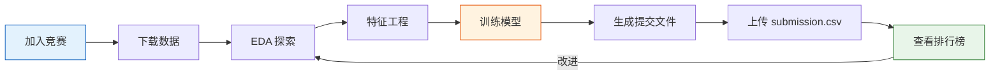

# Kaggle 竞赛实战（选修）

:::tip 本节定位
Kaggle 是全球最大的数据科学竞赛平台。通过参加入门竞赛，你可以把之前学到的所有技能**串联起来**，并向真实的评分系统验证。
:::

## 学习目标

- 了解 Kaggle 平台和竞赛流程
- 学会参加入门级竞赛（Titanic）
- 学习优秀 Notebook 的技巧

---

## 一、Kaggle 平台入门

### 1.1 核心功能

| 功能 | 说明 |
|------|------|
| **Competitions** | 竞赛（入门/基础/奖金赛） |
| **Datasets** | 海量免费数据集 |
| **Notebooks** | 在线 Jupyter 环境（GPU 免费） |
| **Discussion** | 讨论区（学习他人思路） |
| **Learn** | 官方免费课程 |

### 1.2 竞赛流程



---

## 二、入门竞赛：Titanic 生存预测

### 2.1 完整解题流程

```python
import pandas as pd
import numpy as np
from sklearn.ensemble import RandomForestClassifier, GradientBoostingClassifier
from sklearn.model_selection import cross_val_score
from sklearn.pipeline import Pipeline
from sklearn.compose import ColumnTransformer
from sklearn.preprocessing import StandardScaler, OneHotEncoder
from sklearn.impute import SimpleImputer

# 1. 加载数据（Kaggle 下载 或 seaborn）
import seaborn as sns
df = sns.load_dataset('titanic').dropna(subset=['embarked'])

# 2. 特征工程
df['family_size'] = df['sibsp'] + df['parch'] + 1
df['is_alone'] = (df['family_size'] == 1).astype(int)

# 3. 定义特征
num_features = ['age', 'fare', 'family_size']
cat_features = ['sex', 'embarked', 'class']
all_features = num_features + cat_features

X = df[all_features]
y = df['survived']

# 4. 构建 Pipeline
preprocessor = ColumnTransformer([
    ('num', Pipeline([
        ('imputer', SimpleImputer(strategy='median')),
        ('scaler', StandardScaler()),
    ]), num_features),
    ('cat', Pipeline([
        ('imputer', SimpleImputer(strategy='most_frequent')),
        ('encoder', OneHotEncoder(drop='first', sparse_output=False)),
    ]), cat_features),
])

# 5. 模型对比
models = {
    '随机森林': RandomForestClassifier(n_estimators=200, random_state=42),
    'GBDT': GradientBoostingClassifier(n_estimators=200, random_state=42),
}

for name, model in models.items():
    pipe = Pipeline([
        ('preprocessor', preprocessor),
        ('classifier', model),
    ])
    scores = cross_val_score(pipe, X, y, cv=5, scoring='accuracy')
    print(f"{name}: {scores.mean():.4f} ± {scores.std():.4f}")
```

### 2.2 生成提交文件

```python
# Kaggle 竞赛中的标准提交格式
# 假设 test_df 是测试集
# pipe.fit(X_train, y_train)
# predictions = pipe.predict(test_df[all_features])
#
# submission = pd.DataFrame({
#     'PassengerId': test_df['PassengerId'],
#     'Survived': predictions
# })
# submission.to_csv('submission.csv', index=False)
# print(f"提交文件: {submission.shape}")
```

---

## 三、竞赛提分技巧

### 3.1 分数提升路径

| 阶段 | 重点 | 预期提升 |
|------|------|---------|
| 基线 | 简单模型 + 默认参数 | — |
| 特征工程 | 构造新特征、编码优化 | 显著 |
| 模型选择 | 试多种模型 | 中等 |
| 超参数调优 | GridSearch / Optuna | 小幅 |
| 模型融合 | Stacking / Blending | 小幅但稳定 |

### 3.2 学习优秀 Notebook

| 看什么 | 为什么 |
|--------|--------|
| 投票最多的 Notebook | 社区认可的思路 |
| EDA 型 Notebook | 学习数据探索技巧 |
| 高分选手的分享 | 学习特征工程和融合策略 |
| Discussion 区 | 了解数据泄露、评分陷阱等 |

---

## 四、推荐入门竞赛

| 竞赛 | 类型 | 难度 | 说明 |
|------|------|------|------|
| **Titanic** | 分类 | 入门 | 经典入门，社区资源丰富 |
| **House Prices** | 回归 | 入门 | 房价预测，特征工程练习 |
| **Digit Recognizer** | 图像分类 | 入门 | MNIST，可尝试简单 CNN |
| **Spaceship Titanic** | 分类 | 入门 | Titanic 升级版 |

---

## 五、小结

| 要点 | 说明 |
|------|------|
| 从入门竞赛开始 | Titanic / House Prices |
| 先建基线再优化 | 不要一上来就搞复杂模型 |
| 多看优秀 Notebook | 站在巨人的肩膀上 |
| 特征工程最重要 | 比调参的回报大得多 |
| 坚持提交和迭代 | 每次改进都提交看效果 |

---

## 动手挑战

### 挑战 1：Titanic 冲刺 0.80+

在 Kaggle 注册账号，参加 Titanic 竞赛，用本课程学到的所有技能（特征工程 + Pipeline + 模型调优）尝试达到 0.80+ 的分数。

### 挑战 2：House Prices 实战

参加 Kaggle 的 House Prices 竞赛，用更大的数据集练习回归任务，重点练习缺失值处理和高维类别特征编码。
