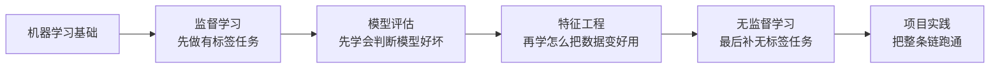

# 第四阶段：机器学习

| 信息 | 说明 |
|---|---|
| **预估学时** | 120～160h |
| **前置要求** | 完成前三阶段 |

掌握经典机器学习算法与完整建模流程。

## 阶段导读

这一阶段的重点不是“模型名词越记越多”，而是学会完整回答下面这些问题：

1. 这是分类、回归还是聚类问题
2. 数据该怎么准备和切分
3. 先用什么 baseline 最合理
4. 该看什么指标
5. 模型效果不好时先查哪一步

## 这一阶段真正的主线是什么

如果用一条最核心的线把第四阶段串起来，它其实是在练这件事：

也就是说，这一阶段真正想教会你的不是“十几个模型名”，而是：

- 遇到问题先怎么拆
- 第一版模型先怎么立
- 模型不够好时下一步优先查什么
- 最后怎样把结果讲成一个完整项目

## 这一阶段的教学安排是否由浅入深？

整体上是顺的，但更适合新人的理解方式不是“按文件夹顺序一路往下扫”，而是把它看成一条建模主线：

也就是说：

- **章节结构**本身是合理的
- 但**学习时最好把第 5 章特征工程和第 2、4 章交叉着学**

因为新人真正做项目时，通常不是“先把算法学完，再想特征”，而是会来回迭代。

## 本阶段包含什么

| 章节 | 主题 | 主要解决什么问题 |
|---|---|---|
| 第一章 | 机器学习基础 | 建立任务、数据集、特征和训练流程地图 |
| 第二章 | 监督学习 | 学线性回归、逻辑回归、树模型等核心方法 |
| 第三章 | 无监督学习 | 学聚类、降维和没有标签时怎么分析数据 |
| 第四章 | 模型评估 | 学指标、交叉验证、混淆矩阵和实验比较 |
| 第五章 | 特征工程 | 学数据表示、特征选择和预处理 |
| 第六章 | 项目实践 | 把建模流程真正跑成一个闭环 |

## 建议学习顺序

1. 先补第一章“机器学习基础”
2. 再学第二章“监督学习”
3. 接着学第四章“模型评估”
4. 然后补第五章“特征工程”
5. 再看第三章“无监督学习”
6. 最后做第六章“项目实践”

这样学的好处是：你会先把有标签任务和评估框架打稳，再回头理解无监督方法。

## 如果你想按“最稳的项目节奏”来学

也可以直接按下面这条更像真实建模工作的顺序走：

1. 先把第一章和第二章前半学完  
   先建立“任务类型 + baseline”这两个最关键的抓手。

2. 马上插入第四章第一节  
   先学会为什么不能只看一个总分，尤其不能只看准确率。

3. 再补第五章前半  
   这样你在做第一个项目前，就已经知道数据怎么清洗、编码、缩放。

4. 再回头补第二章后半和第三章  
   这时再看树模型、集成学习、聚类、降维，会更像在补工具箱。

5. 最后用第六章项目把整条链跑通  
   真正把“baseline -> 评估 -> 改进 -> 解释”做成闭环。

## 更适合新人的学习节奏

如果你希望“更简单、更不容易学乱”，建议按下面的节奏走：

1. 第一章先学完整  
   把任务类型、训练集/测试集、baseline 这些最基础的东西真正看懂。

2. 第二章先学前两节  
   先把线性回归、逻辑回归学明白，建立最基本的建模感觉。

3. 第四章先学第一节  
   先搞清为什么不能只看准确率。

4. 第五章先学前两节  
   先学会看特征、处理缺失值、编码、缩放。

5. 再回到第二章后两节  
   这时再看树模型和集成学习，会更容易理解“为什么有些模型对预处理没那么敏感”。

6. 然后学第三章  
   你会更容易区分“有标签建模”和“无标签探索”。

7. 最后做第六章项目  
   把特征、模型、评估、调参、解释真正串起来。

## 学这一阶段时最容易犯的错

- 一上来就比谁模型更高级，不先立 baseline
- 只看准确率，不看数据分布和业务代价
- 数据泄漏了还以为模型很强
- 不做错误分析，只看一个总分

## 这一阶段最值得养成的 4 个习惯

1. 先问任务是什么，再问模型是什么
2. 先做一个能解释的 baseline，再谈更强模型
3. 每次只改一个主要因素，方便判断提升来自哪里
4. 每轮实验都留下记录，最后才能做出像样的复盘

## 这一阶段最值得优先补强的能力

- 能从一个业务问题判断它是分类、回归还是聚类
- 能先搭一个简单 baseline，而不是直接上复杂模型
- 能根据任务代价选择指标，而不是只看分数高低
- 能用特征工程和错误分析去真正改进模型

## 学完后的出口能力

- 能独立完成一次经典 ML 建模流程
- 能解释为什么选某个模型和某个指标
- 能看懂后面深度学习里很多通用训练概念
- 能把数学、数据分析和建模主线真正接起来

## 学完第四阶段后，你应该能自己回答什么

到这一阶段结束时，一个比较扎实的新人应该已经能独立回答这些问题：

- 这个问题到底是回归、分类还是聚类
- 我为什么先用这个 baseline
- 我现在最该盯哪个指标，为什么
- 我下一轮是该改特征、改模型，还是改评估方式
- 我怎么把这个项目讲成一个别人能听懂的建模故事
