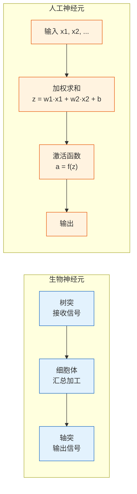
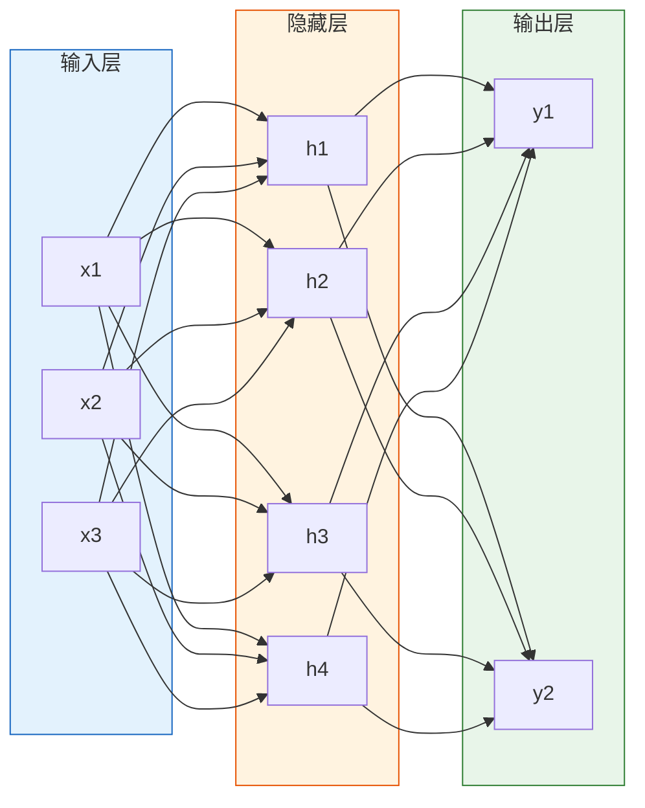
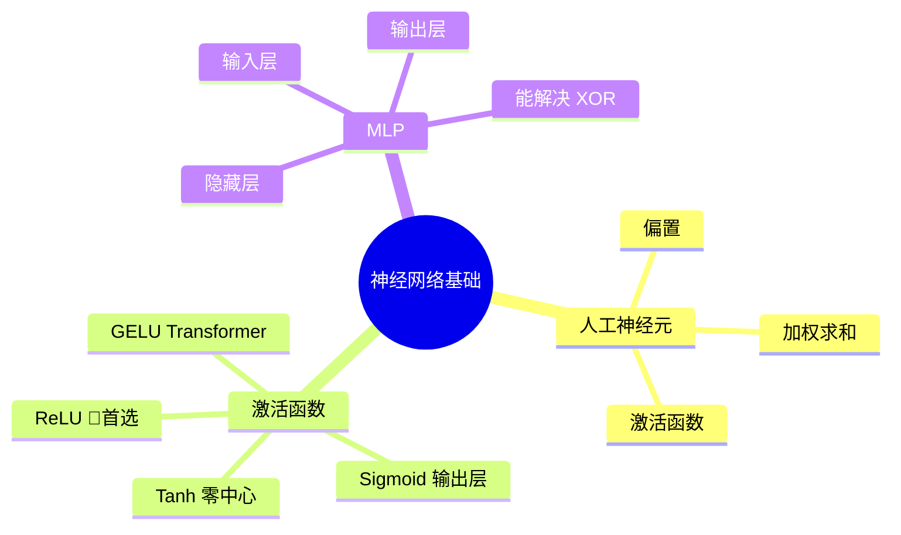

# 从神经元到多层感知机

:::tip 本节定位
深度学习的一切都从**人工神经元**开始。本节从最简单的感知机出发，认识各种激活函数，再组装成多层感知机（MLP）——这是所有神经网络的基础。
:::

## 学习目标

- 理解从生物神经元到人工神经元的映射
- 掌握感知机模型
- 掌握常用激活函数：ReLU、Sigmoid、Tanh 等
- 理解多层感知机（MLP）的结构

---

## 一、从生物到人工



核心对应关系：

| 生物 | 人工 |
|------|------|
| 树突（接收信号） | 输入 x |
| 突触强度 | 权重 w |
| 细胞体（汇总） | 加权求和 z = Σ(wi·xi) + b |
| 激活/抑制 | 激活函数 f(z) |
| 轴突（输出） | 输出 a = f(z) |

---

## 二、感知机——最简单的人工神经元

### 2.1 模型

感知机是一个做**二分类**的简单模型：

> **z = w1·x1 + w2·x2 + ... + wn·xn + b**
>
> **输出 = 1 如果 z > 0，否则 = 0**

```python
import numpy as np
import matplotlib.pyplot as plt

class Perceptron:
    """最简单的感知机"""
    def __init__(self, n_features, lr=0.1):
        self.w = np.zeros(n_features)
        self.b = 0
        self.lr = lr

    def predict(self, x):
        z = np.dot(x, self.w) + self.b
        return 1 if z > 0 else 0

    def train(self, X, y, epochs=20):
        for epoch in range(epochs):
            errors = 0
            for xi, yi in zip(X, y):
                pred = self.predict(xi)
                error = yi - pred
                if error != 0:
                    self.w += self.lr * error * xi
                    self.b += self.lr * error
                    errors += 1
            if errors == 0:
                print(f"第 {epoch+1} 轮收敛！")
                break

# AND 门
X = np.array([[0,0], [0,1], [1,0], [1,1]])
y = np.array([0, 0, 0, 1])

p = Perceptron(2)
p.train(X, y)
print(f"权重: {p.w}, 偏置: {p.b}")
for xi, yi in zip(X, y):
    print(f"  输入 {xi} → 预测 {p.predict(xi)}, 真实 {yi}")
```

### 2.2 感知机的局限

感知机只能解决**线性可分**问题。XOR 问题就无法解决——这正是多层网络出现的原因。

```python
# XOR 问题——感知机无法解决
X_xor = np.array([[0,0], [0,1], [1,0], [1,1]])
y_xor = np.array([0, 1, 1, 0])

p_xor = Perceptron(2)
p_xor.train(X_xor, y_xor, epochs=100)

print("\nXOR 预测结果:")
for xi, yi in zip(X_xor, y_xor):
    print(f"  输入 {xi} → 预测 {p_xor.predict(xi)}, 真实 {yi}")
```

---

## 三、激活函数

### 3.1 为什么需要激活函数？

如果没有激活函数，多层网络就退化为一个线性模型——无论叠多少层，效果等同于单层。激活函数引入**非线性**，让网络能拟合任意复杂的函数。

### 3.2 常用激活函数

```python
import numpy as np
import matplotlib.pyplot as plt

x = np.linspace(-5, 5, 200)

# 各种激活函数
activations = {
    'Sigmoid': (1 / (1 + np.exp(-x)), 'σ(x) = 1/(1+e⁻ˣ)'),
    'Tanh': (np.tanh(x), 'tanh(x)'),
    'ReLU': (np.maximum(0, x), 'max(0, x)'),
    'Leaky ReLU': (np.where(x > 0, x, 0.01 * x), 'max(0.01x, x)'),
}

fig, axes = plt.subplots(2, 2, figsize=(12, 8))
colors = ['#e74c3c', '#3498db', '#2ecc71', '#9b59b6']

for ax, (name, (y, formula)), color in zip(axes.ravel(), activations.items(), colors):
    ax.plot(x, y, linewidth=2, color=color)
    ax.axhline(0, color='gray', linewidth=0.5)
    ax.axvline(0, color='gray', linewidth=0.5)
    ax.set_title(f'{name}: {formula}', fontsize=12)
    ax.set_xlim(-5, 5)
    ax.grid(True, alpha=0.3)

plt.suptitle('常用激活函数', fontsize=14)
plt.tight_layout()
plt.show()
```

### 3.3 对比与选择

| 激活函数 | 输出范围 | 优点 | 缺点 | 使用场景 |
|---------|---------|------|------|---------|
| **ReLU** | [0, +∞) | 计算快、缓解梯度消失 | 神经元"死亡" | **隐藏层首选** |
| **Sigmoid** | (0, 1) | 输出概率解释 | 梯度消失、非零中心 | 二分类输出层 |
| **Tanh** | (-1, 1) | 零中心 | 梯度消失 | RNN（较少用） |
| **Leaky ReLU** | (-∞, +∞) | 避免神经元死亡 | 多一个超参数 | ReLU 改进 |
| **GELU** | 约 (-0.17, +∞) | 平滑、效果好 | 计算稍慢 | Transformer |
| **Swish** | 约 (-0.28, +∞) | 平滑、自门控 | 计算稍慢 | 新架构 |

:::info ReLU 的"神经元死亡"
当输入始终为负时，ReLU 输出永远为 0，梯度也为 0，参数不再更新。Leaky ReLU 通过给负数一个小斜率（0.01）来缓解。
:::

---

## 四、多层感知机（MLP）

### 4.1 结构

把多个神经元**按层排列**，前一层的输出作为下一层的输入：



### 4.2 用 NumPy 实现 MLP 解决 XOR

```python
np.random.seed(42)

# XOR 数据
X = np.array([[0,0], [0,1], [1,0], [1,1]])
y = np.array([[0], [1], [1], [0]])

# 网络: 2 → 4 → 1
W1 = np.random.randn(2, 4) * 0.5
b1 = np.zeros((1, 4))
W2 = np.random.randn(4, 1) * 0.5
b2 = np.zeros((1, 1))

def sigmoid(z):
    return 1 / (1 + np.exp(-z))

def sigmoid_deriv(a):
    return a * (1 - a)

lr = 1.0
losses = []

for epoch in range(5000):
    # 前向传播
    z1 = X @ W1 + b1
    a1 = sigmoid(z1)
    z2 = a1 @ W2 + b2
    a2 = sigmoid(z2)

    # 损失
    loss = np.mean((y - a2) ** 2)
    losses.append(loss)

    # 反向传播
    dz2 = (a2 - y) * sigmoid_deriv(a2)
    dW2 = a1.T @ dz2 / 4
    db2 = np.mean(dz2, axis=0, keepdims=True)

    dz1 = (dz2 @ W2.T) * sigmoid_deriv(a1)
    dW1 = X.T @ dz1 / 4
    db1 = np.mean(dz1, axis=0, keepdims=True)

    # 更新
    W2 -= lr * dW2
    b2 -= lr * db2
    W1 -= lr * dW1
    b1 -= lr * db1

print(f"最终损失: {losses[-1]:.6f}")
print("XOR 预测:")
for xi, yi, pred in zip(X, y, a2):
    print(f"  {xi} → {pred[0]:.4f}, 真实 {yi[0]}")

plt.plot(losses)
plt.xlabel('Epoch')
plt.ylabel('Loss')
plt.title('MLP 解决 XOR')
plt.grid(True, alpha=0.3)
plt.show()
```

---

## 五、小结

| 概念 | 要点 |
|------|------|
| 人工神经元 | 加权求和 + 激活函数 |
| 感知机 | 最简单的神经元，只能线性分类 |
| 激活函数 | 引入非线性；隐藏层用 ReLU |
| MLP | 多层堆叠，可拟合任意函数 |



---

## 动手练习

### 练习 1：实现 OR 门感知机

修改 AND 门的训练数据为 OR 门（0|0→0, 0|1→1, 1|0→1, 1|1→1），训练感知机并画出决策边界。

### 练习 2：MLP 分类月牙数据

用 `sklearn.datasets.make_moons` 生成月牙数据，手写 NumPy MLP（2→8→1），训练后画出决策边界。
