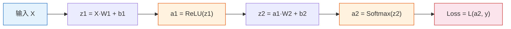
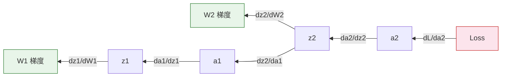
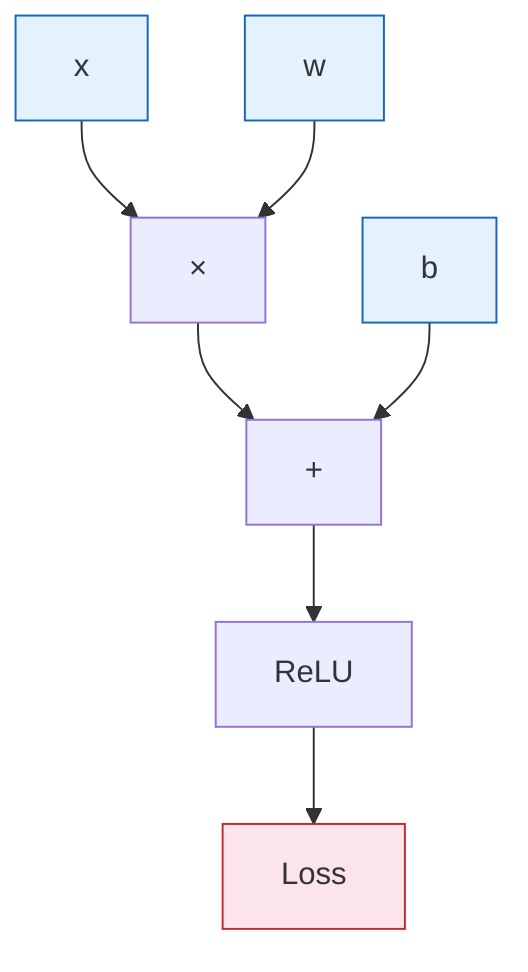

# 前向传播与反向传播

:::tip 🔧 核心技能
反向传播是深度学习的**核心算法**。你必须能手动推导一个 2 层网络的反向传播过程。本节在第三阶段"链式法则与反向传播预览"的基础上，给出完整的推导和实现。
:::

## 学习目标

- 理解前向传播的完整计算过程
- 掌握常用损失函数（MSE、交叉熵）
- 🔧 能手动推导 2 层网络的反向传播
- 理解计算图的概念

---

## 一、前向传播

前向传播就是**从输入到输出的计算过程**：



### 1.1 手动计算示例

```python
import numpy as np

# 一个极简的 2 层网络: 2→3→2
np.random.seed(0)

# 输入和权重
X = np.array([[1.0, 2.0]])     # 1 个样本, 2 个特征
W1 = np.array([[0.1, 0.3, -0.2],
               [0.4, -0.1, 0.5]])  # 2×3
b1 = np.array([[0.0, 0.0, 0.0]])
W2 = np.array([[0.2, -0.3],
               [0.1, 0.4],
               [-0.5, 0.2]])       # 3×2
b2 = np.array([[0.0, 0.0]])
y_true = np.array([[1, 0]])        # 真实标签（one-hot）

# 前向传播
z1 = X @ W1 + b1
print(f"z1 = {z1}")

a1 = np.maximum(0, z1)  # ReLU
print(f"a1 (ReLU) = {a1}")

z2 = a1 @ W2 + b2
print(f"z2 = {z2}")

# Softmax
exp_z2 = np.exp(z2 - z2.max())
a2 = exp_z2 / exp_z2.sum(axis=1, keepdims=True)
print(f"a2 (Softmax) = {a2}")
```

---

## 二、损失函数

### 2.1 MSE（回归）

> **MSE = (1/n) × Σ(yi - ŷi)²**

```python
# MSE
y_true_reg = np.array([3.0, 5.0, 2.0])
y_pred_reg = np.array([2.8, 5.2, 2.1])
mse = np.mean((y_true_reg - y_pred_reg) ** 2)
print(f"MSE = {mse:.4f}")
```

### 2.2 交叉熵（分类）

> **Cross-Entropy = -Σ(yi × log(ŷi))**

```python
# 交叉熵
loss = -np.sum(y_true * np.log(a2 + 1e-8))
print(f"交叉熵损失 = {loss:.4f}")
```

### 2.3 二元交叉熵（二分类）

> **BCE = -(y × log(ŷ) + (1-y) × log(1-ŷ))**

```python
# 二元交叉熵
y_bin = np.array([1, 0, 1, 1])
y_pred_bin = np.array([0.9, 0.1, 0.8, 0.7])
bce = -np.mean(y_bin * np.log(y_pred_bin) + (1 - y_bin) * np.log(1 - y_pred_bin))
print(f"BCE = {bce:.4f}")
```

### 损失函数选择

| 任务 | 输出层激活 | 损失函数 |
|------|-----------|---------|
| 回归 | 无（线性） | MSE |
| 二分类 | Sigmoid | BCE |
| 多分类 | Softmax | 交叉熵 |

---

## 三、反向传播——🔧 手动推导

### 3.1 核心思想

反向传播就是**链式法则的系统化应用**——从损失出发，逐层往回算每个参数的梯度。



### 3.2 完整推导（2 层网络）

```python
# 继续上面的例子，手动反向传播

# --- 输出层梯度 ---
# 对 Softmax + 交叉熵, 梯度简化为: dz2 = a2 - y_true
dz2 = a2 - y_true
print(f"dz2 = {dz2}")

# W2 梯度: dW2 = a1.T @ dz2
dW2 = a1.T @ dz2
db2 = dz2.copy()
print(f"dW2 = \n{dW2}")

# --- 隐藏层梯度 ---
# da1 = dz2 @ W2.T
da1 = dz2 @ W2.T
print(f"da1 = {da1}")

# ReLU 的导数: z1 > 0 则为 1, 否则为 0
relu_mask = (z1 > 0).astype(float)
dz1 = da1 * relu_mask
print(f"dz1 = {dz1}")

# W1 梯度: dW1 = X.T @ dz1
dW1 = X.T @ dz1
db1 = dz1.copy()
print(f"dW1 = \n{dW1}")

# --- 参数更新 ---
lr = 0.1
W2 -= lr * dW2
b2 -= lr * db2
W1 -= lr * dW1
b1 -= lr * db1
print("\n参数已更新！")
```

### 3.3 梯度计算公式总结

| 变量 | 梯度 |
|------|------|
| `dz2` | `a2 - y`（Softmax+交叉熵简化） |
| `dW2` | `a1.T @ dz2` |
| `db2` | `dz2` |
| `da1` | `dz2 @ W2.T` |
| `dz1` | `da1 * relu_mask` |
| `dW1` | `X.T @ dz1` |
| `db1` | `dz1` |

---

## 四、计算图

### 4.1 什么是计算图？

计算图是把每一步计算拆成节点，记录**谁依赖谁**。反向传播时，沿着图的反方向传递梯度。



**PyTorch 就是在自动构建和遍历这个计算图**——这就是 `autograd` 的本质。

### 4.2 数值验证

用微小扰动验证梯度是否正确：

```python
def numerical_gradient(f, x, eps=1e-5):
    """数值梯度（有限差分法）"""
    grad = np.zeros_like(x)
    for i in range(x.size):
        old_val = x.flat[i]
        x.flat[i] = old_val + eps
        fx_plus = f(x)
        x.flat[i] = old_val - eps
        fx_minus = f(x)
        grad.flat[i] = (fx_plus - fx_minus) / (2 * eps)
        x.flat[i] = old_val
    return grad

# 验证: y = x^2, dy/dx = 2x
x = np.array([3.0])
f = lambda x: x[0]**2
print(f"解析梯度: 2×3 = 6")
print(f"数值梯度: {numerical_gradient(f, x)[0]:.6f}")
```

---

## 五、完整训练循环

```python
# 完整的 2 层网络训练 (分类月牙数据)
from sklearn.datasets import make_moons

X, y = make_moons(200, noise=0.2, random_state=42)
y_onehot = np.eye(2)[y]  # one-hot

# 初始化
np.random.seed(42)
W1 = np.random.randn(2, 16) * 0.5
b1 = np.zeros((1, 16))
W2 = np.random.randn(16, 2) * 0.5
b2 = np.zeros((1, 2))

lr = 0.5
losses = []

for epoch in range(1000):
    # 前向
    z1 = X @ W1 + b1
    a1 = np.maximum(0, z1)
    z2 = a1 @ W2 + b2
    exp_z = np.exp(z2 - z2.max(axis=1, keepdims=True))
    a2 = exp_z / exp_z.sum(axis=1, keepdims=True)

    # 损失
    loss = -np.mean(np.sum(y_onehot * np.log(a2 + 1e-8), axis=1))
    losses.append(loss)

    # 反向
    dz2 = (a2 - y_onehot) / len(X)
    dW2 = a1.T @ dz2
    db2 = dz2.sum(axis=0, keepdims=True)
    da1 = dz2 @ W2.T
    dz1 = da1 * (z1 > 0)
    dW1 = X.T @ dz1
    db1 = dz1.sum(axis=0, keepdims=True)

    # 更新
    W2 -= lr * dW2
    b2 -= lr * db2
    W1 -= lr * dW1
    b1 -= lr * db1

# 结果
preds = np.argmax(a2, axis=1)
acc = (preds == y).mean()
print(f"最终损失: {losses[-1]:.4f}, 准确率: {acc:.1%}")

import matplotlib.pyplot as plt
fig, axes = plt.subplots(1, 2, figsize=(12, 4))
axes[0].plot(losses)
axes[0].set_xlabel('Epoch')
axes[0].set_ylabel('Loss')
axes[0].set_title('训练损失')

axes[1].scatter(X[:, 0], X[:, 1], c=preds, cmap='coolwarm', s=10, alpha=0.7)
axes[1].set_title(f'分类结果（准确率 {acc:.1%}）')
plt.tight_layout()
plt.show()
```

---

## 六、小结

| 概念 | 要点 |
|------|------|
| 前向传播 | 输入→加权求和→激活→输出→损失 |
| 损失函数 | 回归用 MSE，分类用交叉熵 |
| 反向传播 | 链式法则从后往前算梯度 |
| 计算图 | 记录计算依赖，PyTorch 自动构建 |

---

## 动手练习

### 练习 1：手动推导（纸笔）

对一个 1→2→1 的网络（Sigmoid 激活），输入 x=0.5，目标 y=1，手动计算一轮前向+反向传播，更新参数。

### 练习 2：数值梯度验证

修改完整训练循环，在第一轮时用数值梯度验证 dW1 的解析梯度是否正确（误差应小于 1e-5）。
