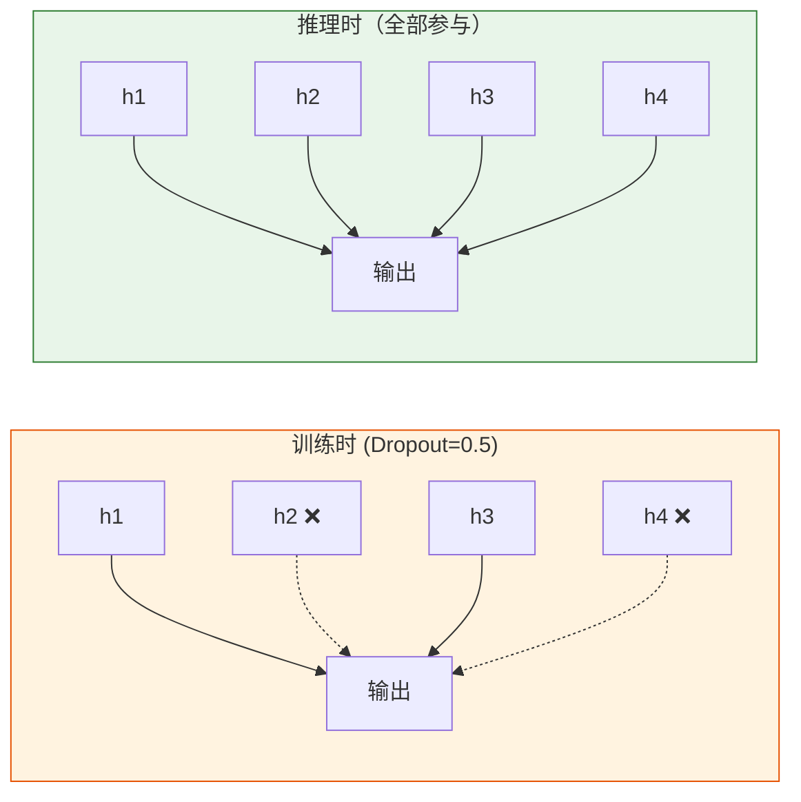

# 深度学习中的正则化

:::tip 本节定位
深度网络参数量巨大，非常容易过拟合。本节介绍深度学习特有的正则化技术——**Dropout 和 BatchNorm 是你必须掌握的两个。**
:::

## 学习目标

- 🔧 掌握 Dropout 的原理和使用
- 🔧 掌握 Batch Normalization（BN）
- 理解 Layer Normalization（LN）
- 🔧 掌握数据增强和早停法

---

## 一、回顾：L1/L2 正则化

第四阶段已学过——L2 正则化（权重衰减）在深度学习中直接通过优化器的 `weight_decay` 参数使用：

```python
import torch
import torch.nn as nn

# AdamW 自带权重衰减
optimizer = torch.optim.AdamW(model.parameters(), lr=0.001, weight_decay=0.01)
```

---

## 二、Dropout——随机丢弃

### 2.1 原理

训练时，**随机让一部分神经元不工作**（输出置为 0）。这迫使网络不依赖任何单个神经元，增强鲁棒性。



### 2.2 PyTorch 使用

```python
import torch
import torch.nn as nn
import matplotlib.pyplot as plt
from sklearn.datasets import make_moons
from sklearn.model_selection import train_test_split

# 数据
X, y = make_moons(500, noise=0.3, random_state=42)
X_train, X_test, y_train, y_test = train_test_split(X, y, test_size=0.3, random_state=42)
X_train_t = torch.FloatTensor(X_train)
y_train_t = torch.LongTensor(y_train)
X_test_t = torch.FloatTensor(X_test)
y_test_t = torch.LongTensor(y_test)

# 对比有无 Dropout
class MLP(nn.Module):
    def __init__(self, dropout_rate=0.0):
        super().__init__()
        self.net = nn.Sequential(
            nn.Linear(2, 64),
            nn.ReLU(),
            nn.Dropout(dropout_rate),
            nn.Linear(64, 64),
            nn.ReLU(),
            nn.Dropout(dropout_rate),
            nn.Linear(64, 2),
        )

    def forward(self, x):
        return self.net(x)

results = {}
for name, drop in [('无 Dropout', 0.0), ('Dropout=0.3', 0.3), ('Dropout=0.5', 0.5)]:
    model = MLP(drop)
    optimizer = torch.optim.Adam(model.parameters(), lr=0.01)
    criterion = nn.CrossEntropyLoss()
    train_losses, test_losses = [], []

    for epoch in range(200):
        model.train()
        loss = criterion(model(X_train_t), y_train_t)
        optimizer.zero_grad()
        loss.backward()
        optimizer.step()
        train_losses.append(loss.item())

        model.eval()
        with torch.no_grad():
            test_loss = criterion(model(X_test_t), y_test_t)
            test_losses.append(test_loss.item())

    results[name] = (train_losses, test_losses)

fig, axes = plt.subplots(1, 3, figsize=(15, 4))
for ax, (name, (tr, te)) in zip(axes, results.items()):
    ax.plot(tr, label='训练', linewidth=2)
    ax.plot(te, label='测试', linewidth=2)
    ax.set_title(name)
    ax.set_xlabel('Epoch')
    ax.set_ylabel('Loss')
    ax.legend()
    ax.grid(True, alpha=0.3)
plt.suptitle('Dropout 对过拟合的影响', fontsize=13)
plt.tight_layout()
plt.show()
```

:::info 重要
- `model.train()` 开启 Dropout
- `model.eval()` 关闭 Dropout
- **推理时一定要调 `model.eval()`！**
:::

---

## 三、Batch Normalization（BN）

### 3.1 原理

对每一层的输出做**归一化**（均值为 0，标准差为 1），然后用可学习的参数缩放和平移。

**作用：**
- 加速收敛
- 减少对初始化的敏感性
- 有轻微正则化效果

### 3.2 PyTorch 使用

```python
class MLP_BN(nn.Module):
    def __init__(self):
        super().__init__()
        self.net = nn.Sequential(
            nn.Linear(2, 64),
            nn.BatchNorm1d(64),   # BN 放在激活函数前面
            nn.ReLU(),
            nn.Linear(64, 64),
            nn.BatchNorm1d(64),
            nn.ReLU(),
            nn.Linear(64, 2),
        )

    def forward(self, x):
        return self.net(x)

# 对比有无 BN
for name, ModelClass in [('无 BN', MLP), ('有 BN', MLP_BN)]:
    model = ModelClass() if name == '有 BN' else ModelClass(0.0)
    optimizer = torch.optim.SGD(model.parameters(), lr=0.1)  # 用 SGD 更明显
    criterion = nn.CrossEntropyLoss()

    for epoch in range(100):
        model.train()
        loss = criterion(model(X_train_t), y_train_t)
        optimizer.zero_grad()
        loss.backward()
        optimizer.step()

    model.eval()
    with torch.no_grad():
        acc = (model(X_test_t).argmax(1) == y_test_t).float().mean()
    print(f"{name}: 测试准确率 = {acc:.4f}")
```

---

## 四、Layer Normalization（LN）

### BN vs LN

| 特性 | Batch Normalization | Layer Normalization |
|------|-------------------|-------------------|
| 归一化维度 | 跨样本（batch 维） | 跨特征（layer 维） |
| 依赖 batch size | 是 | 否 |
| 适用 | **CNN** | **Transformer、RNN** |

```python
# BN vs LN 使用
bn = nn.BatchNorm1d(64)    # 输入: (batch, 64)
ln = nn.LayerNorm(64)      # 输入: (batch, 64)

x = torch.randn(32, 64)
print(f"BN 输出形状: {bn(x).shape}")
print(f"LN 输出形状: {ln(x).shape}")
```

:::info
记住：**CNN 用 BN，Transformer 用 LN。** 这是实际工程中的标准选择。
:::

---

## 五、数据增强

### 5.1 图像数据增强

```python
from torchvision import transforms

# 常用的图像增强组合
train_transform = transforms.Compose([
    transforms.RandomHorizontalFlip(p=0.5),     # 随机水平翻转
    transforms.RandomRotation(15),               # 随机旋转 ±15°
    transforms.ColorJitter(brightness=0.2, contrast=0.2),  # 颜色扰动
    transforms.RandomResizedCrop(224, scale=(0.8, 1.0)),   # 随机裁剪
    transforms.ToTensor(),
    transforms.Normalize([0.485, 0.456, 0.406], [0.229, 0.224, 0.225]),
])

# 测试集不做增强
test_transform = transforms.Compose([
    transforms.Resize(256),
    transforms.CenterCrop(224),
    transforms.ToTensor(),
    transforms.Normalize([0.485, 0.456, 0.406], [0.229, 0.224, 0.225]),
])
```

---

## 六、早停法（Early Stopping）

### 6.1 原理

监控**验证集损失**，连续 N 轮不下降就停止训练。

```python
class EarlyStopping:
    def __init__(self, patience=10, min_delta=0.001):
        self.patience = patience
        self.min_delta = min_delta
        self.counter = 0
        self.best_loss = float('inf')
        self.should_stop = False

    def step(self, val_loss):
        if val_loss < self.best_loss - self.min_delta:
            self.best_loss = val_loss
            self.counter = 0
        else:
            self.counter += 1
            if self.counter >= self.patience:
                self.should_stop = True
        return self.should_stop

# 使用示例
early_stop = EarlyStopping(patience=10)
# for epoch in range(max_epochs):
#     train(...)
#     val_loss = validate(...)
#     if early_stop.step(val_loss):
#         print(f"早停! Epoch {epoch}")
#         break
```

---

## 七、小结

| 技术 | 类型 | 要点 |
|------|------|------|
| **Dropout** | 防过拟合 | 训练时随机丢弃，推理时关闭 |
| **Batch Norm** | 加速+正则 | CNN 标配，放在激活前 |
| **Layer Norm** | 加速+正则 | Transformer 标配 |
| **数据增强** | 增加多样性 | 只在训练集用 |
| **早停法** | 防过拟合 | 监控验证集 loss |
| **权重衰减** | L2 正则 | optimizer 的 weight_decay |

---

## 动手练习

### 练习 1：正则化组合

在 MNIST 数据集上训练 MLP，依次添加 Dropout、BatchNorm、数据增强，观察测试准确率的变化。

### 练习 2：Early Stopping 实践

实现完整的早停训练循环，保存最佳模型权重，训练结束后加载最佳权重评估。
