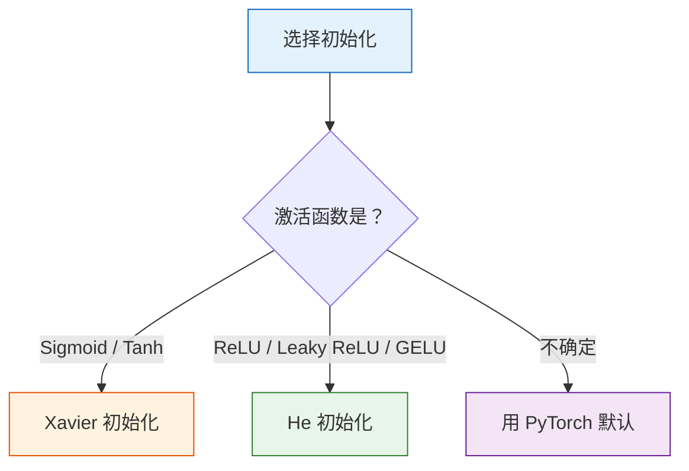

# 权重初始化

:::tip 本节定位
深度网络训练成败的一个关键因素是**权重初始化**。不好的初始化会导致梯度消失或梯度爆炸，让训练完全失败。好消息是：PyTorch 默认已经帮你选了合适的初始化。
:::

## 学习目标

- 理解为什么不能全零初始化
- 理解 Xavier / Glorot 初始化
- 理解 He / Kaiming 初始化
- 观察初始化对训练的影响

---

## 一、为什么初始化很重要？

### 1.1 全零初始化的问题

如果所有权重都是 0，那所有神经元计算结果完全一样，梯度也一样，**永远不会分化**——等于只有一个神经元。

### 1.2 随机初始化也有坑

- **太大**：激活值饱和 → 梯度消失（Sigmoid/Tanh）或梯度爆炸
- **太小**：信号逐层衰减 → 梯度也衰减 → 训练极慢

```python
import torch
import torch.nn as nn
import matplotlib.pyplot as plt

# 观察不同初始化下的激活值分布
torch.manual_seed(42)

def observe_activations(init_fn, title, activation=nn.Tanh()):
    """观察 10 层网络中每层的激活值分布"""
    layers = []
    for i in range(10):
        linear = nn.Linear(256, 256, bias=False)
        init_fn(linear.weight)
        layers.append(linear)
        layers.append(activation)

    model = nn.Sequential(*layers)

    # 记录每层输出
    x = torch.randn(200, 256)
    activations = []
    for i in range(0, len(layers), 2):
        x = layers[i](x)       # Linear
        x = layers[i+1](x)     # Activation
        activations.append(x.detach().numpy().flatten())

    fig, axes = plt.subplots(2, 5, figsize=(15, 5))
    for i, (ax, act) in enumerate(zip(axes.ravel(), activations)):
        ax.hist(act, bins=50, color='steelblue', alpha=0.7)
        ax.set_title(f'Layer {i+1}')
        ax.set_xlim(-1.5, 1.5)
    plt.suptitle(title, fontsize=13)
    plt.tight_layout()
    plt.show()

# 太小的初始化
observe_activations(
    lambda w: nn.init.normal_(w, 0, 0.01),
    '太小初始化 (std=0.01) + Tanh → 信号衰减'
)

# 太大的初始化
observe_activations(
    lambda w: nn.init.normal_(w, 0, 1.0),
    '太大初始化 (std=1.0) + Tanh → 饱和'
)
```

---

## 二、Xavier / Glorot 初始化

### 2.1 核心思想

让每一层的**输入和输出的方差保持一致**，避免信号逐层放大或衰减。

> **权重从 N(0, 2/(fan_in + fan_out)) 中采样**
>
> fan_in = 输入维度, fan_out = 输出维度

### 2.2 适用：Sigmoid / Tanh

```python
observe_activations(
    lambda w: nn.init.xavier_normal_(w),
    'Xavier 初始化 + Tanh → 信号稳定'
)
```

---

## 三、He / Kaiming 初始化

### 3.1 核心思想

Xavier 假设激活函数是线性的。但 ReLU 会把一半神经元置为 0，所以需要**更大的方差**来补偿。

> **权重从 N(0, 2/fan_in) 中采样**

### 3.2 适用：ReLU 及其变体

```python
observe_activations(
    lambda w: nn.init.kaiming_normal_(w, mode='fan_in', nonlinearity='relu'),
    'He 初始化 + ReLU → 信号稳定',
    activation=nn.ReLU()
)
```

---

## 四、选择指南

| 激活函数 | 推荐初始化 | PyTorch 函数 |
|---------|-----------|-------------|
| **Sigmoid / Tanh** | Xavier | `nn.init.xavier_normal_` |
| **ReLU / Leaky ReLU** | He (Kaiming) | `nn.init.kaiming_normal_` |
| **GELU / Swish** | He | `nn.init.kaiming_normal_` |

### PyTorch 默认行为

```python
# PyTorch 的 nn.Linear 默认使用 Kaiming Uniform
linear = nn.Linear(256, 128)
print(f"默认初始化范围: [{linear.weight.min():.4f}, {linear.weight.max():.4f}]")

# 手动指定初始化
nn.init.kaiming_normal_(linear.weight, mode='fan_in', nonlinearity='relu')
nn.init.zeros_(linear.bias)
```

:::info 好消息
PyTorch 的 `nn.Linear` 默认使用 Kaiming Uniform 初始化，`nn.Conv2d` 也是。大多数情况下**你不需要手动初始化**——但理解原理能帮你诊断训练异常。
:::

---

## 五、初始化对训练的影响

```python
# 对比不同初始化的训练效果
from sklearn.datasets import make_moons

X, y = make_moons(500, noise=0.2, random_state=42)
X_t = torch.FloatTensor(X)
y_t = torch.LongTensor(y)

init_methods = {
    '全零': lambda w: nn.init.zeros_(w),
    'N(0, 0.01)': lambda w: nn.init.normal_(w, 0, 0.01),
    'N(0, 1.0)': lambda w: nn.init.normal_(w, 0, 1.0),
    'Xavier': lambda w: nn.init.xavier_normal_(w),
    'He (Kaiming)': lambda w: nn.init.kaiming_normal_(w),
}

plt.figure(figsize=(10, 5))
for name, init_fn in init_methods.items():
    model = nn.Sequential(
        nn.Linear(2, 64), nn.ReLU(),
        nn.Linear(64, 64), nn.ReLU(),
        nn.Linear(64, 2),
    )
    # 初始化
    for m in model:
        if isinstance(m, nn.Linear):
            init_fn(m.weight)
            nn.init.zeros_(m.bias)

    optimizer = torch.optim.Adam(model.parameters(), lr=0.01)
    criterion = nn.CrossEntropyLoss()
    losses = []

    for epoch in range(200):
        loss = criterion(model(X_t), y_t)
        optimizer.zero_grad()
        loss.backward()
        optimizer.step()
        losses.append(loss.item())

    plt.plot(losses, label=name, linewidth=2)

plt.xlabel('Epoch')
plt.ylabel('Loss')
plt.title('不同初始化方法的训练曲线')
plt.legend()
plt.grid(True, alpha=0.3)
plt.show()
```

---

## 六、小结

| 初始化 | 原理 | 适用 |
|--------|------|------|
| **全零** | 所有神经元相同 | ❌ 永远不要用 |
| **小随机** | 信号衰减 | ❌ 深层网络不适合 |
| **大随机** | 梯度爆炸/饱和 | ❌ 不适合 |
| **Xavier** | 保持输入输出方差 | Sigmoid / Tanh |
| **He (Kaiming)** | ReLU 补偿 | **ReLU 系列（最常用）** |



---

## 动手练习

### 练习 1：深层网络对比

创建一个 20 层的 MLP（ReLU 激活），分别用全零、Xavier、He 初始化，观察前向传播后各层激活值的分布（打印均值和标准差）。

### 练习 2：训练深层 MNIST

用 10 层 MLP 训练 MNIST，对比 He 初始化和默认初始化的训练速度和最终准确率。
