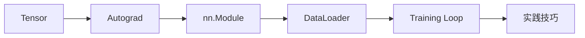

# 学前导读：PyTorch 这一章到底在学什么

这一章不是在教“某几个 API”，而是在帮你搭出深度学习训练的最小工程闭环。

## 这一章的主线

学完这一章后，你应该能自己把一个最小深度学习训练流程搭起来。

## 这一章更适合新人的学习顺序

1. 先看 `Tensor`
2. 再看自动求导
3. 再看 `nn.Module`
4. 再看 `DataLoader`
5. 最后把它们串进训练循环

这比一上来直接啃完整训练代码更容易稳住。

## 这一章最该先抓住什么

- `Tensor` 是深度学习里的基础数据容器
- `autograd` 负责自动算梯度
- `nn.Module` 负责组织网络结构
- `DataLoader` 负责批量喂数据
- `training loop` 负责把这些东西真正跑起来

## 新人最容易卡住的地方

- 看不懂 shape
- 不知道 `forward / backward / step` 各自做了什么
- 代码能跑，但不理解每个对象在训练流程里扮演什么角色
