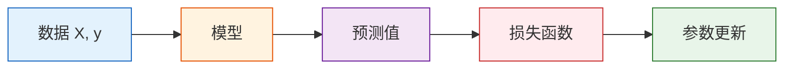

# 从 sklearn 到 PyTorch

:::tip 本节定位
如果说 `scikit-learn` 像自动挡汽车，那么 `PyTorch` 更像手动挡汽车。

- `scikit-learn` 帮你把很多细节都封装好了
- `PyTorch` 让你自己控制模型、损失函数、梯度和训练流程

学会这节，你会知道自己到底是从哪里“换挡”的。
:::

## 学习目标

- 理解 `sklearn` 和 `PyTorch` 的职责差异
- 建立数据、模型、损失函数、优化器、训练循环的整体心智模型
- 用一个最小例子同时跑通 `sklearn` 和 `PyTorch`
- 明白为什么深度学习需要 PyTorch 这种“更底层”的框架

---

## 一、为什么学完 sklearn 还要学 PyTorch？

在第四阶段里，你已经用过 `scikit-learn`：

```python
from sklearn.linear_model import LinearRegression

model = LinearRegression()
model.fit(X_train, y_train)
pred = model.predict(X_test)
```

这套体验很舒服，但也意味着很多东西被“藏起来”了：

| 你做的事 | sklearn 帮你做了什么 |
|---|---|
| 选模型 | 定义了参数结构 |
| 调 `fit()` | 自动完成前向计算、求损失、求梯度、更新参数 |
| 调 `predict()` | 自动完成推理 |

而在 PyTorch 中，这些步骤要拆开来写：

| 步骤 | 你需要自己处理什么 |
|---|---|
| 准备数据 | 把数据转成 `Tensor` |
| 定义模型 | 用 `nn.Module` 或 `nn.Sequential` 写网络 |
| 定义损失函数 | 例如 `nn.MSELoss()` |
| 定义优化器 | 例如 `torch.optim.SGD()` |
| 训练循环 | `forward -> loss -> backward -> step` |

这看起来更麻烦，但换来的好处是：

- 你可以定义任何网络结构
- 你可以控制训练过程的每一步
- 你可以做 CNN、RNN、Transformer、大模型微调这些 `sklearn` 很难覆盖的事

---

## 二、把两者放在一张图里看



- 在 `sklearn` 里，这条链路大多被包进了 `fit()`
- 在 `PyTorch` 里，这条链路会完整暴露出来

所以 PyTorch 的学习重点不是“多几个 API”，而是：  
**你开始真正接触模型训练的内部结构。**

---

## 三、一个最小对照实验

:::info 运行环境
下面的代码可以直接运行。若你本地还没安装依赖：

```bash
pip install numpy scikit-learn torch
```
:::

我们来做一个最简单的线性回归任务：已知学习时长，预测考试分数。

### 3.1 用 sklearn 训练

```python
import numpy as np
from sklearn.linear_model import LinearRegression

# 学习时长（小时）
X = np.array([[1.0], [2.0], [3.0], [4.0], [5.0]], dtype=np.float32)

# 对应分数
y = np.array([52.0, 59.0, 66.0, 73.0, 80.0], dtype=np.float32)

sk_model = LinearRegression()
sk_model.fit(X, y)

print("sklearn 截距:", round(float(sk_model.intercept_), 2))
print("sklearn 权重:", round(float(sk_model.coef_[0]), 2))
print("学习 6 小时的预测分数:", round(float(sk_model.predict([[6.0]])[0]), 2))
```

你会得到一条直线模型，过程非常顺滑。

### 3.2 用 PyTorch 训练同一个任务

```python
import torch
from torch import nn

torch.manual_seed(42)

# 1. 数据转成张量
X_torch = torch.tensor([[1.0], [2.0], [3.0], [4.0], [5.0]])
y_torch = torch.tensor([[52.0], [59.0], [66.0], [73.0], [80.0]])

# 2. 定义模型：一个线性层 y = wx + b
model = nn.Linear(in_features=1, out_features=1)

# 3. 定义损失函数
loss_fn = nn.MSELoss()

# 4. 定义优化器
optimizer = torch.optim.SGD(model.parameters(), lr=0.01)

# 5. 训练循环
for epoch in range(1000):
    pred = model(X_torch)                  # forward
    loss = loss_fn(pred, y_torch)          # 计算损失

    optimizer.zero_grad()                  # 清空旧梯度
    loss.backward()                        # backward
    optimizer.step()                       # 更新参数

    if epoch % 200 == 0:
        print(f"epoch={epoch:4d}, loss={loss.item():.4f}")

weight = model.weight.item()
bias = model.bias.item()
pred_6 = model(torch.tensor([[6.0]])).item()

print("PyTorch 截距:", round(bias, 2))
print("PyTorch 权重:", round(weight, 2))
print("学习 6 小时的预测分数:", round(pred_6, 2))
```

---

## 四、你真正新增学会了什么？

上面的 PyTorch 代码虽然比 `sklearn` 长，但它暴露出了深度学习最核心的 5 个组件：

| 组件 | 类比 | 作用 |
|---|---|---|
| 数据 | 食材 | 模型要加工的输入 |
| 模型 | 厨师 | 决定怎么把输入变成输出 |
| 损失函数 | 评分表 | 判断模型做得好不好 |
| 优化器 | 调参师 | 根据误差去改参数 |
| 训练循环 | 每日复盘 | 重复试错直到效果变好 |

以后你学 CNN、Transformer、RAG 微调、本地模型训练，本质上都还是这五件事，只是模型结构变复杂了。

---

## 五、什么时候继续用 sklearn，什么时候切 PyTorch？

### 更适合 `sklearn` 的情况

- 表格数据为主
- 模型是线性回归、逻辑回归、树模型、随机森林、XGBoost 一类
- 你更在意快速建模与调参

### 更适合 `PyTorch` 的情况

- 图像、语音、文本等非结构化数据
- 需要自定义网络结构
- 需要 GPU 训练
- 需要微调预训练模型
- 需要自己控制训练细节

一句话记忆：

> `sklearn` 擅长“传统机器学习的高效应用”，`PyTorch` 擅长“深度学习的灵活构建”。

---

## 六、常见误区

### 误区 1：PyTorch 只是另一个建模库

不对。它更像是一个“深度学习搭建平台”。  
你不只是调用模型，而是在搭建训练系统。

### 误区 2：PyTorch 比 sklearn 高级，所以以后都用它

也不对。工程上最重要的是**选合适的工具**。  
很多表格任务里，`sklearn` 和树模型依然是首选。

### 误区 3：只要会写训练循环，就等于理解了深度学习

训练循环只是外壳。你还要继续理解：

- 张量和自动求导
- `nn.Module`
- 数据加载
- 模型调试
- 训练稳定性和评估方法

这些内容就是本章接下来几节要补上的。

---

## 七、本章之后你应该会的事

学完这一小节，你至少应该能回答下面三个问题：

1. `sklearn.fit()` 到底替你藏了哪些步骤？
2. 为什么 PyTorch 训练一定绕不开损失函数和优化器？
3. 为什么“模型 + 损失 + 优化器 + 训练循环”会成为后面所有深度学习课程的共同结构？

如果这三个问题你已经能说清楚，说明桥已经搭起来了。

---

## 练习

1. 把上面例子里的学习时长和分数改成你自己的数据，再分别用 `sklearn` 和 `PyTorch` 训练一次。
2. 把 `PyTorch` 里的学习率从 `0.01` 改成 `0.1` 和 `0.001`，观察损失下降速度变化。
3. 试着打印每 100 轮的 `weight` 和 `bias`，看看参数是怎么逐步逼近答案的。
