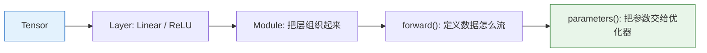

# nn 模块

## 学习目标

- 理解为什么 PyTorch 要用 `nn.Module` 组织模型
- 掌握 `nn.Linear`、`nn.ReLU`、`nn.Sequential`
- 能自己写一个最简单的自定义网络
- 明白 `forward()`、`parameters()`、`train()`、`eval()` 的作用

---

## 零、先建立一张地图

这节最重要的不是记住多少类名，而是看清：



所以这一节真正解决的是：

- 模型结构怎么被组织成一个“可训练对象”

## 这节和前后内容是怎么接上的

- 前一节 `autograd` 已经解决“梯度怎么来”
- 这一节开始解决“这些参数到底被装在哪、怎么统一管理”
- 下一节 `DataLoader` 会解决“数据怎么一批批送进来”

所以这一节其实是在给训练循环准备“模型这一半”。

## 一、为什么需要 `nn.Module`？

如果说张量是“数据盒子”，那 `nn.Module` 就是“模型盒子”。

它帮你把一堆东西组织起来：

- 网络层
- 参数
- 前向计算逻辑
- 训练 / 评估模式切换

类比一下：

| 组件 | 类比 |
|---|---|
| `Tensor` | 一块砖 |
| `nn.Linear` | 一个标准零件 |
| `nn.Module` | 一个可组合的机器 |

如果没有 `nn.Module`，你也可以手写网络，但会非常乱。  
有了它，模型就像乐高积木，可以一层层拼起来。

### 1.1 一个更适合新人的直觉：`nn.Module` 就是“模型容器”

你可以先把它理解成一个统一的模型盒子，里面会装：

- 网络层
- 参数
- 前向逻辑
- 训练 / 评估模式

这就是为什么后面很多地方都只传一个 `model` 对象，就能完成：

- 前向计算
- 参数更新
- 保存和加载

---

## 二、最常见的层：`nn.Linear`

线性层做的事情就是：

> `y = xW + b`

```python
import torch
from torch import nn

layer = nn.Linear(in_features=3, out_features=2)

x = torch.tensor([[1.0, 2.0, 3.0]])
y = layer(x)

print("输出:", y)
print("weight shape:", layer.weight.shape)
print("bias shape:", layer.bias.shape)
```

这里的形状要读懂：

- 输入是 `[1, 3]`，表示 1 个样本、每个样本 3 个特征
- 输出是 `[1, 2]`，表示映射到 2 个输出值

### 2.1 看到 `nn.Linear(in, out)` 时，脑子里最该立刻跳出什么？

最值得先跳出来的是：

- 这不是在“神秘变换”
- 而是在把每个样本从 `in` 维表示映射到 `out` 维表示

所以一个线性层最实用的理解方式通常是：

- 输入空间被重新编码成了新的特征空间

---

## 三、用 `nn.Sequential` 快速搭网络

如果模型比较简单，可以直接把层按顺序串起来：

```python
import torch
from torch import nn

model = nn.Sequential(
    nn.Linear(2, 4),
    nn.ReLU(),
    nn.Linear(4, 1)
)

x = torch.tensor([[1.0, 2.0]])
pred = model(x)

print(pred)
```

这段代码表示：

1. 输入 2 个特征
2. 先映射到 4 维隐藏层
3. 经过 `ReLU` 激活
4. 再输出 1 个值

这就已经是一个最小版多层感知机了。

---

## 四、自己定义一个模型类

当模型稍微复杂一点，推荐继承 `nn.Module`。

```python
import torch
from torch import nn

class ScorePredictor(nn.Module):
    def __init__(self):
        super().__init__()
        self.net = nn.Sequential(
            nn.Linear(2, 8),
            nn.ReLU(),
            nn.Linear(8, 1)
        )

    def forward(self, x):
        return self.net(x)

model = ScorePredictor()

x = torch.tensor([
    [3.0, 4.0],   # 学习时长、作业完成数
    [5.0, 8.0]
])

print(model(x))
```

### `__init__()` 和 `forward()` 分别做什么？

| 方法 | 职责 |
|---|---|
| `__init__()` | 定义层和子模块 |
| `forward()` | 定义“数据怎么流过去” |

一句话记忆：

- `__init__` 负责“搭机器”
- `forward` 负责“机器怎么工作”

### 4.1 为什么 `forward()` 里只写数据流，不写训练逻辑？

因为训练逻辑属于另一个层面。  
`forward()` 的职责非常纯粹：

- 给定输入
- 返回输出

而像这些东西：

- loss
- backward
- optimizer.step

都不属于 `forward()`。  
把这层职责分清，对后面读大模型代码非常重要。

---

## 五、模型参数是怎么被管理起来的？

`nn.Module` 的一个大好处是：  
你定义的层会自动被框架登记，参数也会自动出现在 `model.parameters()` 里。

```python
import torch
from torch import nn

class TinyNet(nn.Module):
    def __init__(self):
        super().__init__()
        self.fc1 = nn.Linear(3, 4)
        self.fc2 = nn.Linear(4, 1)

    def forward(self, x):
        x = torch.relu(self.fc1(x))
        return self.fc2(x)

model = TinyNet()

for name, param in model.named_parameters():
    print(name, param.shape)
```

这正是为什么优化器能直接写：

```python
optimizer = torch.optim.SGD(model.parameters(), lr=0.01)
```

### 5.1 为什么 `model.parameters()` 这么关键？

因为它把“模型是很多参数的集合”这件事统一起来了。

也就是说，优化器其实根本不关心你写了几层、用了什么结构，它最关心的是：

- 我到底要更新哪些参数

而 `nn.Module` 就是在自动替你把这件事整理好。

因为模型已经把所有需要学习的参数打包好了。

---

## 六、`train()` 和 `eval()` 是什么？

很多初学者以为：

- `model.train()` 是开始训练
- `model.eval()` 是开始评估

其实不完全对。  
它们真正的作用是：**切换模型内部某些层的行为模式**。

最典型的两种层是：

- `Dropout`
- `BatchNorm`

虽然我们现在还没重点讲它们，但你要先记住这个习惯：

```python
model.train()   # 训练前
model.eval()    # 验证 / 测试前
```

### 6.1 初学阶段先把这一点记死，非常值

你现在甚至可以先不完全理解：

- Dropout
- BatchNorm

但这两个动作最好先养成条件反射：

- 训练前 `model.train()`
- 验证前 `model.eval()`

后面网络越复杂，这个习惯越能救你。

---

## 七、一个完整的小例子：预测成绩

下面是一个可以直接运行的小网络。  
输入两个特征：

- 每周学习时长
- 每周完成练习数

输出预测分数。

```python
import torch
from torch import nn

torch.manual_seed(42)

X = torch.tensor([
    [2.0, 1.0],
    [3.0, 2.0],
    [4.0, 3.0],
    [5.0, 5.0],
    [6.0, 6.0],
    [7.0, 8.0]
])

y = torch.tensor([
    [55.0],
    [60.0],
    [68.0],
    [78.0],
    [85.0],
    [92.0]
])

class ScorePredictor(nn.Module):
    def __init__(self):
        super().__init__()
        self.net = nn.Sequential(
            nn.Linear(2, 8),
            nn.ReLU(),
            nn.Linear(8, 1)
        )

    def forward(self, x):
        return self.net(x)

model = ScorePredictor()
loss_fn = nn.MSELoss()
optimizer = torch.optim.SGD(model.parameters(), lr=0.01)

for epoch in range(500):
    pred = model(X)
    loss = loss_fn(pred, y)

    optimizer.zero_grad()
    loss.backward()
    optimizer.step()

    if epoch % 100 == 0:
        print(f"epoch={epoch:3d}, loss={loss.item():.4f}")

test = torch.tensor([[6.5, 7.0]])
print("预测分数:", round(model(test).item(), 2))
```

---

## 八、什么时候用 `Sequential`，什么时候自定义 `Module`？

### 用 `nn.Sequential`

适合：

- 层是严格顺序堆叠的
- 没有分支结构
- 没有特殊控制逻辑

### 用自定义 `nn.Module`

适合：

- 有多路输入 / 输出
- 有跳连、分支、条件逻辑
- 你想让结构更清晰、更可维护

工程上，自定义 `Module` 更常见。

---

## 九、初学者常见误区

### 1. 在 `forward()` 里临时创建新层

不推荐。  
层最好在 `__init__()` 里定义，这样参数才能被正确注册。

### 2. 只会写 `Sequential`，不会写类

`Sequential` 很方便，但你迟早要会写自定义 `Module`。  
后面的 CNN、Transformer 都离不开它。

### 3. 不知道模型里有哪些参数

养成使用 `named_parameters()` 的习惯，调试时非常有用。

---

## 十、小结

这一节你要带走的核心是：

1. `nn.Module` 是组织模型的标准方式
2. `forward()` 描述的是数据流，不是训练流程
3. 模型参数会被自动收集，优化器才能统一更新

有了模型盒子，下一步就是把数据一批一批喂进去。

### 10.1 这节最该带走什么

如果再压成一句话，那就是：

> **`nn.Module` 的核心价值，不是让代码更像面向对象，而是让“层、参数、前向逻辑、训练模式”都能被统一管理。**

---

## 练习

1. 把 `ScorePredictor` 的隐藏层从 `8` 改成 `16`，观察损失变化。
2. 把 `ReLU()` 去掉，看看模型还能不能学到规律。
3. 用 `named_parameters()` 打印每层参数名称和形状，确认你读懂了每一层。
