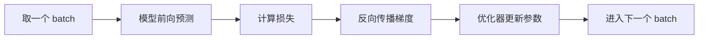
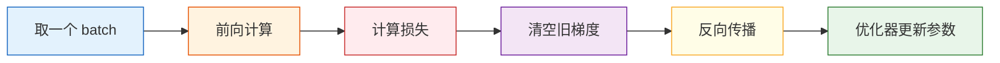

# 训练流程 🔧

## 学习目标

- 看懂并写出标准的 PyTorch 训练循环
- 明白 `train()`、`eval()`、`zero_grad()`、`backward()`、`step()` 的顺序
- 能对一个小任务完成训练、验证和预测
- 形成可复用的训练模板

---

## 零、先建立一张地图

训练循环这节最适合新人的理解方式不是“背模板”，而是先看清训练到底在重复什么：



这五步不断循环，就是深度学习训练最核心的节奏。

## 一、训练循环为什么重要？

深度学习代码里最值得反复练的，不是某一个层，而是**训练循环**。

因为不管你是做：

- 图像分类
- 文本分类
- 目标检测
- 大模型微调

训练主流程都逃不开这条线：



---

## 二、先记住标准模板

先不要急着背，先多看几遍：

```python
for batch_x, batch_y in train_loader:
    pred = model(batch_x)
    loss = loss_fn(pred, batch_y)

    optimizer.zero_grad()
    loss.backward()
    optimizer.step()
```

它其实只在做三件事：

1. 算预测
2. 算误差
3. 按误差更新参数

### 2.1 一个新人最该先背下来的口令

如果你每次写训练循环都会乱，可以先记这个最短口令：

`前向 -> 算 loss -> 清梯度 -> 反传 -> 更新`

只要这一条顺了，后面再加验证、日志、早停都不难。

---

## 三、一个完整可运行例子

:::info 运行环境
下面代码可以直接运行：

```bash
pip install torch
```
:::

我们做一个二维回归任务。  
输入两个特征，目标值满足近似关系：

> `y ≈ 3*x1 + 2*x2 + 5`

```python
import torch
from torch import nn
from torch.utils.data import TensorDataset, DataLoader, random_split

torch.manual_seed(42)

# 1. 造一份可直接运行的模拟数据
X = torch.randn(200, 2)
noise = torch.randn(200, 1) * 0.3
y = 3 * X[:, [0]] + 2 * X[:, [1]] + 5 + noise

dataset = TensorDataset(X, y)
train_dataset, val_dataset = random_split(
    dataset,
    [160, 40],
    generator=torch.Generator().manual_seed(42)
)

train_loader = DataLoader(train_dataset, batch_size=32, shuffle=True)
val_loader = DataLoader(val_dataset, batch_size=40, shuffle=False)

# 2. 定义模型
model = nn.Sequential(
    nn.Linear(2, 8),
    nn.ReLU(),
    nn.Linear(8, 1)
)

# 3. 定义损失函数和优化器
loss_fn = nn.MSELoss()
optimizer = torch.optim.Adam(model.parameters(), lr=0.05)

# 4. 训练
for epoch in range(1, 101):
    model.train()
    train_loss_sum = 0.0

    for batch_x, batch_y in train_loader:
        pred = model(batch_x)
        loss = loss_fn(pred, batch_y)

        optimizer.zero_grad()
        loss.backward()
        optimizer.step()

        train_loss_sum += loss.item() * len(batch_x)

    train_loss = train_loss_sum / len(train_dataset)

    # 5. 验证
    model.eval()
    with torch.no_grad():
        val_loss_sum = 0.0
        for batch_x, batch_y in val_loader:
            pred = model(batch_x)
            loss = loss_fn(pred, batch_y)
            val_loss_sum += loss.item() * len(batch_x)
        val_loss = val_loss_sum / len(val_dataset)

    if epoch % 20 == 0 or epoch == 1:
        print(f"epoch={epoch:3d}, train_loss={train_loss:.4f}, val_loss={val_loss:.4f}")

# 6. 测试预测
test_x = torch.tensor([[1.0, 2.0], [-1.0, 0.5], [0.0, 0.0]])
with torch.no_grad():
    test_pred = model(test_x)

print("\n测试样本预测:")
for x_row, y_row in zip(test_x, test_pred):
    print(f"x={x_row.tolist()} -> pred={round(y_row.item(), 2)}")
```

---

## 四、逐行拆解这段代码

### 1. `model.train()`

告诉模型进入训练模式。  
如果模型里有 `Dropout`、`BatchNorm` 这样的层，它们会切换到训练行为。

### 2. `pred = model(batch_x)`

前向传播。  
也就是“拿当前参数做一次预测”。

### 3. `loss = loss_fn(pred, batch_y)`

告诉模型：“你这次和真实答案差多少。”

### 4. `optimizer.zero_grad()`

清空旧梯度。  
因为 PyTorch 默认会累计梯度。

### 5. `loss.backward()`

反向传播。  
把损失对各参数的梯度算出来。

### 6. `optimizer.step()`

根据梯度真正更新参数。

### 4.1 新人第一次自己写时，最容易漏哪一步？

最常见的是这两处：

- 忘了 `optimizer.zero_grad()`
- 验证阶段忘了 `model.eval()` 和 `torch.no_grad()`

这两个问题都会让训练结果看起来“怪怪的”，但又不一定立刻报错。

---

## 五、为什么验证要用 `eval()` 和 `no_grad()`？

验证阶段的目标不是学习，而是检查模型表现。

所以我们一般会这样写：

```python
model.eval()
with torch.no_grad():
    ...
```

原因有两个：

- `eval()`：让某些层切换成推理模式
- `no_grad()`：不记录梯度，省内存、省时间

---

## 六、一个更适合记忆的“厨房版类比”

把训练看成开餐厅会很好记：

| 深度学习步骤 | 餐厅类比 |
|---|---|
| `batch_x` | 一批顾客订单 |
| `model(batch_x)` | 厨师按当前手法做菜 |
| `loss_fn` | 顾客给评分 |
| `backward()` | 找出是哪里做得不好 |
| `step()` | 下次做菜时调整手法 |

训练就是反复营业、反复改进。

---

## 七、常见变体

### 1. 分类任务

回归常用 `MSELoss()`，分类更常见：

```python
loss_fn = nn.CrossEntropyLoss()
```

### 2. 不同优化器

最常见的两个：

- `SGD`
- `Adam`

初学阶段，`Adam` 往往更省心一些。

### 3. 统计指标

训练时除了 loss，还常常统计：

- 准确率 `accuracy`
- 精确率 `precision`
- 召回率 `recall`
- F1

---

## 八、最容易写错的地方

### 1. 忘记 `zero_grad()`

后果：梯度不断累加，训练结果不可信。

### 2. 验证时忘记 `model.eval()`

有些模型层在训练 / 验证模式下行为不同，会影响结果。

### 3. 验证时也在算梯度

虽然可能能跑，但浪费内存与算力。

### 4. `loss.item()` 和 `loss` 混着用

- `loss` 是张量，能参与反向传播
- `loss.item()` 是普通 Python 数字，适合打印和统计

---

## 九、一个你可以保存下来的通用骨架

```python
for epoch in range(num_epochs):
    model.train()
    for batch_x, batch_y in train_loader:
        pred = model(batch_x)
        loss = loss_fn(pred, batch_y)

        optimizer.zero_grad()
        loss.backward()
        optimizer.step()

    model.eval()
    with torch.no_grad():
        for batch_x, batch_y in val_loader:
            pred = model(batch_x)
            val_loss = loss_fn(pred, batch_y)
```

以后你看到任何 PyTorch 项目，基本都能在里面认出这条主线。

---

## 十、小结

如果这节你只记住一句话，那就是：

> **训练循环就是“前向算一次，反向改一次，然后重复很多次”。**

把这条链路练熟，后面学 CNN、Transformer、微调大模型时，你不会总被框架代码吓住。

---

## 练习

1. 把上面例子里的优化器从 `Adam` 改成 `SGD`，看看收敛速度有什么差异。
2. 把隐藏层从 `8` 改成 `16`，观察训练和验证损失变化。
3. 把数据中的噪声 `0.3` 改成 `1.0`，看看模型训练难度会发生什么变化。
